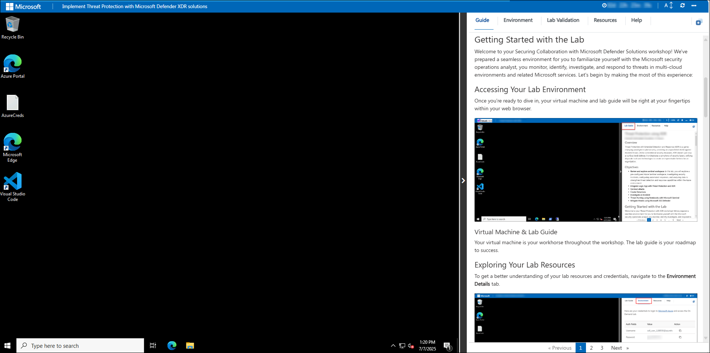
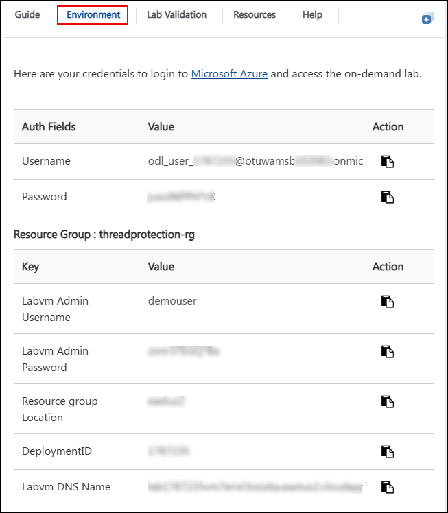
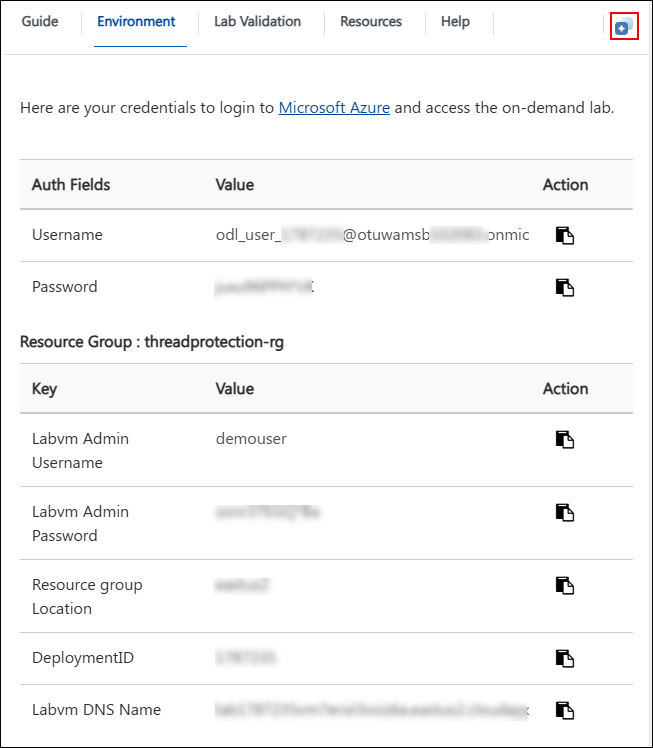
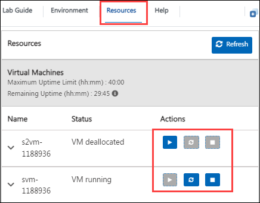
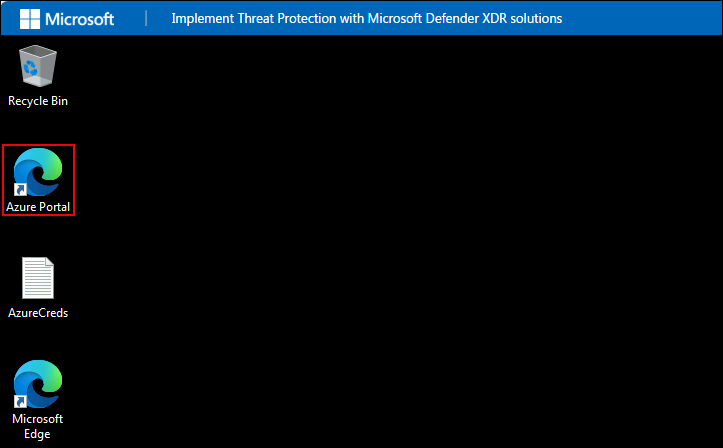
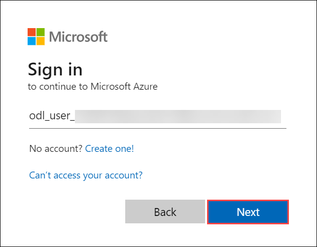
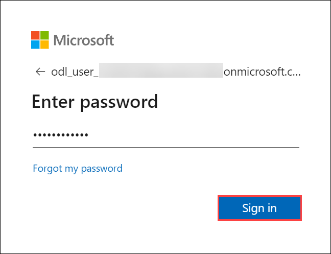
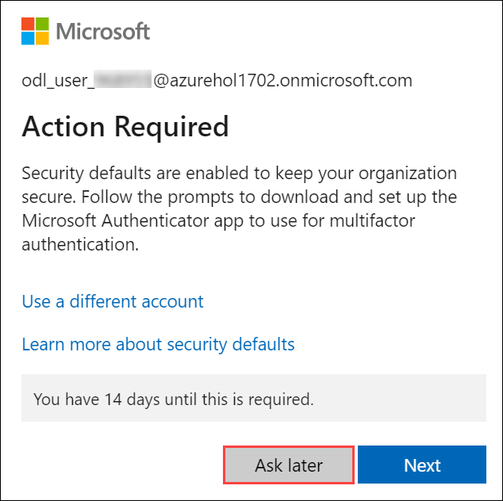
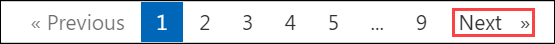

# Implement Threat Protection with Microsoft Defender XDR solutions

### Overall Estimated Duration: 8 Hours

## Overview

This lab series is designed to equip security operations professionals with the knowledge and hands-on experience needed to strengthen organizational defenses using Microsoft Defender XDR solutions. Throughout the exercises, you'll work with Microsoft Defender for Office 365, Microsoft Defender for Identity, Microsoft Defender for Cloud, and Microsoft Sentinel.

You’ll start by configuring threat protection policies and simulating email-based attacks using Defender for Office 365. Then, you'll explore how to analyze threats in real time with Threat Explorer and investigate incidents using Microsoft Defender XDR. Moving further, you’ll deploy identity sensors, detect lateral movement, configure App Governance, and monitor risky app behaviors. Finally, you’ll dive into Microsoft Sentinel for advanced threat hunting, incident investigation, and automated response using Notebooks and analytics rules.

By the end of this lab, you’ll have a holistic view of how to detect, investigate, and respond to modern cyber threats across identity, email, endpoint, and cloud environments using Microsoft’s integrated security tools.

## Objectives

- Configure threat protection policies in Microsoft Defender for Office 365

- Simulate phishing and malware attacks using Attack Simulator

- Analyze threats using Threat Explorer and real-time detections

- Investigate and remediate incidents in Microsoft Defender XDR

- Configure anti-phishing and Safe Links policies to protect users

- Enable and analyze Cloud Discovery to detect Shadow IT

- Connect and protect Microsoft 365 SaaS apps using Defender for Cloud Apps

- Create and enforce session and activity policies to block risky behavior

- Implement App Governance and detect high-risk OAuth apps

- Deploy Microsoft Defender for Identity sensors on domain controllers

- Detect and investigate lateral movement and identity-based threats

- Integrate Microsoft Defender with Sentinel for unified incident management
 
- Perform threat hunting using advanced KQL queries and Sentinel Notebooks
 
- Automate detection and response with scheduled rules and NRT queries

- Mitigate threats and manage alerts through Microsoft 365 Defender

# Getting Started with the Lab
 
Welcome to your Securing Collaboration with Microsoft Defender Solutions workshop! We've prepared a seamless environment for you to familiarize yourself with the Microsoft security operations analyst, you monitor, identify, investigate, and respond to threats in multi-cloud environments and related Microsoft services. Let's begin by making the most of this experience:
 
## Accessing Your Lab Environment
 
Once you're ready to dive in, your virtual machine and lab guide will be right at your fingertips within your web browser.
 

### Virtual Machine & Lab Guide
 
Your virtual machine is your workhorse throughout the workshop. The lab guide is your roadmap to success.
 
## Exploring Your Lab Resources
 
To get a better understanding of your lab resources and credentials, navigate to the **Environment Details** tab.
 

 
## Utilizing the Split Window Feature
 
For convenience, you can open the lab guide in a separate window by selecting the **Split Window** button from the Top right corner.
 

 
## Managing Your Virtual Machine
 
Feel free to start, stop, or restart your virtual machine as needed from the **Resources** tab. Your experience is in your hands!
 

## Let's Get Started with Azure Portal
 
1. On your virtual machine, click on the Azure Portal icon as shown below:
 
    

2. You'll see the **Sign into Microsoft Azure** tab. Here, enter your credentials:
 
   - **Email/Username:** <inject key="AzureAdUserEmail"></inject>
 
     
 
3. Next, provide your password:
 
   - **Password:** <inject key="AzureAdUserPassword"></inject>
 
     

1. If you see the pop-up **Action Required**, click **Ask Later**.

     
 
4. If prompted to stay signed in, you can click **No**.

5. If a **Welcome to Microsoft Azure** pop-up window appears, simply click **Cancel** to skip the tour.

## Steps to Proceed with MFA Setup if "Ask Later" Option is Not Visible

1. At the **"More information required"** prompt, select **Next**.

1. On the **"Keep your account secure"** page, select **Next** twice.

1. **Note:** If you don’t have the Microsoft Authenticator app installed on your mobile device:

   - Open **Google Play Store** (Android) or **App Store** (iOS).
   - Search for **Microsoft Authenticator** and tap **Install**.
   - Open the **Microsoft Authenticator** app, select **Add account**, then choose **Work or school account**.

1. A **QR code** will be displayed on your computer screen.

1. In the Authenticator app, select **Scan a QR code** and scan the code displayed on your screen.

1. After scanning, click **Next** to proceed.

1. On your phone, enter the number shown on your computer screen in the Authenticator app and select **Next**.

1. If prompted to stay signed in, you can click "No."

1. If a **Welcome to Microsoft Azure** pop-up window appears, simply click "Maybe Later" to skip the tour.

1. If a **Welcome to Microsoft Azure** pop-up window appears, simply click **Cancel** to skip the tour.
 
1. Click **Next** from the bottom right corner to embark on your Lab journey!
 
     

Now you're all set to explore the powerful world of technology. Feel free to reach out if you have any questions along the way. Enjoy your workshop!

## Support Contact

The CloudLabs support team is available 24/7, 365 days a year, via email and live chat to ensure seamless assistance at any time. We offer dedicated support channels tailored specifically for both learners and instructors, ensuring that all your needs are promptly and efficiently addressed.

Learner Support Contacts:

- Email Support: cloudlabs-support@spektrasystems.com
- Live Chat Support: https://cloudlabs.ai/labs-support
