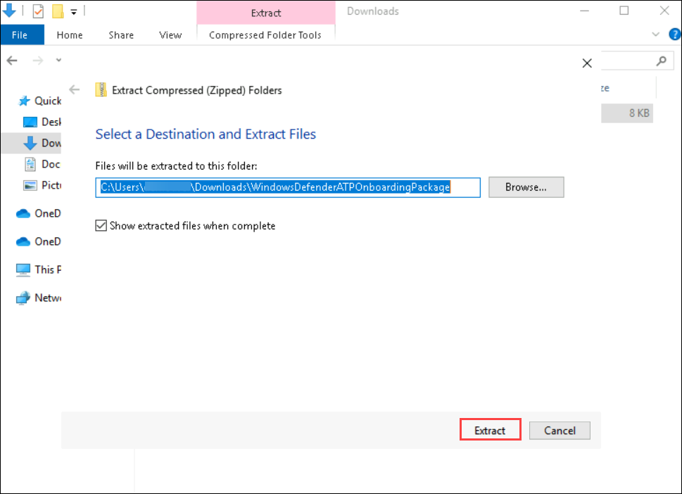
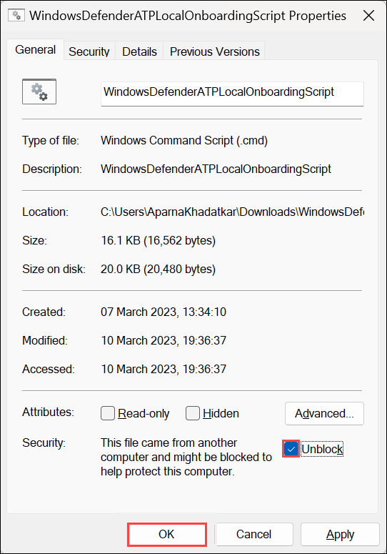
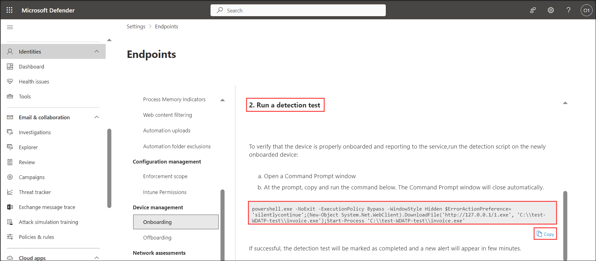
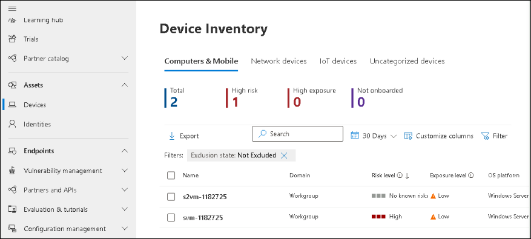
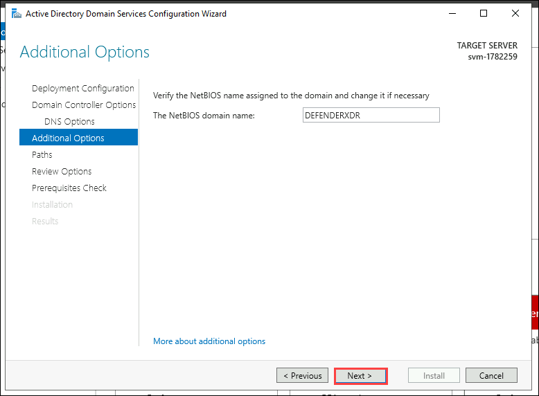
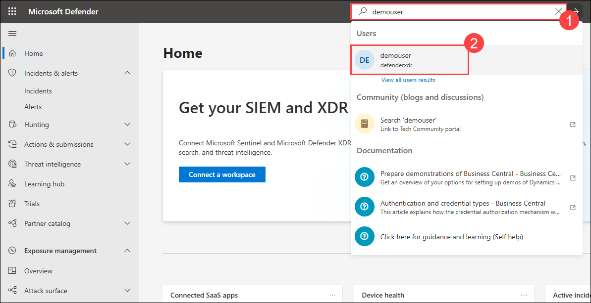

## Exercise 1: Microsoft Defender for Identity for Advanced Threat Detection and Response
### Estimated Duration: 60 Minutes

## Overview

In this exercise, you will onboard a device and deploy Microsoft Defender for Identity sensors on domain controllers to enable identity threat detection. You will simulate lateral movement attack. Additionally, you will investigate identity-based threats and user activity timelines, integrate Defender for Identity with the Microsoft 365 Defender portal, and explore identity-related signals using advanced hunting queries to enhance your threat detection and response capabilities.

## Objectives

- Task 1: Onboard a Device 
- Task 2: Deploy Microsoft Defender for Identity Sensor on Domain Controllers 
- Task 3: Simulate and Detect Lateral Movement Attacks (Read-Only)
- Task 4: Investigate Threats and User Timelines 
- Task 5: Integrate Defender for Identity with Microsoft 365 Defender Portal
- Task 6: Review and Run Advanced Hunting Queries for Identity Signals

### Task 1: Onboard a Device

1. Navigate to **Settings** in the left menu bar, and then, on the Settings page, choose **Endpoints**.

    

    > **Note:** The **Endpoints** option under **Settings** may take a few moments to appear after the initial setup.  
    > If you don't see it right away, wait a minute and try refreshing the page.

1. Navigate to the **Onboarding** option in the Device Management section.

    >**Note:** Device onboarding can also be initiated from the **Assets** section on the left menu bar. Expand 'Assets' and choose 'Devices.' On the Device Inventory page, with 'Computers & Mobile' selected, scroll down to find the option for **Onboard devices.** Clicking on this option will direct you to the **Settings > Endpoints** page.

1. In the '1. Onboard a device' section, ensure that 'Local Script (for up to 10 devices)' is visible in the Deployment method drop-down, then click the **Download onboarding package** button.

     

1. In the *Downloads* pop-up, use your mouse to select the 'WindowsDefenderATPOnboardingPackage.zip' file, and then click on the folder icon for **Show in folder**. **Hint:** If you can't locate it, the file should be in the 'c:\users\admin\downloads' directory.

    

1. Right-click on the downloaded zip file, choose **Extract All...**, ensure that **Show extracted files when complete** is checked, and then click **Extract**.

     

1. Right-click on the extracted file 'WindowsDefenderATPLocalOnboardingScript.cmd' and choose **Properties**. Tick the **Unblock** checkbox located in the bottom right of the Properties window, and then click **OK**.

     

1. Once again, right-click on the extracted file **WindowsDefenderATPLocalOnboardingScript.cmd** and opt for **Run as Administrator**. **Hint:** If the Windows SmartScreen window appears, click on **More info**, and then select **Run anyway**.
    
1. When the "User Account Control" window appears, select **Yes** to allow the script to run, answer **Y** to the question presented by the script, and press **Enter**. Once complete, you should see a message in the command screen that says *Successfully onboarded machine to Microsoft Defender for Endpoint*.

1. Press any key to continue. This action will close the Command Prompt window.

    

1. Back on the Onboarding page within the Microsoft 365 Defender portal, navigate to the "2. Run a detection test" section, and copy the detection test script by clicking the **Copy** button.

     

1. In the Windows search bar of the virtual machine, type **CMD**, and choose **Run as Administrator** from the right pane for the Command Prompt app.

1. When the "User Account Control" window appears, select **Yes** to allow the app to run. 

1. Paste the script by right-clicking in the **Administrator: Command Prompt** window and press **Enter** to run it. **Note:** The window closes automatically after running the script.

1. In the Microsoft 365 Defender portal, navigate to the left-hand menu, and under the **Assets** area, select **Devices**. If the device is not shown, proceed with the next task and return to check it later. It can take up to 60 minutes for the first device to be displayed in the portal.

     

    >**Note:** If you have completed the onboarding process and don't see devices in the Devices list after an hour, it might indicate an onboarding or connectivity problem.

### Task 2: Deploy Microsoft Defender for Identity Sensor on Domain Controllers

In this task you will install and configure the Defender for Identity sensor on a domain controller to monitor identity-based threats.

Install the AD DS role to enable the server to function as a domain controller.

1. Open **Server Manager**:
   - Click the **Start** button and select **Server Manager**, or type "Server Manager" in the search bar and press **Enter**.

      

2. Launch the **Add Roles and Features Wizard**:
   - In Server Manager, click **Manage** in the top-right corner, then select **Add Roles and Features**.

      

3. Configure the Wizard:
   - Select **Role-based or feature-based installation**, then click **Next**.
   - Choose your server from the server pool, then click **Next**.
   - In the "Server Roles" list, check **Active Directory Domain Services**.

      

   - When prompted, click **Add Features** to include required tools, then click **Next**.
   - Skip the "Features" page by clicking **Next**.
   - Review the AD DS information page, then click **Next**.
   - Confirm your selections and click **Install**.
   - Wait for the installation to complete and click on **Close**.

      

   > **Note:** Do not close Server Manager after installation; the next step begins from there.

1. In Server Manager, click the yellow notification flag and select **Promote this server to a domain controller**.

      

1. In the wizard, select **Add a new forest** and enter the root domain name as `defenderxdr.internal`, then click **Next**.

      

1. Set Domain Controller Options:
   - Set both **Forest Functional Level** and **Domain Functional Level** to **Windows Server 2016** (or your server’s version).
   - Ensure **Domain Name System (DNS) server** is checked.
   - Enter a **Directory Services Restore Mode (DSRM)** password (e.g., `P@ssw0rd123!`), then click **Next**.

      

   - Ignore DNS delegation warnings, click on **Next**.
   - Accept the default **NetBIOS domain name** `DEFENDERXDR`, then click **Next**.

      

   - Use default paths for the AD DS database, logs, and SYSVOL, then click **Next**.

      

   - Review your selections, then click **Next**.
   - Wait for the prerequisites check to complete, then click **Install**.
   - Wait for the process to complete; the server will restart automatically.

   > **Note:** The VM will restart now, wait for 5 minutes and **Reconnect** to the VM.

      

1. Sign in to the Microsoft Defender Portal, open a Edge browser and navigate to `security.microsoft.com`.

   - If you see the **Sign in to Microsoft Azure** tab, you will see the login screen. Enter the following email/username, and click on **Next**.

   * **Email/Username:** <inject key="AzureAdUserEmail"></inject>
     
     

   - Now enter the following password and click on **Sign in**.
   
   * **Password:** <inject key="AzureAdUserPassword"></inject>

      

      >**Note:** Take a moment to allow the option panel to fully load on the security portal.
      
1. On the Microsoft Defender page, select **Settings** and select **Identities** and you will be navigated to **Microsoft Defender for Identity** page.

      

      >**Note:** Please wait while the **identities** page loads—this may take a few minutes.

1. Click on **Sensors** at the top, then select **Add sensor** in the top-right corner. On the **Simplify your installation process** pop-up, click **Continue with classic sensor**.

      

1. A pop-up will display a **Download installer** button and an **Access key**. Click **Download installer** to download `Azure ATP Sensor Setup.zip` and copy the **Access key** to your clipboard which will be used during the installation.

      
      > **Note:** If you do not see that the file is downloading, click on the pop-up window button and then select Always allow pop-ups and redirects from `https://security.microsoft.com`and click on **Done** and **download** the file again

      

1. From your VM, navigate to the downloaded `Azure ATP Sensor Setup.zip` file in the **Downloads** folder, extract it to `C:\ATP`, and run `Azure ATP Sensor Setup.exe` as administrator.

      
    > **Note:** If the `ATP` folder does not exist in `C:\`, click on **New** > **Create new folder**, name it **ATP**, and then extract the files.

      

1. On the Setup wizard follow the below steps:
     - Accept the license terms and click **Next**.
     - Enter the **Access key** copied earlier and click **Next**.
         

     - Choose the default installation path (e.g., `C:\Program Files\Azure Advanced Threat Protection Sensor`) and click **Install**.
   - Wait for the installation to complete.

1. Return to the Microsoft Defender portal, go to **Settings** > **Identities** > **Sensors**, find the sensor for `defenderxdr.internal`, and verify that the **Status** shows **Running** within 5–10 minutes.

> **Congratulations** on completing the task! Now, it's time to validate it. Here are the steps:
> - Hit the Validate button for the corresponding task. If you receive a success message, you can proceed to the next task. 
> - If not, carefully read the error message and retry the step, following the instructions in the lab guide.
> - If you need any assistance, please contact us at cloudlabs-support@spektrasystems.com. We are available 24/7 to help you out.
<validation step="a35ecb78-8ff8-4873-9f92-37f3811cdc3f" />

### Task 3: Simulate and Detect Lateral Movement Attacks `(Read-Only)`

In this task, you will simulate a Lateral Movement attack and detect it using Microsoft Defender for Identity. Please note that this is a `read-only` task, as you will be logged out of your virtual machine during the attack simulation—this is a security measure enforced by Defender for Identity.

1. Open **PowerShell (Admin)** and navigate to the below mentioned directory.

      ```powershell
      cd C:\MimikatzLab\mimikatz-master\mimikatz-master\x64
      ```
1. In the same PowerShell session, run the below command to run the mimikatz application

     ```powershell
     mimikatz.exe 
     ```

1. Simulate a DC Sync attack and extract the credentials of the krbtgt account.

      ```shell
      lsadump::dcsync /domain:yourdomain.com /user:krbtgt
      ```

1. Now you can check your alerts in the Microsoft Defender portal, navigate to **Incidents & alerts** in the left-hand navigation pane.

      

1. Click **Alerts** to view the alerts queue.

1. You will find alerts with the below names
     - **Lateral movement using remote logon by contained user blocked**
     - **Lateral movement using RDP blocked**

      
      > **Note:** The user will be logged out of the virtual machine as part of the containment measures initiated by the Defender in response to the user's attempted lateral movement attack.

### Task 4: Investigate Threats and User Timelines 

In this task you will analyze using user timelines and alert details in the Defender portal.

1. In the Microsoft Defender portal, in the search bar, type `demouser` and select it.

      

1. Click on **Go to user page**

      

1. In the user profile, click the **Timeline** tab and you will be able to see the events like `Lateral movement attacks` and `mimikatz credential theft tool` alerts

      

### Task 5: Integrate Defender for Identity with Microsoft 365 Defender Portal

In this task you will enable integration to view Defender for Identity incidents in the unified Microsoft 365 Defender portal and Microsoft Sentinel.

1. Navigate to `portal.azure.com` and navigate to **Microsoft Sentinel** and select `loganalyticworkspace`.

      

1. In the left-hand pane, click **Content hub**. 

      

1. Search for **Defender for XDR** and select it and click on **Install** and wait for the installation to be complete

      

1. Return to the Sentinel workspace and navigate to **Data Connectors** and click on  **Defender for XDR** and select **Open connector page**.

      

1. Click on **Connect incidents & alerts** and navigate back to Data connectors page and make sure that **Defender for XDR** shows as connected

      

### Task 6: Review and Run Advanced Hunting Queries for Identity Signals

In this task you will use advanced hunting queries in the Defender portal to detect identity-based threats.

1. In the Microsoft Defender portal, click **Hunting** in the left-hand navigation pane and select **Advanced hunting** from the menu.

      

1. In the query editor, paste the following KQL query to detect Lateral movement attacks:

   ```kql
   AlertInfo
   | summarize AlertCount = count() by Title, DetectionSource
   | order by AlertCount desc
   ```
   - Click **Run query** to execute.

      

1. Review the results table for all the alerts, 

1. Click **Save** in the top-right corner.
   - Name the query as `Alert1`.
   - Select **Save**.

      

## Review
In this lab, you have completed the following tasks:

- Onboarded a Device 
- Deployed Microsoft Defender for Identity Sensor on Domain Controllers 
- Simulated and Detected Lateral Movement Attacks (Read-Only)
- Investigated Threats and User Timelines 
- Integrated Defender for Identity with Microsoft 365 Defender Portal
- Run Advanced Hunting Queries for Identity Signals
