# Exercise 2 - Review and explore sentinel workspace

## Estimated timing: 45 minutes

### Task 1: Onboard a Device

In this task, you will onboard a device to Microsoft Defender for Endpoint using an onboarding script.

1. If you are not already at the Microsoft 365 Defender portal in your browser, start the Microsoft Edge browser go to (https://security.microsoft.com).

1. On the **Sign into Microsoft Azure** tab, you will see the login screen. Enter the following **Email/Username**, and then click on **Next**.

   * Email/Username: <inject key="AzureAdUserEmail"></inject>

     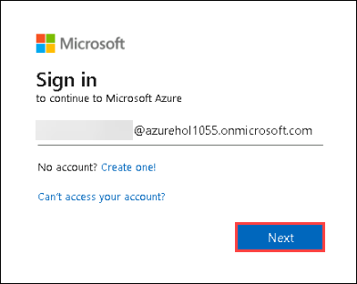

1. Enter the following **Password** and click on **Sign in**. 
   
   * Password: <inject key="AzureAdUserPassword"></inject>

     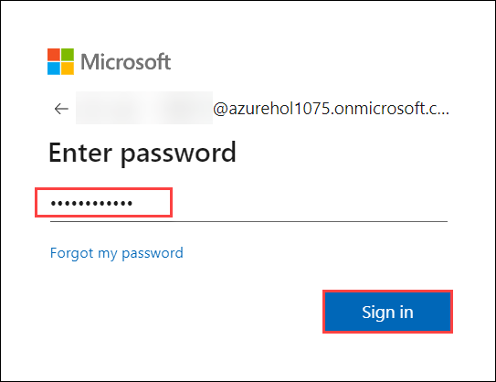 

      >**Note:** Take a moment to allow the option panel to fully load on the security portal.

1. Navigate to **Settings (1)** in the left menu bar, and then, on the Settings page, choose **Endpoints (2)**.

    

   >**Note:** If you face any issues while opening the Endpoint. follow the url: **https://security.microsoft.com/securitysettings/endpoints/onboarding**
to access the endpoint resource
   
1. Navigate to the **Onboarding (1)** option in the *Device Management section.*

1. Under **Select operating system to start onboarding process:** make sure to select the **Windows Server 2019, 2022, and 2025**.

   

1. In the **1. Onboard a device** section, ensure that **Local Script (for up to 10 devices) (2)** is visible in the Deployment method drop-down, then click the **Download onboarding package (3)** button.

    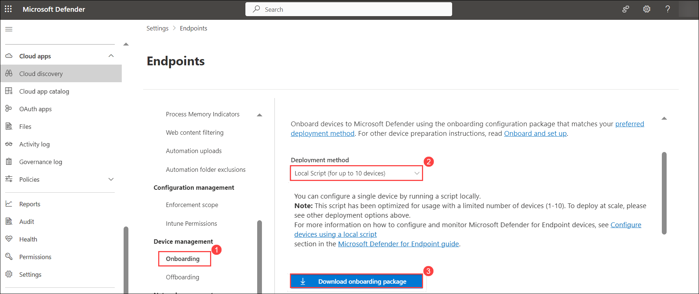 

1. In the *Downloads* pop-up, use your mouse to select the **WindowsDefenderATPOnboardingPackage.zip** file, and then click on the folder icon for **Show in folder**. **Hint:** If you can't locate it, the file should be in the 'c:\users\admin\downloads' directory.

    

1. Right-click on the downloaded zip file, choose **Extract All...**, ensure that **Show extracted files when complete** is checked, and then click **Extract**.

    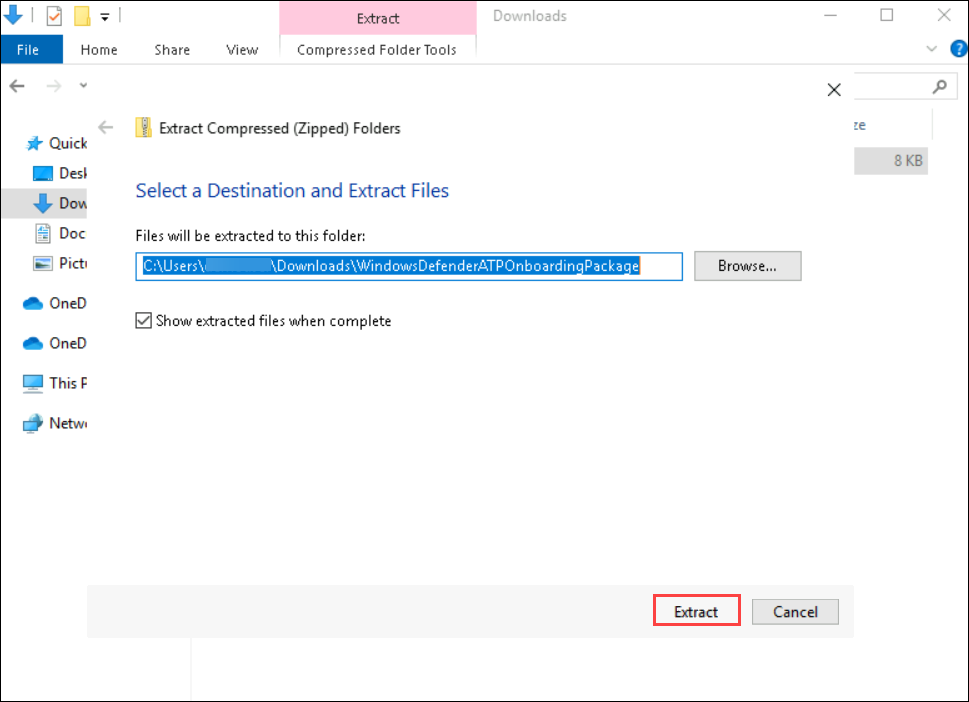 

1. Right-click on the extracted file **WindowsDefenderATPLocalOnboardingScript.cmd** and choose **Properties**. Tick the **Unblock (1)** checkbox located in the bottom right of the Properties window, and then click **OK (2)**.

     

1. Once again, right-click on the extracted file **WindowsDefenderATPLocalOnboardingScript.cmd** and opt for **Run as Administrator**. **Hint:** If the Windows SmartScreen window appears, click on **More info**, and then select **Run anyway**.
    
1. When the "User Account Control" window appears, select **Yes** to allow the script to run, answer **Y** to the question presented by the script, and press **Enter**. Once complete, you should see a message in the command screen that says *Successfully onboarded machine to Microsoft Defender for Endpoint*.

1. Press any key to continue. This action will close the Command Prompt window.

    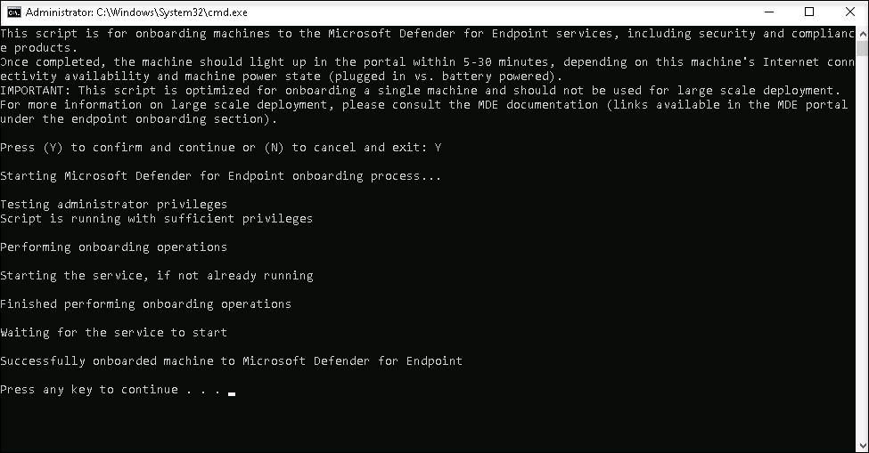

1. Back on the Onboarding page within the Microsoft 365 Defender portal, navigate to the **2. Run a detection test** section, and copy the detection test script by clicking the **Copy** button.

    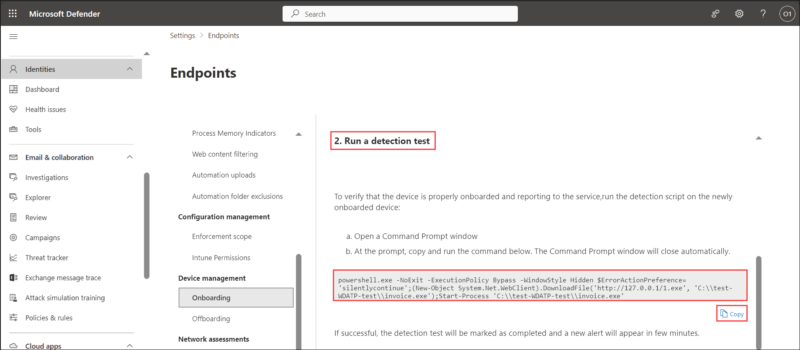 

1. In the Windows search bar of the virtual machine, type **CMD (1)**, and choose **Run as Administrator (2)** from the right pane for the Command Prompt app.

     

1. When the "User Account Control" window appears, select **Yes** to allow the app to run. 

1. Paste the script by right-clicking in the **Administrator: Command Prompt** window and press **Enter** to run it. **Note:** The window closes automatically after running the script.

1. In the Microsoft 365 Defender portal, navigate to **Endpoints** and select **Onboarding**. If the status is **Incomplete**, proceed with the next task and check back later, as it may take 24–48 hours to update.

### Task 1: Connect the Windows security event connector

1. In the Search bar of the Azure portal, type *Microsft Sentinel (1)*, then select **Microsoft Sentinel (2)**.

    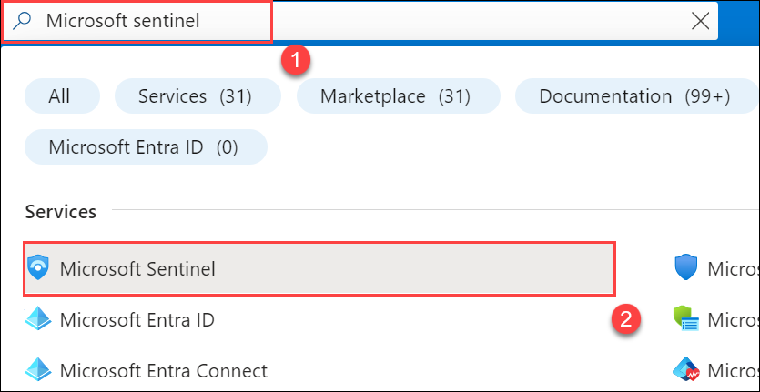 

1. Select the pre-created Sentinel **loganalyticworkspace** from the available list.

    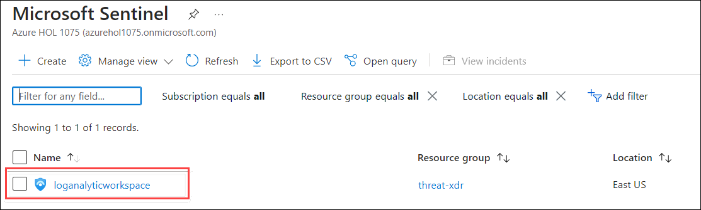 

1. Navigate to the left menu and go to the *Content Management* section, below that select **Content Hub (1)**. On the Content Hub page, locate **Windows Security Events (2)**, and then **select (3)** it. Finally, click on **Install (4)**.

    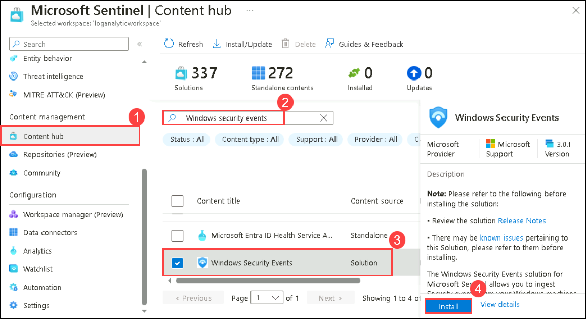  

1. After receiving the notification of a successful installation, return to the **Data connectors** page under *Configuration* and click on the refresh button to ensure that the changes take effect.

1. You should observe two options: **Security Events Via Legacy Agent** and **Windows Security Event Via AMA**.

1. Choose **Security Events Via Legacy Agent (1)**, and then click on **Open Connector Page (2)**.

     
   
8. In the configuration section, opt for **Install Agent on Azure Windows Virtual Machine (1)**, and then choose **Download & Install Agent for Azure Windows Virtual Machines (2)**.

     

9. Select the **svm-<inject key="DeploymentID" enableCopy="false" />** virtual machine. 

     
        
10. Click on **Connect (1)**. Once **connected**, select the **Virtual Machine (2)** link from the top.

     

11. On the virtual machine page select the **s2vm-<inject key="DeploymentID" enableCopy="false" />** virtual machine and click on connect. wait until get connected.

    

11. Then, come back to the Configuration and scroll down a bit. You can find **Select which events to stream**. Select **All Events (1)** and then click on **Apply changes (2).**

     

12. If you refresh the data connector page, you can see the status Connected for **Security Events Via Legacy Agent**.

     

### Task 2: Enable Microsoft Defender for Cloud

In this task, you will enable and configure Microsoft Defender for Cloud.

1. In the search bar of the Azure portal, type *Defender (1)*, then select **Microsoft Defender for Cloud (2)**.

     

1. On the **Overview** page, select the **Azure subscriptions**.

    

1. On the **Environment Settings (1)** page, select **Subscription > Log Analytics Workspace (3)**, then toggle **Foundational CSPM** to **On(4)** and Click on **Save button**. Please wait 2-5 minutes for the process to complete.

    

    

1. Navigate back to the **Environment settings (1)** then click on the subscription (or its equivalent name in your language). **(2)**

     

1. Review the Azure resources that are now protected with the Defender for Cloud plans.

1. Select the **Settings & Monitoring** tab from the Settings area (next to Save).

    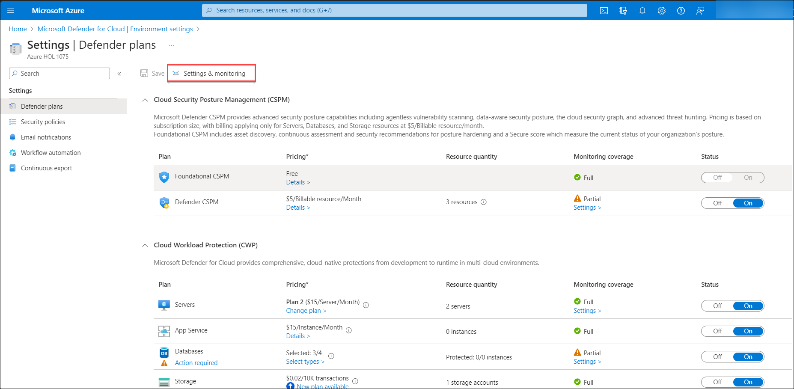

1. Review the monitoring extensions and confirm that **Log Analytics agent** is by-default **On**.

     


### Task 3: Create a Security Operations Center Team in Microsoft Teams.

In this task, you will create a team in Microsoft Teams for use in the lab.  

1. Access File Explorer and navigate to the directory **C:\LabFiles (1)**. Then, double-click on the named **MSTeams-86 (2)**. Allow a moment for the installation process to commence. Once installed, proceed to log in using the following credentials:

   - **Email/Username:** <inject key="AzureAdUserEmail"></inject>
   - **Password:** <inject key="AzureAdUserPassword"></inject>

        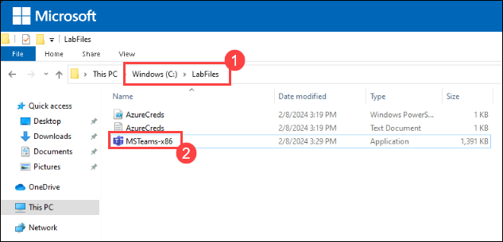

        >**Note:** If you come up with the popup stay signed in to all your apps click on **No, sign in to this app only**.

1. Close any other popup opened and do not switch from classic teams, teams might automatically switch to new version after reopening the teams. please perform the below steps in the classic version as there might be steps vary in new version. 

1. Select **Teams (2)** on the left menu, then select **Join or create a team (2)**.

     

1. Select the **Create Team** button from the drop-down.

1. Select the **From scratch** button.

    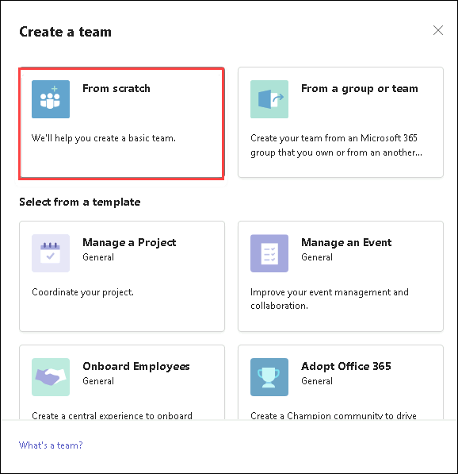  
       
1. Select the **Private** button.

    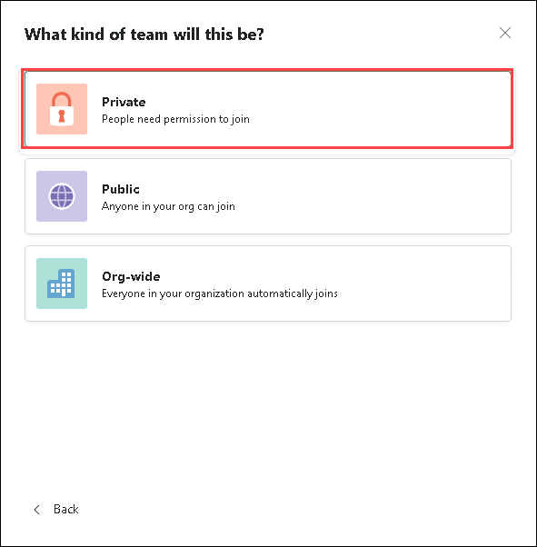 

1. Give the team the name: **SOC (1)** and select the **Create (2)** button.

      

1. In the Add members to SOC screen, select the **Skip** button. 

1. Scroll down the Teams blade to locate the newly created SOC team, select the ellipsis **(...) (1)** on the right side of the name and select **Add channel (2)**.
   
     

1. Enter a channel name as **New Alerts (1)** then select the **Add (2)** button.

     

   > **Congratulations** on completing the task! Now, it's time to validate it. Here are the steps:
   - If you receive a success message, you can proceed to the next task.
   - If not, carefully read the error message and retry the step, following the instructions in the lab guide.
   - If you need any assistance, please contact us at cloudlabs-support@spektrasystems.com. We are available 24/7 to help you out.
 
   <validation step="5e120148-dee3-45fe-8e37-6cbed679379f" />

### Task 4: Create a Playbook in Microsoft Sentinel.

In this task, you will create a Logic App that is used as a Playbook in Microsoft Sentinel.

1. In the Microsoft Edge browser, open a new tab and paste https://github.com/Azure/Azure-Sentinel to navigate to Microsoft Sentinel on GitHub.

1. Scroll down and select the **Solutions** folder.

1. Next select the **SentinelSOARessentials** folder, then the **Playbooks** folder.

1. Select the **Post-Message-Teams** folder.

1. In the readme.md box, scroll down to the **Quick Deployment (1)** section, **Deploy with incident trigger (recommended) (2)** and select the **Deploy to Azure (3)** button.

     

1. On the **Custom deployment** page provide the following details.

    - Make sure your Azure Subscription is selected. **(1)**

    - For Resource Group, select **threat-xdr** **(2)** 

    - Leave **(US) East US** as the default value for *Region*. **(3)**

    - Rename the *Playbook Name* to **PostMessageTeams-OnIncident (4)**. 

    - Provide the **Teams Group Id(5)** and **Teams Channel ID(6)** in order to get these values navigate back to the MS teams.

        i.  For **Teams Group Id** click on **SOC Ellipse(1)** then click on **Get  link to team(2)**.

        

        ii. For **Teams Channel Id** click on **New Alerts Ellipse(1)** then click on **Get  link to Channel(2)**.

        

        iii. Copy the values to the **Notepad**.

        

1. Select **Review + create (7)** and then click **Create**.

       

    >**Note:** Wait for the deployment to finish before proceeding to the next task. It may take a couple of minutes to deploy.

### Task 5: Update a Playbook in Microsoft Sentinel.

In this task, you will update the new playbook you created with the proper connection information.

1. In the Search bar of the Azure portal, type *Microsft Sentinel (1)*, then select **Microsoft Sentinel (2)**.

     

1. Select the pre-created Sentinel **loganalyticworkspace** from the available list.

    

1. Select the **Automation (1)** from the Configuration area and then select the **Active Playbooks (2)** tab, If **PostMessageTeams-OnIncident (3)** is not visiable refresh the page and check.

1. Select the **PostMessageTeams-OnIncident** playbook and click on it to go to the logic App page.

    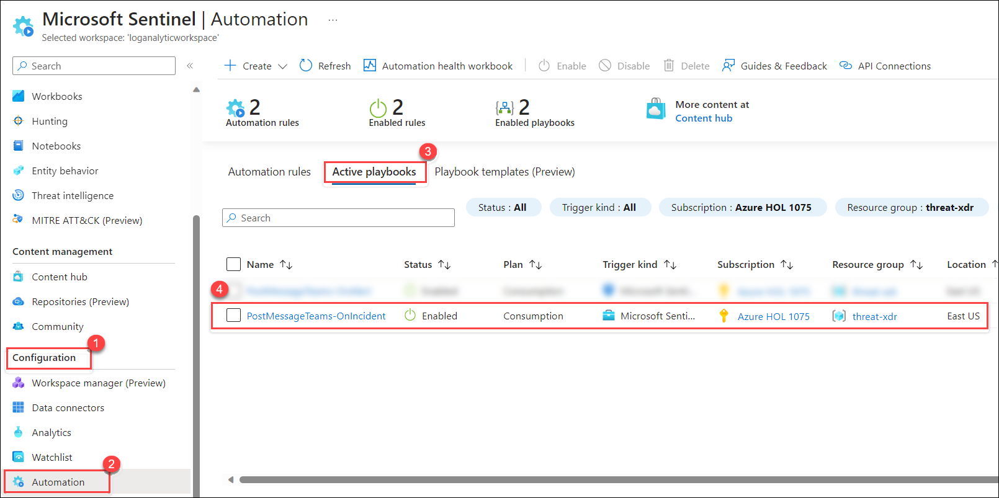 

1. On the Logic App page for *PostMessageTeams-OnIncident*, in the center menu, select **Edit**.
   
    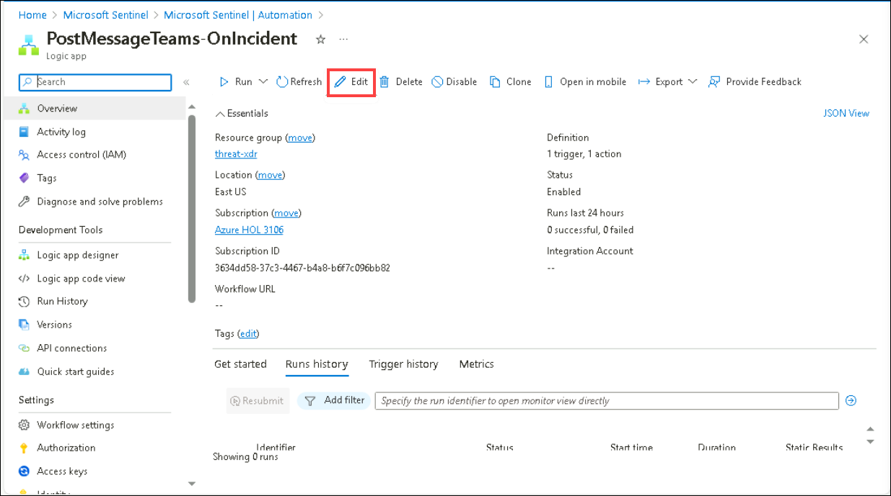 

1. Select the *first* block **Microsoft Sentinel Incident**.

     

1. Select the **Change connection** link.
   
    

1. Select **Add new.**

    

1. Select **Sign in**. In the new window, select your Azure subscription admin credentials when prompted. The last line of the block should now read “Connected to your-admin-username”.  

     

1. Now select the *second block*, **Connections**.

    

1. Click on **Change connection.**  

    

1. Select **Add new** then **Sign in** and select your Azure admin credentials when prompted. The last line of the block should now read “Connected to your-admin-username”.

    
   
1. The block has now been renamed to **Post a message (V3)**, at the end of the Team field, select the X to clear the contents. The field is changed to a drop-down with a listing of the available Teams from Microsoft Teams. Select **SOC (1)**.

1. Do the same for the Channel field, select the **X** at the end of the field to clear the contents. The field is changed to a drop-down with a listing of the Channels of the SOC Teams. Select **New Alerts (2)**. 

        

1. Under the **Message** section, type **Entities: (1)** and click on the **dynamic content (2)** icon.

       

1. Search and select **Entities (2)** dynamic content from the right panel.

   

   >**Note:** Click in the **Thunder Icon** to check fir the entities field content.

1. Select **Save** on the command bar. The Logic App will be used in a future lab.
   
   

### Task 1: Persistence Attack with Registry Key Add 

>**Note:** Perform this task in your LAB-VM (svm).

1. In the search of the taskbar, enter *Command*. A Command Prompt will be displayed in the search results. Right-click on the Command Prompt and select **Run as Administrator**. Select **Yes** in the User Account Control window that allows the app to run.

1. In the Command Prompt, create a Temp folder in the root directory. Remember to press Enter after the last row:

    ```CommandPrompt
    cd \
    mkdir temp
    cd temp
    ```

    >**Note**: If there is any error on temp directory already exists, please perform the next steps.  
   
1. Copy and run this command to simulate program persistence:

    ```CommandPrompt
    REG ADD "HKCU\SOFTWARE\Microsoft\Windows\CurrentVersion\Run" /V "SOC Test" /t REG_SZ /F /D "C:\temp\startup.bat"
    ```

   > **Congratulations** on completing the task! Now, it's time to validate it. Here are the steps:
   - If you receive a success message, you can proceed to the next task.
   - If not, carefully read the error message and retry the step, following the instructions in the lab guide.
   - If you need any assistance, please contact us at cloudlabs-support@spektrasystems.com. We are available 24/7 to help you out.
 
   <validation step="8f13852e-0b9e-4064-babe-3918fddfd6c3" />
   
### Task 2: Command and Control Attack with DNS

>**Note:** Perform this task in your LAB-VM (svm).

1. Copy and run this command to create a script that will simulate a DNS query to a C2 server:

      ```CommandPrompt
      notepad c2.ps1
      ```

1. Select **Yes** to create a new file and copy the following PowerShell script into *c2.ps1*.

      >**Note:** Pasting into the virtual machine file might not show the full script length. Make sure the script matches the instructions within the *c2.ps1* file.

      ```PowerShell
      param(
        [string]$Domain = "microsoft.com",
        [string]$Subdomain = "subdomain",
        [string]$Sub2domain = "sub2domain",
        [string]$Sub3domain = "sub3domain",
        [string]$QueryType = "TXT",
        [int]$C2Interval = 8,
        [int]$C2Jitter = 20,
        [int]$RunTime = 240
    )
    $RunStart = Get-Date
    $RunEnd = $RunStart.addminutes($RunTime)
    $x2 = 1
    $x3 = 1 
    Do {
        $TimeNow = Get-Date
        Resolve-DnsName -type $QueryType $Subdomain".$(Get-Random -Minimum 1 -Maximum 999999)."$Domain -QuickTimeout
        if ($x2 -eq 3 )
        {
            Resolve-DnsName -type $QueryType $Sub2domain".$(Get-Random -Minimum 1 -Maximum 999999)."$Domain -QuickTimeout
            $x2 = 1
        }
        else
        {
            $x2 = $x2 + 1
        }    
        if ($x3 -eq 7 )
        {
            Resolve-DnsName -type $QueryType $Sub3domain".$(Get-Random -Minimum 1 -Maximum 999999)."$Domain -QuickTimeout
            $x3 = 1
        }
        else
        {
            $x3 = $x3 + 1
        }
        $Jitter = ((Get-Random -Minimum -$C2Jitter -Maximum $C2Jitter) / 100 + 1) +$C2Interval
        Start-Sleep -Seconds $Jitter
    }
    Until ($TimeNow -ge $RunEnd)
    ```

1. In the Notepad menu, select **File** and then **Save**. 

1. Go back to the Command Prompt window, enter the following command and press Enter.

      ```CommandPrompt
      Start PowerShell.exe -file c2.ps1
      ```
    
      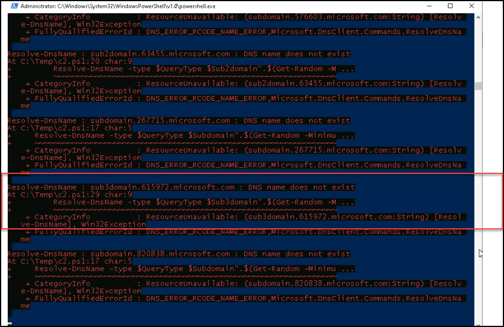
   
      >**Note:** You will see DNS resolve errors. This is expected.

      >**Important**: Do not close these windows. Let this PowerShell script run in the background. The command needs to generate log entries for some hours. You can proceed to the next task and next exercises while this script runs. The data created by this task will be used in the Threat Hunting lab later. This process will not create substantial amounts of data or processing.

### Task 2: Persistence Attack Detection

In this task, you will create a detection for the first attack of the previous exercise.
1. In the Search bar of the Azure portal, type *Microsft Sentinel (1)*, then select **Microsoft Sentinel (2)**.

   
   
1. Select the Microsoft Sentinel Workspace you created earlier.

1. Select **Logs** from the *General* section.

    >**Note:** You might see some popup after clicking on **Logs**. close all Popups by clicking on **X** Icon.

1. **Run** the following statement with the *where* operator in our query to retrieve the results for the records that starts from particular EventId.

    ```KQL
    SecurityEvent 
    | where Activity startswith "4624" 
    ```
    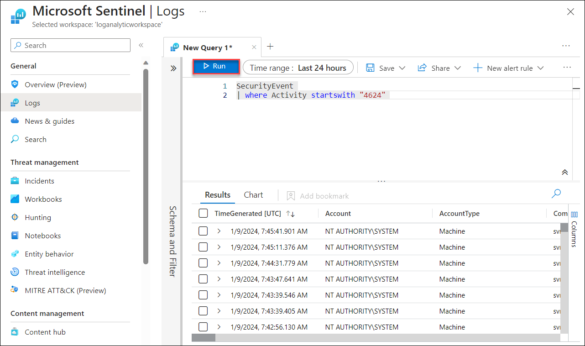

1. It is important to help the Security Operations Center Analyst by providing as much context about the alert as you can. This includes projecting Entities for use in the investigation graph. **Run** the following query:

    ```KQL
    SecurityEvent 
    | where Activity startswith "4624" 
    | extend timestamp = TimeGenerated, HostCustomEntity = Computer, AccountCustomEntity = SubjectUserName
    ```

1. Now that you have a good detection rule, in the Logs window, select the **+ New alert rule** in the command bar and then select **Create Microsoft Sentinel alert**. This will create a new Scheduled rule.
   
    >**Hint:** You might need to select the ellipsis (...) button in the command bar.

1. This starts the "Analytics rule wizard". For the *General* tab type:

    |Setting|Value|
    |---|---|
    |Name|Startup RegKey|
    |Description|Startup RegKey in c:\temp|
    |MITRE ATT&CK|Persistence|
    |Severity|High|

1. Select **Next: Set rule logic >** button.

1. On the *Set rule logic* tab, the *Rule query* should be populated already with your KQL query, under **Alert enhancement** expand *Entity mapping* and select **+ Add New Entity**.

    |Entity|Identifier|Data Field|
    |:----|:----|:----|
    |Account|FullName|AccountCustomEntity|
    |Host|Hostname|HostCustomEntity|

1. If **Hostname** isn't selected for *Host* Entity, select it from the drop-down list.

1. For *Query scheduling* set the following:

    |Setting|Value|
    |---|---|
    |Run Query every|5 minutes|
    |Lookup data from the last|1 Days|

    >**Note:** We are purposely generating many incidents for the same data. This enables the Lab to use these alerts.

1. Leave the rest of the options with the defaults. Select **Next: Incident settings>** button.

1. For the *Incident settings* tab, leave the default values and select **Next: Automated response >** button.

1. On the *Automated response* tab, you will be able to see the Automation rule created in previous task. Leave everything as default and select  **Next: Review + Create** button.
  
1. On the *Review and create* tab, select the **Save** button to create the new Scheduled Analytics rule.

### Task 1: Investigate an incident

In this task, you will investigate an incident.

1. Select the Microsoft Sentinel Workspace you created earlier.

1. Select the **Incidents** page under Threat management from left side blade and Review the list of incidents

   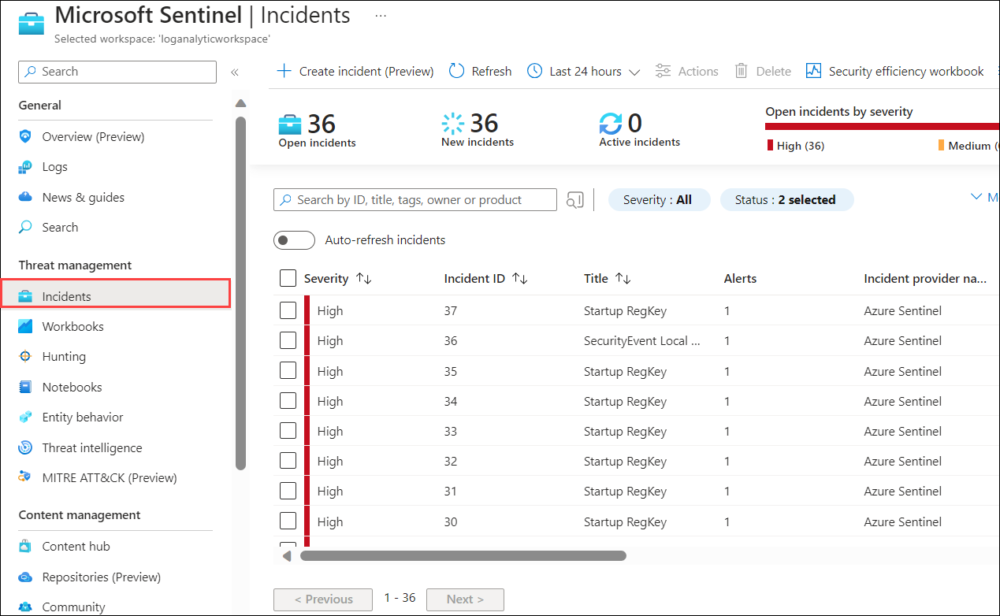

    >**Note:** The Analytics rules are generating alerts and incidents on the same specific log entry. Remember that this was done in the *Query scheduling* configuration to generate more alerts and incidents to be utilized in the lab.
  
1. Select one of the **Startup RegKey (1)** incidents. click on the **<< (2)** icon appear on the right side.Review the incident details on the right blade that opened. Scroll down and select the **View full details (3)** button.

   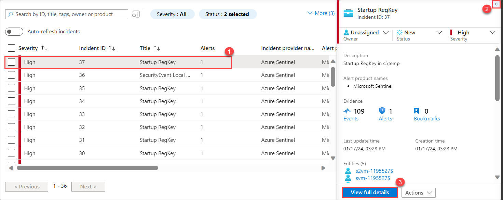

1. If the New incident experience pop-up appears, follow the prompts by reading the information by selecting the **Next** button.

1. On the left blade of the incident, change the Status to **Active** and then select **Apply**.

    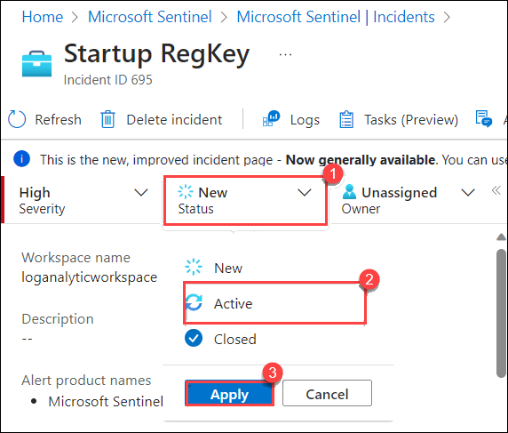

1. Scroll down to the *Tags* area, select **+ (1)** and type **RegKey (2)** and select **OK (3)**.

     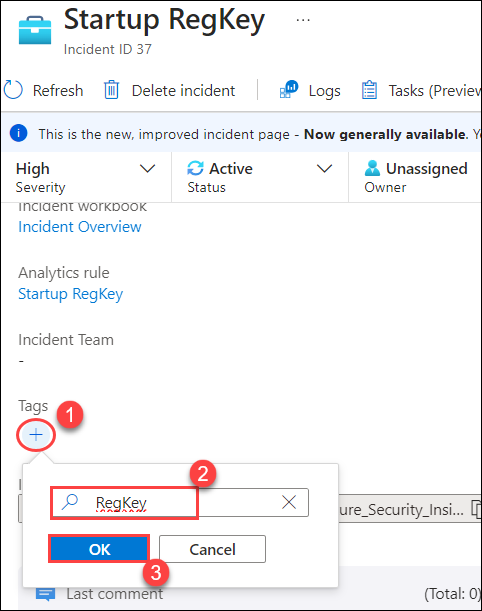

1. Scroll down and in the *Write a comment...* box type: *I will research this* and select the **>** icon to submit the new comment.

    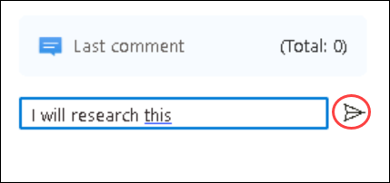

1. Hide the left blade by selecting the **<<** icon next to the owner.

1. Review the **Incident timeline** window. For the *Startup RegKey* alert, select the ellipsis **(...) (1)** icon and then **Run playbook (2)**. You will see the *Alert playbooks*. This option helps you to run playbooks manually.

    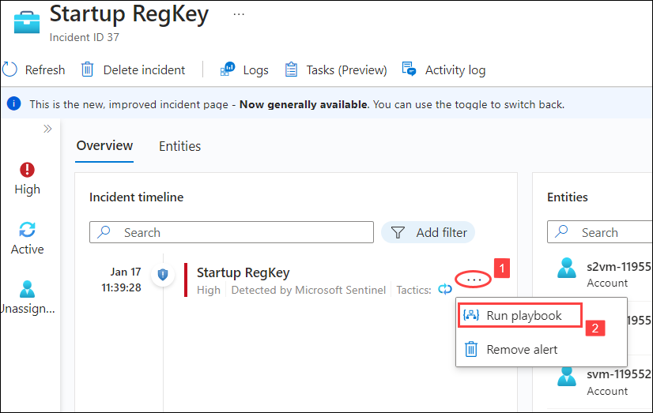

    >**Note**: If you did not see any playbook no need to worry there might be the case where sentinel does not reflect the playbook, we can proceed with the next step

1. Close the *Alert playbooks* blade by selecting the **x** icon in the top right.

1. Review the **Entities** window. At least the *Host* entity that we mapped within the KQL query from the previous exercise should appear. **Hint:** If no entities are shown, refresh the page.

   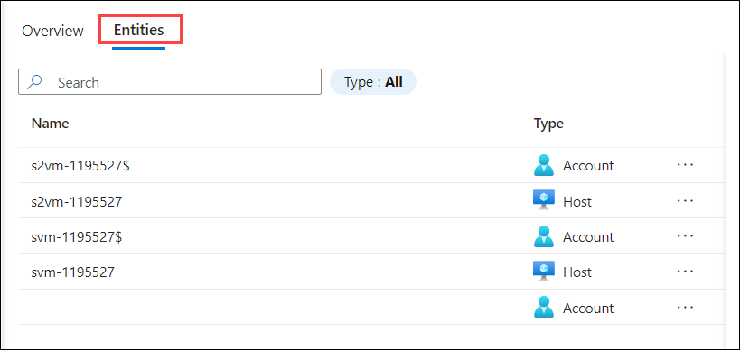

1. Select the **Tasks** button from the command bar.

   

1. Select **+ Add task (1)**, type **Review who owns the machine (2)** in the Title box and select **Save (3)**.

   

1. Close the *Incident tasks* blade by selecting the **x** icon in the top right.

   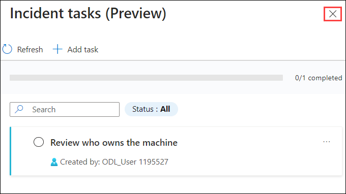

1. Select the new **Activity Log** button from the command bar. Review the actions you have taken during this exercise. Close the *Incident activity log* blade by selecting the **x** icon in the top right.

   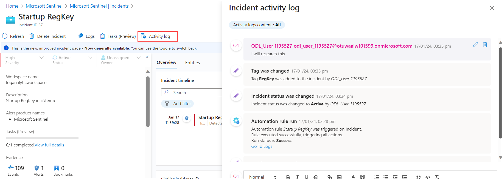

1. From the almost hidden left blade, select the user icon named **Unassigned (1)**. The new incident experience allows quick changes from here.

1. Select **Assign to me (2)** and then scroll down to select **Apply (3)** to save the changes.

    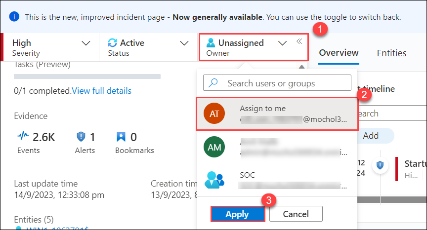

1. Select the **Investigate** button.

    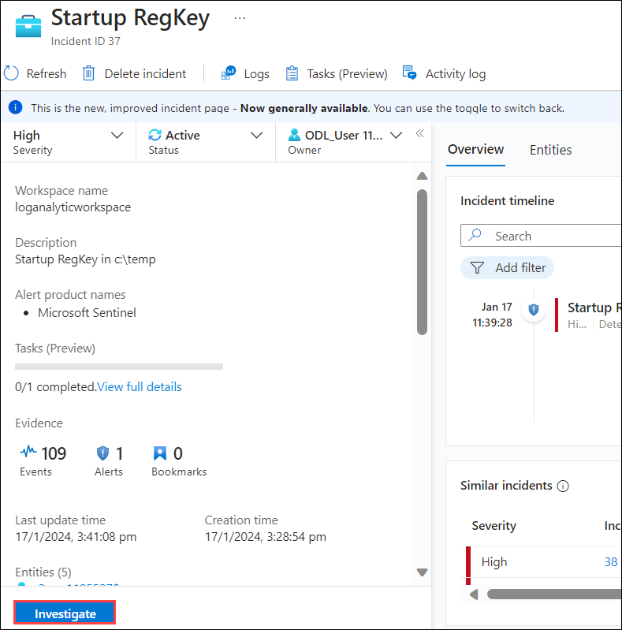

1. **Hover** the svm-server entity icon and wait for new *exploration queries* to be shown. It looks like *Related Alerts* has more data on it. Select the name of the exploration query **Related Alerts** to bring them to the investigation graph or select **Events >** to investigate them with a KQL query.

    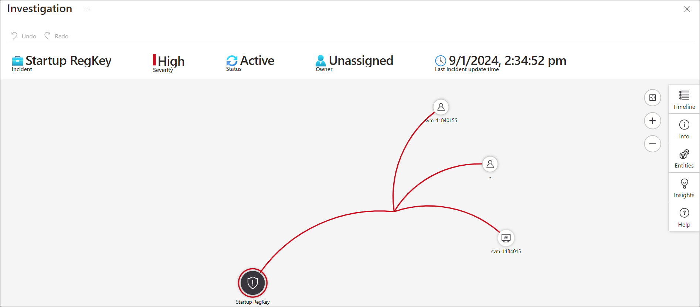

   >**Hint:** If the icons are too small for your screen, select **(+)** to magnify them.   

1. Close the query window by selecting the **X** icon at the top right to go back to the *Investigation* page.

1. Now select the **svm-server** entity, a window on the right opens for more detailed information. Review the **Info** page.

   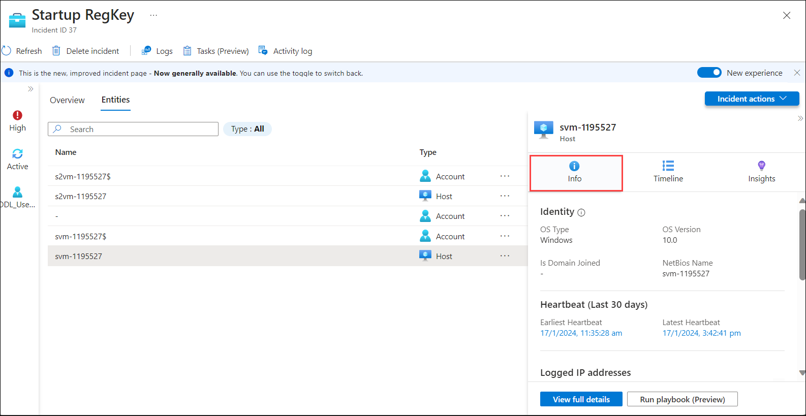

1. Select **Timeline** button. Hover the incidents and see which things on the graph occurred at what point in time.

   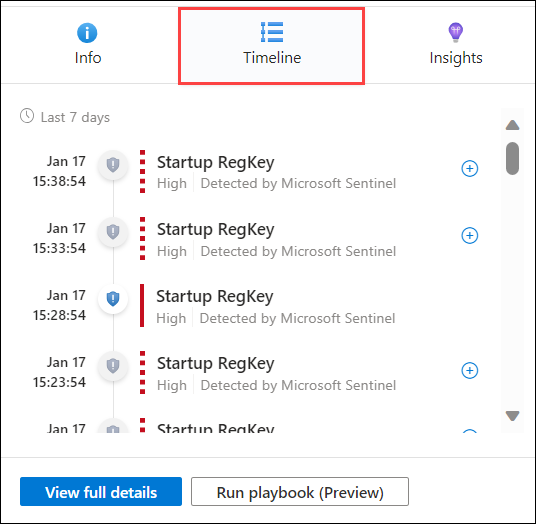

1. Close the investigation graph by selecting the **X** icon at the top right of the page.

1. Back in the incident page, in the left pane select **Active Status (1)** and select **Closed (2)**. In the *Select classification* drop-down review the different options. After that, select **True positive - suspicious activity (3)** and then select **Apply (4)**.

   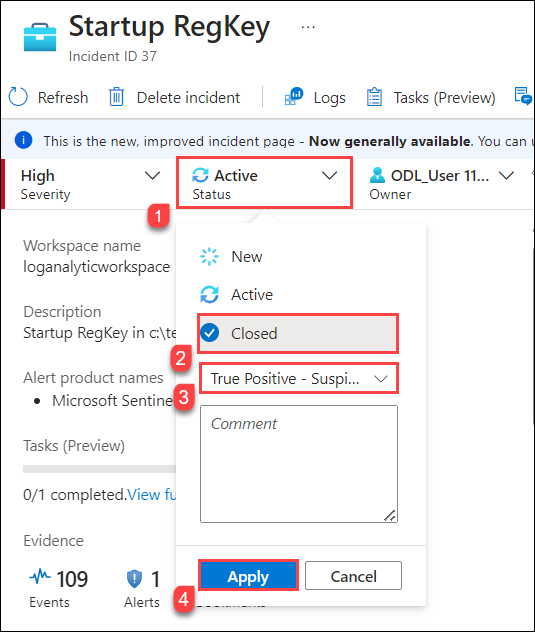
