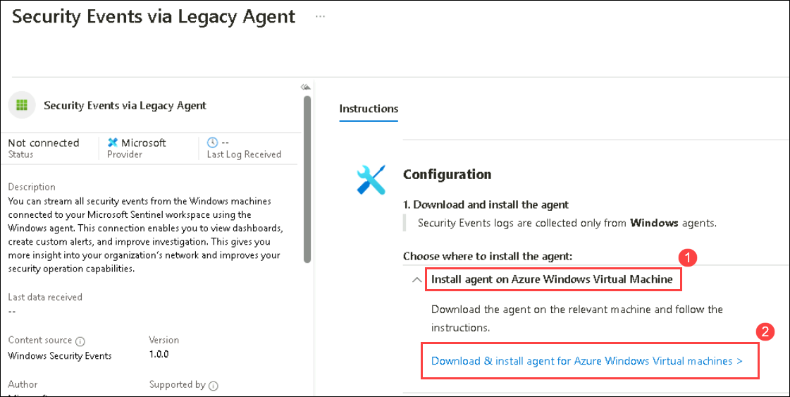
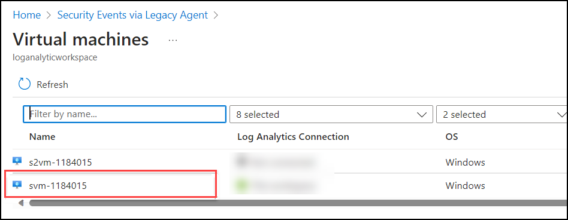
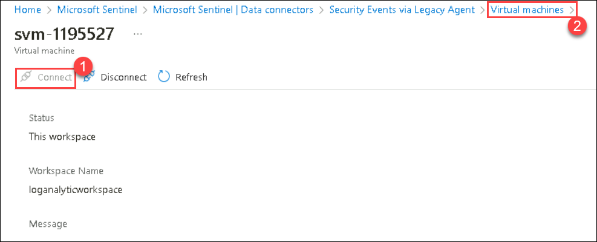

# Exercise 2: Integrating Microsoft Sentinel with Microsoft 365 Defender for Threat Detection and Investigation

### Estimated timing: 90 minutes
## Overview

In this exercise, you will connect the Windows security event connector, enable Microsoft Defender for Cloud, and protect an on-premises server. You’ll simulate persistence and command-and-control attacks, detect malicious activity, and investigate the resulting incident to understand how Defender for Cloud responds to advanced threats.

## Objectives
 In this exercise, you will perform the following in the M365 Defender portal:
- Task 1: Connect the Windows security event connector
- Task 2: Enable Microsoft Defender for Cloud
- Task 3: Persistence Attack with Registry Key Add 
- Task 4: Command and Control Attack with DNS
- Task 5: Persistence Attack Detection
- Task 6: Investigate an incident

### Task 1: Connect the Windows security event connector

1. In the Search bar of the Azure portal, type *Microsft Sentinel*, then select **Microsoft Sentinel**.

     

1. Select the pre-created Sentinel **loganalyticworkspace** from the available list.

     

1. Navigate to the left menu and go to the Content Management section; there, select **Content Hub (1)**. On the Content Hub page, locate **Windows Security Events (2)**, and then **select (3)** it. Finally, click on **Install (4)**.

      

1. After receiving the notification of a successful installation, return to the Data Connector page and click on the refresh button to ensure that the changes take effect.

1. You should observe two options: **Security Events Via Legacy Agent** and **Windows Security Event Via AMA**.

1. Choose **Security Events Via Legacy Agent**, and then click on **Open Connector Page**.

     
   
8. In the configuration section, opt for **Install Agent on Azure Windows Virtual Machine (1)**, and then choose **Download & Install Agent for Azure Windows Virtual Machines (2)**.

     

9. Select the **svm-<inject key="DeploymentID" enableCopy="false" />** virtual machine and click on connect.

     
        
10. Once **connected (1)**, select the **Virtual Machine (2)** link from the top.

     

11. On the virtual machine page select the **s2vm-<inject key="DeploymentID" enableCopy="false" />** virtual machine and click on connect. wait until get connected.

    

11. Then, come back to the Configuration and scroll down a bit. You can find **Select which events to stream**. Click on **All Events**.

     

12. Click on Apply Changes now. If you refresh the data connector page, you can see the status Connected for **Security Events Via Legacy Agent**.

### Task 2: Enable Microsoft Defender for Cloud

In this task, you will enable and configure Microsoft Defender for Cloud.

1. Go to the [Azure Portal](https://portal.azure.com), and search for **Microsoft Defender for Cloud**.

1. When prompted, click **Enable** to activate Defender CSPM.

   
     
   

   > **Note:** If you don’t see the pop-up prompt, simply continue and follow the lab guide steps as shown below.

   >**Note:** This enables advanced posture capabilities like attack path analysis and permissions management.

1. Go to **Environment settings** > select your subscription.

   

1. Review the Azure resources that are now protected with the Defender for Cloud plans.

1. Select the **Settings & Monitoring** tab from the Settings area (next to Save).
 
     

1. Review the monitoring extensions and confirm that **Log Analytics agent/Azure Monitor agent** is **Off**. Click Continue or close the Settings & Monitoring page by selecting the 'X' on the upper right of the page.

     

1. Close the settings page by selecting the 'X' on the upper right of the page to return to the **Environment settings**. Then, click on the '>' to the left of your subscription.

1. Select the Log Analytics workspace named **loganalyticworkspace** to review the available options and pricing.

     

1. Select **Enable all** (to the right of Select Defender plan), and then choose **Save**. Wait for the *"Microsoft Defender plan for workspace loganalyticworkspace was saved successfully!"* notification to appear.

    >**Note:** If the page is not being displayed, refresh your Edge browser and try again.  

1. Close the Defender plans page by selecting the 'X' in the upper right corner of the page to return to the **Environment settings**.

    

> **Congratulations** on completing the task! Now, it's time to validate it. Here are the steps:
> - Hit the Validate button for the corresponding task. If you receive a success message, you can proceed to the next task. 
> - If not, carefully read the error message and retry the step, following the instructions in the lab guide.
> - If you need any assistance, please contact us at cloudlabs-support@spektrasystems.com. We are available 24/7 to help you out.
<validation step="ea9784ef-a103-41e0-859f-f673a96cf886" />
    
### Task 3: Persistence Attack with Registry Key Add 

1. In the search of the taskbar, enter *Command*. A Command Prompt will be displayed in the search results. Right-click on the Command Prompt and select **Run as Administrator**. Select **Yes** in the User Account Control window that allows the app to run.

1. In the Command Prompt, create a Temp folder in the root directory. Remember to press Enter after the last row:

    ```CommandPrompt
    cd \
    mkdir temp
    cd temp
    ```

    >**Note**: If there is any error on temp directory already exists, please perform the next steps.  
   
1. Copy and run this command to simulate program persistence:

    ```CommandPrompt
    REG ADD "HKCU\SOFTWARE\Microsoft\Windows\CurrentVersion\Run" /V "SOC Test" /t REG_SZ /F /D "C:\temp\startup.bat"
    ```

   > **Congratulations** on completing the task! Now, it's time to validate it. Here are the steps:
   - If you receive a success message, you can proceed to the next task.
   - If not, carefully read the error message and retry the step, following the instructions in the lab guide.
   - If you need any assistance, please contact us at cloudlabs-support@spektrasystems.com. We are available 24/7 to help you out.
 
   <validation step="4308381b-c9df-4237-b612-a6aa4f974757" />
   
### Task 4: Command and Control Attack with DNS

1. Copy and run this command to create a script that will simulate a DNS query to a C2 server:

      ```CommandPrompt
      notepad c2.ps1
      ```

1. Select **Yes** to create a new file and copy the following PowerShell script into *c2.ps1*.

      >**Note:** Pasting into the virtual machine file might not show the full script length. Make sure the script matches the instructions within the *c2.ps1* file.

      ```PowerShell
      param(
        [string]$Domain = "microsoft.com",
        [string]$Subdomain = "subdomain",
        [string]$Sub2domain = "sub2domain",
        [string]$Sub3domain = "sub3domain",
        [string]$QueryType = "TXT",
        [int]$C2Interval = 8,
        [int]$C2Jitter = 20,
        [int]$RunTime = 240
    )
    $RunStart = Get-Date
    $RunEnd = $RunStart.addminutes($RunTime)
    $x2 = 1
    $x3 = 1 
    Do {
        $TimeNow = Get-Date
        Resolve-DnsName -type $QueryType $Subdomain".$(Get-Random -Minimum 1 -Maximum 999999)."$Domain -QuickTimeout
        if ($x2 -eq 3 )
        {
            Resolve-DnsName -type $QueryType $Sub2domain".$(Get-Random -Minimum 1 -Maximum 999999)."$Domain -QuickTimeout
            $x2 = 1
        }
        else
        {
            $x2 = $x2 + 1
        }    
        if ($x3 -eq 7 )
        {
            Resolve-DnsName -type $QueryType $Sub3domain".$(Get-Random -Minimum 1 -Maximum 999999)."$Domain -QuickTimeout
            $x3 = 1
        }
        else
        {
            $x3 = $x3 + 1
        }
        $Jitter = ((Get-Random -Minimum -$C2Jitter -Maximum $C2Jitter) / 100 + 1) +$C2Interval
        Start-Sleep -Seconds $Jitter
    }
    Until ($TimeNow -ge $RunEnd)
    ```

1. In the Notepad menu, select **File** and then **Save**. 

1. Go back to the Command Prompt window, enter the following command and press Enter.

      ```CommandPrompt
      Start PowerShell.exe -file c2.ps1
      ```
    
      
   
      >**Note:** You will see DNS resolve errors. This is expected.

      >**Important**: Do not close these windows. Let this PowerShell script run in the background. The command needs to generate log entries for some hours. You can proceed to the next task and next exercises while this script runs. The data created by this task will be used in the Threat Hunting lab later. This process will not create substantial amounts of data or processing.

### Task 5: Persistence Attack Detection

In this task, you will create a detection for the first attack of the previous exercise.
1. In the Search bar of the Azure portal, type *Microsft Sentinel (1)*, then select **Microsoft Sentinel (2)**.

   
   
1. Select the Microsoft Sentinel Workspace you created earlier.

1. Select **Logs** from the *General* section.

    >**Note:** You might see some popup after clicking on **Logs**. close all Popups by clicking on **X** Icon.

1. **Run** the following statement with the *where* operator in our query to retrieve the results for the records that starts from particular EventId.

    ```KQL
    SecurityEvent 
    | where Activity startswith "4624" 
    ```
    

    >**Note:** It may take **5 to 10 minutes** for the SecurityEvent data to become available after onboarding or activity generation.  

1. It is important to help the Security Operations Center Analyst by providing as much context about the alert as you can. This includes projecting Entities for use in the investigation graph. **Run** the following query:

    ```KQL
    SecurityEvent 
    | where Activity startswith "4624" 
    | extend timestamp = TimeGenerated, HostCustomEntity = Computer, AccountCustomEntity = SubjectUserName
    ```

1. Now that you have a good detection rule, in the Logs window, select the **+ New alert rule** in the command bar and then select **Create Microsoft Sentinel alert**. This will create a new Scheduled rule.
   
    >**Hint:** You might need to select the ellipsis (...) button in the command bar.

1. This starts the "Analytics rule wizard". For the *General* tab type:

    |Setting|Value|
    |---|---|
    |Name|Startup RegKey|
    |Description|Startup RegKey in c:\temp|
    |MITRE ATT&CK|Persistence|
    |Severity|High|

1. Select **Next: Set rule logic >** button.

1. On the *Set rule logic* tab, the *Rule query* should be populated already with your KQL query, under **Alert enhancement** expand *Entity mapping* and select **+ Add New Entity**.

    |Entity|Identifier|Data Field|
    |:----|:----|:----|
    |Account|FullName|AccountCustomEntity|
    |Host|Hostname|HostCustomEntity|

1. If **Hostname** isn't selected for *Host* Entity, select it from the drop-down list.

1. For *Query scheduling* set the following:

    |Setting|Value|
    |---|---|
    |Run Query every|5 minutes|
    |Lookup data from the last|1 Days|

    >**Note:** We are purposely generating many incidents for the same data. This enables the Lab to use these alerts.

1. Leave the rest of the options with the defaults. Select **Next: Incident settings>** button.

1. For the *Incident settings* tab, leave the default values and select **Next: Automated response >** button.

1. On the *Automated response* tab, you will be able to see the Automation rule created in previous task. Leave everything as default and select  **Next: Review + Create** button.
  
1. On the *Review and create* tab, select the **Save** button to create the new Scheduled Analytics rule.

### Task 6: Investigate an incident

In this task, you will investigate an incident.

1. Select the Microsoft Sentinel Workspace you created earlier.

1. Select the **Incidents** page under Threat management from left side blade and Review the list of incidents

   

    >**Note:** The Analytics rules are generating alerts and incidents on the same specific log entry. Remember that this was done in the *Query scheduling* configuration to generate more alerts and incidents to be utilized in the lab.
  
1. Select one of the **Startup RegKey (1)** incidents. click on the **<< (2)** icon appear on the right side.Review the incident details on the right blade that opened. Scroll down and select the **View full details (3)** button.

   

1. If the New incident experience pop-up appears, follow the prompts by reading the information by selecting the **Next** button.

1. On the left blade of the incident, change the Status to **Active** and then select **Apply**.

    

1. Scroll down to the *Tags* area, select **+ (1)** and type **RegKey (2)** and select **OK (3)**.

     

1. Scroll down and in the *Write a comment...* box type: *I will research this* and select the **>** icon to submit the new comment.

    

1. Hide the left blade by selecting the **<<** icon next to the owner.

1. Review the **Entities** window. At least the *Host* entity that we mapped within the KQL query from the previous exercise should appear. **Hint:** If no entities are shown, refresh the page.

   

1. Select the **Tasks** button from the command bar.

1. Select **+ Add task (1)**, type **Review who owns the machine (2)** in the Title box and select **Save (3)**.

1. Close the *Incident tasks* blade by selecting the **x** icon in the top right.

   

1. Select the new **Activity Log** button from the command bar. Review the actions you have taken during this exercise. Close the *Incident activity log* blade by selecting the **x** icon in the top right.

   

1. From the almost hidden left blade, select the user icon named **Unassigned (1)**. The new incident experience allows quick changes from here.

1. Select **Assign to me (2)** and then scroll down to select **Apply (3)** to save the changes.

    

1. Select the **Investigate** button.

    

1. **Hover** the svm-server entity icon and wait for new *exploration queries* to be shown. It looks like *Related Alerts* has more data on it. Select the name of the exploration query **Related Alerts** to bring them to the investigation graph or select **Events >** to investigate them with a KQL query.

    

   >**Hint:** If the icons are too small for your screen, select **(+)** to magnify them.   

1. Close the query window by selecting the **X** icon at the top right to go back to the *Investigation* page.

1. Now select the **svm-server** entity, a window on the right opens for more detailed information. Review the **Info** page.

   

1. Select **Timeline** button. Hover the incidents and see which things on the graph occurred at what point in time.

   

1. Close the investigation graph by selecting the **X** icon at the top right of the page.

1. Back in the incident page, in the left pane select **Active Status (1)** and select **Closed (2)**. In the *Select classification* drop-down review the different options. After that, select **True positive - suspicious activity (3)** and then select **Apply (4)**.

   

## Review
In this lab, you have completed the following tasks:
- Connected the Windows security event connector
- Enabled Microsoft Defender for Cloud
- Conducted Persistence Attack with Registry Key Add 
- Conducted Command and Control Attack with DNS
- Conducted Persistence Attack Detection
- Investigated an incident
