# Exercise 3: Threat Hunting with Microsoft Sentinel

### Estimated timing: 30 minutes

## Overview

You are a Security Operations Analyst working at a company that implemented Microsoft Sentinel. You have received threat intelligence about a Command and Control (C2 or C&C) technique.  You need to perform a hunt and watch for the threat.

## Objectives

 In this Exercise, you will perform the following:
 - Task 1: Create a hunting query
 - Task 2: Create a NRT query rule
 - Task 3: Create a Search

### Task 1: Create a hunting query

In this task, you will create a hunting query, bookmark a result, and create a Livestream.

1. In the Search bar of the Azure portal, type *Microsft Sentinel (1)*, then select **Microsoft Sentinel (2)**.

   
   
1. Select the Microsoft Sentinel Workspace you created earlier.

1. Select **Logs** from the *General* section.

   

    >**Note:** You might see some popup after clicking on **Logs**. close all Popups by clicking on **X** Icon.

1. Enter the following KQL Statement in the New Query 1 space:

   >**Important:** Please paste any KQL queries first in Notepad and then copy from there to the New Query 1 Log window to avoid any errors.

    ```KQL
    let lookback = 2d; 
    SecurityEvent 
    | where TimeGenerated >= ago(lookback) 
    | where EventID == 4688 and Process =~ "powershell.exe"
    | extend PwshParam = trim(@"[^/\\]*powershell(.exe)+" , CommandLine) 
    | project TimeGenerated, Computer, SubjectUserName, PwshParam 
    | summarize min(TimeGenerated), count() by Computer, SubjectUserName, PwshParam 
    | order by count_ desc nulls last 
    ```

1. Review the different results. You have now identified PowerShell requests that are running in your environment.

    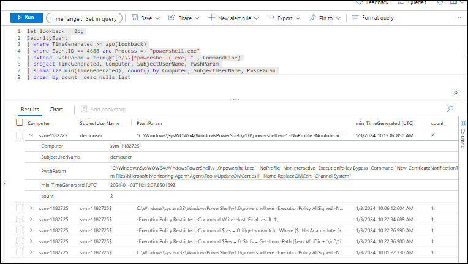

1. Select the checkbox of the results that shows the **demouser** SubjectUsername.

1. In the middle command bar, select the **Add bookmark** button.

   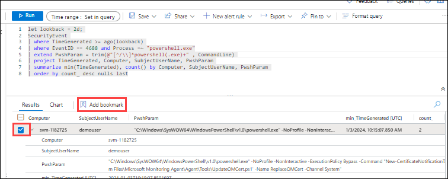

1. Select **+ Add new entity** under Entity mapping.

1. For *Entity* select **Host**, then **Hostname** and **Computer** for the values.

1. In Tactics and Techniques, select **Command and Control** from the dropdonw that appears.

1. Go back to the Add bookmark blade, and the select **Create**. We will map this bookmark to an incident later.

   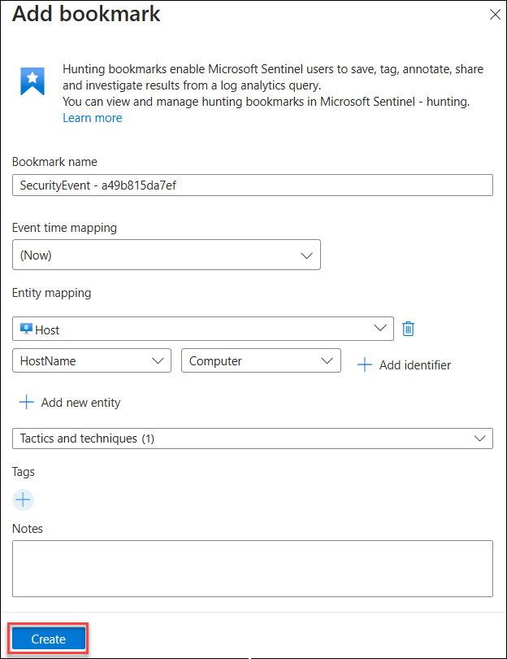

1. Close the Logs window by selecting the **X** in the top-right of the window and select **OK** to discard the changes. 

1. On the **Microsoft Sentinel** page, under **Threat management (1)**, select **Hunting (2)**, then click the **Queries (3)** tab.

   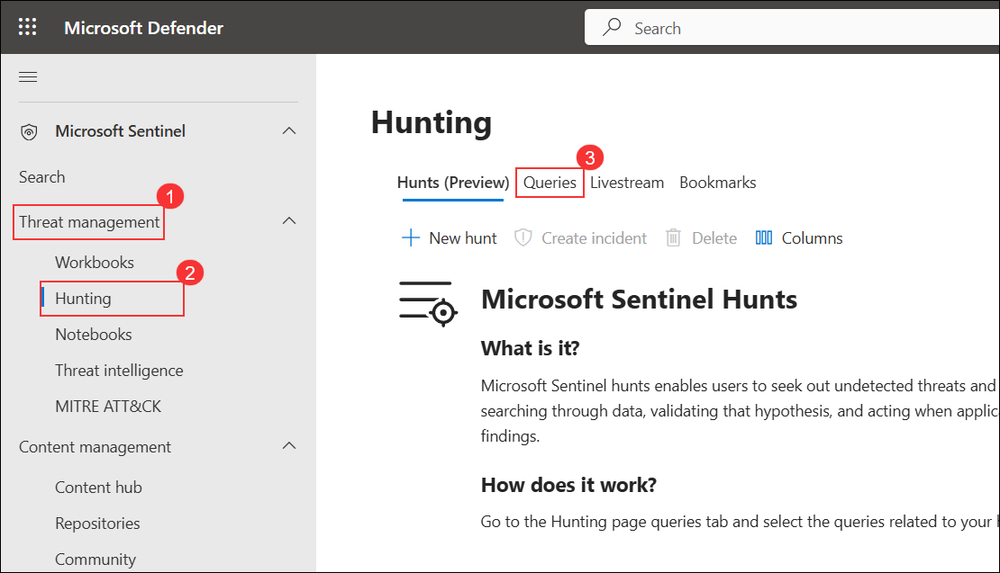

1. Select the **Queries (1)** tab and then **+ New Query (2)** from the command bar.

   

1. In the **Name** field, enter **PowerShell Hunt (1)**, and in the **Query** field, paste the provided KQL query **(2)**.

    - For the Custom query enter the following KQL statement:

    ```KQL
    let lookback = 2d; 
    SecurityEvent 
    | where TimeGenerated >= ago(lookback) 
    | where EventID == 4688 and Process =~ "powershell.exe"
    | extend PwshParam = trim(@"[^/\\]*powershell(.exe)+" , CommandLine) 
    | project TimeGenerated, Computer, SubjectUserName, PwshParam 
    | summarize min(TimeGenerated), count() by Computer, SubjectUserName, PwshParam 
    | order by count_ desc nulls last 
    ```

   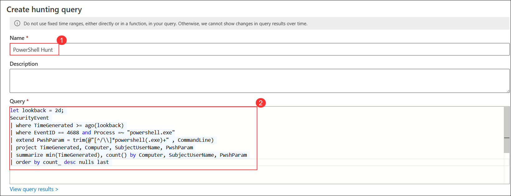

1. Under **Entity mapping**, select **Host**, then set **HostName** as the identifier and **Computer (1)** as the value. Click **Create (2)** to save the hunting query.

   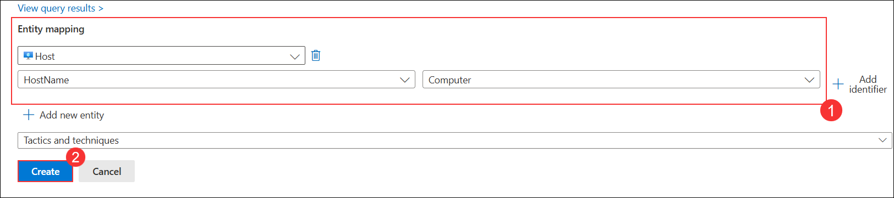

1. Verify that a notification appears confirming the hunting query **'PowerShell Hunt'** was successfully created.

   

1. Confirm that the newly created hunting query **PowerShell Hunt** is now visible in the **Queries** list under Microsoft Sentinel Hunts.

   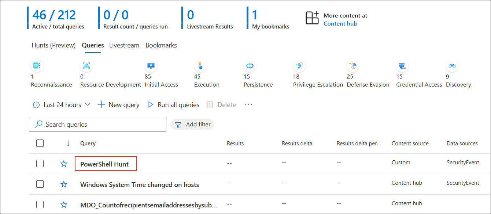

1. On the **PowerShell Hunt** details page, review the query configuration and click **View results** to see the hunting query output.

   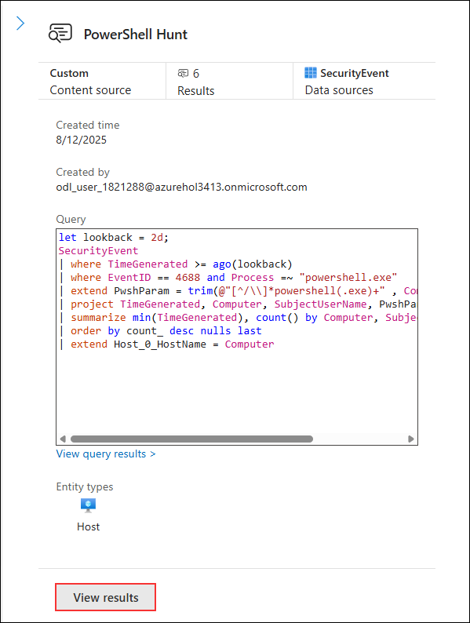

1. On the **Hunting** page, select **PowerShell Hunt (1)** from the list of queries, click on the vertical ellipsis menu, and choose **Add to livestream (2)** to monitor the query in real-time.

   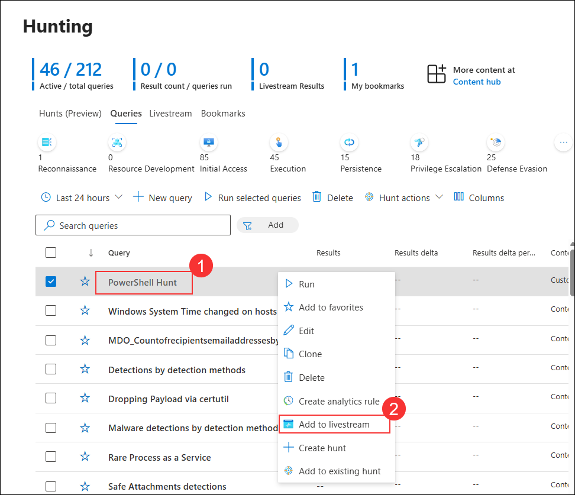

1. On the **Bookmarks (1)** tab, select the checkbox for the relevant bookmark entry **(2)**, then click **Investigate (3)** to analyze the bookmarked event in detail.

   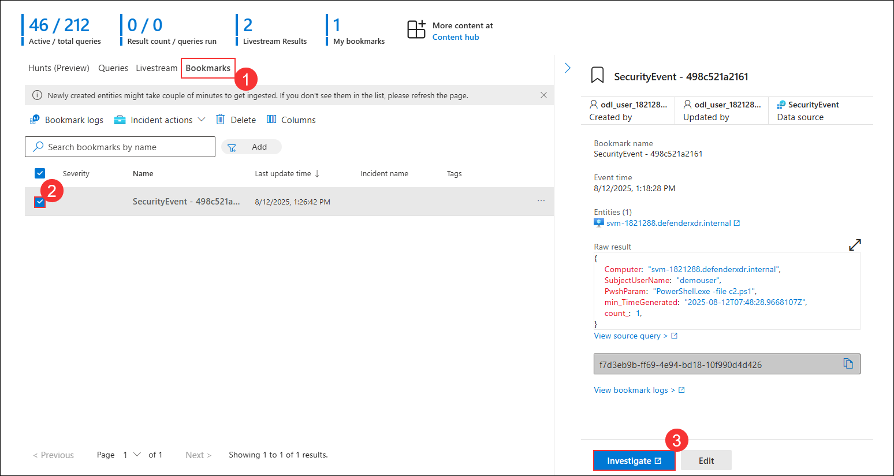

1. On the **Bookmarks** tab, click the **More actions (1)** icon for the relevant bookmark and select **Add to existing incident (2)** from the menu.

   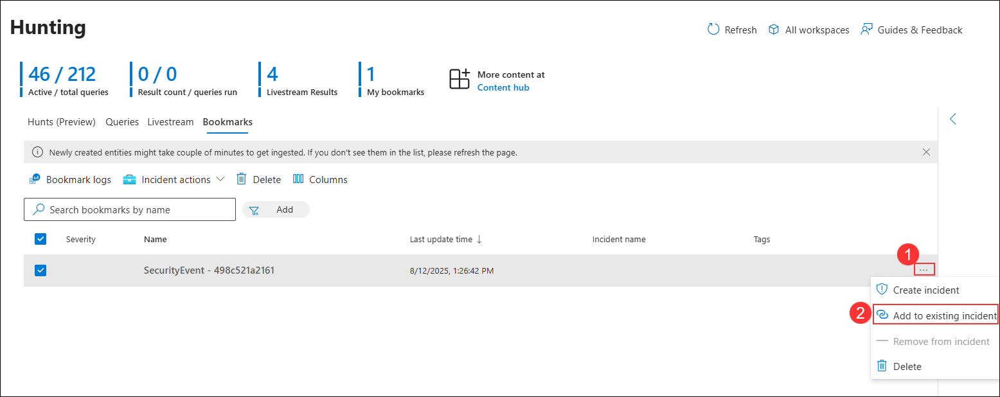

1. On the **Adding bookmark(s) to an existing incident** pane, select the incident **Multi-stage i... (1)** and click **Add (2)**.

   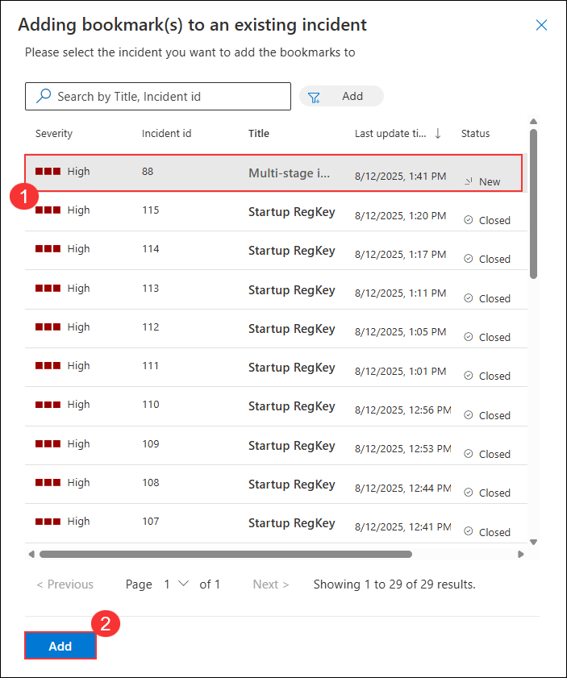

### Task 2: Create a NRT query rule

In this task, instead of using a LiveStream, you will create a NRT analytics query rule. NRT rules run every minute and look back one minute. The benefit of NRT rules is they can use the alert and incident creation logic.

1. In Microsoft Sentinel, on the left menu bar under the Configuration section, select **Analytics (1)**, and then click on **+ Create (2)** to choose **NRT query rule (3)** from dropdown.

    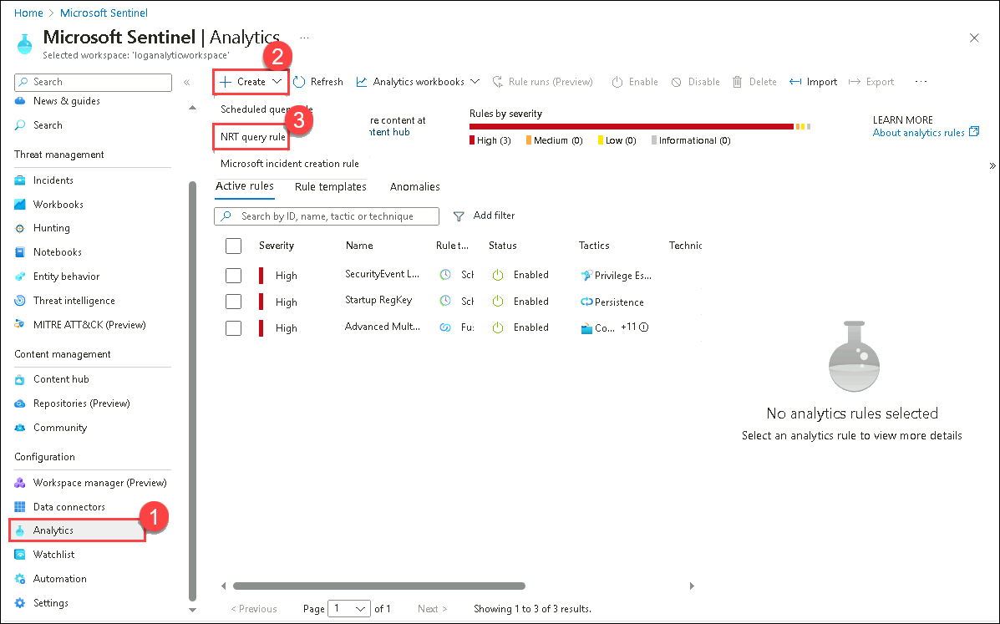 

1. This starts the Analytics rule wizard For the General tab type:

    |Setting|Value|
    |---|---|
    |Name|**NRT PowerShell Hunt**|
    |Description|**NRT PowerShell Hunt**|
    |Severity|**High**|
    |MITRE ATT&CK|**Command and Control**|

1. Select **Next: Set rule logic >** button. 

1. For the *Rule query* enter the following KQL statement:

    ```KQL
    let lookback = 2d; 
    SecurityEvent 
    | where TimeGenerated >= ago(lookback) 
    | where EventID == 4688 and Process =~ "powershell.exe"
    | extend PwshParam = trim(@"[^/\\]*powershell(.exe)+" , CommandLine) 
    | project TimeGenerated, Computer, SubjectUserName, PwshParam 
    | summarize min(TimeGenerated), count() by Computer, SubjectUserName, PwshParam
    ```

1. Select **View query results >** to make sure your query does not have any errors.

1. Close the Logs window by selecting the **X** in the top-right of the window and select **OK** to discard the changes. 

1. Under Entity mapping select:
     
    - Select **+ Add new entity** under Entity mapping.
    - For the Entity type drop-down list select **Host**.
    - For the Identifier drop-down list select **HostName**.
    - For the Value drop-down list select **Computer**.

1. Scroll down and select **Next: Incident settings>** button.

1. For the *Incident settings* tab, leave the default values and select **Next: Automated response>** button.

1. For the Automated response tab, leave the default values and select **Next: Review + create >** button.

1. On the Review and Create tab, select the **Save** button to create and save the new Scheduled Analytics rule.

### Task 3: Create a Search job

In this task, you will use a Search job to look for a C2.

1. In Microsoft Sentinel, on the left menu under General, select the **Search**. In the search box, enter **reg.exe**, and then click on **Start**.

    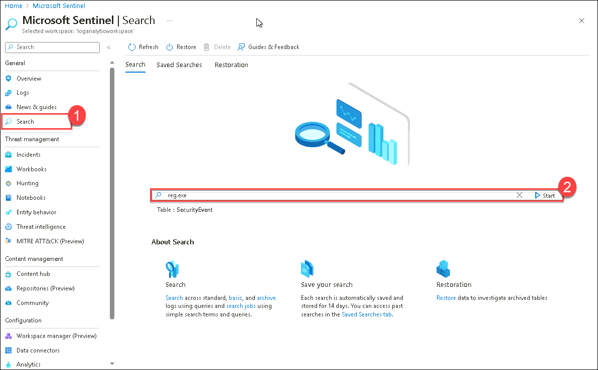

1. A new window running the query opens. Select the ellipsis icon **(...)** from the top right and then toggle the **Search job mode**.

1. Select **Search job** button from the command bar. 

1. Enter the name of the table as **Newtable**. The search job creates a new table with your results as soon as they arrive. The results can be consulted from the *Saved Searches* tab.

1. Close the *Logs* window by selecting the **X** in the top-right of the window and select **OK** to discard the changes. 
 
1. Select the **Restoration** tab from the command bar and then the **Restore** button.

1. Under *Select a table to restore*, search for and select **SecurityEvent**.

1. Review the options available and then select the **Cancel** button.

    >**Note:** If you were running the job, the restore would run for a couple of minutes and your data would be available in a new table.

## Review
In this lab, you have completed the following tasks:
- We created a hunting query.
- We created an NRT query rule.
- We Created a Search.