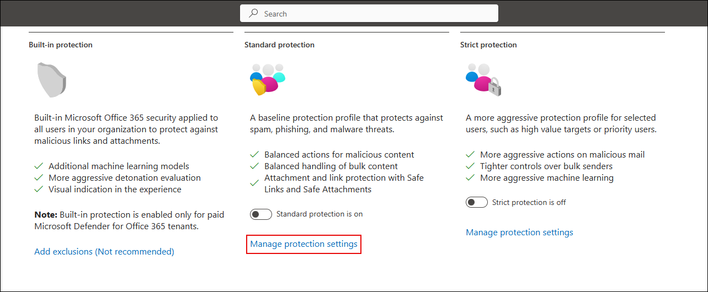

# Exercise 1: Configuring Threat Policies and Simulating Attacks in Microsoft Defender for Office 365

## Overview

In this exercise, you will configure threat protection policies in Microsoft Defender for Office 365 and use the Attack Simulator to mimic phishing and malware attacks. You will then explore how to analyze these simulated threats using Threat Explorer and real-time detections, gaining insights into how Defender identifies, tracks, and helps mitigate threats within your Office 365 environment.

## Objectives

- Task 1: Configure Threat Policies in Microsoft Defender for Office 365 
- Task 2: Simulate Phishing and Malware Attacks Using Attack Simulator 
- Task 3: Analyze Threats with Threat Explorer and Real-Time Detections 

## Task 1: Configure Threat Policies in Microsoft Defender for Office 365

### Enable Microsoft Defender for Cloud

1. Go to the [Azure Portal](https://portal.azure.com), and search for **Microsoft Defender for Cloud**.

2. When prompted, click **Enable** to activate Defender CSPM.

     
   

> ✅ This enables advanced posture capabilities like attack path analysis and permissions management.

---

### Enable Defender Plans and Verify Protection

1. In **Microsoft Defender for Cloud**, navigate to **Inventory** and check if **Defender for Cloud** is **Off** for any resources.

   

2. Go to **Environment settings** > select your subscription.

   

3. Under **Defender plans**, turn on:

   - Foundational CSPM  
   - Defender CSPM  
   - Servers (under CWP)  

   Then click **Save**.

   

4. Return to **Inventory** and confirm Defender is now set to **On**.

   

> ✅ Your Defender protection is now active for all supported workloads.

---

### Configure Threat Protection Policies

1. Open [Microsoft 365 Defender Portal](https://security.microsoft.com)

2. Navigate to:  
   **Email & collaboration** → **Policies & rules** → **Threat policies**

   

---

### Apply Standard Protection Policies

1. Select **Standard Protection**, then click **Manage protection settings**.

2. In each section, choose **Specific recipients** and assign your lab user (e.g., `ODL_User@...`).

     
   

3. Select **Turn on the policy when finished**, then review and confirm the settings.

   

> 🔐 Standard protection includes Safe Attachments, Safe Links, and anti-phishing controls.

---

### Apply Strict Protection for High-Risk Users

1. On the protection profile page, go to **Strict Protection** and click **Manage protection settings**.

   

2. Like before, assign your lab user under **Specific recipients** for both Exchange and Defender for Office 365.

     
   

3. Configure impersonation protection:

   - Add key email addresses to monitor  
   - Add domains (e.g., `www.officenced.com`) that need protection

     
   

4. Complete the wizard and confirm the configuration.

---

### Confirm Policy Activation

1. Once setup is complete, verify that:

   - **Standard protection is on**  
   - **Strict protection is on** for selected users

   

> ✅ Your threat policies are now fully configured with layered protection for both general and high-risk users.

## Task 2: Simulate Phishing and Malware Attacks Using Attack Simulator

## Task 2: Simulate Phishing and Malware Attacks Using Attack Simulator

In this task, you'll simulate phishing and malware attacks using Microsoft Defender's built-in **Attack Simulation Training**. These simulations help you evaluate user vulnerability and response to social engineering techniques.

---

### Launch a Credential Harvest Simulation

1. In [Microsoft 365 Defender Portal](https://security.microsoft.com), go to:  
   **Email & collaboration** → **Attack simulation training**

2. Click **Launch your own simulation**.

   

3. Select **Launch a single simulation** and click **Continue**.

   

4. On the **Select technique** screen, choose **Credential Harvest** and click **Next**.

   

5. Name your simulation (e.g., `Test1`) and proceed.

   

6. Select a payload such as **Expense report sharing**, then click **Next**.

   

7. Add your lab user as the target recipient.

     
   

8. Use default training settings:  
   - Training assignment: **Assign training for me**  
   - Due in: **7 days after simulation ends**

     
   

9. Choose a landing page template and continue.

   

10. Set **End-user notification** to *Microsoft default notification*.  
    Confirm:
    - Positive reinforcement: **During simulation**  
    - Training reminder: **Weekly**

    

11. Launch immediately and set the simulation to end after 2 days.

    

12. Review details and click **Submit** to start the simulation.

    

13. After confirmation, click **Done**.

    

14. You’ll see the simulation listed as **In progress**.

    

> ✅ You've successfully launched a phishing simulation that will track user interaction and response.

---

### Launch a Malware Attachment Simulation

1. From the Attack simulation dashboard, launch another simulation.

2. Choose **Malware Attachment** as the technique.

   

3. Name the simulation (e.g., `Test2`) and click **Next**.

   

4. Select a payload like **HR notification on update of contract**.

   

5. Repeat the notification and training steps:
   - Use Microsoft defaults  
   - Deliver during simulation  
   - Weekly reminders

   

6. Set simulation launch to immediate and duration to 2 days.

   

7. Review the summary and submit.

   

8. Confirm the simulation has been scheduled successfully.

   

> 🛡️ This test mimics malware-laden email attachments and assesses user interaction with potentially harmful files.

---

## Task 3: Analyze Threats with Threat Explorer and Real-Time Detections

## Review

1. In this exercise, you learnt how to configure threat policies and simulate phishing and malware attacks using Microsoft Defender for Office 365.

1. You also learnt to analyze threats in real time using Threat Explorer, helping understand how Defender detects and responds to email-based threats.

## Click Next to Continue
