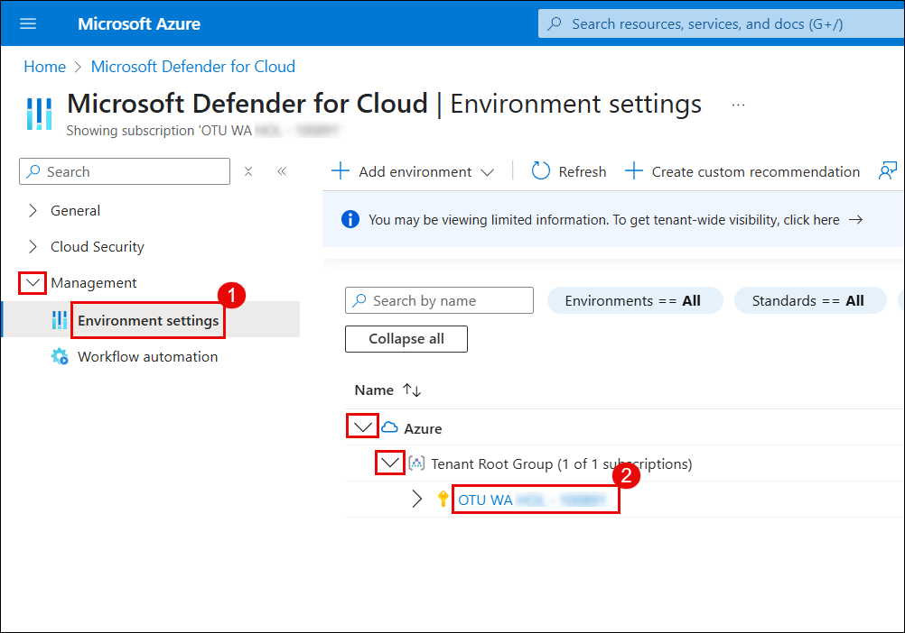

# Exercise 1: Configuring Threat Policies and Simulating Attacks in Microsoft Defender for Office 365

## Overview

In this exercise, you will configure threat protection policies in Microsoft Defender for Office 365 and use the Attack Simulator to mimic phishing and malware attacks. You will then explore how to analyze these simulated threats using Threat Explorer and real-time detections, gaining insights into how Defender identifies, tracks, and helps mitigate threats within your Office 365 environment.

## Objectives

- Task 1: Configure Threat Policies in Microsoft Defender for Office 365 
- Task 2: Simulate Phishing and Malware Attacks Using Attack Simulator 
- Task 3: Analyze Threats with Threat Explorer and Real-Time Detections 

## Task 1: Configure Threat Policies in Microsoft Defender for Office 365

1. Go to the [Azure Portal](https://portal.azure.com), and search for **Microsoft Defender for Cloud**.

1. When prompted, click **Enable** to activate Defender CSPM.

     
   

   > **Note:** If you don’t see the pop-up prompt, simply continue and follow the lab guide steps as shown below.

   >**Note:** This enables advanced posture capabilities like attack path analysis and permissions management.

1. In **Microsoft Defender for Cloud**, navigate to **Inventory** and check if **Defender for Cloud** is **Off** for any resources.

   

1. Go to **Environment settings** > select your subscription.

   

1. Under **Defender plans**, turn on the following and then click **Save**.  :

   - Foundational CSPM  
   - Defender CSPM  
   - Servers (under CWP)   

   

1. Return to **Inventory** and confirm Defender is now set to **On**.

   

   > **Note:** Your Defender protection is now active for all supported workloads.

1. Open the [Microsoft 365 Defender Portal](https://security.microsoft.com)

1. Navigate to **Email & collaboration** → **Policies & rules** → **Threat policies**

   

1. Select **Standard Protection**, then click **Manage protection settings**.

1. In each section, choose **Specific recipients** and assign your lab user (`ODL_User@...`).

     
   
   

1. Select **Turn on the policy when finished**, then review and confirm the settings.

   

   > **Note:** Standard protection includes Safe Attachments, Safe Links, and anti-phishing controls.

1. On the protection profile page, go to **Strict Protection** and click **Manage protection settings**.

   

1. Like before, assign your lab user under **Specific recipients** for both Exchange and Defender for Office 365.

     

   

1. Configure impersonation protection:

   - Add key email addresses to monitor  
   - Add domains (e.g., `www.officenced.com`) that need protection

      

    

1. Complete the wizard and confirm the configuration.

1. Once setup is complete, verify that:

   - **Standard protection is on**  
   - **Strict protection is on** for selected users

    

   > **Note:** Your threat policies are now fully configured with layered protection for both general and high-risk users.

## Task 2: Simulate Phishing and Malware Attacks Using Attack Simulator

In this task, you'll simulate phishing and malware attacks using Microsoft Defender's built-in **Attack Simulation Training**. These simulations help you evaluate user vulnerability and response to social engineering techniques.

1. In [Microsoft 365 Defender Portal](https://security.microsoft.com), go to:  

    **Email & collaboration** → **Attack simulation training**

1. Click **Launch your own simulation**.

   

1. Select **Launch a single simulation** and click **Continue**.

   

1. On the **Select technique** screen, choose **Credential Harvest** and click **Next**.

   

1. Name your simulation (e.g., `Test1`) and proceed.

   

1. Select a payload such as **Expense report sharing**, then click **Next**.

   

1. Add your lab user as the target recipient.

     

    

1. Use default training settings:  
   - Training assignment: **Assign training for me**  
   - Due in: **7 days after simulation ends**

    
    
    

1. Choose a landing page template and continue.

   

1. Set **End-user notification** to *Microsoft default notification*.  
    Confirm:
    - Positive reinforcement: **During simulation**  
    - Training reminder: **Weekly**

    

1. Launch immediately and set the simulation to end after 2 days.

    

1. Review details and click **Submit** to start the simulation.

    

1. After confirmation, click **Done**.

    

1. You’ll see the simulation listed as **In progress**.

    

    > **Note:** You've successfully launched a phishing simulation that will track user interaction and response.

1. From the Attack simulation dashboard, launch another simulation.

1. Choose **Malware Attachment** as the technique.

   

1. Name the simulation (e.g., `Test2`) and click **Next**.

   

1. Select a payload like **HR notification on update of contract**.

   

1. Repeat the notification and training steps:
   - Use Microsoft defaults  
   - Deliver during simulation  
   - Weekly reminders

   

1. Set simulation launch to immediate and duration to 2 days.

   

1. Review the summary and submit.

   

1. Confirm the simulation has been scheduled successfully.

   

   >**Note:** This test mimics malware-laden email attachments and assesses user interaction with potentially harmful files.

> **Congratulations** on completing the task! Now, it's time to validate it. Here are the steps:
> - Hit the Validate button for the corresponding task. If you receive a success message, you can proceed to the next task. 
> - If not, carefully read the error message and retry the step, following the instructions in the lab guide.
> - If you need any assistance, please contact us at cloudlabs-support@spektrasystems.com. We are available 24/7 to help you out.
<validation step="5e29bfa2-6b5e-4539-9e55-be9046b26218" />

## Task 3: Analyze Threats with Threat Explorer and Real-Time Detections

In this task, you'll create a custom role in Microsoft Defender to manage access and permissions for specific users or groups.

1. In the [Microsoft 365 Defender Portal](https://security.microsoft.com), go to  **System** → **Permissions**

1. Click **Create a custom role**.

   

1. Click **Create custom role** under **Microsoft Defender XDR**.

   

1. Name the role (e.g., `Test-role`) and optionally add a description.Click **Next**.

   

1. Select **Select custom permissions**, then:

   - Under **Security data**, choose **Select all permissions**
   - Under **Raw data**, select custom permissions and check **Email & collaboration content (read)**

1. Click **Apply**.

   

1. In the **Security operations** tab, choose **All read and manage permissions**, then click **Apply**.

   

1. Name the assignment (e.g., `Test-assignment`)
   
1. Add your lab user (e.g., `ODL_User`)
   
1. For data sources, choose **Microsoft Defender for Office 365**

1. Click **Add**.

   

1. Check the permissions and assignments summary, then click **Submit**.

   

1. Open the lab user's mailbox and locate the phishing email titled **"File inloop Expenses Report.xlsx Has Been Shared with ODL_User 1781683"**

   

1. Clicking **Open** simulates a phishing link click and may trigger a credential submission event.

   

   > **Note:** This interaction will reflect in the **simulation report** and under **URL clicks** in **Threat Explorer**.

1. Go to the **Microsoft 365 Defender Portal** → **Email & collaboration** → **Explorer** → **URL clicks**

1. Filter by time and user to find the phishing email interaction.

   

1. Click on the URL entry to view detailed information.

   

    > **Note:** This shows the full URL, click metadata, and confirms the phishing interaction.

1. Navigate to**Email & collaboration** → **Attack simulation training** → **Simulations**

1. Select the simulation titled `Test1`.

   

1. The simulation report reveals that **100% of users were compromised**, and **0% reported** the email.

   

   > **Note:** Helps assess end-user awareness and effectiveness of security training.

1. Select the user from the simulation results to see specific actions. You'll see the sequence of actions like reading the message, clicking the link, and submitting credentials.

   

   > **Note:** These insights help evaluate user behavior and response during simulated phishing attacks.

## Review

1. In this exercise, you learnt how to configure threat policies and simulate phishing and malware attacks using Microsoft Defender for Office 365.

1. You also learnt to analyze threats in real time using Threat Explorer, helping understand how Defender detects and responds to email-based threats.

## Click Next to Continue
