# Exercise 2: Threat Investigation and Security Posture Management with Microsoft Defender

## Overview

In this exercise, you will investigate and remediate security incidents using Microsoft Defender XDR, gaining hands-on experience with incident timelines and response actions. You will also configure anti-phishing and Safe Links policies to protect users from malicious emails and links. Finally, you will implement and monitor security posture settings in Defender for Office 365 to ensure ongoing protection and compliance across your organization.

## Objectives

- Task 1: Investigate and remediate Incidents in Microsoft Defender XDR  
- Task 2: Configure Anti-Phishing and Safe Links Policies

---

## Task 1: Investigate and remediate Incidents in Microsoft Defender XDR

In this task, you’ll investigate a phishing email, take appropriate actions, submit it to Microsoft for review, and monitor the automated investigation and alerts triggered in Microsoft Defender XDR.

### Send a Phishing Email

Use Outlook or another email client to send a test phishing message with suspicious links to your lab user.

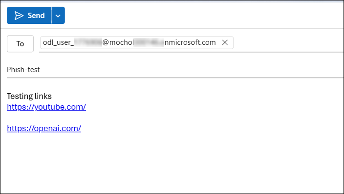

---

### Locate the Suspicious Email in Threat Explorer

Go to the [Microsoft 365 Defender Portal](https://security.microsoft.com)  
Navigate to:  
**Email & collaboration** → **Explorer**  
Find and click the suspicious message.

---

### Take Action on the Email

Review the email delivery details and click **Take action**.

---

### Configure Response Actions

- Enable **Show all response actions**  
- Choose **Move to Junk**  
- Submit to Microsoft for review:
  - Select **I've confirmed it's a threat**
  - Choose **Phish** as the category  
- Enable **Initiate automated investigation**

Click **Next** to proceed.

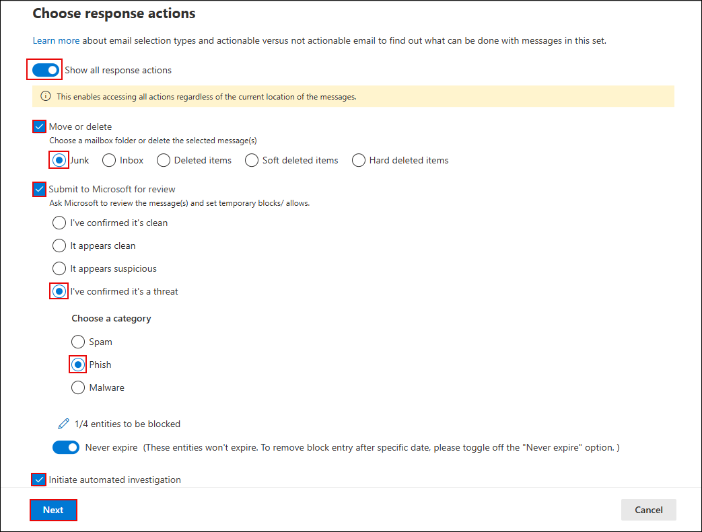

---

### Choose Target Entities

Set a name like `report-phish` and confirm impacted users and actions.

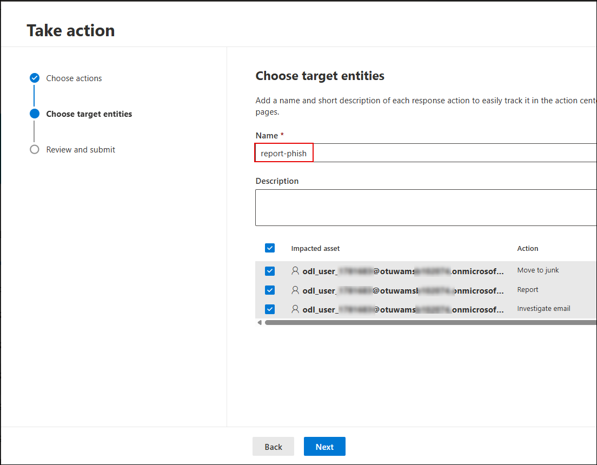

---

### Submit the Action

Review and submit the response action.

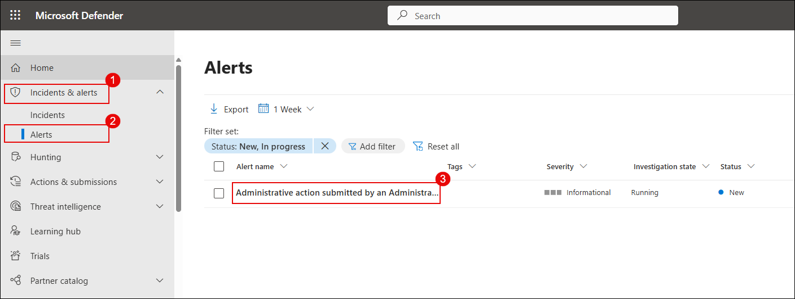

---

### View Triggered Alert

Navigate to:  
**Incidents & alerts** → **Alerts**  
Look for the alert titled **Administrative action submitted by an Administrator**.

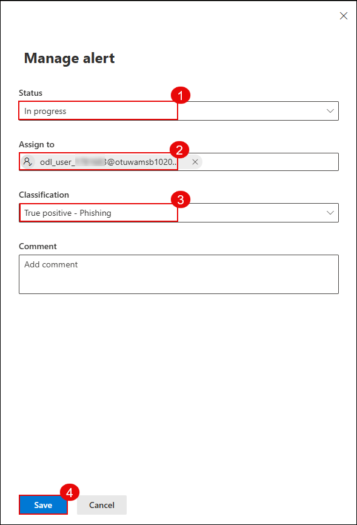

---

### Manage and Classify the Alert

Open the alert and click **Manage alert**. Set the status, assign to your user, and classify the alert as **True positive - Phishing**.

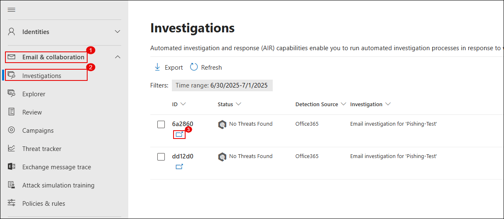

---

### View the Automated Investigation

Go to:  
**Email & collaboration** → **Investigations**  
Open the investigation triggered by your action.

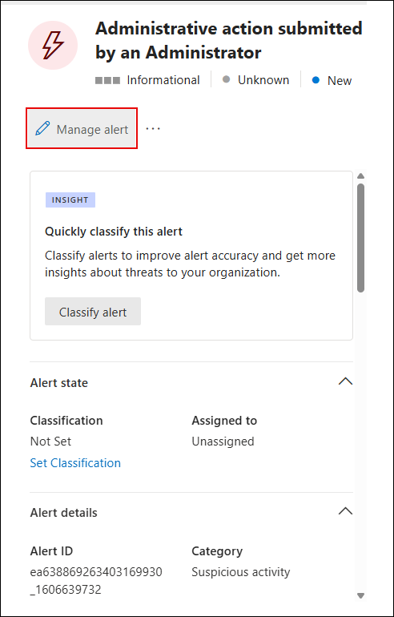

---

### Analyze the Investigation Graph

Review the timeline, graph, and entities analyzed.

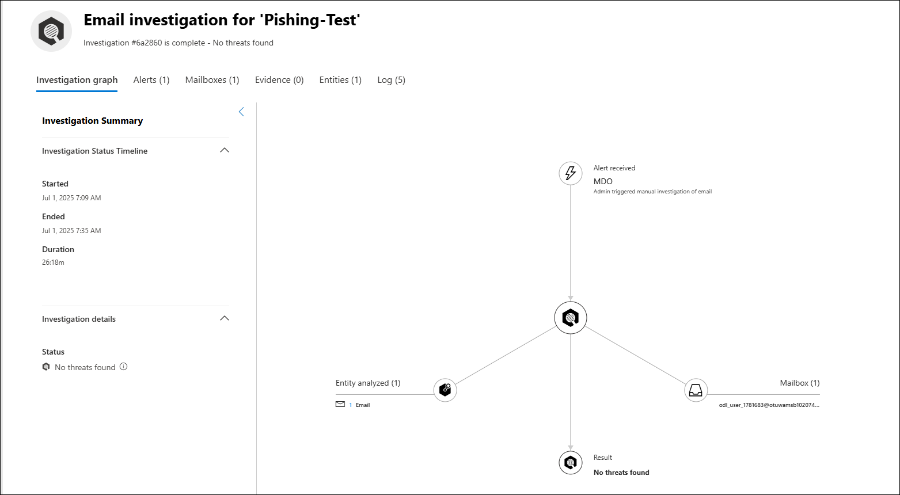

> ✅ You've successfully investigated and responded to a phishing incident using Microsoft Defender XDR.

---

## Task 2: Configure Anti-Phishing and Safe Links Policies

Go to the [Microsoft 365 Defender Portal](https://security.microsoft.com)  
Navigate to:  
**Email & collaboration** → **Policies & rules** → **Threat policies**

Click **Safe Links** under the Policies section.

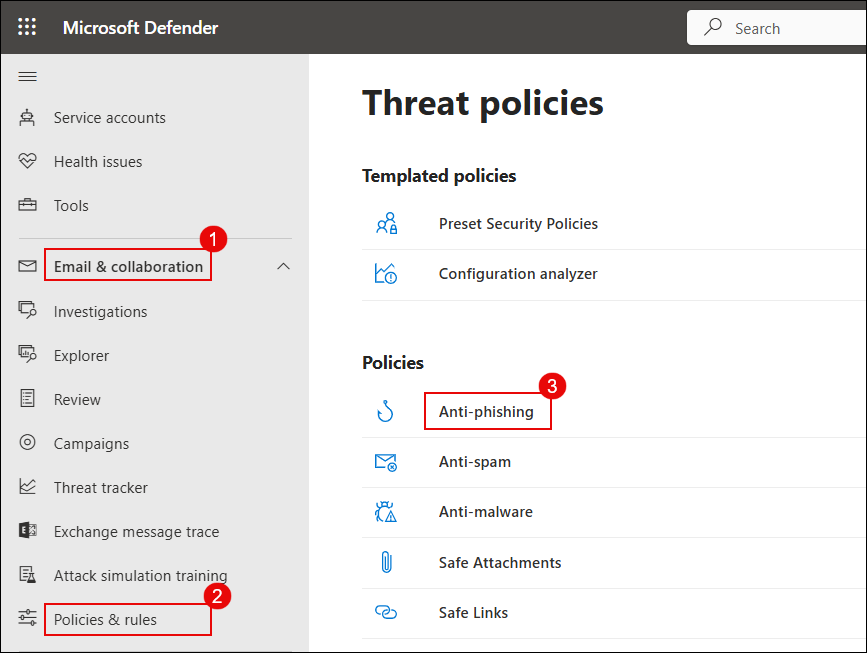

---

### Create a Safe Links Policy

Click **+ Create** or **New policy**, and provide a name like `Anti-Safe`.

---

### Assign Users to the Policy

Assign your lab user (e.g., `ODL_User`) as the recipient for this policy.

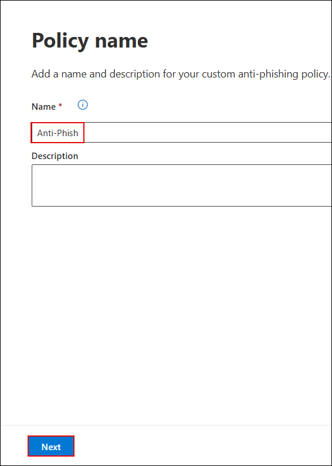

---

### Configure URL & Click Protection

Enable all recommended options including:  
- Real-time scanning of URLs  
- Apply Safe Links to email, Teams, and Office apps  
- Track user clicks

Click **Next** to continue.

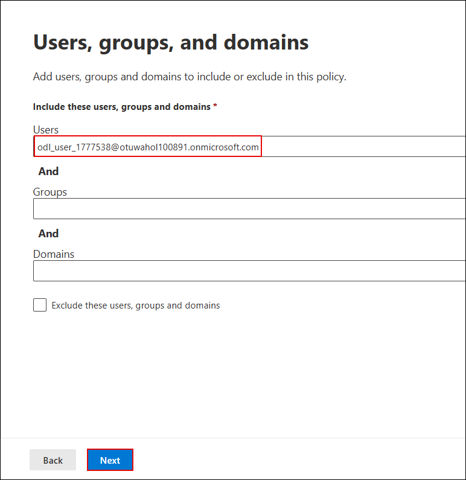

---

### Finalize the Policy

Review the settings and finish the wizard to apply the Safe Links policy.

---

### Simulate a Phishing Attack

Open the phishing email received by the lab user and click the malicious link.

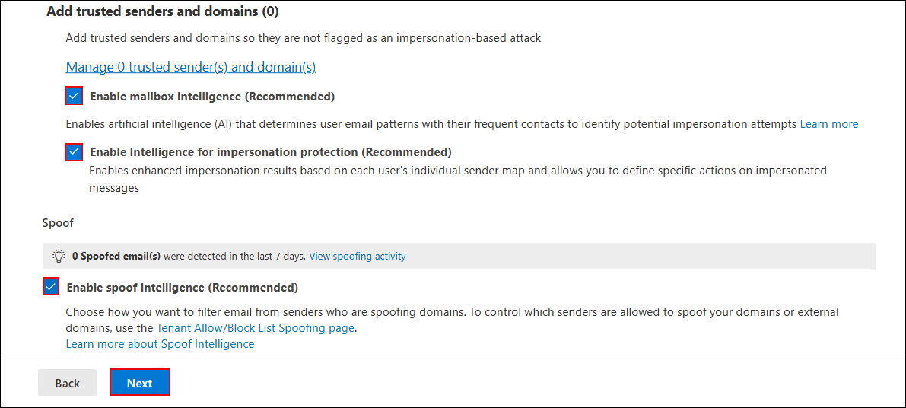

Copy the link address from the browser.

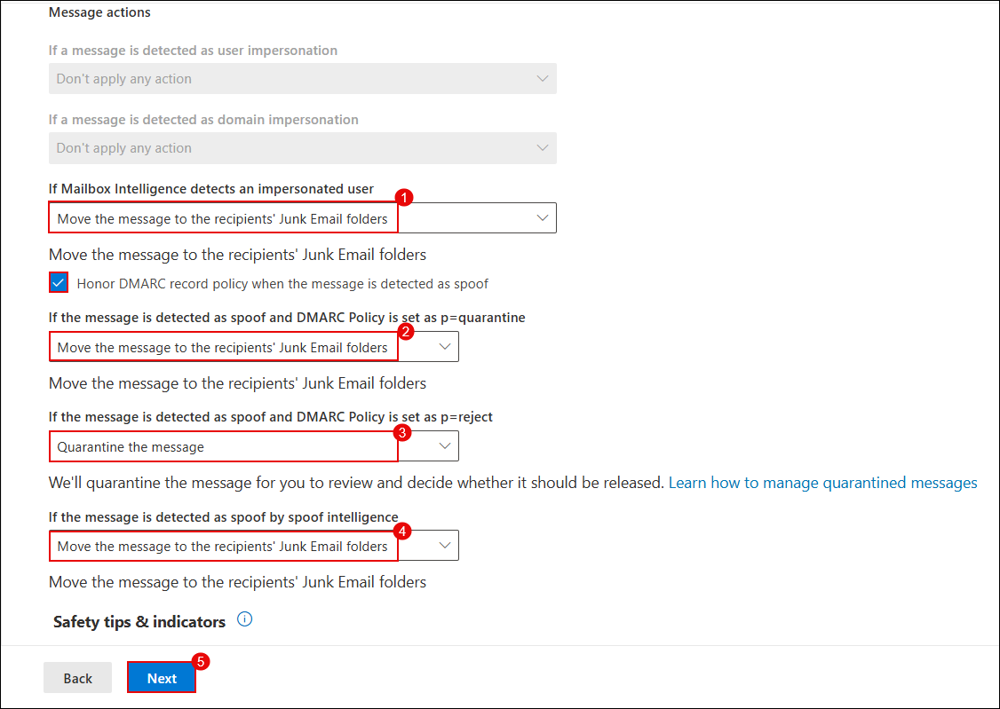

---

### Create a Phishing Email

Use Outlook to send a new email to the lab user containing the copied phishing link.

---

### Investigate the Email in Explorer

Go to:  
**Email & collaboration** → **Explorer**

Locate and open the phishing email you just sent.

---

### Review Email Details and Actions Taken

Click **Open email entity** to view full email details, delivery action, and policy results.

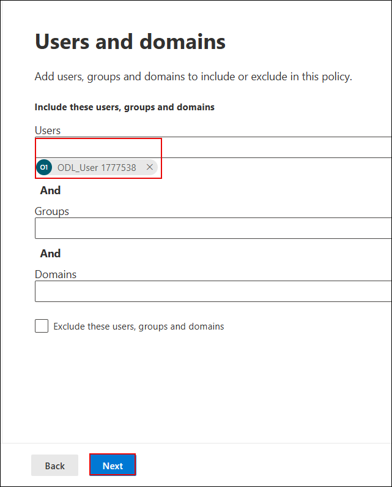

---

### Analyze Detection and Headers

Review the detection technology and authentication results (DMARC, DKIM) to understand the trustworthiness of the sender.

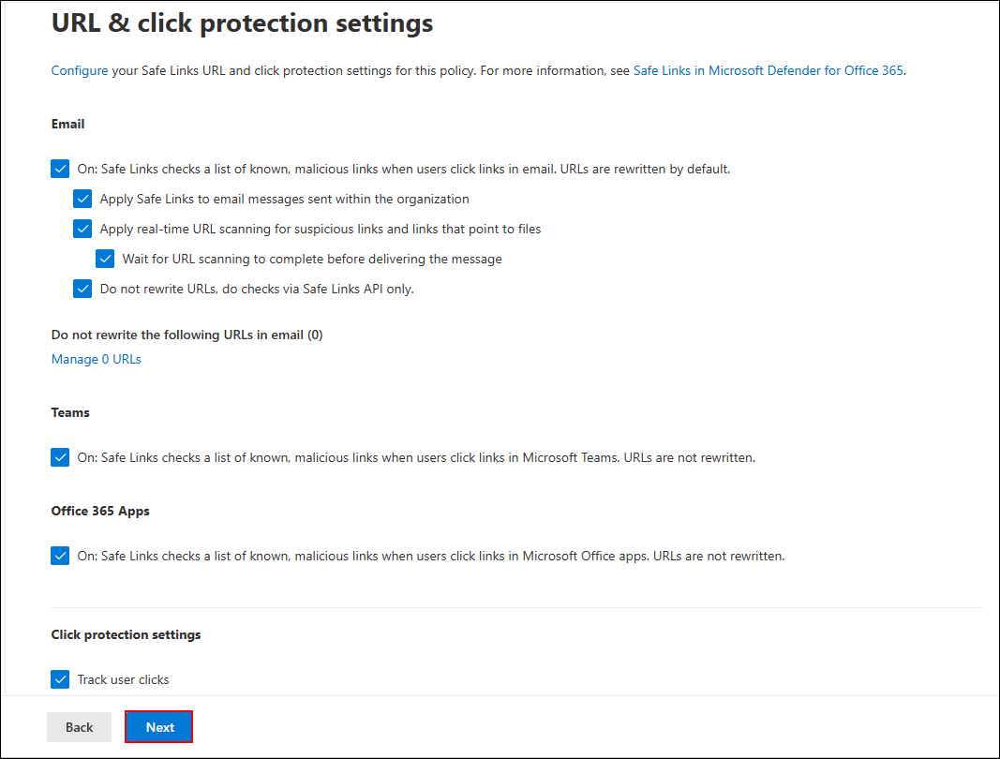

---

> ✅ You’ve now configured Safe Links protection and successfully simulated and tracked a phishing attack using Defender’s real-time threat policies.

---

## Review

1. In this exercise, you learnt how to investigate and respond to security incidents using Microsoft Defender XDR.  
2. You also configured anti-phishing and Safe Links policies and monitored Defender for Office 365 to strengthen overall security posture.

## 🎉 Congratulations! You have successfully completed the Lab.
