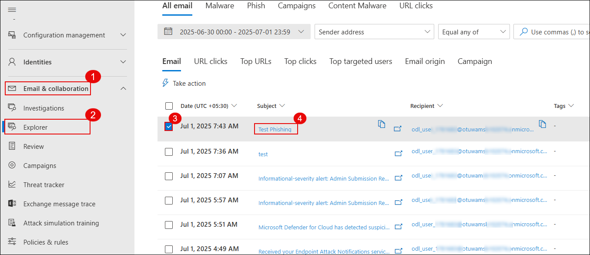
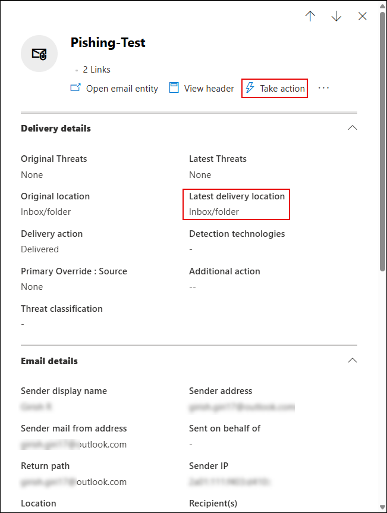
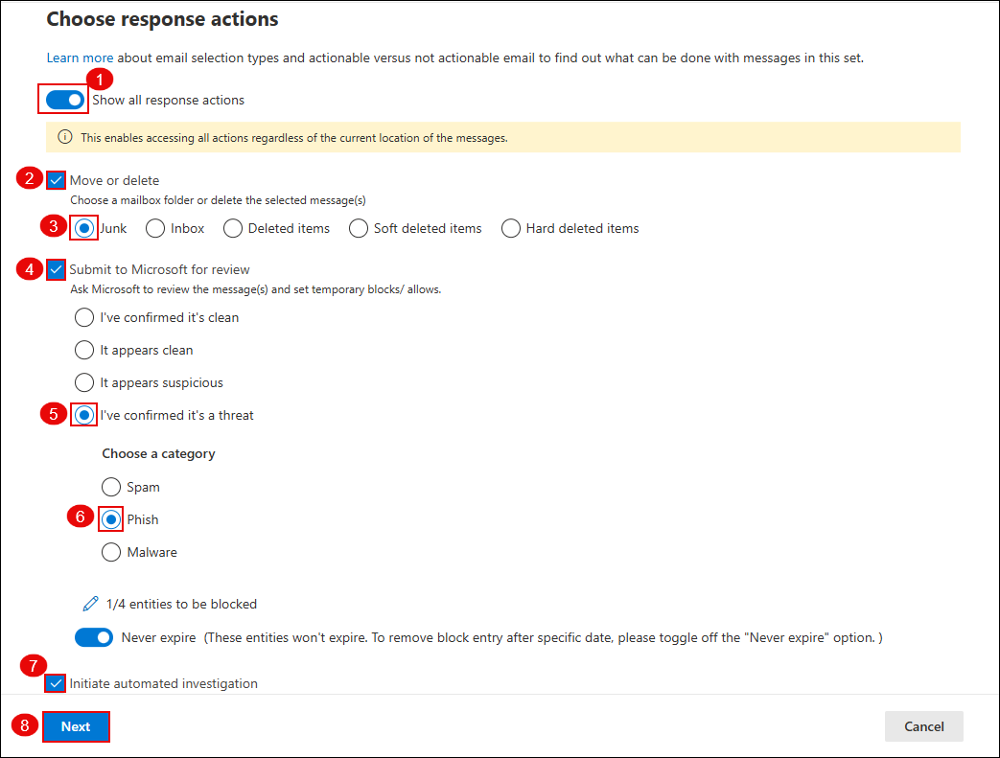
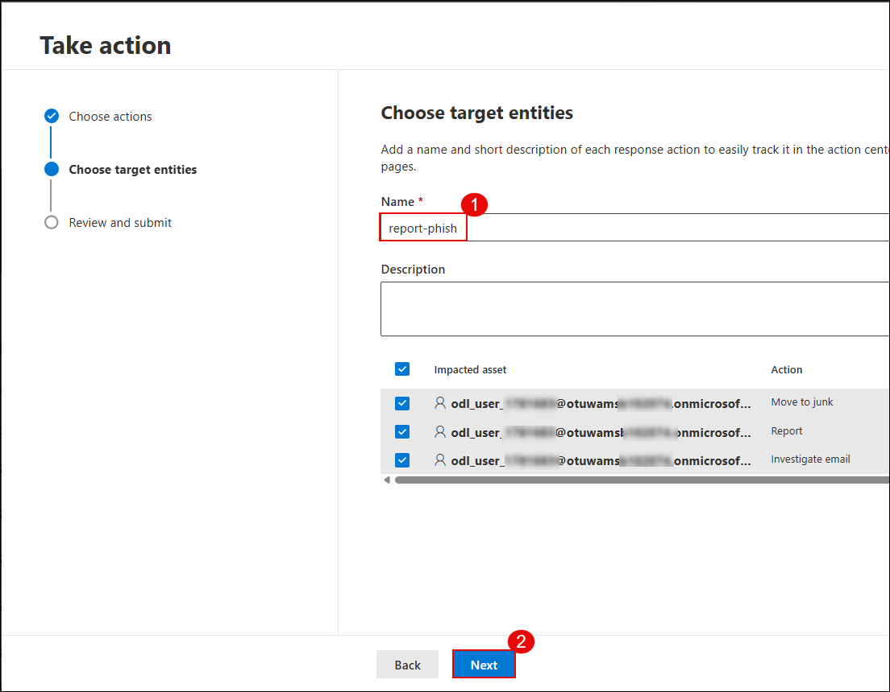
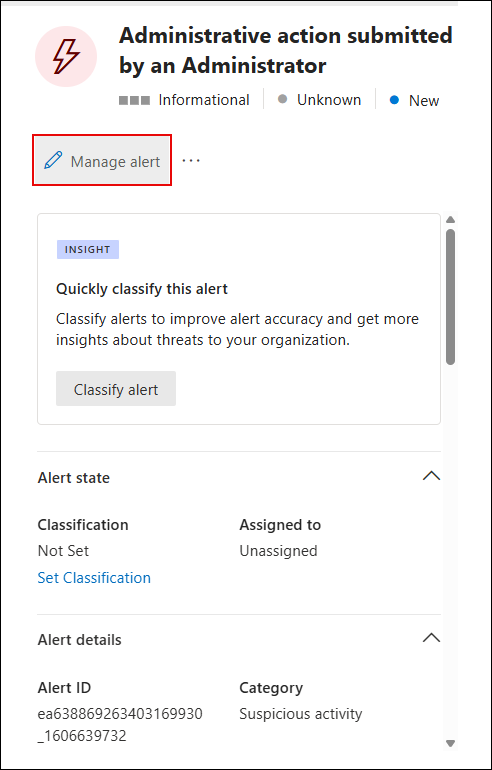
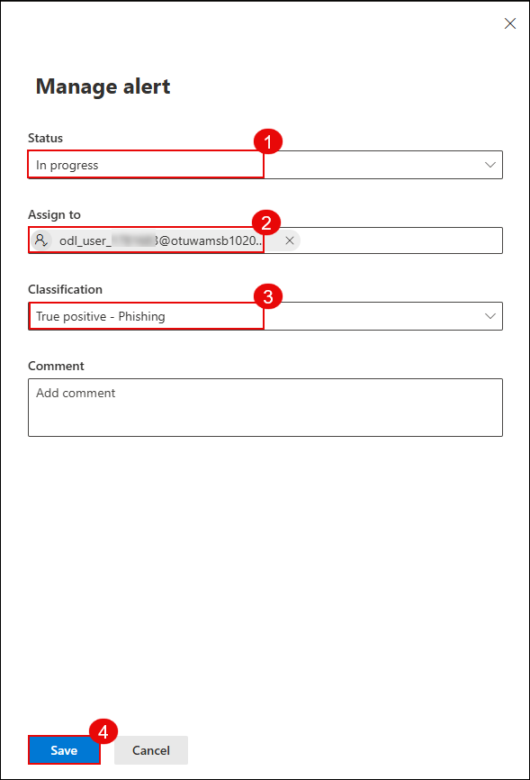
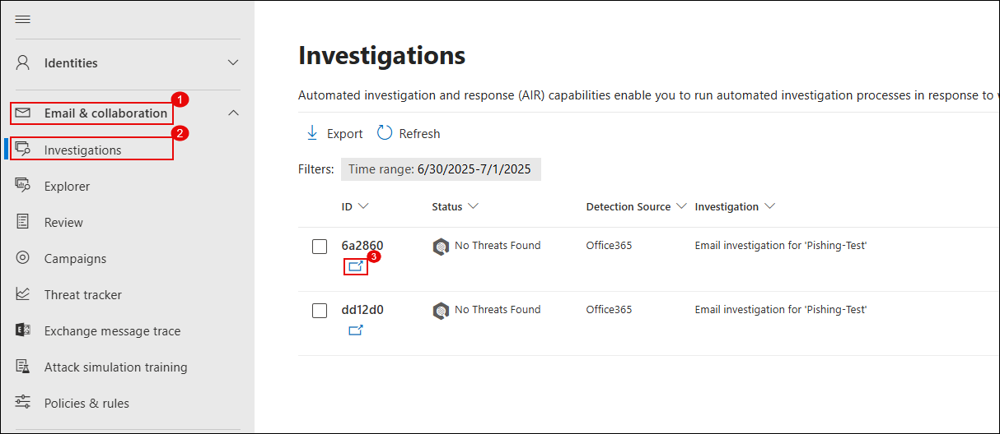
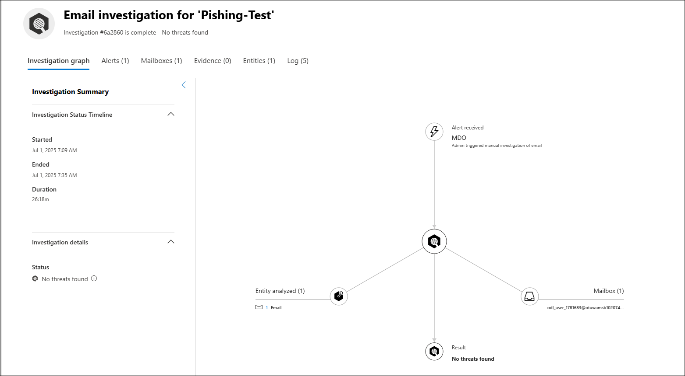

# Exercise 2: Threat Investigation and Security Posture Management with Microsoft Defender

## Overview

In this exercise, you will investigate and remediate security incidents using Microsoft Defender XDR, gaining hands-on experience with incident timelines and response actions. You will also configure anti-phishing and Safe Links policies to protect users from malicious emails and links. Finally, you will implement and monitor security posture settings in Defender for Office 365 to ensure ongoing protection and compliance across your organization.

## Objectives

- Task 1: Investigate and remediate Incidents in Microsoft Defender XDR  
- Task 2: Configure Anti-Phishing and Safe Links Policies

## Task 1: Investigate and Remediate Incidents in Microsoft Defender XDR

In this task, you’ll simulate a phishing incident, investigate the suspicious message using Threat Explorer, take remediation actions, submit the message to Microsoft for analysis, and review the automated investigation results.

1. Send a test email to your lab user containing links such as:

   - https://youtube.com/  
   - https://openai.com/  

   

2. On the Microsoft Defender portal (https://security.microsoft.com), go to **Email & collaboration (1)** → **Explorer (2)**. Select the phishing email entry **Test Phishing (4)**.

   

   > **Note:** It may take 2–3 minutes for the email to appear in Explorer after delivery.

3. Click the message to open its details. Then click **Take action**.

   

4. On the **Choose response actions** page:

   - **(1)** Toggle on **Show all response actions**  
   - **(2)** Select **Move or delete**  
   - **(3)** Choose **Junk**  
   - **(4)** Select **Submit to Microsoft for review**  
   - **(5)** Choose **I've confirmed it’s a threat**  
   - **(6)** Select **Phish** as the category  
   - **(7)** Enable **Initiate automated investigation**  
   - Click **Next (8)**

   

5. On the **Choose target entities** page, enter a name such as `report-phish (1)` and review the impacted users. Click **Next (2)**.

   

6. Navigate to **Incidents & alerts (1)** → **Alerts (2)**. Locate the alert titled **Administrative action submitted by an Administrator (3)**.

   

7. Click the alert to open details. Then click **Manage alert**.

   

8. In the **Manage alert** panel:

   - **(1)** Set **Status** to `In progress`  
   - **(2)** Assign to your lab user  
   - **(3)** Set **Classification** to `True positive – Phishing`  
   - Click **Save (4)**

   

9. Go to **Email & collaboration (1)** → **Investigations (2)**. Click on the latest investigation entry related to your phishing test **(3)**.

   

10. Review the investigation graph which shows:

    - **Alert received**  
    - **Entities analyzed**  
    - **Mailbox involved**  
    - **Result**: No threats found

    

   >**Note:** It may take **10–15 minutes** for the automated investigation to complete and display results.

   > You've successfully investigated and responded to a phishing incident using Microsoft Defender XDR.

## Task 2: Configure Anti-Phishing and Safe Links Policies

1. Go to the [Microsoft 365 Defender Portal](https://security.microsoft.com) Navigate to **Email & collaboration** → **Policies & rules** → **Threat policies**  and click on **Anti-phishing** under the Policies section.

    

1. Click **+ Create** to start configuring a custom anti-phishing policy.

    

1. Enter a name such as `Anti-Phish` and click **Next**.

    

1. Add your lab user under **Users**, then click **Next**.

    
   
1. Set **Phishing email threshold** to `4 - Most Aggressive` for strict detection.(Other impersonation settings can be skipped for now.)

    

1. Enable all recommended options under trusted senders and spoofing intelligence and click **Next** to continue.
    
    -  Enable mailbox intelligence  
    -  Enable impersonation intelligence  
    -  Enable spoof intelligence  

       

1. Set the following actions for detected spoofing and impersonation and click **Next** to continue.

   - Move impersonated messages to **Junk Email**
   - Honor DMARC policies:
      - If `p=quarantine` → move to Junk
      - If `p=reject` → quarantine
      - If spoof intelligence triggers → move to Junk

        

1. Go to **Email & collaboration** → **Policies & rules** → **Threat policies**.Click on **Safe Links** under the Policies section.

   

1. Click **+ Create**, name the policy (e.g., `Anti-Safe`), then click **Next**.

   

1. Add your lab user (e.g., `ODL_User 1777538`) under **Users** and proceed.

   

1. Enable all recommended protection settings. Click **Next**.

    - Real-time URL scanning  
    - Safe Links for email, Teams, and Office apps  
    - Track user clicks  
    - Wait for URL scanning before delivery  

      

1. Go to **Email & collaboration** → **Policies & rules** → **Alert policy**.

   

1. Click **+ New Alert Policy**.

   

1. Fill in the following details and click **Next**.
   
    - **Name**: `Alert-Safe`
    - **Severity**: `High`
    - **Category**: `Threat management`

       

1. Set the alert logic and click **Next**.
  
    - **Activity**: `Detected malware in an email message`
    - **Mail direction**: `Inbound`
    - **Trigger**: `Every time an activity matches the rule`

       

1. Add the email recipient to get notified about the alert.Click **Next**

   

1. Enable the alert immediately and click **Submit** to create the policy.

   

1. Send an email to the lab user with the following links:

   - [https://www.amtso.org/check-desktop-phishing-page/](https://www.amtso.org/check-desktop-phishing-page/)
   - [https://malware.wicar.org/data/eicar.com.txt](https://malware.wicar.org/data/eicar.com.txt)

      

      > **Note:** These are safe test links designed to simulate phishing and malware detection.

1. Go to **Email & collaboration** → **Explorer** and locate the **Test-safe** email.

   

1. Click **Open email entity** to inspect the detection and delivery information.

1. Check details like quarantine status and detection technologies used.

   

1. Navigate to **Investigation & response** → **Incidents**.Open the incident titled **Alert-Link**.

   

   >  Dive deep into the incident: review alerts, evidence, entities involved, and the automated investigation trail.

   >  You’ve now created an alert policy, triggered it with test emails, and followed the investigation trail using Defender XDR.

## Review

1. In this exercise, you learnt how to investigate and respond to security incidents using Microsoft Defender XDR.  
2. You also configured anti-phishing and Safe Links policies and monitored Defender for Office 365 to strengthen overall security posture.

## Congratulations! You have successfully completed the Lab.
