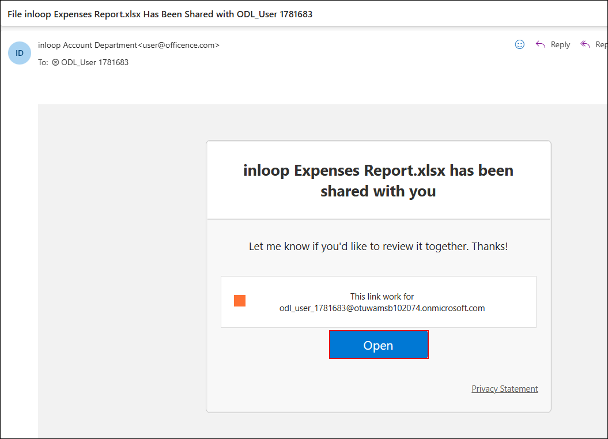
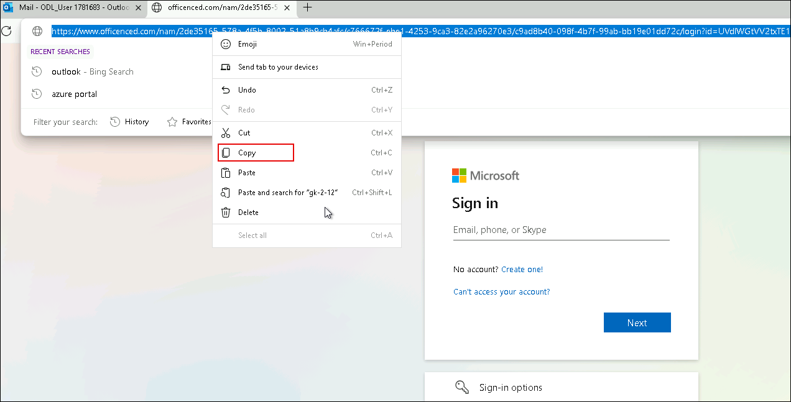
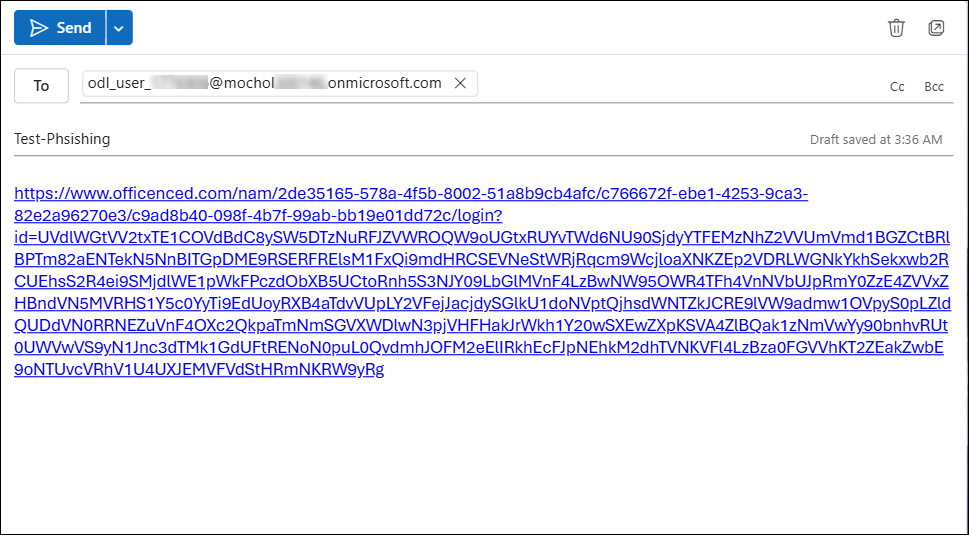
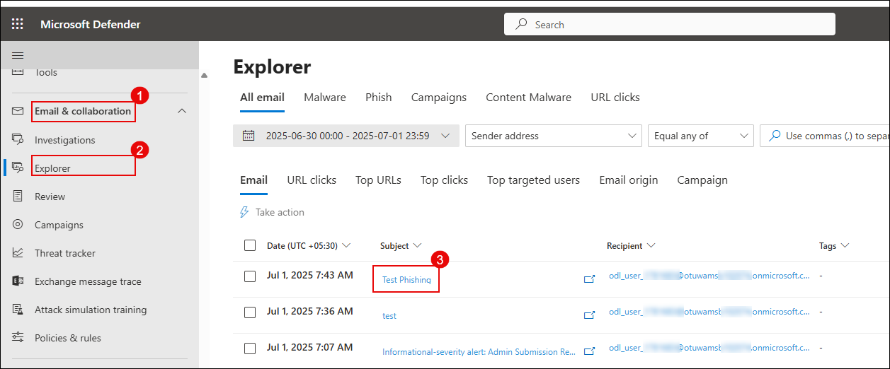
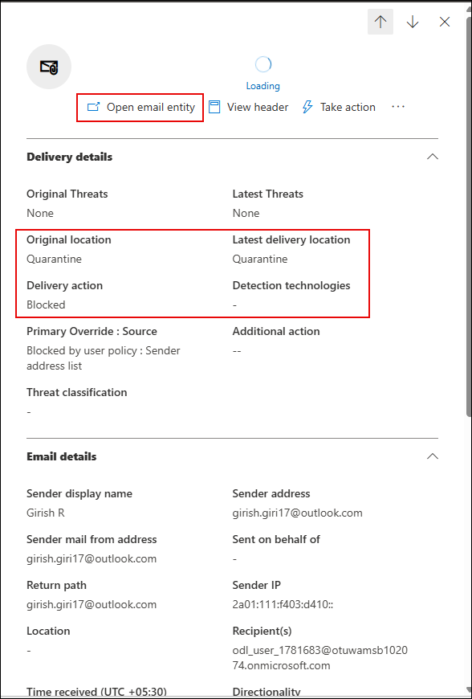
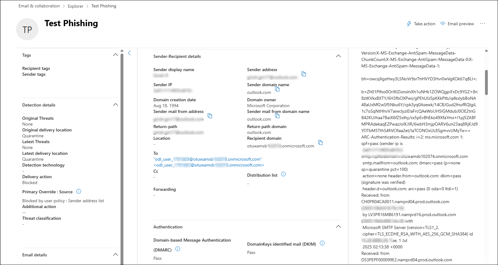

# Exercise 2: Threat Investigation and Security Posture Management with Microsoft Defender

## Overview

In this exercise, you will investigate and remediate security incidents using Microsoft Defender XDR, gaining hands-on experience with incident timelines and response actions. You will also configure anti-phishing and Safe Links policies to protect users from malicious emails and links. Finally, you will implement and monitor security posture settings in Defender for Office 365 to ensure ongoing protection and compliance across your organization.

## Objectives

- Task 1: Investigate and remediate Incidents in Microsoft Defender XDR  
- Task 2: Configure Anti-Phishing and Safe Links Policies

---

## Task 1: Investigate and Remediate Incidents in Microsoft Defender XDR

In this task, you’ll investigate a phishing email, take appropriate actions, submit it to Microsoft for review, and monitor the automated investigation and alerts triggered in Microsoft Defender XDR.

### Send a Phishing Email

Use Outlook or another email client to send a test phishing message with suspicious links to your lab user.

### Locate the Suspicious Email in Threat Explorer

Go to the [Microsoft 365 Defender Portal](https://security.microsoft.com)  
Navigate to:  
**Email & collaboration** → **Explorer**  
Find and click the suspicious message titled **Test Phishing**.

> ⚠️ It may take 2–3 minutes after the phishing email is delivered for it to appear in Threat Explorer.

### Take Action on the Email

Click the message to view its details, then click **Take action** to initiate response actions.

### Configure Response Actions

- Enable **Show all response actions**  
- Choose **Move to Junk**  
- Submit to Microsoft for review:
  - Select **I've confirmed it's a threat**
  - Choose **Phish** as the category  
- Enable **Initiate automated investigation**

Click **Next** to continue.

### Choose Target Entities

Set a name like `report-phish` and confirm impacted users and actions.

### View Triggered Alert

Navigate to:  
**Incidents & alerts** → **Alerts**  
Look for the alert titled **Administrative action submitted by an Administrator**.

### Manage and Classify the Alert

Click the alert to open details, then click **Manage alert**.

In the Manage alert pane:  
- Set **Status** to `In progress`  
- Assign to your lab user  
- Set **Classification** to `True positive – Phishing`  
- Click **Save**

### View the Automated Investigation

Go to:  
**Email & collaboration** → **Investigations**  
Click on the newly triggered investigation linked to your phishing test.

### Analyze the Investigation Graph

Review the investigation graph showing the alert path, analyzed entities, and final result.

> ⏳ **Note:** It may take **10–15 minutes** for the automated investigation to complete and display results.

> ✅ You've successfully investigated and responded to a phishing incident using Microsoft Defender XDR.

---

## Task 2: Configure Anti-Phishing and Safe Links Policies

---

### Open Anti-Phishing Policies

Go to the [Microsoft 365 Defender Portal](https://security.microsoft.com)  
Navigate to:  
**Email & collaboration** → **Policies & rules** → **Threat policies**  
Click on **Anti-phishing** under the Policies section.

### Create a New Anti-Phishing Policy

Click **+ Create** to start configuring a custom anti-phishing policy.

### Name the Policy

Enter a name such as `Anti-Phish` and click **Next**.

### Assign Users to the Policy

Add your lab user under **Users**, then click **Next**.

### Configure Threshold and Protection

Set **Phishing email threshold** to `4 - Most Aggressive` for strict detection.  
(Other impersonation settings can be skipped for now.)

### Enable Intelligence and Spoof Protection

Enable all recommended options under trusted senders and spoofing intelligence:  
- ✅ Enable mailbox intelligence  
- ✅ Enable impersonation intelligence  
- ✅ Enable spoof intelligence  

Click **Next** to continue.

### Configure Message Actions

Set the following actions for detected spoofing and impersonation:
- Move impersonated messages to **Junk Email**
- Honor DMARC policies:
  - If `p=quarantine` → move to Junk
  - If `p=reject` → quarantine
  - If spoof intelligence triggers → move to Junk

Click **Next** to continue.

### Open Safe Links Policies

Go to:  
**Email & collaboration** → **Policies & rules** → **Threat policies**  
Click on **Safe Links** under the Policies section.

### Create a New Safe Links Policy

Click **+ Create**, name the policy (e.g., `Anti-Safe`), then click **Next**.

### Assign Users to the Policy

Add your lab user (e.g., `ODL_User 1777538`) under **Users** and proceed.

### Configure URL & Click Protection

Enable all recommended protection settings:
- ✅ Real-time URL scanning  
- ✅ Safe Links for email, Teams, and Office apps  
- ✅ Track user clicks  
- ✅ Wait for URL scanning before delivery  

Click **Next**.

### Simulate a Phishing Attack

Open the test phishing email received by the lab user and click the link.

### Copy the Link

Copy the link address from the browser's address bar.

### Create a New Phishing Email

Compose a new email to your lab user and paste the malicious link.  
Subject: `Test-Phishing`

### Investigate the Email in Explorer

Navigate to:  
**Email & collaboration** → **Explorer**  
Locate and open the email titled **Test Phishing**.

### Review Email Entity and Actions

Click **Open email entity** to view detailed delivery information and actions.  
Check if the message was blocked or quarantined.

### Analyze Detection and Headers

Review the full detection and header analysis, including SPF, DKIM, and DMARC results.

> ✅ You’ve successfully configured Safe Links protection and simulated a phishing attack, tracking the detection and response using Microsoft Defender.

> ✅ You’ve now configured Safe Links protection and successfully simulated and tracked a phishing attack using Defender’s real-time threat policies.

---

## Review

1. In this exercise, you learnt how to investigate and respond to security incidents using Microsoft Defender XDR.  
2. You also configured anti-phishing and Safe Links policies and monitored Defender for Office 365 to strengthen overall security posture.

## 🎉 Congratulations! You have successfully completed the Lab.
