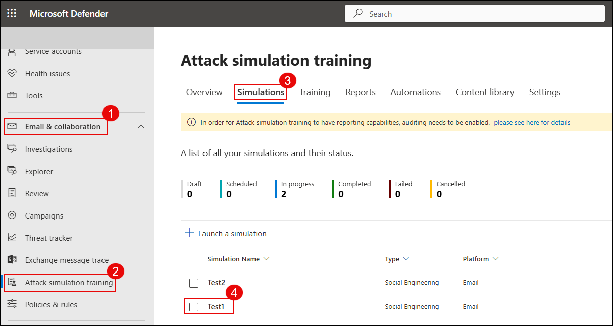
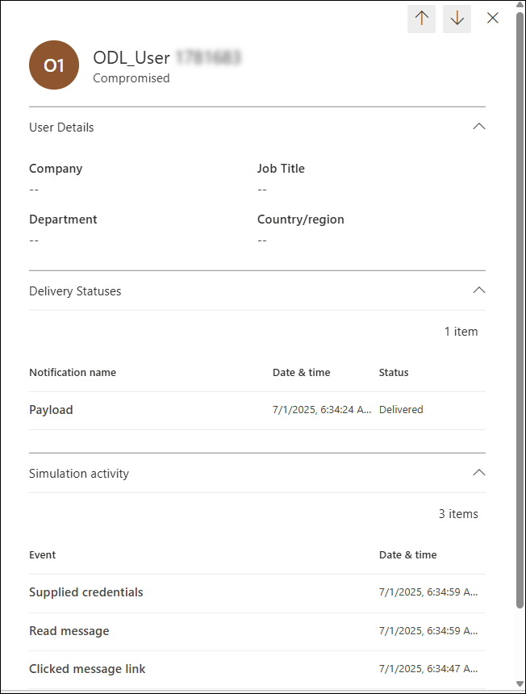
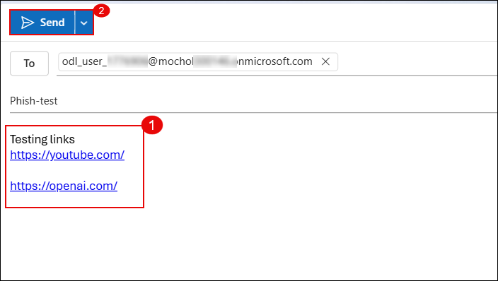

# Exercise 2: Threat Investigation and Security Posture Management with Microsoft Defender

## Overview

In this exercise, you will investigate and remediate security incidents using Microsoft Defender XDR, gaining hands-on experience with incident timelines and response actions. You will also configure anti-phishing and Safe Links policies to protect users from malicious emails and links. Finally, you will implement and monitor security posture settings in Defender for Office 365 to ensure ongoing protection and compliance across your organization.

## Objectives

- Task 1: Investigate and remediate Incidents in Microsoft Defender XDR  
- Task 2: Configure Anti-Phishing and Safe Links Policies

## Task 1: Investigate and Remediate Incidents in Microsoft Defender XDR

In this task, you’ll simulate a phishing incident, investigate the suspicious message using Threat Explorer, take remediation actions, submit the message to Microsoft for analysis, and review the automated investigation results.

1. Send a test email to your lab user containing links such as:

   - https://youtube.com/  
   - https://openai.com/  

   

2. On the Microsoft Defender portal (https://security.microsoft.com), go to **Email & collaboration (1)** → **Explorer (2)**. Select the phishing email entry **Test Phishing (4)**.

   

   > **Note:** It may take 2–3 minutes for the email to appear in Explorer after delivery.

3. Click the message to open its details. Then click **Take action**.

   

4. On the **Choose response actions** page:

   - **(1)** Toggle on **Show all response actions**  
   - **(2)** Select **Move or delete**  
   - **(3)** Choose **Junk**  
   - **(4)** Select **Submit to Microsoft for review**  
   - **(5)** Choose **I've confirmed it’s a threat**  
   - **(6)** Select **Phish** as the category  
   - **(7)** Enable **Initiate automated investigation**  
   - Click **Next (8)**

   

5. On the **Choose target entities** page, enter a name such as `report-phish (1)` and review the impacted users. Click **Next (2)**.

   

6. Navigate to **Incidents & alerts (1)** → **Alerts (2)**. Locate the alert titled **Administrative action submitted by an Administrator (3)**.

   

7. Click the alert to open details. Then click **Manage alert**.

   

8. In the **Manage alert** panel:

   - **(1)** Set **Status** to `In progress`  
   - **(2)** Assign to your lab user  
   - **(3)** Set **Classification** to `True positive – Phishing`  
   - Click **Save (4)**

   

9. Go to **Email & collaboration (1)** → **Investigations (2)**. Click on the latest investigation entry related to your phishing test **(3)**.

   

10. Review the investigation graph which shows:

    - **Alert received**  
    - **Entities analyzed**  
    - **Mailbox involved**  
    - **Result**: No threats found

    

   >**Note:** It may take **10–15 minutes** for the automated investigation to complete and display results.

   > You've successfully investigated and responded to a phishing incident using Microsoft Defender XDR.

## Task 2: Configure Anti-Phishing and Safe Links Policies

In this task, you’ll configure Microsoft Defender anti-phishing and Safe Links policies to detect and prevent malicious emails and URLs.

1. On the Microsoft Defender portal (https://security.microsoft.com), go to **Email & collaboration (1)** → **Policies & rules (2)** → click **Threat policies** → select **Anti-phishing**.

   

1. Click **+ Create (1)** to create a new anti-phishing policy.

   

1. Enter a name such as `Anti-Phish (1)` and click **Next (2)**.

   

1. Under **Users**, select your lab user (1), then click **Next (2)**.

   

1. Set the **Phishing email threshold** to `4 - Most aggressive (1)` and click **Next (2)**.

   

1. Enable all intelligence features:

   - **(1)** Enable mailbox intelligence  
   - **(2)** Enable impersonation protection  
   - **(3)** Enable spoof intelligence  
   - Click **Next (4)** to continue

   

1. Set spoof and impersonation actions:

   - **(1)** Impersonated user → Move to Junk  
   - **(2)** Spoof with DMARC quarantine → Move to Junk  
   - **(3)** Spoof with DMARC reject → Quarantine  
   - **(4)** Spoof intelligence → Move to Junk  
   - Click **Next (5)**

   

1. Back in **Threat policies**, click **Safe Links (3)** under Policies.

   

1. Click **+ Create**, enter a name such as `Anti-Safe (1)` and click **Next (2)**.

   

1. Add the lab user (1) under **Users**, then click **Next (2)**.

    

1. Enable all recommended URL protection settings:

    - Safe Links for email, Teams, and Office apps  
    - Real-time scanning  
    - Wait for scan before delivery  
    - Track user clicks  
    - Click **Next**

    

1. Go to **Email & collaboration (1)** → **Policies & rules (2)** → Click on **Alert policy (3)**.

    

1. Click **+ New Alert Policy**.

    

1. Fill the following details and click **Next (4)**:

    - **(1)** Name: Alert-Safe  
    - **(2)** Severity: High  
    - **(3)** Category: Threat Management

    

1. Define the alert rule logic:

    - **(1)** Activity: Detected malware in an email  
    - **(2)** Mail direction: Inbound  
    - **(3)** Trigger: Every time activity matches  
    - Click **Next (4)**

    

1. Add alert recipients (1) and click **Next (2)**.

    

1. Choose **Yes, turn it on right away (1)** and click **Submit (2)** to create the policy.

    

1. Send a test email to the lab user with links:

    - https://www.amtso.org/check-desktop-phishing-page/  
    - https://malware.wicar.org/data/eicar.com.txt  

    

    > **Note:** These are legitimate safe testing links for phishing and malware simulation.

1. Go to **Email & collaboration (1)** → **Explorer (2)** and open the test mail **Test-safe (3)**.

    

1. Click **Open email entity (1)** and review:

    - **Original location**: Quarantine  
    - **Detection technologies**: URL malicious reputation, mixed analysis  

    

1. Navigate to **Investigation & response (1)** → **Incidents (2)**, select incident **Alert-Link (3)** and click to view details (4).

    

   >  Dive deep into the incident: review alerts, evidence, entities involved, and the automated investigation trail.

   >  You’ve now created an alert policy, triggered it with test emails, and followed the investigation trail using Defender XDR.

## Review

1. In this exercise, you learnt how to investigate and respond to security incidents using Microsoft Defender XDR.  
2. You also configured anti-phishing and Safe Links policies and monitored Defender for Office 365 to strengthen overall security posture.

## Congratulations! You have successfully completed the Lab.
