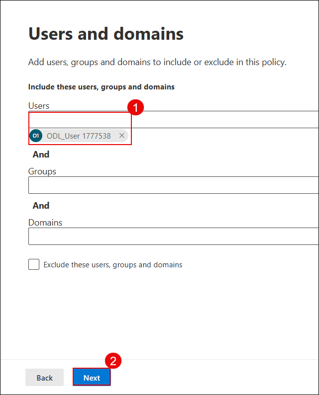

# Exercise 2: Threat Investigation and Security Posture Management with Microsoft Defender

## Overview

In this exercise, you will investigate and remediate security incidents using Microsoft Defender XDR, gaining hands-on experience with incident timelines and response actions. You will also configure anti-phishing and Safe Links policies to protect users from malicious emails and links. Finally, you will implement and monitor security posture settings in Defender for Office 365 to ensure ongoing protection and compliance across your organization.

## Objectives

- Task 1: Investigate and remediate Incidents in Microsoft Defender XDR  
- Task 2: Configure Anti-Phishing and Safe Links Policies

## Task 1: Investigate and Remediate Incidents in Microsoft Defender XDR

In this task, you’ll simulate a phishing incident, investigate the suspicious message using Threat Explorer, take remediation actions, submit the message to Microsoft for analysis, and review the automated investigation results.

1. Send a test email to your lab user containing links such as:

   - https://youtube.com/  
   - https://openai.com/  

   

2. On the Microsoft Defender portal (https://security.microsoft.com), go to **Email & collaboration (1)** → **Explorer (2)**. Select the phishing email entry **Test Phishing (4)**.

   

   > **Note:** It may take 2–3 minutes for the email to appear in Explorer after delivery.

3. Click the message to open its details. Then click **Take action**.

   

4. On the **Choose response actions** page:

   - **(1)** Toggle on **Show all response actions**  
   - **(2)** Select **Move or delete**  
   - **(3)** Choose **Junk**  
   - **(4)** Select **Submit to Microsoft for review**  
   - **(5)** Choose **I've confirmed it’s a threat**  
   - **(6)** Select **Phish** as the category  
   - **(7)** Enable **Initiate automated investigation**  
   - Click **Next (8)**

   

5. On the **Choose target entities** page, enter a name such as `report-phish (1)` and review the impacted users. Click **Next (2)**.

   

6. Navigate to **Incidents & alerts (1)** → **Alerts (2)**. Locate the alert titled **Administrative action submitted by an Administrator (3)**.

   

7. Click the alert to open details. Then click **Manage alert**.

   

8. In the **Manage alert** panel:

   - **(1)** Set **Status** to `In progress`  
   - **(2)** Assign to your lab user  
   - **(3)** Set **Classification** to `True positive – Phishing`  
   - Click **Save (4)**

   

9. Go to **Email & collaboration (1)** → **Investigations (2)**. Click on the latest investigation entry related to your phishing test **(3)**.

   

10. Review the investigation graph which shows:

    - **Alert received**  
    - **Entities analyzed**  
    - **Mailbox involved**  
    - **Result**: No threats found

    

   >**Note:** It may take **10–15 minutes** for the automated investigation to complete and display results.

   > You've successfully investigated and responded to a phishing incident using Microsoft Defender XDR.

## Task 2: Configure Anti-Phishing and Safe Links Policies

In this task, you will create a custom Anti-Phishing policy and Safe Links policy to enhance protection against malicious emails and phishing links. You will also simulate a phishing email and verify alerts and detections.

1. On the **Microsoft Defender portal**, go to **Email & collaboration (1)** > **Policies & rules (2)**. Under **Policies**, select **Anti-phishing (3)**.

   

1. On the **Anti-phishing** page, click **Create (1)** to begin a new policy.

   

1. Enter the name **Anti-Phish (1)** and click **Next (2)**.

   

1. Under **Users, groups, and domains**, add the user **ODL User (1)** and click **Next (2)**.

   

1. Set the **Phishing email threshold** to **4 - Most Aggressive** to enable maximum protection.

   

1. Under **Trusted senders and domains**, check the following options:

   - **Enable mailbox intelligence (1)**
   - **Enable Intelligence for impersonation protection (2)**
   - **Enable spoof intelligence (3)**  
     
   Then click **Next (4)**.

   

1. Under **Message actions**, configure the following:

   - If Mailbox Intelligence detects an impersonated user:  
     **Move the message to the recipients’ Junk Email folders (1)**
   - For spoof messages with DMARC policy = quarantine:  
     **Move to Junk Email (2)**
   - For spoof messages with DMARC policy = reject:  
     **Quarantine the message (3)**
   - For spoof detection by spoof intelligence:  
     **Move to Junk Email (4)**  
     
   Click **Next (5)**.

   

1. Back on the **Threat policies** page, go to **Email & collaboration (1)** > **Policies & rules (2)**, then select **Safe Links (3)**.

   

1. Enter the policy name **Anti-Safe (1)** and click **Next (2)**.

   

1. Under **Users and domains**, add the user **ODL_User 1777538 (1)** and click **Next (2)**.

    

1. In **URL & click protection settings**, ensure all checkboxes are enabled, including:

    - Email Safe Links
    - URL scanning
    - Teams and Office 365 apps protection
    - Click tracking  

    Then click **Next**.

    

1. Navigate to **Email & collaboration (1)** > **Policies & rules (2)** > **Alert policy (3)**.

    

1. On the **Alert policy** page, click **+ New Alert Policy**.

    

1. Enter the following details:
    
    - **Name (1):** Alert-Safe  
    - **Severity (2):** High  
    - **Category (3):** Threat management  
      
    Click **Next (4)**.

    

1. For the activity condition, configure:

    - **Activity (1):** Detected malware in an email message  
    - **Mail direction (2):** Inbound  
    - **Trigger (3):** Every time an activity matches the rule  
      
    Click **Next (4)**.

    

1. Add the recipient's email address **(1)** and click **Next (2)**.

    

1. Review the alert settings, choose **Yes, turn it on right away (1)**, and click **Submit (2)**.

    

   > **Note:** Your alert policy is now active and will trigger if matching activity is detected.

1. Send a test email with sample malicious links to simulate a threat:
    
    - **(1)** https://www.amtso.org/check-desktop-phishing-page/  
    - **(2)** https://malware.wicar.org/data/eicar.com.txt  
    - Click **Send (3)** to deliver the email.

    

1. Navigate to **Email & collaboration (1)** > **Explorer (2)** and locate the test email **Test-safe (3)**.

    

1. Click **Open email entity (1)** and verify that:
    
    - **Original location:** Quarantine  
    - **Delivery action:** Blocked  
    - **Detection technologies:** URL malicious reputation, Mixed analysis detection  

    

1. Finally, go to **Investigation & response (1)** > **Incidents (2)**. Select the alert incident **Alert-Link (3)** and click on the incident name **(4)** to investigate further.

    

   >  Dive deep into the incident: review alerts, evidence, entities involved, and the automated investigation trail.

   >  You’ve now created an alert policy, triggered it with test emails, and followed the investigation trail using Defender XDR.

## Review

1. In this exercise, you learnt how to investigate and respond to security incidents using Microsoft Defender XDR.  
2. You also configured anti-phishing and Safe Links policies and monitored Defender for Office 365 to strengthen overall security posture.

## Congratulations! You have successfully completed the Lab.
