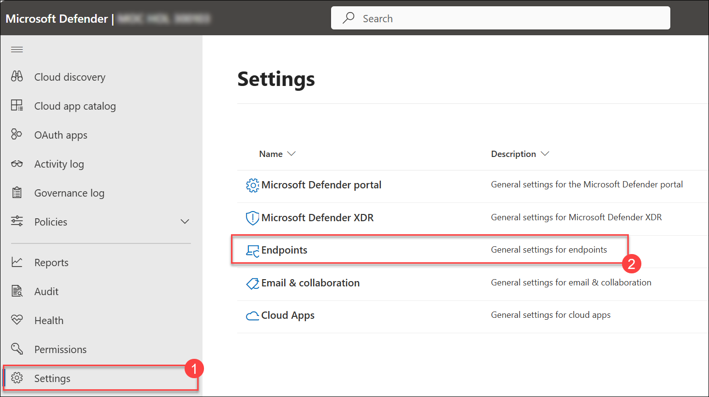
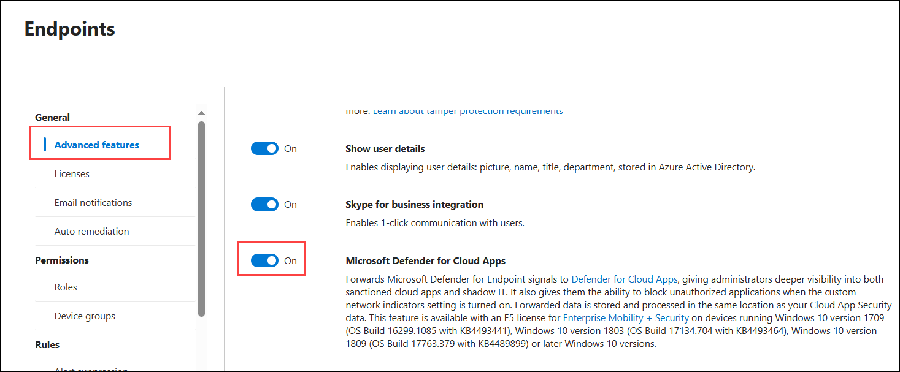

# Exercise 1: Configuring Cloud Discovery in Microsoft Defender for Cloud Apps to Detect Shadow IT

## Task 1: Microsoft Defender for Cloud Apps-Configuring Cloud Discovery 

1. In the Edge browser, log-in to Microsoft Defender portal using the following link: https://security.microsoft.com/ with the below username and password if prompted to sign in.

    - **Email/Username:** <inject key="AzureAdUserEmail"></inject>
 
       
 
  - Provide your password:
 
   - **Password:** <inject key="AzureAdUserPassword"></inject>

      

1.  In the Microsoft Defender portal, from the left navigation pane, select **Settings** and choose **Endpoints**.

     

1.  Under **General**, select **Advanced features** and toggle the option for **Microsoft Defender for Cloud Apps**

    

1. Navigate back to **Settings** and choose **Cloud Apps**

   

1. Under Cloud Discovery, choose **Microsoft Defender for Endpoint** and enable **Enforce App Access**

   

1. Scroll down and under Cloud Discovery, select **Snapshot reports** and click on **Create Snapshot Report**
