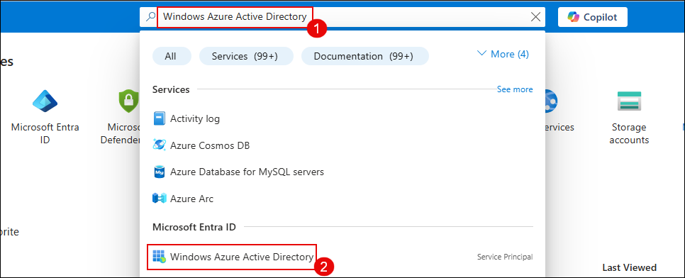
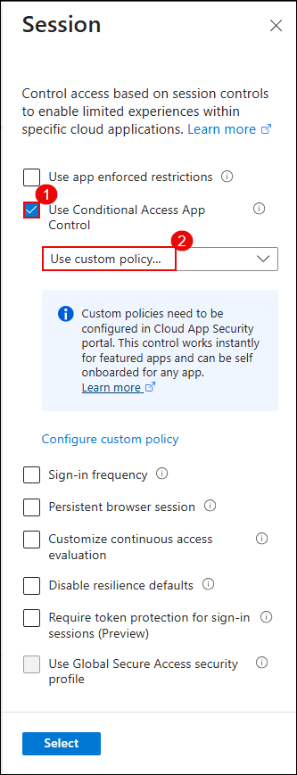
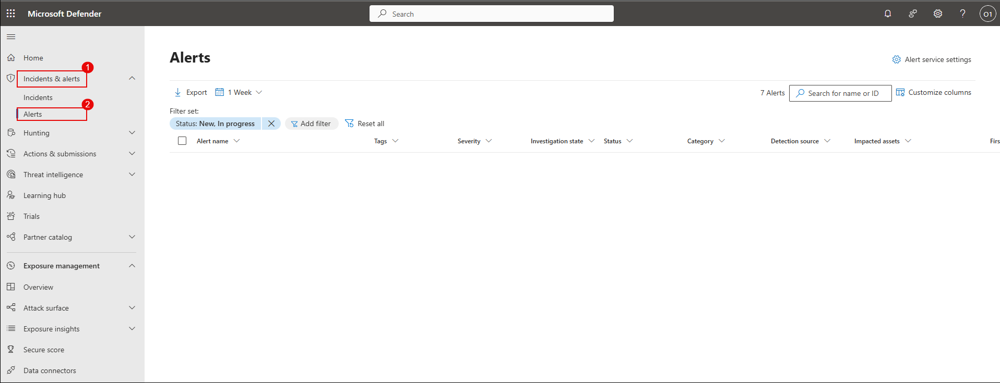

# Exercise 1: Protecting Microsoft 365 SaaS Apps with Microsoft Defender for Cloud Apps

## Overview

In this exercise, you will explore how to secure Microsoft 365 cloud services like SharePoint, OneDrive, and Exchange using Microsoft Defender for Cloud Apps. You'll connect Microsoft 365 as a cloud app, configure real-time session policies, and create custom activity detection rules to detect and block risky behavior.

## Objectives

- **Lab 1**: Connect and Onboard a SaaS App to Microsoft Defender for Cloud Apps  
- **Lab 2**: Configure Session Policies to Monitor and Block Risky Behavior  
- **Lab 3**: Investigate Alerts and Create Custom Detection Policies  

---

## Lab 1: Connect and Onboard a SaaS App to Microsoft Defender for Cloud Apps

### Estimated Duration: 30–45 minutes

## Overview

In this lab, you will connect Microsoft 365 as a SaaS application to Microsoft Defender for Cloud Apps using the native App Connector integration. Once connected, Defender will start ingesting activity logs such as file access, sign-ins, and administrative operations for enhanced visibility and control.

## Objectives

- Task 1: Assign Microsoft 365 license and enable audit logging  
- Task 2: Configure Conditional Access policy for Defender session control  
- Task 3: Enable file monitoring in Microsoft Defender for Cloud Apps  
- Task 4: Connect Microsoft 365 to Microsoft Defender for Cloud Apps

## Task 1: Assign Microsoft 365 License and Enable Audit Logging

> **Note:** Ensure you're signed in with a Microsoft 365 Global Administrator account.

### Step 1: Assign Microsoft 365 License

1. Go to the [Azure Portal](https://portal.azure.com)
2. In the search bar at the top, type **Microsoft Entra ID** and select it.

   

3. In the **Overview** pane, select **Users** under the **Manage** section.

   

4. From the list of users, click on your assigned user (e.g., `ODL_User 1777538`).

   

5. In the user blade, click on **Licenses** from the left pane.

6. Verify that the user has **Microsoft 365 E5 (no Teams)** or equivalent license assigned and marked as **Active**.

   

> ✅ The license assignment ensures your user has access to services like Exchange, SharePoint, and OneDrive required by Microsoft Defender for Cloud Apps.

---

### Step 2: Enable Audit Logging in Microsoft Purview

1. Open [https://compliance.microsoft.com](https://compliance.microsoft.com) in a browser.

2. If prompted, click **Switch to the new portal yourself** to access **Microsoft Purview**.

   

3. On the Microsoft Purview homepage, select the **Audit** tile.

   

4. If audit logging is not enabled, click on **Start recording user and admin activity**.

> ⚠️ This may take up to a few hours to activate. You can continue the next steps while audit logs begin recording in the background.

> ✅ Once enabled, Microsoft Defender for Cloud Apps can ingest logs to detect user and app behavior in Microsoft 365.

## Task 2: Configure Conditional Access Policy for Defender Session Control

In this task, you will create a Conditional Access policy to route Microsoft 365 sessions through Microsoft Defender for Cloud Apps. This enables real-time session control such as blocking downloads or inspecting file access.

> **Note:** This policy must be assigned to the user you're testing with (e.g., ODL_User).

### Step 1: Open Conditional Access in Microsoft Entra ID

1. Go to the [Azure Portal](https://portal.azure.com)

2. In the search bar, type **Microsoft Entra ID** and select it.

3. From the left navigation pane, under **Protect & secure**, click on **Conditional Access**.

   

4. Click **+ New policy** at the top.

   

---

### Step 2: Configure Policy Settings

1. **Name the policy**: `MCAS – M365 Session Control`

2. Under **Assignments > Users**, choose **Select users and groups** and add your lab user (e.g., ODL_User).

   

3. Under **Assignments > Target resources**, select **Cloud apps**, then choose **Office 365**.

   

---

### Step 3: Enable Session Control

1. Under **Access controls > Session**, enable:

   - ✅ **Use Conditional Access App Control**
   - From the dropdown, select **Use custom policy**

   

2. Scroll down and under **Enable policy**, toggle to **On**, then click **Create**.

   

> ✅ You’ve now created a Conditional Access policy to route Office 365 sessions through Microsoft Defender for Cloud Apps.

## Task 3: Enable File Monitoring in Microsoft Defender for Cloud Apps

In this task, you will enable file monitoring, which allows Microsoft Defender for Cloud Apps to track file activity across connected services like OneDrive, SharePoint, and Exchange.

### Step 1: Open Microsoft Defender for Cloud Apps Settings

1. Navigate to the [Microsoft Defender Portal](https://security.microsoft.com)

2. From the left-hand menu, scroll down and click on **Settings**.

3. Under **Settings**, select **Cloud Apps**.

   

---

### Step 2: Enable File Monitoring

1. In the **Cloud Apps** settings page, expand **Information Protection**.

2. Select **Files** from the options.

3. On the right pane, check the box for **Enable file monitoring**.

4. Click **Save** to apply the settings.

   

> ✅ File monitoring is now enabled. Microsoft Defender for Cloud Apps will begin collecting metadata and user activity related to files across supported apps.

## Task 4: Connect Microsoft 365 to Microsoft Defender for Cloud Apps

In this task, you will connect Microsoft 365 to Microsoft Defender for Cloud Apps using the native App Connector. This enables activity data ingestion from services like SharePoint, Exchange, and OneDrive.

### Step 1: Open App Connectors Page

1. In the [Microsoft Defender Portal](https://security.microsoft.com), navigate to:  
   **Settings** → **Cloud Apps** → **App Connectors**

   

2. Click on **Connect an app**.

---

### Step 2: Select Microsoft 365 Components

1. In the list of available components, check the following:

   - Microsoft Entra ID Management events  
   - Microsoft Entra ID Sign-in events  
   - Microsoft Entra ID Apps  
   - Microsoft 365 activities  
   - Microsoft 365 files  

   

2. Click **Connect Microsoft 365**.

---

### Step 3: Complete Connection

1. After authentication and connection, you will see a confirmation message:  
   **“Great, Microsoft 365 is connected.”**

   

2. Click **Done** to complete the onboarding.

3. On the **App Connectors** page, verify that Microsoft 365 shows a **Connected** status.

   

> ✅ Microsoft 365 is now fully integrated with Microsoft Defender for Cloud Apps and will begin sending user, file, and app activity logs.

---

## Lab 2: Configure Session Policies to Monitor and Block Risky Behavior

### Estimated Duration: 30–40 minutes

## Overview

In this lab, you will create a **session policy** in Microsoft Defender for Cloud Apps that blocks file downloads from unmanaged or non-compliant devices. This helps enforce Zero Trust access by enabling real-time session control for Microsoft 365 services like SharePoint and OneDrive.

## Objectives

- Task 1: Create a session policy to block file downloads on unmanaged devices  
- Task 2: Simulate risky behavior and trigger the policy  
- Task 3: Verify the block event and policy alert

## Task 1: Create a Session Policy to Block Downloads on Unmanaged Devices

In this task, you’ll configure a session policy in Microsoft Defender for Cloud Apps that inspects real-time file downloads and blocks them from unmanaged endpoints.

### Step 1: Open Session Policy Configuration

1. Go to the [Microsoft Defender Portal](https://security.microsoft.com)

2. In the left navigation pane, select **Cloud Apps** → **Policy management**

3. Click on **Create policy** and select **Session policy**

   

---

### Step 2: Define Policy Settings

1. Configure the following fields:

   - **Policy template**: `Block download based on real-time content inspection`  
   - **Policy name**: `Block-All-Download`  
   - **Category**: `DLP`  
   - **Session control type**: `Control file download (with inspection)`

   

2. Scroll down to **Actions**:
   - Choose **Block**  
   - Enable **Send alert as email** and enter your lab email address

   

3. Click **Create** to activate the policy.

> ✅ The session policy is now live. It will block file downloads from Microsoft 365 apps when accessed through unmanaged or non-compliant devices.

> ⚠️ Ensure your Conditional Access policy from Lab 1 is routing sessions through Microsoft Defender for Cloud

## Task 2: Simulate Risky Behavior and Trigger the Session Policy

In this task, you'll access SharePoint Online from a browser session, upload a file, and attempt to download it to simulate risky behavior from an unmanaged device.

> **Note:** Use a browser profile or incognito mode that is not joined to a domain to simulate an unmanaged session.

### Step 1: Log in to Microsoft 365

1. Open a browser and navigate to [https://www.office.com](https://www.office.com)

2. Sign in using your lab user credentials (e.g., `ODL_User`)

   

---

### Step 2: Access SharePoint

1. From the left navigation bar, go to **Apps** and click on **SharePoint**

   

2. Under **Frequent sites**, select the **Communication site** or a test site provisioned in your tenant

   

---

### Step 3: Upload and Attempt File Download

1. In the SharePoint site, go to the **Documents** library

2. Click **Upload** → **Files** and upload a file such as `msedge.exe`

     
   

3. After the file uploads, click on it and select **Download**

   

4. If everything is configured correctly, the download will be blocked and you’ll see:

   > **"Download blocked – Downloading msedge.exe is blocked by your organization’s security policy."**

   

> ✅ This confirms that your session policy is working and successfully blocked risky activity from an unmanaged session.

## Task 3: Verify the Block Event and Policy Alert

In this task, you will validate that the session policy successfully triggered and that Microsoft Defender for Cloud Apps recorded the event in the activity logs. You’ll also check for alert notifications.

### Step 1: View Activity Log in Microsoft Defender for Cloud Apps

1. Go to the [Microsoft Defender Portal](https://security.microsoft.com)

2. In the left navigation pane, select **Cloud Apps** → **Activity log**

   

3. Use filters to locate your download attempt:
   - **App**: Microsoft SharePoint Online  
   - **Activity type**: Download file  
   - **File name**: `msedge.exe` (or the file you tested with)

   

---

### Step 2: Review Alert in Defender Portal

1. In the portal, navigate to:  
   **Incidents & alerts** → **Alerts**

2. Look for an alert titled `Block-All-Download` or similar.

3. Click the alert to open details and investigate the associated user, device, IP address, and app used.

   

---

### Step 3: Investigate Activity in Detail

1. From the alert detail pane, click **Open alert page**

   

2. Then click **Investigate in activity log** to view all related session data.

   

> ✅ You have now confirmed that your session policy is active, triggered correctly, and generated an alert in Microsoft Defender for Cloud Apps.

---

## Lab 3: Investigate Alerts and Create Custom Detection Policies

### Estimated Duration: 30–45 minutes

## Overview

In this lab, you will use Microsoft Defender for Cloud Apps to investigate suspicious activity and create a **custom detection policy**. This helps identify specific risky behaviors—like unauthorized `.exe` file downloads—and trigger alerts for faster incident response.

## Objectives

- Task 1: Investigate activity logs and verify alerts  
- Task 2: Create a custom activity detection policy  
- Task 3: Simulate a suspicious download  
- Task 4: Confirm alert and investigate the incident

## Task 1: Investigate Activity Logs and Verify Alerts

In this task, you will analyze existing activities in the Defender portal and verify whether any alerts were already generated for suspicious behavior.

### Step 1: Open Activity Log

1. Go to the [Microsoft Defender Portal](https://security.microsoft.com)

2. From the left-hand menu, select:  
   **Cloud Apps** → **Activity log**

   

---

### Step 2: Filter for Download Activity

1. In the filter bar:

   - Click on **App: Select apps** and choose **Microsoft SharePoint Online**  
   - Set **Activity type** to `Download`  
   - Optionally, filter by **File name** = `msedge.exe` or your test file  

   

2. Review the filtered list of activities to confirm that your simulated risky download appears in the logs.

---

### Step 3: Check for Existing Alerts

1. From the left menu, navigate to:  
   **Incidents & alerts** → **Alerts**

2. Confirm that there are no existing alerts for suspicious downloads (or take note of any active alerts that were already triggered).

   

> ✅ This confirms that the activity was recorded and provides a clean baseline before creating a new custom detection policy.

## Task 2: Create a Custom Activity Detection Policy

In this task, you will define a policy in Microsoft Defender for Cloud Apps to detect when a specific risky file (e.g., `.exe`) is downloaded from SharePoint. This policy will trigger alerts for security teams.

### Step 1: Open Policy Management

1. In the [Microsoft Defender Portal](https://security.microsoft.com), go to:  
   **Cloud Apps** → **Policy management**

2. Click **Create policy** → **Activity policy**

   

---

### Step 2: Define Policy Settings

1. Fill in the following fields:

   - **Policy template**: *No template*  
   - **Policy name**: `Detect Suspicious File Download – msedge.exe`  
   - **Severity**: `High`  
   - **Category**: `Threat detection`  
   - **Act on**: `Single activity`

   

---

### Step 3: Add Filters

1. Under **Activity filters**, configure:

   - **Activity type** = `Download file`  
   - **File name** = `msedge.exe`  
   - **App** = `Microsoft SharePoint Online`

2. Click **Edit and preview results** to review sample matches (if available), then click **Save filters**

   

---

### Step 4: Configure Alert Settings

1. Under the **Alerts** section:

   - Enable **Send alert as email**  
   - Enter a valid email address (e.g., your lab email or SOC inbox)  
   - Set **Daily alert limit** to `5` (recommended)

2. Click **Create** to save and activate the policy

   

> ✅ You’ve now created a custom activity policy to detect and alert on suspicious `.exe` file downloads.

## Task 3: Simulate a Suspicious Download

In this task, you will simulate the scenario that your custom activity policy is designed to detect—downloading a risky file (`msedge.exe`) from SharePoint Online.

### Step 1: Upload the Test File to SharePoint

1. Open a browser and go to [https://www.office.com](https://www.office.com)

2. Sign in with your lab user credentials.

3. Click on **Apps**, then select **SharePoint**

   

4. Under **Frequent sites**, click on your assigned **Communication site**.

   

5. In the **Documents** library:

   - Click **Upload** → **Files**
   - Select and upload the file `msedge.exe` (or a renamed `.exe` file)

     
   

---

### Step 2: Attempt to Download the File

1. Once the file is uploaded, click on it and select **Download**

   

2. This download will trigger the custom policy you configured in Task 2.

> ✅ The action should now be logged in Microsoft Defender for Cloud Apps and will generate an alert according to your policy settings.

## Task 4: Confirm Alert and Investigate the Incident

In this final task, you'll verify that your custom policy triggered an alert and review the incident details inside Microsoft Defender for Cloud Apps.

### Step 1: Check for Email Alert

1. Open your email inbox associated with the lab user or SOC recipient.

2. Look for an alert email titled similar to:  
   `Alert - Detect Suspicious File Download – msedge.exe`

   

---

### Step 2: View Alert in Microsoft Defender Portal

1. In the [Microsoft Defender Portal](https://security.microsoft.com), go to:  
   **Incidents & alerts** → **Alerts**

2. Locate and click on the alert you configured (`Detect Suspicious File Download – msedge.exe`)

   

3. In the alert pane, click **Open alert page**

   

---

### Step 3: Investigate Activity

1. On the full alert page, click **Investigate in activity log**

   

2. Review the download event details:

   - User name  
   - File name  
   - App used (e.g., SharePoint Online)  
   - IP address, device, session context  
   - Triggered policy

   

> ✅ You have now confirmed the suspicious activity was detected, logged, and an alert was successfully generated based on your custom policy.

