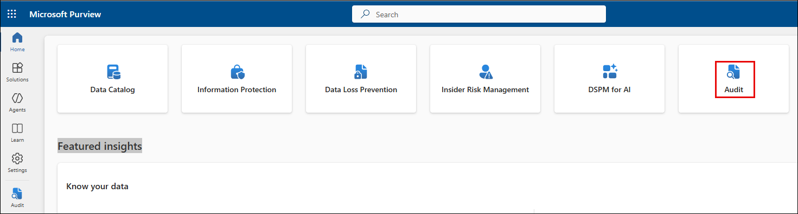
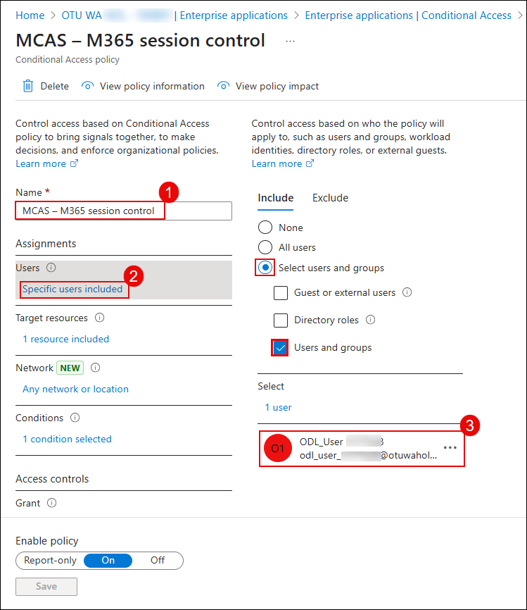
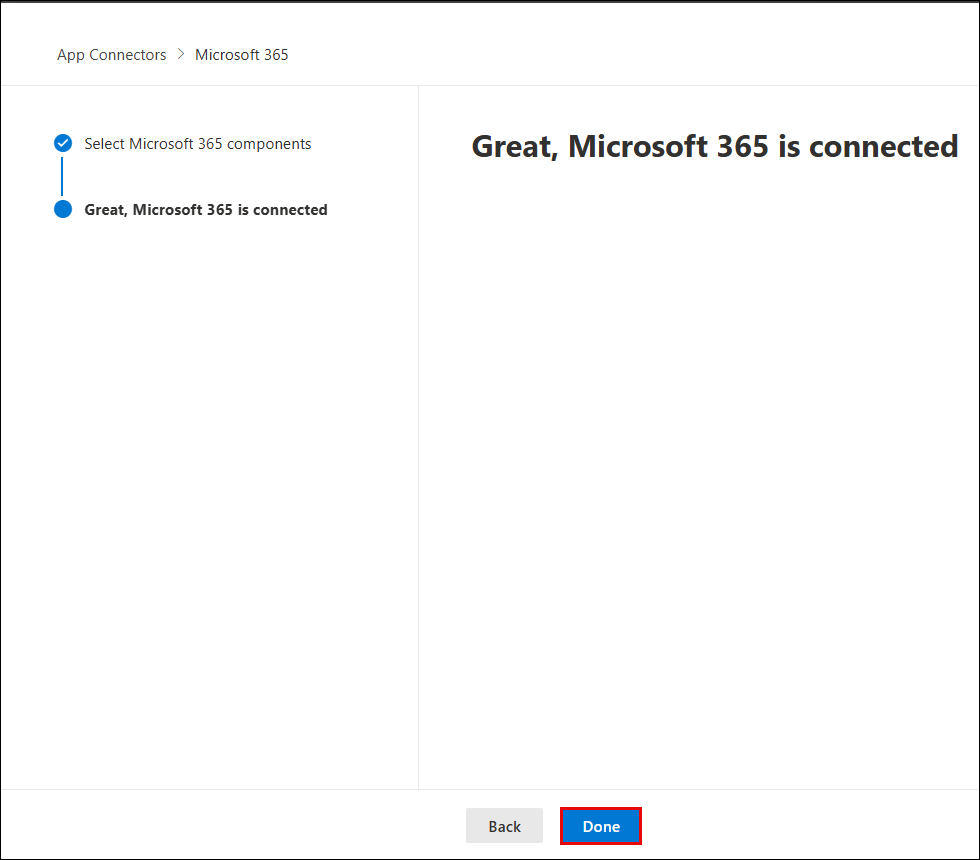
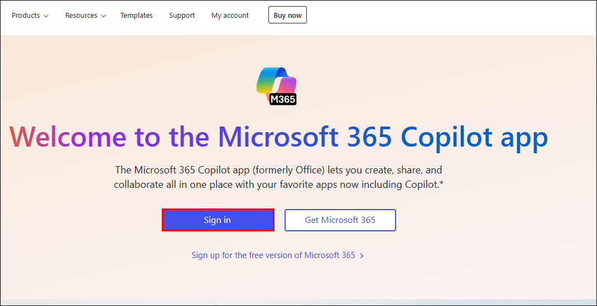
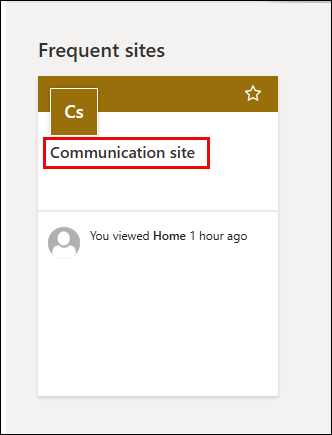

# Exercise 2 – Connect and Onboard a SaaS App to Microsoft Defender for Cloud Apps

## Overview

In this lab, you will connect Microsoft 365 as a SaaS application to Microsoft Defender for Cloud Apps using the native App Connector integration. Once the app is onboarded, Defender will begin ingesting audit logs, file activity, and OAuth app permissions for real-time visibility and security posture management.

This integration also enables **SaaS Security Posture Management (SSPM)** features such as **Secure Score** for Microsoft 365.

---

## Lab Objectives

You will complete the following tasks:

- Task 1: Assign Microsoft 365 license and enable audit logging
- Task 2: Configure Conditional Access policy for Defender session control
- Task 3: Enable file monitoring in Microsoft Defender for Cloud Apps
- Task 4: Connect Microsoft 365 to Microsoft Defender for Cloud Apps

---

## Task 1: Assign Microsoft 365 License and Enable Audit Logging

### Step 1: Assign Microsoft 365 License

1. Go to the [Azure Portal](https://portal.azure.com)  
2. In the top search bar, type **Microsoft Entra ID** (1) and select it from the list (2).

   

3. In the **Microsoft Entra ID Overview**, go to **Users** under the **Manage** section (1), then click on your **ODL_User** account (2).

   
   

4. In your user blade, click **Licenses** from the left menu.  
5. Ensure that **Microsoft 365 E5 (no Teams)** or equivalent is **Assigned** and **Active**.

   

> ℹ️ **Note**: If the license is missing or inactive, contact your admin or assign a valid Microsoft 365 license before proceeding.

---

### Step 2: Enable Audit Logging in Microsoft Purview

1. Go to [https://compliance.microsoft.com](https://compliance.microsoft.com)  

2. If prompted, click **Switch to the new portal yourself** to enter Microsoft Purview.

   

3. In Microsoft Purview, click the **Audit** tile.

   

4. If a banner appears stating **Start recording user and admin activity**, click **Start recording**.

> 🔁 Audit log activation may take up to a few hours. You can continue lab steps while it completes.

> ✅ Once enabled, Defender for Cloud Apps will be able to ingest Microsoft 365 activity logs.

---

## Task 2: Configure Conditional Access for Session Control

This step ensures that user sessions are routed through Microsoft Defender for Cloud Apps so that session policies can apply.

### Step-by-step Instructions:

1. In [Azure Portal](https://portal.azure.com), search for **Windows Azure Active Directory** and select it.

   

2. In the **Security** section, click **Conditional Access**, then **+ New policy**.

   

3. In the new policy wizard:
   - Name the policy `MCAS – M365 session control` (1)
   - Under **Users**, select **Specific users included** (2), and choose your ODL user (3)

   

4. Under **Target resources**:
   - Click **1 resource included** (1)
   - Select **Office 365** (2,3)

   

5. Under **Session**, enable:
   - ✅ **Use Conditional Access App Control**
   - Choose **Use custom policy** from the dropdown

   

6. Scroll to the bottom:
   - Toggle **Enable policy** to **On**
   - Click **Save**

   

> ✅ The Conditional Access policy is now active and routing supported sessions through Microsoft Defender for Cloud Apps.

---

## Task 3: Enable File Monitoring in Microsoft Defender for Cloud Apps

1. Go to the [Microsoft Defender Portal](https://security.microsoft.com)  
2. Navigate to **Settings** → **Cloud Apps**

   

3. Under **Connected apps**, expand **Information Protection** → **Files**  
4. Enable the checkbox for **Enable file monitoring**  
5. Click **Save**

   

> ✅ This step ensures visibility into OneDrive, SharePoint, and Exchange file access activity.

---

## Task 4: Connect Microsoft 365 to Microsoft Defender for Cloud Apps

### Step-by-step Instructions:

1. In [Microsoft Defender Portal](https://security.microsoft.com), go to **Settings** → **Cloud Apps** → **App Connectors**

   

2. Click **Connect an app**, select the following checkboxes:
   - Microsoft Entra ID Management events  
   - Microsoft Entra ID Sign-in events  
   - Microsoft Entra ID Apps  
   - Microsoft 365 activities  
   - Microsoft 365 files

   

3. Click **Connect Microsoft 365**

4. You will see: `Great, Microsoft 365 is connected.` Click **Done**

   

5. Back on the **App Connectors** screen, confirm **Status = Connected**

   

> ✅ Microsoft 365 is now fully onboarded and ready to send logs to Microsoft Defender for Cloud Apps.

---

📌 **Next Step**: Proceed to [Lab 2 – Configure Session Policies to Monitor and Block Risky Behavior](#lab-2--configure-session-policies-to-monitor-and-block-risky-behavior) to create policies that act on this integration.

# Lab 2 – Configure Session Policies to Monitor and Block Risky Behavior

### Estimated Duration: 30–40 minutes

## Overview

In this lab, you will configure a **Session Policy** in Microsoft Defender for Cloud Apps to block risky actions like downloading files from unmanaged devices. This policy provides real-time protection and visibility, especially for Bring Your Own Device (BYOD) scenarios.

---

## Lab Objectives

You will complete the following tasks:

- Task 1: Create a session policy to block downloads on unmanaged devices
- Task 2: Simulate risky behavior to trigger the session policy
- Task 3: Verify alerts and block events in the activity logs

---

## Task 1: Create a Session Policy to Block Downloads

### Step-by-step Instructions:

1. Go to the [Microsoft Defender Portal](https://security.microsoft.com)  
2. From the left pane, click on **Cloud apps** (1) → **Policy management** (2)  
3. Click **Create policy** (3), then select **Session policy** (4)

   

4. On the policy creation page, configure the following:

   - **Policy template**: `Block download based on real-time content inspection` (1)  
   - **Policy name**: `Block-All-Download` (2)  
   - **Category**: `DLP` (3)  
   - **Session control type**: `Control file download (with inspection)` (4)

   

5. Under **Actions**, do the following:
   - Select `Block` (5)
   - Enable **Send alert as email**, and enter your lab email (6)

   

6. Scroll down and click **Create** to save and activate the policy

> ✅ The session policy is now live and will block file downloads from unmanaged devices.

> ℹ️ **Note**: For this policy to work, the user session must be routed through Microsoft Defender for Cloud Apps (via Conditional Access).

---

## Task 2: Simulate Risky Behavior and Trigger the Policy

To test your policy, simulate a file download from a SharePoint site using a non-compliant browser session.

### Step-by-step Instructions:

1. Open a browser (unmanaged session) and go to [https://www.office.com](https://www.office.com)  
2. Click **Sign in** using your lab credentials

   

3. From the Office dashboard, go to **Apps** → **SharePoint**

   

4. Under **Frequent sites**, click your **Communication site**

   

5. In the site:
   - Click on **Documents** (1)
   - Click **Upload** (2), and choose **Files** (3)

   

6. Upload a test file like `msedge.exe` (simulates a risky file)

   

7. Once uploaded, click the file and select **Download**

   

> ✅ If the policy is properly set and the session is routed via Defender, you’ll see this message:  
> **"Download blocked – Downloading msedge.exe is blocked by your organization’s security policy."**

   

> ⚠️ If the policy does **not** trigger:
> - Verify that the Conditional Access policy includes the test user
> - Ensure the device is unmanaged or not domain-joined
> - Confirm that the file matches the session control criteria

---

## Task 3: Verify Alert and Block Activity

1. Return to the [Microsoft Defender Portal](https://security.microsoft.com)  
2. Navigate to **Activity log** under **Cloud Apps**

Here, you can:
- View block events
- See matched session policies

> ✅ Congratulations! You've successfully configured and tested real-time session policies to block risky behavior in Microsoft 365.

---

🔄 **Optional Next Step**: Try modifying the session policy to only apply to specific file types or user groups. This adds precision to your cloud security posture.

