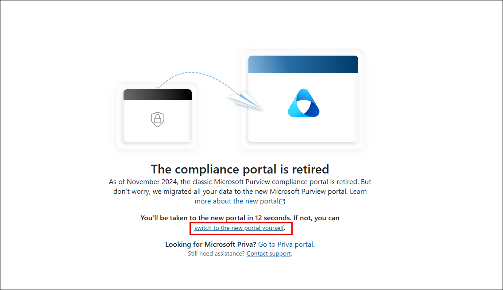
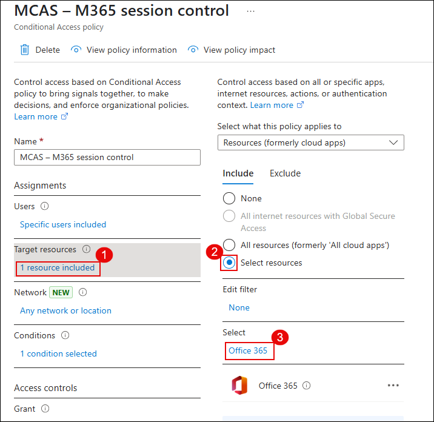
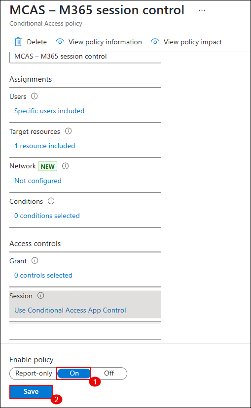
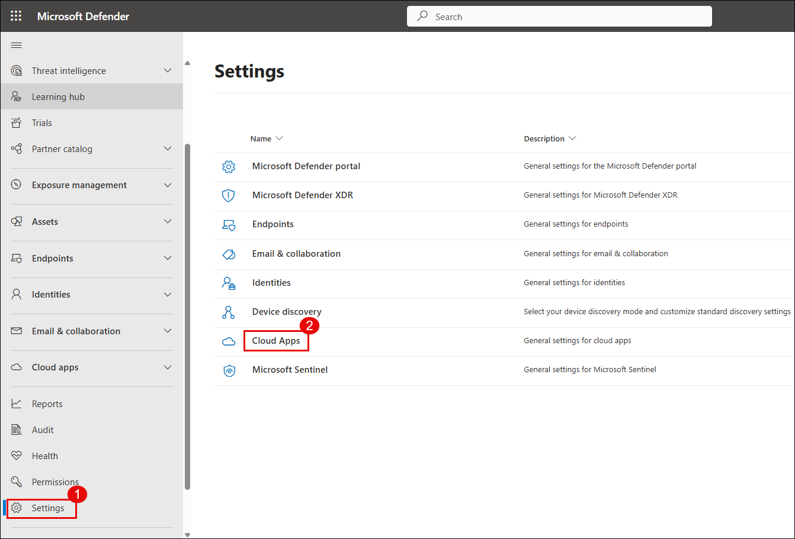
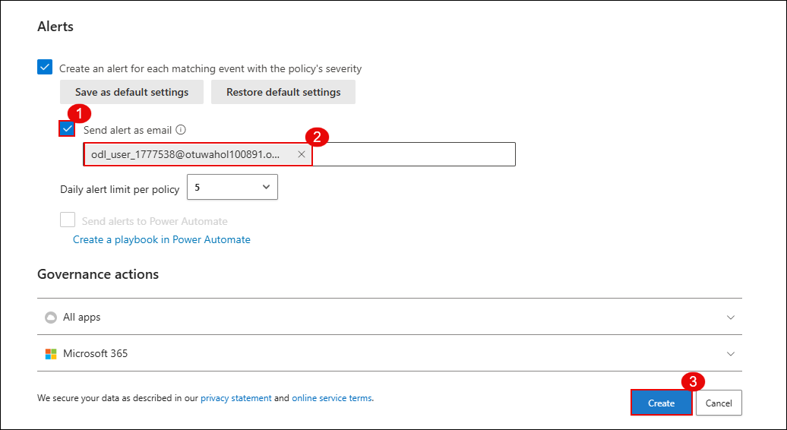

# Exercise 2 – Connect and Onboard a SaaS App to Microsoft Defender for Cloud Apps

<<<<<<< HEAD
## Overview

In this lab, you will connect Microsoft 365 as a SaaS application to Microsoft Defender for Cloud Apps using the native App Connector integration. Once the app is onboarded, Defender will begin ingesting data such as audit logs, file activity, and third-party OAuth app permissions for real-time visibility and security posture management.

This integration also enables SaaS Security Posture Management (SSPM) features for Microsoft 365 via Secure Score.

## Lab objectives

In this lab, you will complete the following tasks:

- Task 1: Assign Microsoft 365 license and verify user access
- Task 2: Connect Microsoft 365 to Microsoft Defender for Cloud Apps
- Task 3: Verify integration and activity data ingestion

## Pre-lab Setup (Microsoft Entra ID)

1. Go to the [Azure Portal](https://portal.azure.com) and in the top search bar, type **Microsoft Entra ID** (1), then select it from the list (2).

   

1. In the Microsoft Entra ID Overview blade, from the left-hand navigation menu, expand **Manage** (1) and select **Users** (2).

   

1. From the list of users, click on your assigned username (e.g., **ODL_User 1777538**).

   

1. In the user profile menu, click on **Licenses** from the left pane.

1. Ensure that **Microsoft 365 E5 (no Teams)** or equivalent license is listed under the **Products** section and the **State** is marked as **Active**.

   

> **Note**: If the Microsoft 365 license is not assigned or not active, contact your administrator or follow lab-specific instructions to assign a valid license before continuing.

### Verify and Enable Audit Logging in Microsoft Purview

Before connecting Microsoft 365 to Defender for Cloud Apps, ensure that **Audit Logs** are accessible and logging is **enabled** through the Microsoft Purview portal. These logs are essential for capturing user activity, app behavior, and other telemetry after onboarding.

1. Open a browser and visit the classic **Compliance portal**: [https://compliance.microsoft.com](https://compliance.microsoft.com)

1. You will see a notification stating that the portal is retired. Click on **switch to the new portal yourself** to be redirected to **Microsoft Purview**.

   

   > **Note**: Microsoft Purview now hosts audit, compliance, insider risk, and DLP features. The classic compliance center was deprecated as of November 2024.

1. In the **Microsoft Purview** portal, click on the **Audit** tile.

   

1. If audit logging is not already enabled, you will see a banner at the top that says: **Start recording user and admin activity**. Click on **Start recording**.

   > This may take a few hours to activate. You can continue with the lab while this is processing.

   > If audit logging is already enabled, no action is needed.

> **Note**: If you do not see the Audit option or the enable banner, it may be due to insufficient permissions or a missing license (e.g., Microsoft 365 E5). Please contact your admin to enable **Microsoft Purview Audit** access.

> ✅ Once audit logging is enabled, Defender for Cloud Apps will be able to ingest all required activity logs from Microsoft 365.

## Task 1: Configure Conditional Access for Session Control

In this task, you will configure a Conditional Access policy in Microsoft Entra ID (formerly Azure Active Directory) to route user sessions through Microsoft Defender for Cloud Apps. This routing is essential for any session policy (like file blocking or inspection) to take effect.

1. Navigate to the [Azure Portal](https://portal.azure.com), and in the top search bar, type **Windows Azure Active Directory** (1) and select it from the dropdown (2).

   

2. In the Entra ID blade, scroll down to the **Security** section, then click on **Conditional Access** (1). Click **+ New policy** (2).

   

3. In the new policy wizard:
   - Set the **Name** to `MCAS – M365 session control` (1)
   - Under **Assignments > Users**, select **Specific users included** (2), and choose your **ODL User** (3)

   

4. Under **Target resources**, click **1 resource included** (1), then:
   - Select the option **Select resources** (2)
   - Choose **Office 365** (3)

   

5. Scroll down to **Access controls > Session**, and enable:
   - ✅ **Use Conditional Access App Control** (1)  
   - Then choose **Use custom policy** from the dropdown (2)

   

6. Finally, scroll to the bottom of the blade:
   - Set **Enable policy** to **On** (1)  
   - Click **Save** (2) to create and activate the policy

   

> ✅ The Conditional Access policy is now live. This will ensure that any supported Office 365 sessions are redirected through Microsoft Defender for Cloud Apps, enabling your session policy logic to apply in real time.

## Task 1: Configure Microsoft Defender for Cloud Apps Settings

In this task, you will navigate to Microsoft Defender settings and enable file monitoring. This allows Defender for Cloud Apps to collect and display SaaS file activity once Microsoft 365 is connected.

1. Visit the [Microsoft Defender Portal](https://security.microsoft.com) and log in with your admin credentials.

1. In the left-hand navigation pane, scroll down and select **Settings** (1), then click on **Cloud Apps** (2).

   

1. Under **Connected apps**, expand **Information Protection** (1) and select **Files** (2).

1. On the right pane, check the box for **Enable file monitoring** (3). This setting enables Microsoft Defender to collect file metadata and access activity across supported SaaS apps.

1. Click **Save** (4) to apply the configuration.

   

> **Note**: This setting is required to ensure visibility into OneDrive, SharePoint, and Exchange file access events when Microsoft 365 is onboarded as a cloud app.

> ✅ Great job! You’ve now completed Task 1. Your Microsoft Defender for Cloud Apps instance is ready for onboarding Microsoft 365 in the next step.

## Task 2: Connect Microsoft 365 to Microsoft Defender for Cloud Apps

In this task, you will connect Microsoft 365 as an app connector in Defender for Cloud Apps. This integration allows Defender to monitor and analyze user activities, file access, and administrative operations across M365 services like Exchange, OneDrive, SharePoint, and Teams.

1. Open the [Microsoft Defender Portal](https://security.microsoft.com), and go to **Settings** > **Cloud Apps**.

2. Under the left-hand pane, click **Connected apps** (1), then select **App Connectors** (2). Click on **Connect an app** (3).

   

3. In the **Select Microsoft 365 components** window, make sure the following options are checked:

   - Microsoft Entra ID Management events  
   - Microsoft Entra ID Sign-in events  
   - Microsoft Entra ID Apps  
   - Microsoft 365 activities  
   - Microsoft 365 files  

4. Click on **Connect Microsoft 365**.

   

5. After successful authentication and configuration, you will see a confirmation message:  
   **Great, Microsoft 365 is connected.** Click **Done**.

   

6. Back on the **App Connectors** page, verify that Microsoft 365 shows as **Connected** in the status column.

   

> **Note**: You may need to refresh the page or wait a few minutes for the status to update. If the connection fails, ensure that you're logged in with a Global Administrator account and that required licenses are active.

> ✅ Excellent! Microsoft 365 is now connected and ready to send user, file, and admin activity logs to Defender for Cloud Apps.

# Lab 2 – Configure Session Policies to Monitor and Block Risky Behavior

### Estimated Duration: 30–40 minutes

## Overview

In this lab, you will configure a **Session Policy** in Microsoft Defender for Cloud Apps to block risky user behavior. Specifically, you'll set up a **real-time policy** to inspect and block file downloads from unmanaged or non-compliant devices.

This proactive control helps secure cloud environments by enforcing session-level restrictions, especially in Bring Your Own Device (BYOD) scenarios.

## Lab objectives

In this lab, you will complete the following tasks:

- Task 1: Create a session policy to block file downloads on unmanaged devices
- Task 2: Simulate risky behavior and trigger the policy
- Task 3: Verify the alerts and block event in the activity logs

---

## Task 1: Create a Session Policy to Block Downloads

In this task, you will configure a session policy in Microsoft Defender for Cloud Apps to block file downloads when users access corporate resources from unmanaged or non-compliant devices.

1. Navigate to the [Microsoft Defender Portal](https://security.microsoft.com) and select **Cloud apps** (1) > **Policy management** (2) from the left navigation pane.

2. Click on **Create policy** (3) and choose **Session policy** (4).

   

3. On the **Create session policy** page, configure the following fields:

   - **Policy template**: `Block download based on real-time content inspection` (1)  
   - **Policy name**: `Block-All-Download` (2)  
   - **Category**: `DLP` (3)  
   - **Session control type**: `Control file download (with inspection)` (4)

   

4. Scroll down and set **Actions**:

   - Choose **Block** (5)  
   - Enable **Send alert as email** and enter your ODL email address (6)  

   > This will send an email alert every time the policy is triggered.

   

5. Click **Create** at the bottom to save and activate the session policy.

> ✅ The session policy is now live and will begin enforcing restrictions on real-time download attempts from non-compliant devices.

> **Note**: For the policy to take effect, ensure the user is included in an **Entra Conditional Access** rule that routes the session through **Defender for Cloud Apps proxy**.

## Task 2: Simulate Risky Behavior and Trigger the Session Policy

In this task, you will log in to SharePoint from a browser, upload a file, and attempt to download it in order to trigger the session policy you configured in Task 1. This simulates a real-world risky behavior scenario from a non-compliant device.

1. Open a browser and navigate to the [Microsoft 365 Copilot App Portal](https://www.office.com) and click on **Sign in** using your lab user credentials.

   

2. After signing in, from the left navigation bar, go to **Apps**, and click on **SharePoint**.

   

3. Under **Frequent sites**, select the **Communication site** or the SharePoint site created for your organization.

   

4. In the site, go to the **Documents** library (1), click **Upload** (2), and select **Files** (3).

   

5. Upload a file such as `msedge.exe` to simulate risky content.

   

6. After the file appears in the library, click on it and select **Download** from the prompt.

   

7. If your session policy is correctly configured and routed via Defender for Cloud Apps, the download attempt will be blocked and you'll see the message:  
   **"Download blocked – Downloading msedge.exe is blocked by your organization’s security policy."**

   

> **Note**: Ensure you're accessing from an unmanaged or non-compliant device for the policy conditions to apply. If the policy doesn't trigger, double-check the session control configuration and Entra Conditional Access policies.

> ✅ The session policy was successfully triggered, and the risky behavior was blocked as expected.

=======
## Overview

In this lab, you will connect Microsoft 365 as a SaaS application to Microsoft Defender for Cloud Apps using the native App Connector integration. Once the app is onboarded, Defender will begin ingesting audit logs, file activity, and OAuth app permissions for real-time visibility and security posture management.

This integration also enables **SaaS Security Posture Management (SSPM)** features such as **Secure Score** for Microsoft 365.

---

## Lab Objectives

You will complete the following tasks:

- Task 1: Assign Microsoft 365 license and enable audit logging
- Task 2: Configure Conditional Access policy for Defender session control
- Task 3: Enable file monitoring in Microsoft Defender for Cloud Apps
- Task 4: Connect Microsoft 365 to Microsoft Defender for Cloud Apps

---

## Task 1: Assign Microsoft 365 License and Enable Audit Logging

### Step 1: Assign Microsoft 365 License

1. Go to the [Azure Portal](https://portal.azure.com)  
2. In the top search bar, type **Microsoft Entra ID** (1) and select it from the list (2).

   

3. In the **Microsoft Entra ID Overview**, go to **Users** under the **Manage** section (1), then click on your **ODL_User** account (2).

   
   

4. In your user blade, click **Licenses** from the left menu.  
5. Ensure that **Microsoft 365 E5 (no Teams)** or equivalent is **Assigned** and **Active**.

   

> ℹ️ **Note**: If the license is missing or inactive, contact your admin or assign a valid Microsoft 365 license before proceeding.

---

### Step 2: Enable Audit Logging in Microsoft Purview

1. Go to [https://compliance.microsoft.com](https://compliance.microsoft.com)  

2. If prompted, click **Switch to the new portal yourself** to enter Microsoft Purview.

   

3. In Microsoft Purview, click the **Audit** tile.

   

4. If a banner appears stating **Start recording user and admin activity**, click **Start recording**.

> 🔁 Audit log activation may take up to a few hours. You can continue lab steps while it completes.

> ✅ Once enabled, Defender for Cloud Apps will be able to ingest Microsoft 365 activity logs.

---

## Task 2: Configure Conditional Access for Session Control

This step ensures that user sessions are routed through Microsoft Defender for Cloud Apps so that session policies can apply.

### Step-by-step Instructions:

1. In [Azure Portal](https://portal.azure.com), search for **Windows Azure Active Directory** and select it.

   

2. In the **Security** section, click **Conditional Access**, then **+ New policy**.

   

3. In the new policy wizard:
   - Name the policy `MCAS – M365 session control` (1)
   - Under **Users**, select **Specific users included** (2), and choose your ODL user (3)

   

4. Under **Target resources**:
   - Click **1 resource included** (1)
   - Select **Office 365** (2,3)

   

5. Under **Session**, enable:
   - ✅ **Use Conditional Access App Control**
   - Choose **Use custom policy** from the dropdown

   

6. Scroll to the bottom:
   - Toggle **Enable policy** to **On**
   - Click **Save**

   

> ✅ The Conditional Access policy is now active and routing supported sessions through Microsoft Defender for Cloud Apps.

---

## Task 3: Enable File Monitoring in Microsoft Defender for Cloud Apps

1. Go to the [Microsoft Defender Portal](https://security.microsoft.com)  
2. Navigate to **Settings** → **Cloud Apps**

   

3. Under **Connected apps**, expand **Information Protection** → **Files**  
4. Enable the checkbox for **Enable file monitoring**  
5. Click **Save**

   

> ✅ This step ensures visibility into OneDrive, SharePoint, and Exchange file access activity.

---

## Task 4: Connect Microsoft 365 to Microsoft Defender for Cloud Apps

### Step-by-step Instructions:

1. In [Microsoft Defender Portal](https://security.microsoft.com), go to **Settings** → **Cloud Apps** → **App Connectors**

   

2. Click **Connect an app**, select the following checkboxes:
   - Microsoft Entra ID Management events  
   - Microsoft Entra ID Sign-in events  
   - Microsoft Entra ID Apps  
   - Microsoft 365 activities  
   - Microsoft 365 files

   

3. Click **Connect Microsoft 365**

4. You will see: `Great, Microsoft 365 is connected.` Click **Done**

   

5. Back on the **App Connectors** screen, confirm **Status = Connected**

   

> ✅ Microsoft 365 is now fully onboarded and ready to send logs to Microsoft Defender for Cloud Apps.

---

📌 **Next Step**: Proceed to [Lab 2 – Configure Session Policies to Monitor and Block Risky Behavior](#lab-2--configure-session-policies-to-monitor-and-block-risky-behavior) to create policies that act on this integration.

# Lab 2 – Configure Session Policies to Monitor and Block Risky Behavior

### Estimated Duration: 30–40 minutes

## Overview

In this lab, you will configure a **Session Policy** in Microsoft Defender for Cloud Apps to block risky actions like downloading files from unmanaged devices. This policy provides real-time protection and visibility, especially for Bring Your Own Device (BYOD) scenarios.

---

## Lab Objectives

You will complete the following tasks:

- Task 1: Create a session policy to block downloads on unmanaged devices
- Task 2: Simulate risky behavior to trigger the session policy
- Task 3: Verify alerts and block events in the activity logs

---

## Task 1: Create a Session Policy to Block Downloads

### Step-by-step Instructions:

1. Go to the [Microsoft Defender Portal](https://security.microsoft.com)  
2. From the left pane, click on **Cloud apps** (1) → **Policy management** (2)  
3. Click **Create policy** (3), then select **Session policy** (4)

   

4. On the policy creation page, configure the following:

   - **Policy template**: `Block download based on real-time content inspection` (1)  
   - **Policy name**: `Block-All-Download` (2)  
   - **Category**: `DLP` (3)  
   - **Session control type**: `Control file download (with inspection)` (4)

   

5. Under **Actions**, do the following:
   - Select `Block` (5)
   - Enable **Send alert as email**, and enter your lab email (6)

   

6. Scroll down and click **Create** to save and activate the policy

> ✅ The session policy is now live and will block file downloads from unmanaged devices.

> ℹ️ **Note**: For this policy to work, the user session must be routed through Microsoft Defender for Cloud Apps (via Conditional Access).

---

## Task 2: Simulate Risky Behavior and Trigger the Policy

To test your policy, simulate a file download from a SharePoint site using a non-compliant browser session.

### Step-by-step Instructions:

1. Open a browser (unmanaged session) and go to [https://www.office.com](https://www.office.com)  
2. Click **Sign in** using your lab credentials

   

3. From the Office dashboard, go to **Apps** → **SharePoint**

   

4. Under **Frequent sites**, click your **Communication site**

   

5. In the site:
   - Click on **Documents** (1)
   - Click **Upload** (2), and choose **Files** (3)

   

6. Upload a test file like `msedge.exe` (simulates a risky file)

   

7. Once uploaded, click the file and select **Download**

   

> ✅ If the policy is properly set and the session is routed via Defender, you’ll see this message:  
> **"Download blocked – Downloading msedge.exe is blocked by your organization’s security policy."**

   

> ⚠️ If the policy does **not** trigger:
> - Verify that the Conditional Access policy includes the test user
> - Ensure the device is unmanaged or not domain-joined
> - Confirm that the file matches the session control criteria

---

## Task 3: Verify Alert and Block Activity

1. Return to the [Microsoft Defender Portal](https://security.microsoft.com)  
2. Navigate to **Activity log** under **Cloud Apps**

Here, you can:
- View block events
- See matched session policies

> ✅ Congratulations! You've successfully configured and tested real-time session policies to block risky behavior in Microsoft 365.

---
# Lab 3 – Investigate Alerts and Create Custom Detection Policies

### Estimated Duration: 30–45 minutes

## Overview

In this lab, you will investigate activity logs in Microsoft Defender for Cloud Apps, verify that there are no current alerts, and then create a custom activity policy to detect suspicious downloads (e.g., `.exe` files) from SharePoint Online. This policy will trigger email alerts to security teams for rapid response and containment.

## Lab Objectives

In this lab, you will:

- Investigate recent activity logs  
- Confirm absence of alerts  
- Create a new custom activity policy  
- Apply filters to match suspicious behavior  
- Enable email alerts and simulate the policy

---

## Prerequisites

- Microsoft 365 E5 tenant with Microsoft Defender for Cloud Apps enabled  
- Microsoft SharePoint Online must be onboarded as a connected app  
- Activity logs must contain at least one download event (e.g., `msedge.exe`)  

---

## Task 1 – Investigate Activity Logs

1. Navigate to the [Microsoft Defender portal](https://security.microsoft.com)

2. In the left-hand menu, select:  
   **Cloud apps** → **Activity log**  
   

3. In the filter bar:  
   - Click **App: Select apps**  
   - Choose **Microsoft SharePoint Online**  
   

4. Review the filtered activity list for file downloads involving `msedge.exe`  
   

---

## Task 2 – Verify Existing Alerts

1. In the left-hand menu, go to:  
   **Incidents & alerts** → **Alerts**

2. Confirm that there are **no existing alerts** related to suspicious `.exe` downloads  
   

---

## Task 3 – Create a Custom Activity Policy

1. In the menu, go to:  
   **Cloud apps** → **Policies** → **Policy management**

2. Click **Create policy** → **Activity policy**  
   

3. Fill in the policy configuration as below:  
   - **Policy template**: *No template*  
   - **Policy name**: `Detect suspicious file download – msedge.exe`  
   - **Severity**: High  
   - **Category**: Threat detection  
   - **Act on**: Single activity  

   **Filters**:  
   - Activity type = Download  
   - File name = `msedge.exe`  
   - App = Microsoft SharePoint Online  
   

4. Click **Edit and preview results**  
   - Review the matched activities  
   - Click **Save filters**  
   

5. In the **Alerts** section:  
   - Enable **Send alert as email**  
   - Enter a valid recipient email (e.g., SOC team)  
   - Set daily alert limit (recommended: 5)  
   - Click **Create** to save the policy  
   

---

## Task 4 – Simulate Suspicious Download

1. Open the **SharePoint Communication Site**

2. Navigate to the **Documents** library and upload the file `msedge.exe`  
   

3. Attempt to download the uploaded file  
   - Click **Download**  
   

4. Observe that the download is **blocked by Defender for Cloud Apps**  
   

> **Note:** This confirms the policy is functioning and preventing unauthorized downloads based on file name and app filters.

---

## Task 5 – Investigate Triggered Alert

1. Check your inbox for an **alert email** from Microsoft Defender for Cloud Apps  
   

2. Navigate to:  
   **Microsoft 365 Defender portal** → **Incidents & alerts** → **Alerts**

3. Locate and click on the alert titled **Block-All- Download**  
   

4. In the alert details pane:  
   - Review classification, severity, and impacted asset  
   - Click **Open alert page**  
   

5. On the full alert page:  
   - Examine the user, IP, app, and what triggered the alert  
   - Click **Investigate in activity log**  
   

6. In the **Activity log** page:  
   - Review activity description (`Download file: msedge.exe`)  
   - Validate device type, IP address, location, and app  
   - Confirm policy match and source as **Session control**  
   

> **Note:** Use this page to perform deeper investigations or create additional detection rules for similar activity.

---

✅ **Lab Completed Successfully**  
You have now created a custom policy, simulated a suspicious download event, received alert notifications, and verified the alert from both email and the Microsoft 365 Defender portal.

# Lab 4 – Implement App Governance and Risk Detection for OAuth Apps

### Estimated Duration: 30–40 minutes

## Overview

In this lab, you will enable **App Governance** within Microsoft Defender for Cloud Apps and implement a detection policy that identifies OAuth apps with high-risk permissions. This helps security teams monitor third-party apps granted access to Microsoft 365 data and take proactive steps against potential threats from overprivileged or unverified applications.

App Governance extends Microsoft Defender for Cloud Apps by giving insights into OAuth app behaviors, permission levels, publisher verification status, and risk scores.

---

## Lab Objectives

You will complete the following tasks:

- Task 1: Enable App Governance in Microsoft Defender for Cloud Apps  
- Task 2: Review permission summary of an onboarded app  
- Task 3: Create a policy to detect highly privileged OAuth apps  
- Task 4: Review policy results and incidents

---

## Prerequisites

- Microsoft 365 E5 license with Microsoft Defender for Cloud Apps enabled  
- At least one OAuth app registered and granted delegated permissions (e.g., AuditLogApp)  
- Admin role in Microsoft Entra ID (Azure AD)

## Task 1: Enable App Governance in Microsoft Defender for Cloud Apps

1. Go to the **Microsoft 365 Defender Portal**
2. Navigate to **Cloud apps** > **App governance** > **Service status**
3. Click on the **Turn on app governance** button

> **Note:** App Governance helps detect apps with excessive permissions, unverified publishers, and abnormal data access.

---

## Task 2: Review OAuth App Permission Summary

1. In the Microsoft 365 Defender Portal, go to **Cloud apps** > **OAuth apps**
2. Click on **Go to app governance** to open the new App Governance experience

3. Navigate to **Cloud apps** > **Governance log**
4. Select the app **AuditLogApp** from the list of apps

5. Click on the **Permissions** tab to view a summary of the app’s access level:
   - 4 total permissions
   - 3 high privilege
   - 0 unused

---

# Task 3 – Create a Policy to Detect Highly Privileged OAuth Apps

### Estimated Duration: 20–30 minutes

## Overview

In this task, you will create a custom App Governance policy to detect OAuth apps that request highly privileged permissions and are published by unverified publishers.

---

## Steps

### Step 1: Choose a Policy Template

1. Go to the **App Governance** portal and select **Policies**.
2. Click **+ Create policy**.
3. Under **Category**, select **Custom**.
4. Choose **Custom policy** from the template list.
5. Click **Next**.

---

### Step 2: Name and Describe the Policy

1. Enter the policy name: `Detect High-Permission OAuth Apps`
2. Add the description:  
   `This policy flags apps with delegated permissions classified as high-risk, such as access to user data, mail, files, etc.`
3. Set the **Severity** to `High`.
4. Click **Next**.

---

### Step 3: Set Policy Scope and Conditions – Customize

1. When asked "Apply default settings?", select  
   `No, I'll customize the policy`
2. Click **Next**.

---

### Step 4: Define Policy Scope

1. Under **Policy scope**, select `All apps`.
2. Click **Next**.

---

### Step 5: Edit Policy Conditions

1. Under **Highly privileged**, set value to `Yes`.
2. Add another condition: **Publisher verified** = `No`.
3. Click **Save**.

---

### Step 6: Set Policy Action

1. Leave the **Disable app** option unchecked (optional).
2. Click **Next**.

---

# Lab 4 – Implement App Governance and Risk Detection for OAuth Apps

### Estimated Duration: 30–40 minutes

## Overview

In this lab, you will enable **App Governance** within [Microsoft Defender for Cloud Apps](https://security.microsoft.com) and review high-privilege OAuth apps to detect potential risks.

App Governance helps security teams monitor third-party applications with access to Microsoft 365 data, offering visibility into their behavior, permissions, and publisher verification.

---

## Lab Objectives

You will complete the following tasks:

- Task 1: Enable App Governance in Microsoft Defender for Cloud Apps  
- Task 2: Review permission summary of an onboarded app  

---

## Prerequisites

- Microsoft 365 E5 license  
- Admin access to [Microsoft Entra ID (Azure AD)](https://entra.microsoft.com)  
- Defender for Cloud Apps enabled  
- At least one onboarded OAuth app with delegated permissions (e.g., `AuditLogApp`)

---

# Task 1 – Enable App Governance in Microsoft Defender for Cloud Apps

### Estimated Duration: 5–10 minutes

In this task, you will enable the App Governance feature within Microsoft Defender for Cloud Apps. This feature extends visibility into OAuth apps that have been granted access to your Microsoft 365 data.

---

### Step 1: Open Microsoft 365 Defender Portal

1. Navigate to the [Microsoft 365 Defender Portal](https://security.microsoft.com).

> **Note:** Ensure you are signed in with an account that has the required Microsoft 365 E5 license and admin permissions.

---

### Step 2: Open App Governance Settings

1. In the left navigation pane, click on **Cloud apps**.
2. Select **App governance**.
3. Under **Service status**, click on **Turn on app governance**.

> 🛡️ *This step enables deep visibility into OAuth apps accessing Microsoft 365 data, including risk detection for high-privilege apps.*

---

# Task 2 – Review OAuth App Permission Summary

### Estimated Duration: 10 minutes

In this task, you will review the permissions and risk status of an onboarded OAuth app using the App Governance dashboard.

---

### Step 1: Navigate to OAuth Apps

1. In the [Microsoft 365 Defender Portal](https://security.microsoft.com), go to **Cloud apps** in the left menu.
2. Click on **OAuth apps**.

> **Note:** You will see a message stating that OAuth app management has moved. Click on **Go to app governance** to continue.

---

### Step 2: Open Governance Log

1. In the App Governance interface, click on **Cloud apps** again (in the new view).
2. Select **Governance log** from the options.

---

### Step 3: Select the App to Review

1. From the list of onboarded apps, find and click on **AuditLogApp**.

---

### Step 4: View App Permissions Summary

1. In the app details pane, click on the **Permissions** tab.
2. Review the following:

   - **Total permissions**: 4  
   - **High privilege permissions**: 3  
   - **Unused permissions**: 0  

> ℹ️ *High privilege permissions often include access to user profile data, mail, and files. These apps should be monitored closely.*

---

# Task 3 – Create a Detection Policy for Highly Privileged OAuth Apps

### Estimated Duration: 20–30 minutes

In this task, you will create a custom detection policy in App Governance to identify OAuth apps that request high-risk permissions and are published by unverified publishers.

---

### Step 1: Go to the Policies Section

1. In the [Microsoft 365 Defender Portal](https://security.microsoft.com), go to **Cloud apps**.
2. Click on **App governance**.
3. Select the **Policies** tab from the top menu.
4. Click **+ Create policy**.

---

### Step 2: Choose Policy Template

1. In the **Create policy** window:
   - Under **Category**, select **Custom**
   - Select the **Custom policy** template
2. Click **Next**.

---

### Step 3: Configure Basic Details

1. Provide the following:
   - **Policy Name**: `Detect High-Permission OAuth Apps`
   - **Description**: `This policy flags apps with delegated permissions classified as high-risk, such as access to user data, mail, files, etc.`
2. Set **Severity** to `High`.
3. Click **Next**.

---

### Step 4: Customize Policy Settings

1. When prompted **Apply default settings?**, select  
   `No, I'll customize the policy`.
2. Click **Next**.

---

### Step 5: Define Policy Scope

1. Under **Policy Scope**, ensure that **All apps** is selected.
2. Click **Next**.

---

### Step 6: Add Detection Conditions

1. Under the **Conditions** section:
   - Set **Highly privileged** to `Yes`
   - Add a second condition: **Publisher verified** = `No`
2. Click **Save**.

---

### Step 7: Configure Policy Action

1. Leave the **Disable app** option unchecked (optional).
2. Click **Next**.

---

### Step 8: Review and Activate

1. Set **Policy status** to `Active`.
2. Review all configuration settings.
3. Click **Save** to create and activate the policy.

---

### Step 9: Confirm Policy Creation

1. You should now see the policy `Detect High-Permission OAuth Apps` listed under **Policies**.
2. Ensure the status is set to **Active**.

> ✅ *Your policy will now continuously evaluate onboarded apps for high-risk behavior based on the conditions you configured.*

---
# Task 4 – Review Policy Results and Incidents

### Estimated Duration: 10–15 minutes

In this task, you will verify if any OAuth apps have triggered the detection policy you created, and analyze incidents logged in App Governance.

---

### Step 1: Open the Governance Log

1. In the [Microsoft 365 Defender Portal](https://security.microsoft.com), go to **Cloud apps**.
2. Click on **App governance**.
3. Select **Governance log** from the left pane.

---

### Step 2: Review Flagged App Entries

1. Look for any apps marked as **Highly privileged** or **Unverified**.
2. Click on the app entry (e.g., `AuditLogApp`) to open its details.

> ℹ️ *The app must meet both conditions: high privilege + unverified publisher for it to be flagged.*

---

### Step 3: Analyze App Behavior

1. In the app details pane, review tabs like:
   - **Permissions**
   - **Activity**
   - **Risk indicators**
2. Use this information to understand the app’s behavior and data access pattern.

---

### Step 4: Confirm Policy Visibility

1. Go to the **Policies** tab inside **App governance**.
2. Confirm that the policy `Detect High-Permission OAuth Apps` is **Active**.

---

### Step 5: Check Incidents in Defender Portal

1. In the left pane, go to **Microsoft 365 Defender** > **Incidents**.
2. Look for incidents linked to **OAuth apps** flagged by your detection policy.

> ⏱️ *It may take up to 30 minutes for new incidents to appear after a policy is created.*

---

### Step 6: Explore Apps and Risk Level

1. Go to **App governance** > **Overview**
2. Under **Apps**, click on **View all apps**
3. Sort or filter apps by the `Privilege level` column to spot risky apps.

  

---

### Additional Notes

- **App Governance** works across Microsoft 365, Google Workspace, and Salesforce OAuth apps.
- You can **integrate with Microsoft Sentinel** to stream incident alerts from App Governance.
- Apps like `AuditLogApp` with permissions such as `ActivityFeed.Read` or `ServiceHealth.Read` are considered **high privilege**.

---

> ✅ *You have now completed the full lab and verified the detection policy is actively monitoring OAuth apps in your environment.*

---
