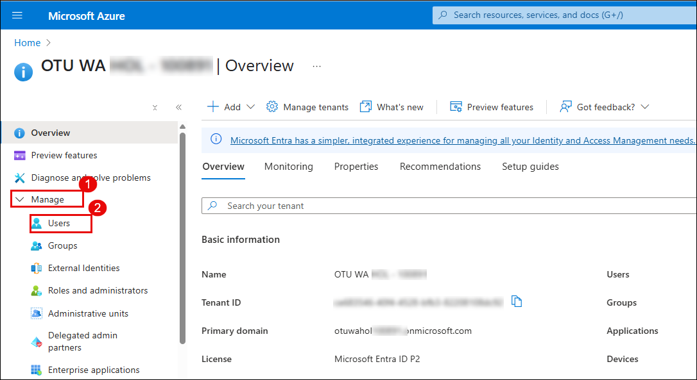
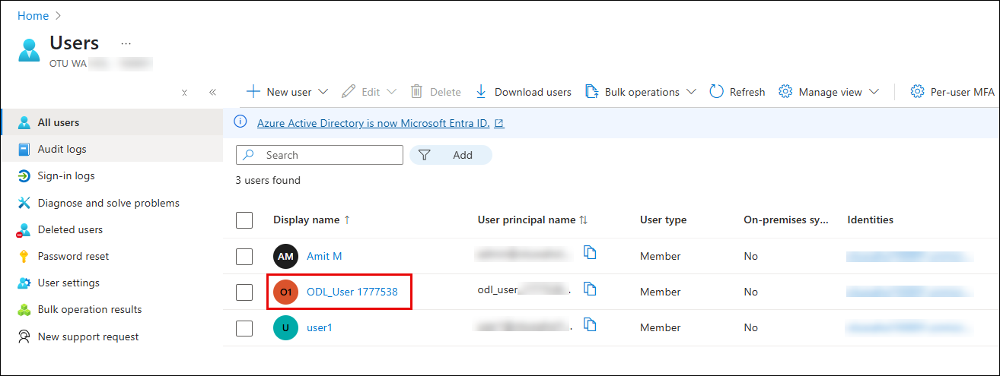
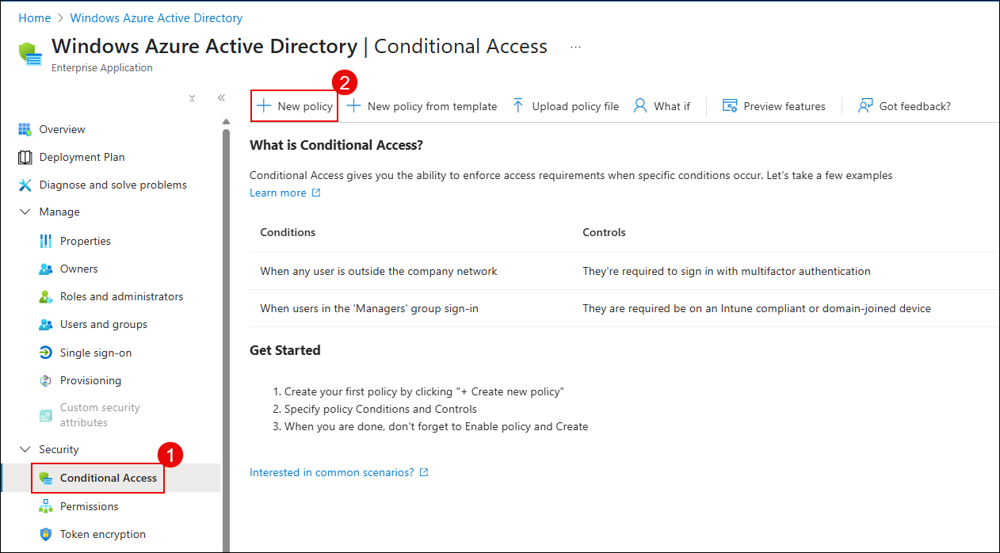
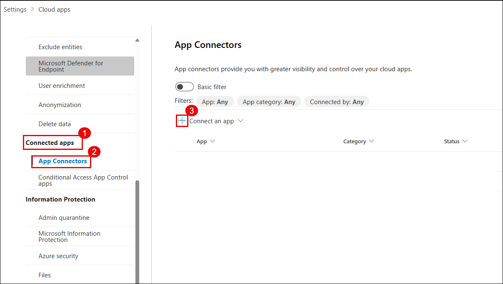
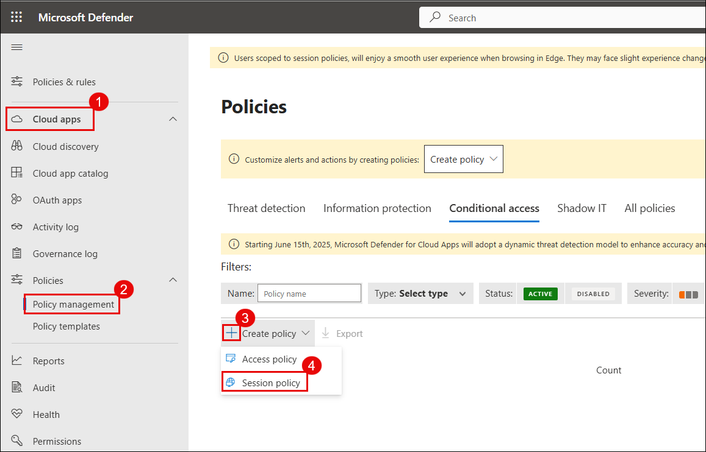
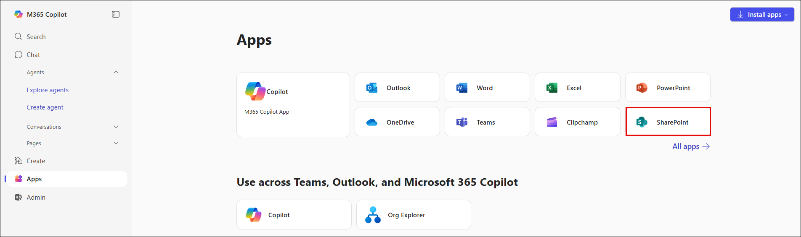
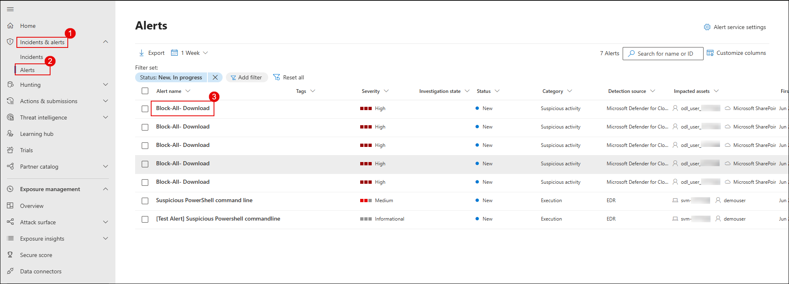
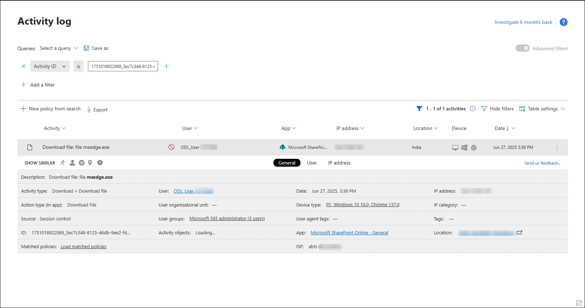

# Exercise 2: Protecting Microsoft 365 SaaS Apps with Microsoft Defender for Cloud Apps

## Overview

In this exercise, you will explore how to secure Microsoft 365 cloud services like SharePoint, OneDrive, and Exchange using Microsoft Defender for Cloud Apps. You'll connect Microsoft 365 as a cloud app, configure real-time session policies, and create custom activity detection rules to detect and block risky behavior.

## Objectives

- Task 1: Connect and Onboard a SaaS App to Microsoft Defender for Cloud Apps  
- Task 2: Configure Session Policies to Monitor and Block Risky Behavior  
- Task 3: Investigate Alerts and Create Custom Detection Policies  

## Task 1: Connect and Onboard a SaaS App to Microsoft Defender for Cloud Apps

## Overview

In this lab, you will connect Microsoft 365 as a SaaS application to Microsoft Defender for Cloud Apps using the native App Connector integration. Once connected, Defender will start ingesting activity logs such as file access, sign-ins, and administrative operations for enhanced visibility and control.

## Objectives

- Task 1: Assign Microsoft 365 license and enable audit logging  
- Task 2: Configure Conditional Access policy for Defender session control  
- Task 3: Enable file monitoring in Microsoft Defender for Cloud Apps  
- Task 4: Connect Microsoft 365 to Microsoft Defender for Cloud Apps

### Assign Microsoft 365 License and Enable Audit Logging

> **Note:** Ensure you're signed in with a Microsoft 365 Global Administrator account.

1. Go to the [Azure Portal](https://portal.azure.com)

2. In the search bar at the top, type **Microsoft Entra ID** and select it.

   

3. In the **Overview** pane, select **Users** under the **Manage** section.

   

4. From the list of users, click on your assigned user (e.g., `ODL_User 1777538`).

   

5. In the user blade, click on **Licenses** from the left pane.

6. Verify that the user has **Microsoft 365 E5 (no Teams)** or equivalent license assigned and marked as **Active**.

   

### Enable Audit Logging in Microsoft Purview

1. Open [https://compliance.microsoft.com](https://compliance.microsoft.com) in a browser.

2. If prompted, click **Switch to the new portal yourself** to access **Microsoft Purview**.
1. Go to [https://compliance.microsoft.com](https://compliance.microsoft.com)  

2. If prompted, click **Switch to the new portal yourself** to enter Microsoft Purview.

   

3. On the Microsoft Purview homepage, select the **Audit** tile.

   

4. If audit logging is not enabled, click on **Start recording user and admin activity**.

> ⚠️ This may take up to a few hours to activate. You can continue the next steps while audit logs begin recording in the background.

> ✅ Once enabled, Microsoft Defender for Cloud Apps can ingest logs to detect user and app behavior in Microsoft 365.

### Configure Conditional Access Policy for Defender Session Control

In this task, you will create a Conditional Access policy to route Microsoft 365 sessions through Microsoft Defender for Cloud Apps. This enables real-time session control such as blocking downloads or inspecting file access.

> **Note:** This policy must be assigned to the user you're testing with (e.g., ODL_User).

1. Go to the [Azure Portal](https://portal.azure.com)

1. In the search bar, type **Microsoft Entra ID** and select it.

1. From the left navigation pane, under **Protect & secure**, click on **Conditional Access**.

   

1. Click **+ New policy** at the top.

   

1. **Name the policy**: `MCAS – M365 Session Control`

1. Under **Assignments > Users**, choose **Select users and groups** and add your lab user (e.g., ODL_User).

   

1. Under **Assignments > Target resources**, select **Cloud apps**, then choose **Office 365**.

   

1. Under **Access controls > Session**, enable:

   - ✅ **Use Conditional Access App Control**
   - From the dropdown, select **Use custom policy**

   

1. Scroll down and under **Enable policy**, toggle to **On**, then click **Create**.

   

> ✅ You’ve now created a Conditional Access policy to route Office 365 sessions through Microsoft Defender for Cloud Apps.

### Enable File Monitoring in Microsoft Defender for Cloud Apps

1. Navigate to the [Microsoft Defender Portal](https://security.microsoft.com)

1. From the left-hand menu, scroll down and click on **Settings**.

1. Under **Settings**, select **Cloud Apps**.

   

1. In the **Cloud Apps** settings page, expand **Information Protection**.

1. Select **Files** from the options.

1. On the right pane, check the box for **Enable file monitoring**.

1. Click **Save** to apply the settings.

   

> ✅ File monitoring is now enabled. Microsoft Defender for Cloud Apps will begin collecting metadata and user activity related to files across supported apps.

### Connect Microsoft 365 to Microsoft Defender for Cloud Apps

1. In the [Microsoft Defender Portal](https://security.microsoft.com), navigate to:  
   **Settings** → **Cloud Apps** → **App Connectors**

   

1. Click on **Connect an app**.

1. In the list of available components, check the following:

   - Microsoft Entra ID Management events  
   - Microsoft Entra ID Sign-in events  
   - Microsoft Entra ID Apps  
   - Microsoft 365 activities  
   - Microsoft 365 files  

   

1. Click **Connect Microsoft 365**.

1. After authentication and connection, you will see a confirmation message:  
   **“Great, Microsoft 365 is connected.”**

   

1. Click **Done** to complete the onboarding.

1. On the **App Connectors** page, verify that Microsoft 365 shows a **Connected** status.

   

> ✅ Microsoft 365 is now fully integrated with Microsoft Defender for Cloud Apps and will begin sending user, file, and app activity logs.

## Task 2: Configure Session Policies to Monitor and Block Risky Behavior

### Create a Session Policy to Block Downloads on Unmanaged Devices

1. Go to the [Microsoft Defender Portal](https://security.microsoft.com)

1. In the left navigation pane, select **Cloud Apps** → **Policy management**

1. Click on **Create policy** and select **Session policy**

   

1. Configure the following fields:

   - **Policy template**: `Block download based on real-time content inspection`  
   - **Policy name**: `Block-All-Download`  
   - **Category**: `DLP`  
   - **Session control type**: `Control file download (with inspection)`

   

1. Scroll down to **Actions**:
   - Choose **Block**  
   - Enable **Send alert as email** and enter your lab email address

   

1. Click **Create** to activate the policy.

> ✅ The session policy is now live. It will block file downloads from Microsoft 365 apps when accessed through unmanaged or non-compliant devices.

> ⚠️ Ensure your Conditional Access policy from Lab 1 is routing sessions through Microsoft Defender for Cloud

### Simulate Risky Behavior and Trigger the Session Policy

> **Note:** Use a browser profile or incognito mode that is not joined to a domain to simulate an unmanaged session.

1. Open a browser and navigate to [https://www.office.com](https://www.office.com)

1. Sign in using your lab user credentials (e.g., `ODL_User`)

   

1. From the left navigation bar, go to **Apps** and click on **SharePoint**

   

1. Under **Frequent sites**, select the **Communication site** or a test site provisioned in your tenant

   

1. In the SharePoint site, go to the **Documents** library

1. Click **Upload** → **Files** and upload a file such as `msedge.exe`

     
   

1. After the file uploads, click on it and select **Download**

   

1. If everything is configured correctly, the download will be blocked and you’ll see:

   > **"Download blocked – Downloading msedge.exe is blocked by your organization’s security policy."**

   

> ✅ This confirms that your session policy is working and successfully blocked risky activity from an unmanaged session.

### Verify the Block Event and Policy Alert

1. Go to the [Microsoft Defender Portal](https://security.microsoft.com)

1. In the left navigation pane, select **Cloud Apps** → **Activity log**

   

1. Use filters to locate your download attempt:
   - **App**: Microsoft SharePoint Online  
   - **Activity type**: Download file  
   - **File name**: `msedge.exe` (or the file you tested with)

   

1. In the portal, navigate to:  
   **Incidents & alerts** → **Alerts**

1. Look for an alert titled `Block-All-Download` or similar.

1. Click the alert to open details and investigate the associated user, device, IP address, and app used.

   

1. From the alert detail pane, click **Open alert page**

   

1. Then click **Investigate in activity log** to view all related session data.

   

> ✅ You have now confirmed that your session policy is active, triggered correctly, and generated an alert in Microsoft Defender for Cloud Apps.

## Task 3: Investigate Alerts and Create Custom Detection Policies

### Investigate Activity Logs and Verify Alerts

1. Go to the [Microsoft Defender Portal](https://security.microsoft.com)

1. From the left-hand menu, select:  
   **Cloud Apps** → **Activity log**

   

1. In the filter bar:

   - Click on **App: Select apps** and choose **Microsoft SharePoint Online**  
   - Set **Activity type** to `Download`  
   - Optionally, filter by **File name** = `msedge.exe` or your test file  

   

1. Review the filtered list of activities to confirm that your simulated risky download appears in the logs.

1. From the left menu, navigate to:  
   **Incidents & alerts** → **Alerts**

1. Confirm that there are no existing alerts for suspicious downloads (or take note of any active alerts that were already triggered).

   

> ✅ This confirms that the activity was recorded and provides a clean baseline before creating a new custom detection policy.

### Create a Custom Activity Detection Policy

1. In the [Microsoft Defender Portal](https://security.microsoft.com), go to:  
   **Cloud Apps** → **Policy management**

1. Click **Create policy** → **Activity policy**

   

1. Fill in the following fields:

   - **Policy template**: *No template*  
   - **Policy name**: `Detect Suspicious File Download – msedge.exe`  
   - **Severity**: `High`  
   - **Category**: `Threat detection`  
   - **Act on**: `Single activity`

   

1. Under **Activity filters**, configure:

   - **Activity type** = `Download file`  
   - **File name** = `msedge.exe`  
   - **App** = `Microsoft SharePoint Online`

1. Click **Edit and preview results** to review sample matches (if available), then click **Save filters**

   

1. Under the **Alerts** section:

   - Enable **Send alert as email**  
   - Enter a valid email address (e.g., your lab email or SOC inbox)  
   - Set **Daily alert limit** to `5` (recommended)

!. Click **Create** to save and activate the policy

   

> ✅ You’ve now created a custom activity policy to detect and alert on suspicious `.exe` file downloads.

### Simulate a Suspicious Download

1. Open a browser and go to [https://www.office.com](https://www.office.com)

1. Sign in with your lab user credentials.

1. Click on **Apps**, then select **SharePoint**

   

1. Under **Frequent sites**, click on your assigned **Communication site**.

   

1. In the **Documents** library:

   - Click **Upload** → **Files**
   - Select and upload the file `msedge.exe` (or a renamed `.exe` file)

     
   

1. Once the file is uploaded, click on it and select **Download**

   

1. This download will trigger the custom policy you configured in Task 2.

> ✅ The action should now be logged in Microsoft Defender for Cloud Apps and will generate an alert according to your policy settings.

### Confirm Alert and Investigate the Incident

1. Open your email inbox associated with the lab user or SOC recipient.

1. Look for an alert email titled similar to:  
   `Alert - Detect Suspicious File Download – msedge.exe`

   

1. In the [Microsoft Defender Portal](https://security.microsoft.com), go to:  
   **Incidents & alerts** → **Alerts**

1. Locate and click on the alert you configured (`Detect Suspicious File Download – msedge.exe`)

   

1. In the alert pane, click **Open alert page**

   

1. On the full alert page, click **Investigate in activity log**

   

1. Review the download event details:

   - User name  
   - File name  
   - App used (e.g., SharePoint Online)  
   - IP address, device, session context  
   - Triggered policy

   

> ✅ You have now confirmed the suspicious activity was detected, logged, and an alert was successfully generated based on your custom policy.

## Review

- You learned how to connect and onboard a SaaS application to Microsoft Defender for Cloud Apps for visibility and control.
- You configured session policies to monitor user activity and block risky behaviors in real time.
- You explored how to investigate alerts and create custom detection policies to enhance threat detection and response.

## Click Next to continue
