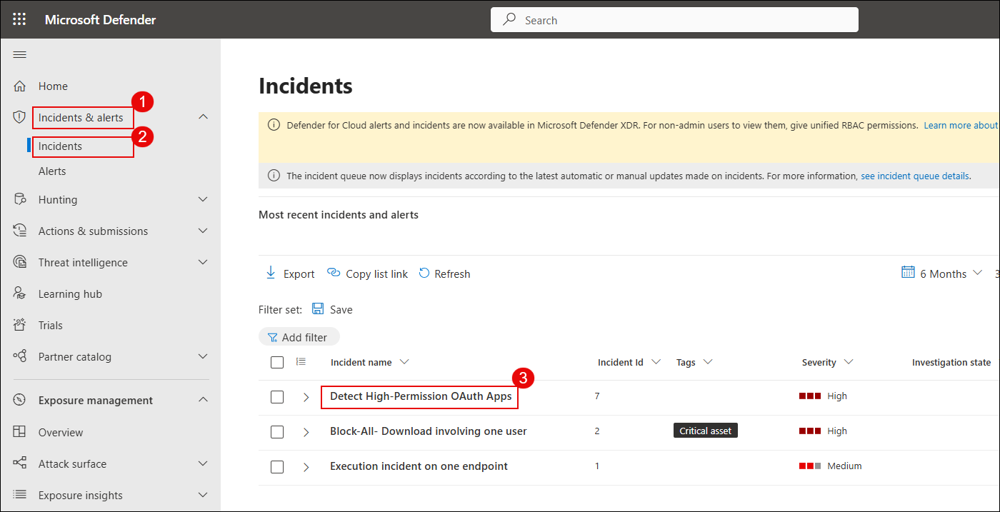
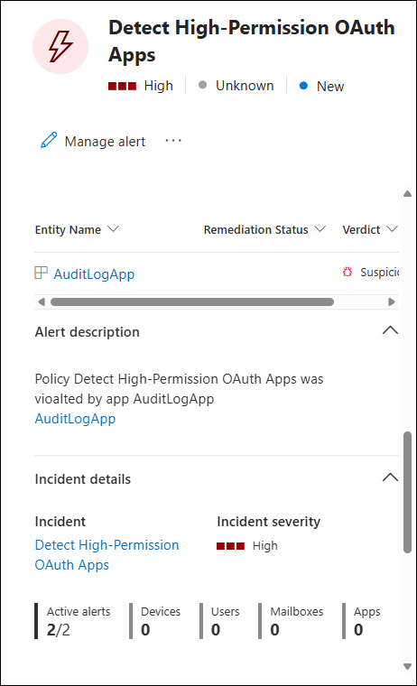

# Exercise 3: Implement App Governance and Risk Detection for OAuth Apps [Read Only]

## Overview

In this exercise, you will enable and configure **App Governance** within Microsoft Defender for Cloud Apps to monitor OAuth-based third-party applications. These apps often request high-privilege delegated permissions that could lead to security or compliance risks if misused.

App Governance helps organizations:

- Detect unverified or overprivileged apps
- Monitor risky app behavior
- Create policies to detect and respond to potential threats

## Objectives

- Task 1: Enable App Governance in Microsoft Defender for Cloud Apps  
- Task 2: Review permission summary of an onboarded OAuth app  
- Task 3: Create a policy to detect high-risk OAuth apps  
- Task 4: Review policy results and incidents

## Task 1: Enable App Governance in Microsoft Defender for Cloud Apps

### Turn On App Governance

1. Go to the [Microsoft Defender Portal](https://security.microsoft.com)

1. Sign in using your administrator account.

1. In the left menu, select **Cloud apps**

1. Click on **App governance** in the sub-menu

1. Under **Service status**, click on **Turn on app governance**

   

> ✅ App Governance is now activated. It will begin evaluating connected OAuth apps and generating insights into their behavior and risk posture.

## Task 2: Review Permission Summary of an Onboarded OAuth App

### Analyze an OAuth App

1. In the [Microsoft Defender Portal](https://security.microsoft.com), go to **Cloud apps**

1. Click on **OAuth apps**

   

> ℹ️ You may be redirected to the new App Governance interface. If so, click on **Go to app governance** to continue.

1. In the App Governance portal, from the top menu, click **Cloud apps**

1. Select **Governance log** from the submenu

   

1. Locate and click on the OAuth app named `AuditLogApp` (or any available sample app)

   

1. Inside the app’s detail pane, click on the **Permissions** tab

1. Review the summary:

   - **Total permissions**: 4  
   - **High privilege permissions**: 3  
   - **Unused permissions**: 0  

   

> ✅ You've now reviewed an OAuth app's access level and identified potentially risky permissions that may require action.

## Task 3: Create a Policy to Detect High-Risk OAuth Apps

### Define and Enable the Detection Policy

1. In the [Microsoft Defender Portal](https://security.microsoft.com), navigate to:  
   **Cloud apps** → **App governance** → **Policies**

1. Click **+ Create policy**

   

1. In the **Create policy** window:

   - **Category**: `Custom`  
   - **Template**: `Custom policy`

1. Click **Next**

   

1. Enter the following:

   - **Policy Name**: `Detect High-Permission OAuth Apps`  
   - **Description**: `Flags apps with high-risk delegated permissions and unverified publishers`  
   - **Severity**: `High`

1. Click **Next**

   

1. When asked **Apply default settings?**, choose `No, I'll customize the policy`

1. Click **Next**

1. For **Scope**, select `All apps`, then click **Next**

   

1. Under **Conditions**, configure the following:

   - **Highly privileged** = `Yes`  
   - **Publisher verified** = `No`
1. Click **Save**

   

1. Leave **Disable app** unchecked (optional)

1. Set **Policy status** = `Active`

1. Review settings and click **Save** to create the policy

   

> ✅ The detection policy is now active and will monitor all onboarded OAuth apps for risky permissions and unverified publishers.

## Task 4: Review Policy Results and Incidents

### Investigate Detected Apps and Alerts

1. In the [Microsoft Defender Portal](https://security.microsoft.com), navigate to:  
   **Cloud apps** → **App governance** → **Governance log**

   

1. Look for apps that are marked as:

   - **Highly privileged** = `Yes`  
   - **Publisher verified** = `No`

1. Click on the app (e.g., `AuditLogApp`) to open the details view

   

1. In the app’s pane, review:

   - **Permissions** tab  
   - **Activity** tab  
   - **Risk indicators** tab

1. Identify if the app has access to sensitive data or services (like mail, calendar, files, etc.)

1. Go to the **Policies** tab under App Governance

1. Confirm the policy `Detect High-Permission OAuth Apps` is listed and shows **Status = Active**

   

1. In the left-hand menu, navigate to:  
   **Incidents & alerts** → **Incidents**

1. Filter or search for incidents related to **OAuth apps**

1. Click into any incident generated by your policy and investigate:

   - What triggered it  
   - Impacted user  
   - App involved  
   - Actions taken or recommended

1. Go to:  
   **App governance** → **Overview** → **View all apps**

1. Sort the list by the **Privilege level** column

     
   

1. Go to **Incidents & alerts** > **Incidents** from the left-hand menu.  
   Look through the list of recent incidents and click on the incident named `Detect High-Permission OAuth Apps`.

   

1. In the incident pane, review the following:
   - **Entity Name** (e.g., `AuditLogApp`)
   - **Remediation status**
   - **Verdict** (e.g., Suspicious)
   - **Incident severity** (should be `High`)
   - **Policy name** that triggered the alert

   

> ✅ You've now confirmed that your detection policy is functioning, and risky OAuth apps are being flagged and investigated as part of your cloud app security posture.

---

## Review

In this exercise, you:

- Enabled App Governance for Microsoft 365  
- Analyzed permissions of onboarded OAuth apps  
- Created and activated a detection policy  
- Validated flagged apps and incidents from policy enforcement

## Congratulations you have successfully completed the lab
