# Exercise 2: Implement App Governance and Risk Detection for OAuth Apps

## Overview

In this exercise, you will enable and configure **App Governance** within Microsoft Defender for Cloud Apps to monitor OAuth-based third-party applications. These apps often request high-privilege delegated permissions that could lead to security or compliance risks if misused.

App Governance helps organizations:

- Detect unverified or overprivileged apps
- Monitor risky app behavior
- Create policies to detect and respond to potential threats

---

## Objectives

- Lab 1: Enable App Governance in Microsoft Defender for Cloud Apps  
- Lab 2: Review permission summary of an onboarded OAuth app  
- Lab 3: Create a policy to detect high-risk OAuth apps  
- Lab 4: Review policy results and incidents

---

## Lab 1: Enable App Governance in Microsoft Defender for Cloud Apps

### Estimated Duration: 5–10 minutes

## Overview

In this lab, you will enable the App Governance feature inside Microsoft Defender for Cloud Apps. This unlocks visibility into OAuth apps granted access to your Microsoft 365 data and helps detect apps with high-risk behavior or permissions.

> 🛡️ Prerequisite: Ensure your Microsoft 365 account has an **E5 license** and **Global Administrator** role.

---

## Task: Turn On App Governance

### Step 1: Open Microsoft Defender Portal

1. Go to the [Microsoft Defender Portal](https://security.microsoft.com)

2. Sign in using your administrator account.

---

### Step 2: Enable App Governance

1. In the left menu, select **Cloud apps**

2. Click on **App governance** in the sub-menu

3. Under **Service status**, click on **Turn on app governance**

   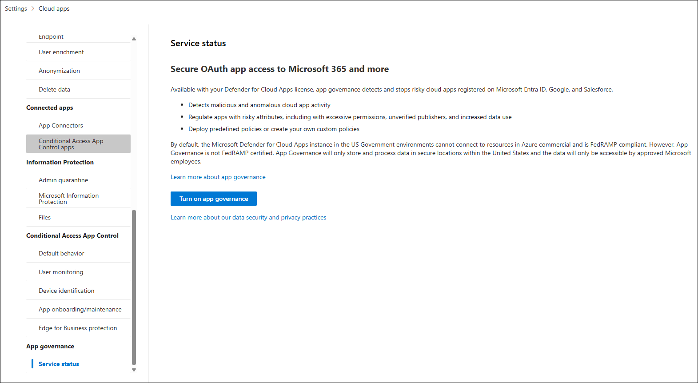

> ✅ App Governance is now activated. It will begin evaluating connected OAuth apps and generating insights into their behavior and risk posture.

---

## Lab 2: Review Permission Summary of an Onboarded OAuth App

### Estimated Duration: 10 minutes

## Overview

In this lab, you will review an onboarded OAuth application's behavior, permissions, and publisher verification status using the App Governance dashboard. This helps identify risky or overly permissive apps.

---

## Task: Analyze an OAuth App

### Step 1: Navigate to OAuth Apps Section

1. In the [Microsoft Defender Portal](https://security.microsoft.com), go to **Cloud apps**

2. Click on **OAuth apps**

   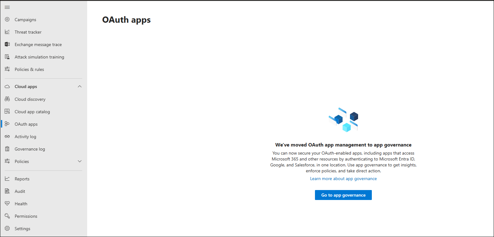

> ℹ️ You may be redirected to the new App Governance interface. If so, click on **Go to app governance** to continue.

---

### Step 2: Open Governance Log

1. In the App Governance portal, from the top menu, click **Cloud apps**

2. Select **Governance log** from the submenu

   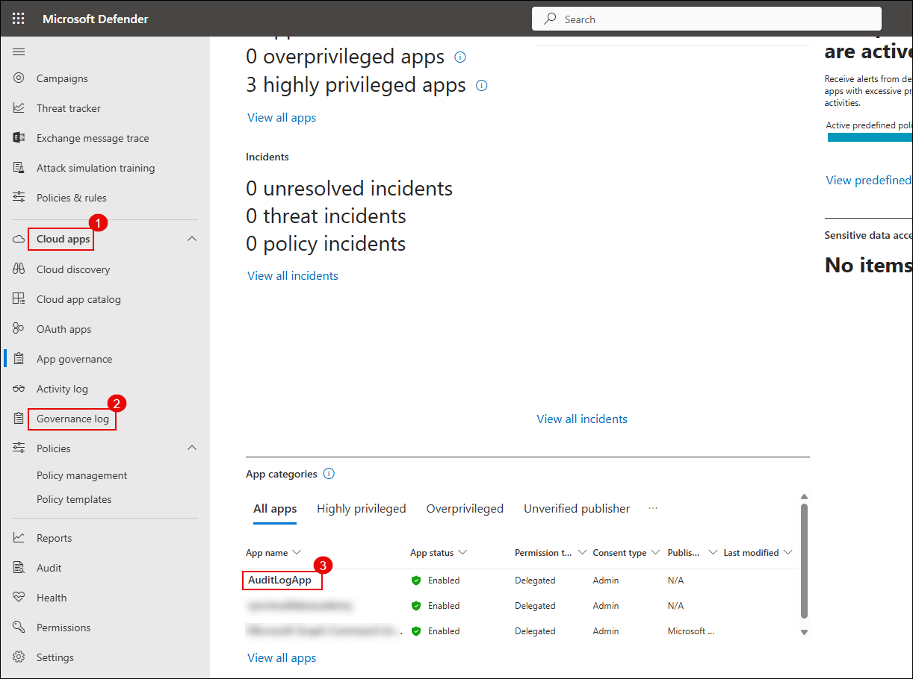

---

### Step 3: Select an Onboarded App

1. Locate and click on the OAuth app named `AuditLogApp` (or any available sample app)

   

---

### Step 4: Review Permissions

1. Inside the app’s detail pane, click on the **Permissions** tab

2. Review the summary:

   - **Total permissions**: 4  
   - **High privilege permissions**: 3  
   - **Unused permissions**: 0  

   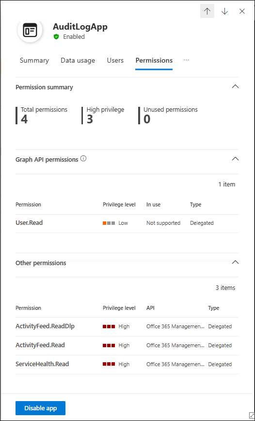

> ✅ You've now reviewed an OAuth app's access level and identified potentially risky permissions that may require action.

---

## Lab 3: Create a Policy to Detect High-Risk OAuth Apps

### Estimated Duration: 20–30 minutes

## Overview

In this lab, you will create a **custom detection policy** in App Governance to flag OAuth apps that:

- Request **highly privileged permissions**  
- Are published by **unverified publishers**

This proactive policy helps reduce your exposure to third-party app risks.

---

## Task: Define and Enable the Detection Policy

### Step 1: Open Policy Configuration

1. In the [Microsoft Defender Portal](https://security.microsoft.com), navigate to:  
   **Cloud apps** → **App governance** → **Policies**

2. Click **+ Create policy**

   

---

### Step 2: Configure Basic Settings

1. In the **Create policy** window:

   - **Category**: `Custom`  
   - **Template**: `Custom policy`

2. Click **Next**

   

---

### Step 3: Define Policy Details

1. Enter the following:

   - **Policy Name**: `Detect High-Permission OAuth Apps`  
   - **Description**: `Flags apps with high-risk delegated permissions and unverified publishers`  
   - **Severity**: `High`

2. Click **Next**

   

---

### Step 4: Set Policy Scope

1. When asked **Apply default settings?**, choose `No, I'll customize the policy`

2. Click **Next**

3. For **Scope**, select `All apps`, then click **Next**

   

---

### Step 5: Add Conditions

1. Under **Conditions**, configure the following:

   - **Highly privileged** = `Yes`  
   - **Publisher verified** = `No`

2. Click **Save**

   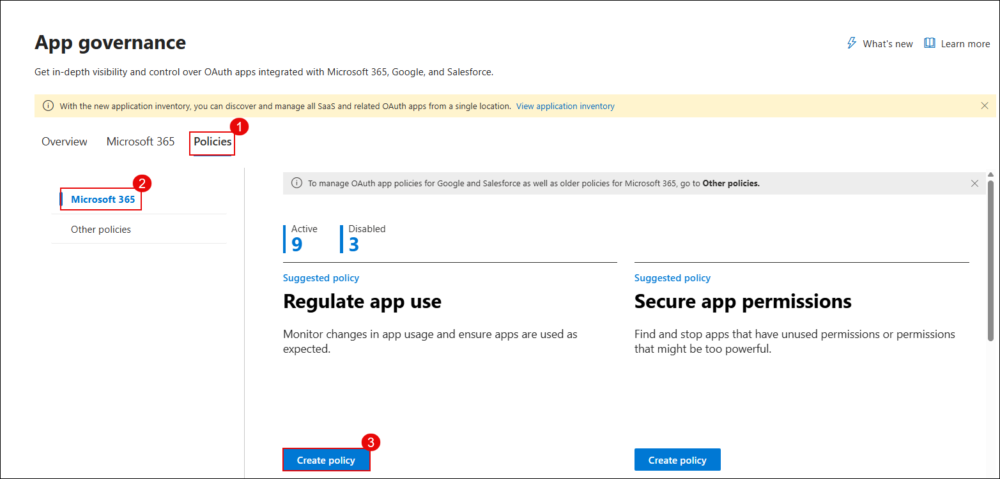

---

### Step 6: Finalize and Activate

1. Leave **Disable app** unchecked (optional)

2. Set **Policy status** = `Active`

3. Review settings and click **Save** to create the policy

   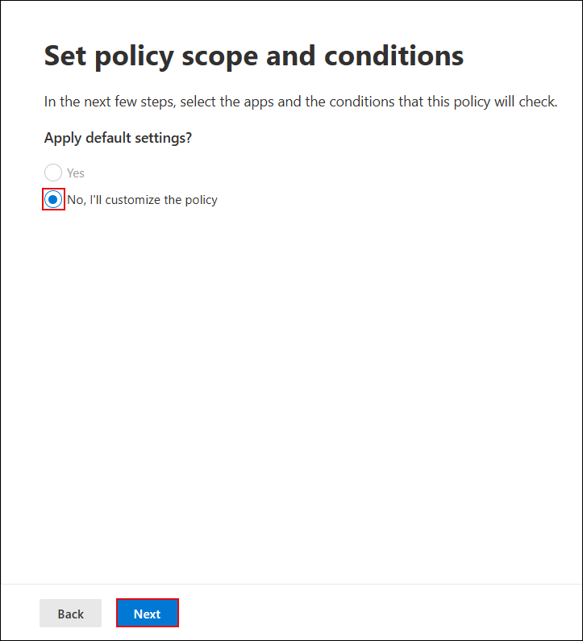

> ✅ The detection policy is now active and will monitor all onboarded OAuth apps for risky permissions and unverified publishers.

---

## Lab 4: Review Policy Results and Incidents

### Estimated Duration: 10–15 minutes

## Overview

In this final lab, you will validate the effectiveness of your App Governance policy by reviewing flagged apps and associated incidents. This helps confirm that high-risk OAuth apps are being detected and logged for response.

---

## Task: Investigate Detected Apps and Alerts

### Step 1: Open the Governance Log

1. In the [Microsoft Defender Portal](https://security.microsoft.com), navigate to:  
   **Cloud apps** → **App governance** → **Governance log**

   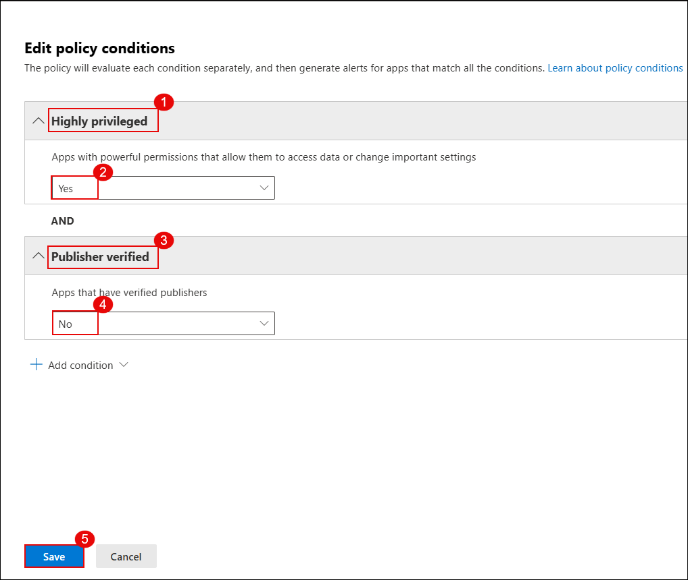

---

### Step 2: Review Flagged App Entries

1. Look for apps that are marked as:

   - **Highly privileged** = `Yes`  
   - **Publisher verified** = `No`

2. Click on the app (e.g., `AuditLogApp`) to open the details view

   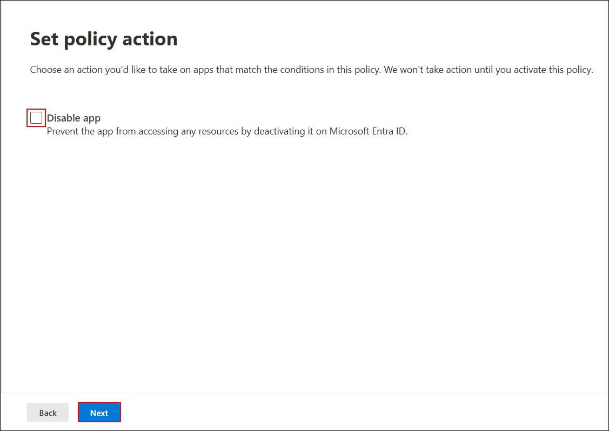

---

### Step 3: Analyze App Behavior

1. In the app’s pane, review:

   - **Permissions** tab  
   - **Activity** tab  
   - **Risk indicators** tab

2. Identify if the app has access to sensitive data or services (like mail, calendar, files, etc.)

---

### Step 4: Confirm Policy and Incident Visibility

1. Go to the **Policies** tab under App Governance

2. Confirm the policy `Detect High-Permission OAuth Apps` is listed and shows **Status = Active**

   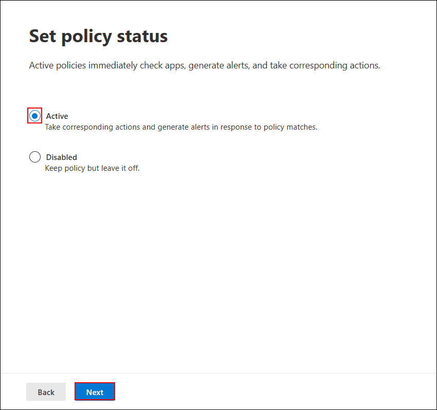

---

### Step 5: View Incidents in Defender

1. In the left-hand menu, navigate to:  
   **Incidents & alerts** → **Incidents**

2. Filter or search for incidents related to **OAuth apps**

3. Click into any incident generated by your policy and investigate:

   - What triggered it  
   - Impacted user  
   - App involved  
   - Actions taken or recommended

---

### Step 6: Explore All Apps by Privilege

1. Go to:  
   **App governance** → **Overview** → **View all apps**

2. Sort the list by the **Privilege level** column

   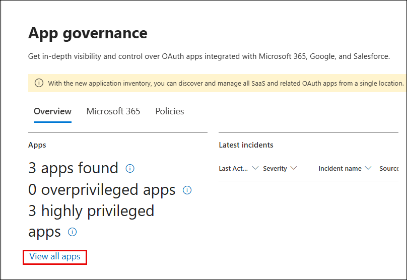  
   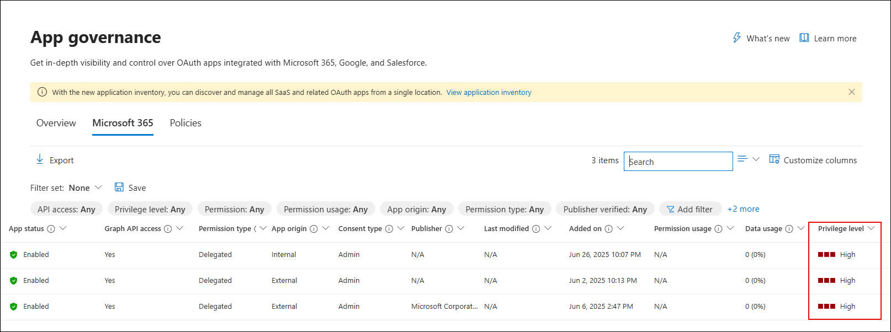

> ✅ You've now confirmed that your detection policy is functioning, and risky OAuth apps are being flagged and investigated as part of your cloud app security posture.

---

## Review

In this exercise, you:

- Enabled App Governance for Microsoft 365  
- Analyzed permissions of onboarded OAuth apps  
- Created and activated a detection policy  
- Validated flagged apps and incidents from policy enforcement

