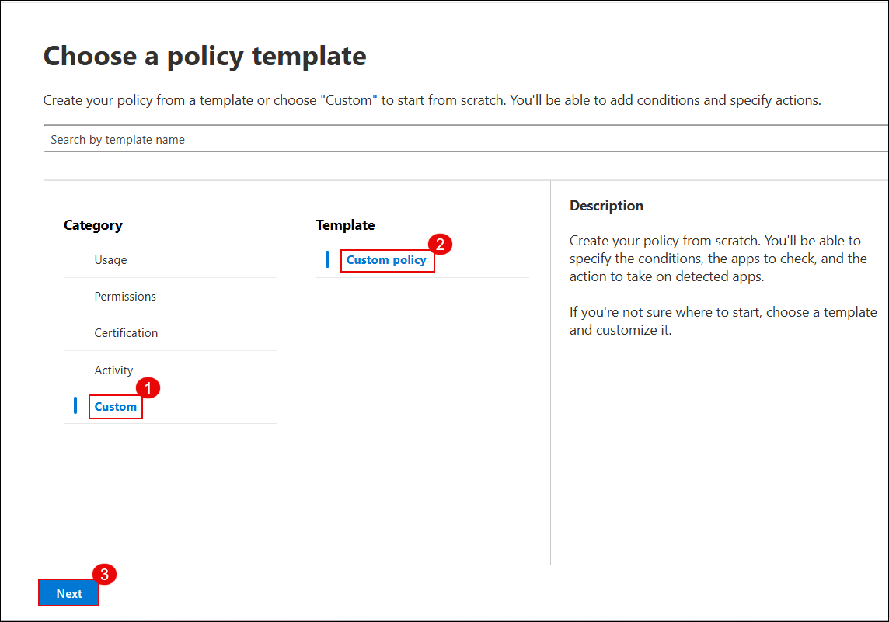
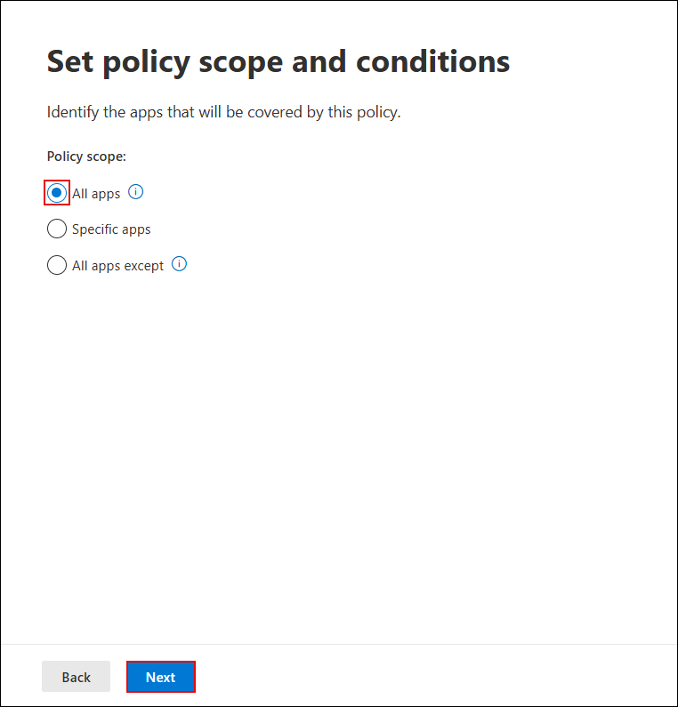

# Exercise 3 – Implement App Governance and Risk Detection for OAuth Apps [Read Only]

### Estimated Duration: 30–40 minutes

## Overview

In this lab, you will enable **App Governance** within Microsoft Defender for Cloud Apps and implement a detection policy that identifies OAuth apps with high-risk permissions. This helps security teams monitor third-party apps granted access to Microsoft 365 data and take proactive steps against potential threats from overprivileged or unverified applications.

App Governance extends Microsoft Defender for Cloud Apps by giving insights into OAuth app behaviors, permission levels, publisher verification status, and risk scores.

---

## Lab Objectives

You will complete the following tasks:

- Task 1: Enable App Governance in Microsoft Defender for Cloud Apps  
- Task 2: Review permission summary of an onboarded app  
- Task 3: Create a policy to detect highly privileged OAuth apps  
- Task 4: Review policy results and incidents

---

## Prerequisites

- Microsoft 365 E5 license with Microsoft Defender for Cloud Apps enabled  
- At least one OAuth app registered and granted delegated permissions (e.g., AuditLogApp)  
- Admin role in Microsoft Entra ID (Azure AD)

## Task 1: Enable App Governance in Microsoft Defender for Cloud Apps

1. Go to the **Microsoft 365 Defender Portal**
2. Navigate to **Cloud apps** > **App governance** > **Service status**
3. Click on the **Turn on app governance** button

> **Note:** App Governance helps detect apps with excessive permissions, unverified publishers, and abnormal data access.

---

## Task 2: Review OAuth App Permission Summary

1. In the Microsoft 365 Defender Portal, go to **Cloud apps** > **OAuth apps**
2. Click on **Go to app governance** to open the new App Governance experience

3. Navigate to **Cloud apps** > **Governance log**
4. Select the app **AuditLogApp** from the list of apps

5. Click on the **Permissions** tab to view a summary of the app’s access level:
   - 4 total permissions
   - 3 high privilege
   - 0 unused

---

# Task 3 – Create a Policy to Detect Highly Privileged OAuth Apps

### Estimated Duration: 20–30 minutes

## Overview

In this task, you will create a custom App Governance policy to detect OAuth apps that request highly privileged permissions and are published by unverified publishers.

---

## Steps

### Step 1: Choose a Policy Template

1. Go to the **App Governance** portal and select **Policies**.
2. Click **+ Create policy**.
3. Under **Category**, select **Custom**.
4. Choose **Custom policy** from the template list.
5. Click **Next**.

---

### Step 2: Name and Describe the Policy

1. Enter the policy name: `Detect High-Permission OAuth Apps`
2. Add the description:  
   `This policy flags apps with delegated permissions classified as high-risk, such as access to user data, mail, files, etc.`
3. Set the **Severity** to `High`.
4. Click **Next**.

---

### Step 3: Set Policy Scope and Conditions – Customize

1. When asked "Apply default settings?", select  
   `No, I'll customize the policy`
2. Click **Next**.

---

### Step 4: Define Policy Scope

1. Under **Policy scope**, select `All apps`.
2. Click **Next**.

---

### Step 5: Edit Policy Conditions

1. Under **Highly privileged**, set value to `Yes`.
2. Add another condition: **Publisher verified** = `No`.
3. Click **Save**.

---

### Step 6: Set Policy Action

1. Leave the **Disable app** option unchecked (optional).
2. Click **Next**.

---

# Task 1 – Enable App Governance in Microsoft Defender for Cloud Apps

### Estimated Duration: 5–10 minutes

In this task, you will enable the App Governance feature within Microsoft Defender for Cloud Apps. This feature extends visibility into OAuth apps that have been granted access to your Microsoft 365 data.

---

### Step 1: Open Microsoft 365 Defender Portal

1. Navigate to the [Microsoft 365 Defender Portal](https://security.microsoft.com).

> **Note:** Ensure you are signed in with an account that has the required Microsoft 365 E5 license and admin permissions.

---

### Step 2: Open App Governance Settings

1. In the left navigation pane, click on **Cloud apps**.
2. Select **App governance**.
3. Under **Service status**, click on **Turn on app governance**.

> 🛡️ *This step enables deep visibility into OAuth apps accessing Microsoft 365 data, including risk detection for high-privilege apps.*

---

# Task 2 – Review OAuth App Permission Summary

### Estimated Duration: 10 minutes

In this task, you will review the permissions and risk status of an onboarded OAuth app using the App Governance dashboard.

---

### Step 1: Navigate to OAuth Apps

1. In the [Microsoft 365 Defender Portal](https://security.microsoft.com), go to **Cloud apps** in the left menu.
2. Click on **OAuth apps**.

> **Note:** You will see a message stating that OAuth app management has moved. Click on **Go to app governance** to continue.

---

### Step 2: Open Governance Log

1. In the App Governance interface, click on **Cloud apps** again (in the new view).
2. Select **Governance log** from the options.

---

### Step 3: Select the App to Review

1. From the list of onboarded apps, find and click on **AuditLogApp**.

---

### Step 4: View App Permissions Summary

1. In the app details pane, click on the **Permissions** tab.
2. Review the following:

   - **Total permissions**: 4  
   - **High privilege permissions**: 3  
   - **Unused permissions**: 0  

> ℹ️ *High privilege permissions often include access to user profile data, mail, and files. These apps should be monitored closely.*

---

# Task 3 – Create a Detection Policy for Highly Privileged OAuth Apps

### Estimated Duration: 20–30 minutes

In this task, you will create a custom detection policy in App Governance to identify OAuth apps that request high-risk permissions and are published by unverified publishers.

---

### Step 1: Go to the Policies Section

1. In the [Microsoft 365 Defender Portal](https://security.microsoft.com), go to **Cloud apps**.
2. Click on **App governance**.
3. Select the **Policies** tab from the top menu.
4. Click **+ Create policy**.

---

### Step 2: Choose Policy Template

1. In the **Create policy** window:
   - Under **Category**, select **Custom**
   - Select the **Custom policy** template
2. Click **Next**.

---

### Step 3: Configure Basic Details

1. Provide the following:
   - **Policy Name**: `Detect High-Permission OAuth Apps`
   - **Description**: `This policy flags apps with delegated permissions classified as high-risk, such as access to user data, mail, files, etc.`
2. Set **Severity** to `High`.
3. Click **Next**.

---

### Step 4: Customize Policy Settings

1. When prompted **Apply default settings?**, select  
   `No, I'll customize the policy`.
2. Click **Next**.

---

### Step 5: Define Policy Scope

1. Under **Policy Scope**, ensure that **All apps** is selected.
2. Click **Next**.

---

### Step 6: Add Detection Conditions

1. Under the **Conditions** section:
   - Set **Highly privileged** to `Yes`
   - Add a second condition: **Publisher verified** = `No`
2. Click **Save**.

---

### Step 7: Configure Policy Action

1. Leave the **Disable app** option unchecked (optional).
2. Click **Next**.

---

### Step 8: Review and Activate

1. Set **Policy status** to `Active`.
2. Review all configuration settings.
3. Click **Save** to create and activate the policy.

---

### Step 9: Confirm Policy Creation

1. You should now see the policy `Detect High-Permission OAuth Apps` listed under **Policies**.
2. Ensure the status is set to **Active**.

> ✅ *Your policy will now continuously evaluate onboarded apps for high-risk behavior based on the conditions you configured.*

---
# Task 4 – Review Policy Results and Incidents

### Estimated Duration: 10–15 minutes

In this task, you will verify if any OAuth apps have triggered the detection policy you created, and analyze incidents logged in App Governance.

---

### Step 1: Open the Governance Log

1. In the [Microsoft 365 Defender Portal](https://security.microsoft.com), go to **Cloud apps**.
2. Click on **App governance**.
3. Select **Governance log** from the left pane.

---

### Step 2: Review Flagged App Entries

1. Look for any apps marked as **Highly privileged** or **Unverified**.
2. Click on the app entry (e.g., `AuditLogApp`) to open its details.

> ℹ️ *The app must meet both conditions: high privilege + unverified publisher for it to be flagged.*

---

### Step 3: Analyze App Behavior

1. In the app details pane, review tabs like:
   - **Permissions**
   - **Activity**
   - **Risk indicators**
2. Use this information to understand the app’s behavior and data access pattern.

---

### Step 4: Confirm Policy Visibility

1. Go to the **Policies** tab inside **App governance**.
2. Confirm that the policy `Detect High-Permission OAuth Apps` is **Active**.

---

### Step 5: Check Incidents in Defender Portal

1. In the left pane, go to **Microsoft 365 Defender** > **Incidents**.
2. Look for incidents linked to **OAuth apps** flagged by your detection policy.

> ⏱️ *It may take up to 30 minutes for new incidents to appear after a policy is created.*

---

### Step 6: Explore Apps and Risk Level

1. Go to **App governance** > **Overview**
2. Under **Apps**, click on **View all apps**
3. Sort or filter apps by the `Privilege level` column to spot risky apps.

  

---

### Additional Notes

- **App Governance** works across Microsoft 365, Google Workspace, and Salesforce OAuth apps.
- You can **integrate with Microsoft Sentinel** to stream incident alerts from App Governance.
- Apps like `AuditLogApp` with permissions such as `ActivityFeed.Read` or `ServiceHealth.Read` are considered **high privilege**.

---

> ✅ *You have now completed the full lab and verified the detection policy is actively monitoring OAuth apps in your environment.*

---

