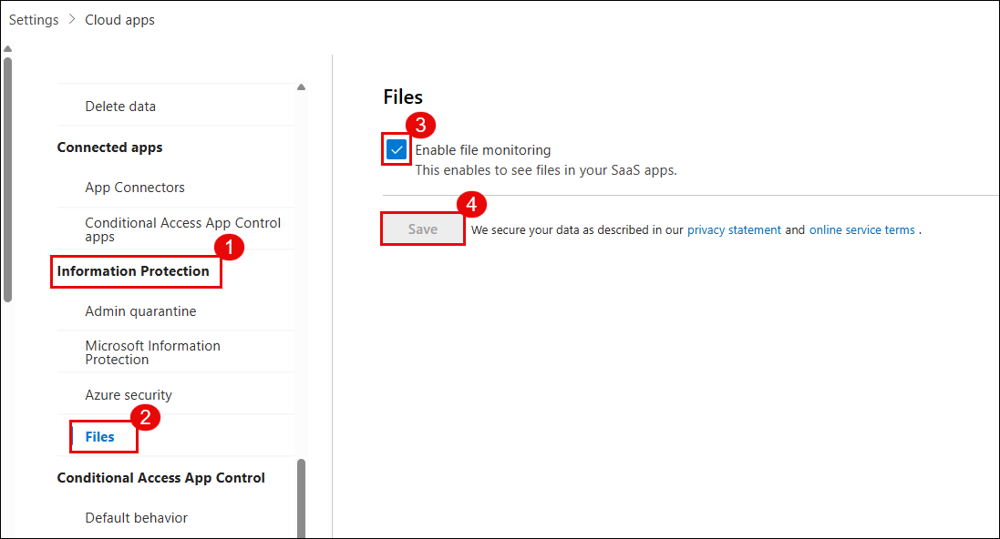
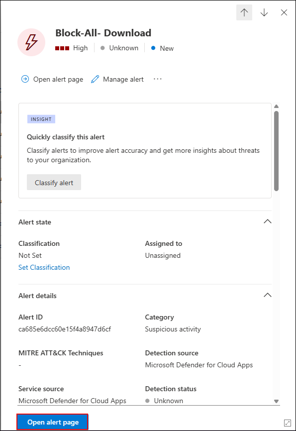

# Exercise 2: Protecting Microsoft 365 SaaS Apps with Microsoft Defender for Cloud Apps

## Overview

In this exercise, you will explore how to secure Microsoft 365 cloud services like SharePoint, OneDrive, and Exchange using Microsoft Defender for Cloud Apps. You'll connect Microsoft 365 as a cloud app, configure real-time session policies, and create custom activity detection rules to detect and block risky behavior.

## Objectives

- Task 1: Connect and Onboard a SaaS App to Microsoft Defender for Cloud Apps  
- Task 2: Configure Session Policies to Monitor and Block Risky Behavior  
- Task 3: Investigate Alerts and Create Custom Detection Policies  

## Task 1: Connect and Onboard a SaaS App to Microsoft Defender for Cloud Apps

1. Go to the [Azure Portal](https://portal.azure.com).

1. In the search bar, type **Microsoft Entra ID** and select it.

   

1. In the **Overview** pane, select **Users** under the **Manage** section.
  
   

1. From the list of users, click on your assigned user (ODL_User******).
  
   

1. In the user blade, click on **Licenses** and ensure **Microsoft 365 E5 (no Teams)** or an equivalent license is assigned and active.
  
   

1. Open [https://compliance.microsoft.com](https://compliance.microsoft.com) in the browser.

1. If prompted, click **Switch to the new portal yourself** to access Microsoft Purview.
  
   

1. On the Microsoft Purview homepage, select the **Audit** tile.
  
   

1. If audit logging is not enabled, click **Start recording user and admin activity**.

   > Note: This may take a few hours to activate. You may proceed with the rest of the exercise while it initializes.

1. Go back to the [Azure Portal](https://portal.azure.com), search for **Windows Azure Active Directory**, and select it.
  
    

1. From the left navigation, select **Conditional Access** and Click on **+ New policy**.
  
    

1. Name the policy: MCAS – M365 Session Control.

1. Under **Assignments > Users**, choose **Select users and groups** and add your lab user.
  
    

1. Under **Assignments > Target resources**, choose **Cloud apps** → **Office 365**.
  
    

    > **Note:** If **Windows Azure Active Directory** is already listed under **Select resources**, click on it and then add **Office 365** to ensure both applications are targeted by the Conditional Access policy.

1. Under **Access controls > Session**, enable **Use Conditional Access App Control**, and select **Use custom policy**.
  
    

1. Scroll down, toggle **Enable policy** to **On**, and click **Create**.
  
    

1. Open [Microsoft Defender Portal](https://security.microsoft.com) and select **Settings** from the left menu.

1. Under **Settings**, select **Cloud Apps**.
  
    

1. Expand **Information Protection** and select **Files**.

1. Enable the checkbox for **Enable file monitoring**, then click **Save**.
  
    

1. Navigate to **Settings** → **Cloud Apps** → **App Connectors**.
  
    

1. Click **Connect an app**, and select **Microsoft 365** from the list.

    

1. In the configuration panel, select the following event types:

    - Microsoft Entra ID Management events  
    - Microsoft Entra ID Sign-in events  
    - Microsoft Entra ID Apps  
    - Microsoft 365 activities  
    - Microsoft 365 files  

    

1. Once selected, the app will appear in the list. Select the checkbox next to **Microsoft 365** and click **Connect Microsoft Azure instance**.

    

1. Click **Connect Microsoft 365** and complete the authentication.

1. After successful connection, you will see the confirmation message:  
    **“Great, Microsoft 365 is connected.”**
 
    

1. Click **Done** to complete onboarding.

1. On the **App Connectors** page, verify that Microsoft 365 shows a **Connected** status.
  
    

   > Note: It may take up to 30–60 minutes for the connection status to update.

1. In the [Microsoft Defender Portal](https://security.microsoft.com), go to **Settings** → **Cloud Apps**.

   

1. Under **Connected apps**, select **Conditional Access App Control apps**.

1. Locate and click the ellipsis (**⋮**) next to **Microsoft SharePoint Online – General**, then choose **View settings in Microsoft Entra ID**.

   

1. In the **Enterprise applications** blade, click **Microsoft Graph Command Line Tools**.

   

1. On the overview page, under **3. Conditional Access**, click **Create a policy**.

   

1. Click **+ New policy** to define a custom access rule for the application.

   

> **Note:** After completing this configuration, go back and repeat steps **13–16** from Task 1 to ensure your Conditional Access App Control policy is correctly applied to **Microsoft Graph Command Line Tools** as well.

> **Congratulations** on completing the task! Now, it's time to validate it. Here are the steps:
> - Hit the Validate button for the corresponding task. If you receive a success message, you can proceed to the next task. 
> - If not, carefully read the error message and retry the step, following the instructions in the lab guide.
> - If you need any assistance, please contact us at cloudlabs-support@spektrasystems.com. We are available 24/7 to help you out.
<validation step="1bbaab69-9291-4c6b-bd0c-7c019d729d2f" />

## Task 2: Configure Session Policies to Monitor and Block Risky Behavior

1. In the [Microsoft Defender Portal](https://security.microsoft.com), go to **Cloud Apps** → **Policy management**.

1. Click **Create policy** → **Session policy**.
  
   

1. Configure the policy settings:
   - **Policy template**: No template
   - **Policy name**: Block-All-Download
   - **Policy severity**: Choose high (red)
   - **Category**: Threat detection
   - **Session control type**: Control file download (with inspection)
   - **Filters**:  
     - Device tag does not equal → Intune compliant, Microsoft Entra Hybrid joined  
     - App equals → Microsoft SharePoint Online

   

1. Scroll to **Files matching all of the following** and configure the following:
   - Filter by **Extension** → exe OR apk
   - Under **Actions**, select **Block**

   

1. Under **Alerts**, enable **Send alert as email**, and enter the lab user email.

1. Click **Create** to save and activate the policy.

   

   > Note: Ensure your Conditional Access policy is routing sessions through Microsoft Defender for Cloud.

1. Right-click the **Microsoft Edge** shortcut on the **Desktop**, select **Send to (2)** → **Documents (3)** to send a copy of the shortcut to the Documents folder.

   

1. Open an incognito browser and go to [https://www.office.com](https://www.office.com).

1. Sign in using your lab credentials.
  
   

1. From the left pane, go to **Apps** → **SharePoint**.
  
   

1. Select the **Communication site** under **Frequent sites**.
  
   

   > **Note**: If no default Communication site is visible, follow these steps to create one:

   > Click the **+ (Create)** icon.

   > Select **Site**.

   

   > Choose **Communication site**.

   > Click **Standard communication (template)** and then select **Use template**.

   > Give the site any name.

   > Leave the site address as default and click **Next**.

   > Choose the language as **English**, then click **Create site**.

1. Go to the **Documents** library and upload msedge.exe via **Upload** → **Files**.
  
    
  
    

> **Note**: If msedge.exe is not available in the **Documents** folder, navigate to C:\Program Files (x86)\Microsoft\Edge\Application, locate msedge (the executable file), and upload it from there.

1. After uploading, click the file and select **Download**.
  
    

1. The download should be blocked with a message:  
    **"Download blocked – Downloading msedge.exe is blocked by your organization’s security policy."**
  
    

## Task 3: Investigate Alerts and Create Custom Detection Policies

1. In the [Microsoft Defender Portal](https://security.microsoft.com), go to **Cloud Apps** → **Activity log**.
  
   

1. Filter for:

   - App: Microsoft SharePoint Online  
   - Activity type: Download file  
   - File name: msedge.exe

   

1. Go to **Incidents & alerts** → **Alerts**, and look for Block-All-Download.

1. Click the alert, then select **Open alert page**.
   
   

   

1. Click **Investigate in activity log**.
 
   

1. Go to **Cloud Apps** → **Policy management**, and click **Create policy** → **Activity policy**.

   

1. Configure the following:

   - Policy name: Detect Suspicious File Download – msedge.exe  
   - Severity: High  
   - Category: Threat detection  
   - Act on: Single activity  
   - Activity type: Download file  
   - File name: msedge.exe  
   - App: Microsoft SharePoint Online
   
   

1. Click **Edit and preview results**, review matches, then click **Save filters**.

   

1. Under **Alerts**, enable **Send alert as email**, add a valid address, set daily alert limit to 5.

10. Click **Create** to save and activate the policy.

    

12. Simulate a download again from [https://www.office.com](https://www.office.com) by logging in, opening SharePoint, and downloading msedge.exe.
    
    

    

    

1. Open your email inbox and locate the alert email titled:  
    Alert - Detect Suspicious File Download – msedge.exe
   
    

1. In the portal, go to **Incidents & alerts** → **Alerts**, and open the custom alert.
   
    

1. Click **Open alert page** → **Investigate in activity log**.
   
    

    

1. Review the event details:

    - User name  
    - File name  
    - App used  
    - IP address  
    - Device info  
    - Triggered policy
   
    

## Review

- You connected and onboarded Microsoft 365 into Microsoft Defender for Cloud Apps.  
- You configured session policies to monitor user activity and block downloads from unmanaged devices.  
- You created a custom detection policy to alert on suspicious activity and verified it through simulated actions.

## Click Next to continue
