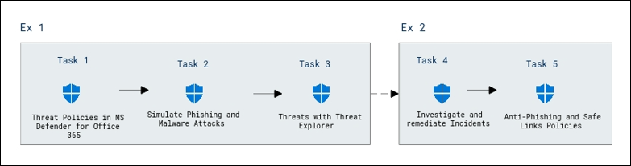
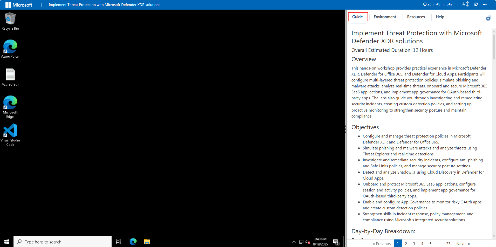
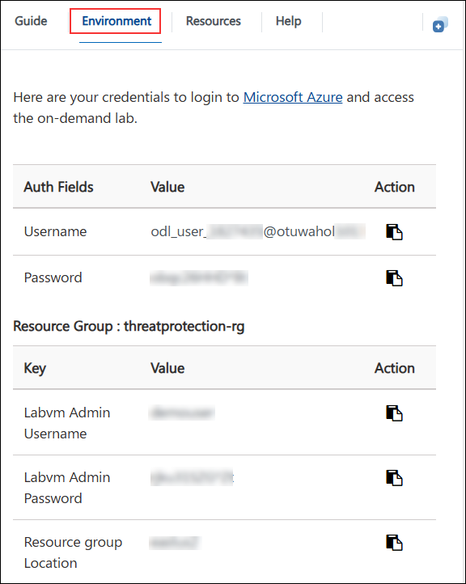
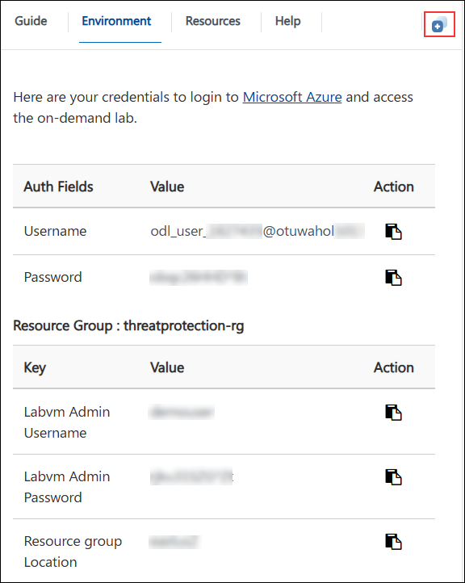
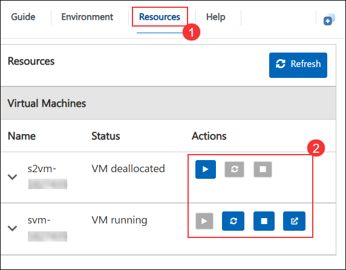
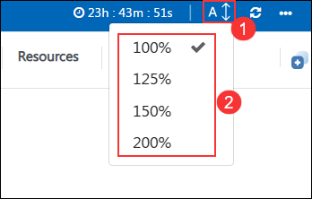

# Implement Threat Protection with Microsoft Defender XDR solutions - Day 01

### Overall Estimated Duration: 4 Hours

## Overview

In this lab, you will explore how to enhance organizational security using Microsoft Defender for Office 365. You’ll configure threat protection policies, simulate phishing and malware attacks with the Attack Simulator, and analyze threats using Threat Explorer and real-time detections. The lab also covers investigating and remediating incidents in Microsoft Defender XDR, configuring anti-phishing and Safe Links policies, and implementing measures to monitor and maintain a strong security posture across Office 365.

## Objectives

- Configure Threat Policies in Microsoft Defender for Office 365 

- Simulate Phishing and Malware Attacks Using Attack Simulator 

- Analyze Threats with Threat Explorer and Real-Time Detections 

- Investigate and remediate Incidents in Microsoft Defender XDR 

- Configure Anti-Phishing and Safe Links Policies 

## Architecture Diagram

 

# Getting Started with the Lab
 
Welcome to your Securing Collaboration with Microsoft Defender Solutions workshop! We've prepared a seamless environment for you to familiarize yourself with the Microsoft security operations analyst, you monitor, identify, investigate, and respond to threats in multi-cloud environments and related Microsoft services. Let's begin by making the most of this experience:
 
## Accessing Your Lab Environment
 
Once you're ready to dive in, your virtual machine and lab guide will be right at your fingertips within your web browser.
 

### Virtual Machine & Lab Guide
 
Your virtual machine is your workhorse throughout the workshop. The lab guide is your roadmap to success.
 
## Exploring Your Lab Resources
 
To get a better understanding of your lab resources and credentials, navigate to the **Environment Details** tab.
 

 
## Utilizing the Split Window Feature
 
For convenience, you can open the lab guide in a separate window by selecting the **Split Window** button from the Top right corner.
 

 
## Managing Your Virtual Machine
 
On the **Resources (1)** tab, you can manage your virtual machines. Under the **Actions (2)** column, use the buttons to start, stop, restart, or open your VM as needed.  
 

## Lab Guide Zoom In/Zoom Out
 
Click the **A↕ icon (1)** next to the timer to adjust the zoom level for the environment page. From the drop-down menu, select the desired **percentage (2)**.

## Let's Get Started with Azure Portal
 
1. On your virtual machine, click on the Azure Portal icon as shown below:
 
    

2. You'll see the **Sign into Microsoft Azure** tab. Here, enter your credentials:
 
   - **Email/Username:** <inject key="AzureAdUserEmail"></inject>
 
     
 
3. Next, provide your password:
 
   - **Password:** <inject key="AzureAdUserPassword"></inject>
 
     

1. If you see the pop-up Stay Signed in?, select No.

   > **NOTE**: If prompted with MFA, and Ask Later option is not available please follow the steps highlighted under - [Steps to Proceed with MFA Setup if Ask Later Option is Not Visible](#steps-to-proceed-with-mfa-setup-if-ask-later-option-is-not-visible)

1. If you see the pop-up **You have free Azure Advisor recommendations!**, close the window to continue the lab.

1. If a Welcome to **Microsoft Azure** popup window appears, select **Maybe Later** to skip the tour.

## Steps to Proceed with MFA Setup if Ask Later Option is Not Visible

   > **Note:** Continue with the exercises if MFA is already enabled or the option is unavailable.

1. At the **"More information required"** prompt, select **Next**.

1. On the **"Keep your account secure"** page, select **Next** twice.

1. **Note:** If you don’t have the Microsoft Authenticator app installed on your mobile device:

   - Open **Google Play Store** (Android) or **App Store** (iOS).
   - Search for **Microsoft Authenticator** and tap **Install**.
   - Open the **Microsoft Authenticator** app, select **Add account**, then choose **Work or school account**.

1. A **QR code** will be displayed on your computer screen.

1. In the Authenticator app, select **Scan a QR code** and scan the code displayed on your screen.

1. After scanning, click **Next** to proceed.

1. On your phone, enter the number shown on your computer screen in the Authenticator app and select **Next**.
       
1. If prompted to stay signed in, you can click **No**.

1. If a **Welcome to Microsoft Azure** popup window appears, click **Cancel** to skip the tour.

1. Now, click on the **Next** from the lower right corner to move to the next page.
   
### Support Contact
The CloudLabs support team is available 24/7, 365 days a year, via email and live chat to ensure seamless assistance at any time. We offer dedicated support channels tailored specifically for both learners and instructors, ensuring that all your needs are promptly and efficiently addressed.
 
Learner Support Contacts:
 
- Email Support: cloudlabs-support@spektrasystems.com
- Live Chat Support: https://cloudlabs.ai/labs-support

Now you're all set to explore the powerful world of technology. Feel free to reach out if you have any questions along the way. Enjoy your workshop!

Now, click on **Next** from the lower right corner to move on to the next page.
 
  

### Happy learning!
