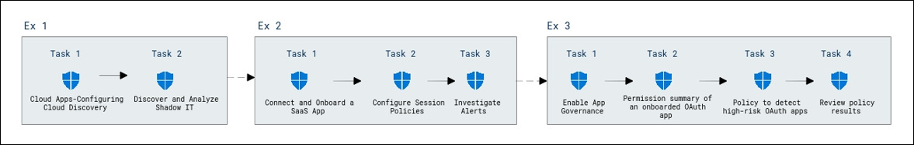
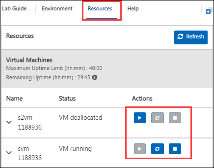
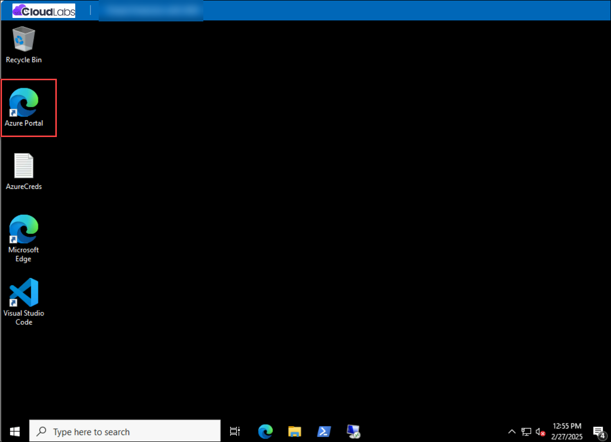
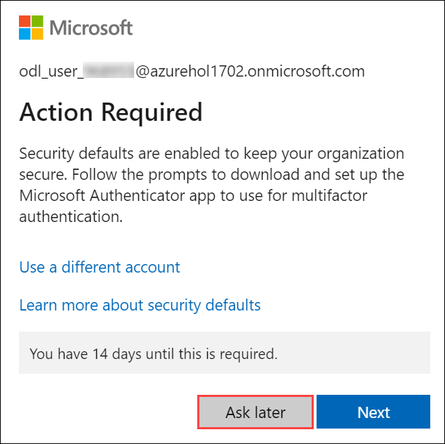
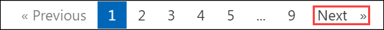

# Implement Threat Protection with Microsoft Defender XDR solutions - Day 2

## Overview

This lab provides hands-on experience with Microsoft Defender for Cloud Apps to detect and manage Shadow IT. You will configure Cloud Discovery, onboard SaaS apps, set session policies, and implement app governance for OAuth apps. Additionally, you’ll learn to investigate alerts and create custom detection policies to enhance cloud security.

## Objectives

- Microsoft Defender for Cloud Apps-Configuring Cloud Discovery 

- Discover and Analyze Shadow IT Using Cloud Discovery 

- Connect and onboard a SaaS App to Defender for Cloud Apps 

- Configure Session Policies to Monitor and Block Risky Behavior 

- Implement App Governance and Risk Detection for OAuth Apps 

- Investigate Alerts and Create Custom Detection Policies 

## Architecture Diagram

 

# Getting Started with the Lab
 
Welcome to your Securing Access to SaaS Apps with Microsoft Defender for Cloud Apps workshop! We've prepared a seamless environment for you to familiarize yourself with the Microsoft security operations analyst, you monitor, identify, investigate, and respond to threats in multi-cloud environments and related Microsoft services. Let's begin by making the most of this experience:
 
## Managing Your Virtual Machine
 
Feel free to start, stop, or restart your virtual machine as needed from the **Resources** tab. Your experience is in your hands!
 

## Let's Get Started with Azure Portal
 
1. On your virtual machine, click on the Azure Portal icon as shown below:
 
    

2. You'll see the **Sign into Microsoft Azure** tab. Here, enter your credentials:
 
   - **Email/Username:** <inject key="AzureAdUserEmail"></inject>
 
     
 
3. Next, provide your password:
 
   - **Password:** <inject key="AzureAdUserPassword"></inject>
 
     

1. If you see the pop-up **Action Required**, click **Ask Later**.

     
 
4. If prompted to stay signed in, you can click **No**.

5. If a **Welcome to Microsoft Azure** pop-up window appears, simply click **Cancel** to skip the tour.

## Steps to Proceed with MFA Setup if "Ask Later" Option is Not Visible

1. At the **"More information required"** prompt, select **Next**.

1. On the **"Keep your account secure"** page, select **Next** twice.

1. **Note:** If you don’t have the Microsoft Authenticator app installed on your mobile device:

   - Open **Google Play Store** (Android) or **App Store** (iOS).
   - Search for **Microsoft Authenticator** and tap **Install**.
   - Open the **Microsoft Authenticator** app, select **Add account**, then choose **Work or school account**.

1. A **QR code** will be displayed on your computer screen.

1. In the Authenticator app, select **Scan a QR code** and scan the code displayed on your screen.

1. After scanning, click **Next** to proceed.

1. On your phone, enter the number shown on your computer screen in the Authenticator app and select **Next**.

1. If prompted to stay signed in, you can click "No."

1. If a **Welcome to Microsoft Azure** pop-up window appears, simply click "Maybe Later" to skip the tour.

1. If a **Welcome to Microsoft Azure** pop-up window appears, simply click **Cancel** to skip the tour.
 
1. Click **Next** from the bottom right corner to embark on your Lab journey!
 
     

Now you're all set to explore the powerful world of technology. Feel free to reach out if you have any questions along the way. Enjoy your workshop!

## Support Contact

The CloudLabs support team is available 24/7, 365 days a year, via email and live chat to ensure seamless assistance at any time. We offer dedicated support channels tailored specifically for both learners and instructors, ensuring that all your needs are promptly and efficiently addressed.

Learner Support Contacts:

- Email Support: cloudlabs-support@spektrasystems.com
- Live Chat Support: https://cloudlabs.ai/labs-support
