# **Day-01**

# Lab 1: Configure Threat Policies in Microsoft Defender for Office 365

In this lab, you will enable Microsoft Defender CSPM for your environment and configure both standard and strict protection policies using Microsoft Defender XDR.

> **⚠ Important Usage Guidance:** Microsoft Defender for Office 365 may take some time to load certain results or complete specific labs from the backend. This is expected behavior. If the data does not appear after a couple of refresh attempts, proceed with the next lab and return later to check the results.

1. Go to the Azure Portal and search for **Microsoft Defender for Cloud (1)**, select it from the **results (2)**.

   

1. When prompted, click **Enable** to activate Defender CSPM.

   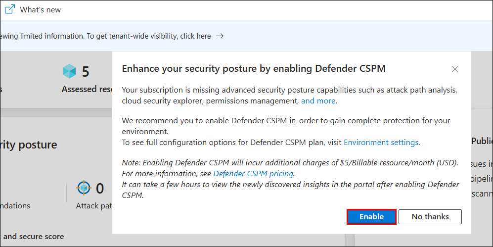

   > **Note:** If you don’t see the pop-up prompt, continue with the lab steps below.

   > **Note:** Enabling Defender CSPM unlocks advanced posture management features such as attack path analysis and permission visibility.

1. Go to **Environment settings (2)** under **Management (1)**, expand **Azure (3)** → **Tenant Root Group (4)**, and select your **subscription (5)**.

   

1. Under **Defender plans (1)**, turn on the following options and click **Save (5)**:
   - **Foundational CSPM (2)**
   - **Defender CSPM (3)**
   - **Servers under Cloud Workload Protection (4)**

        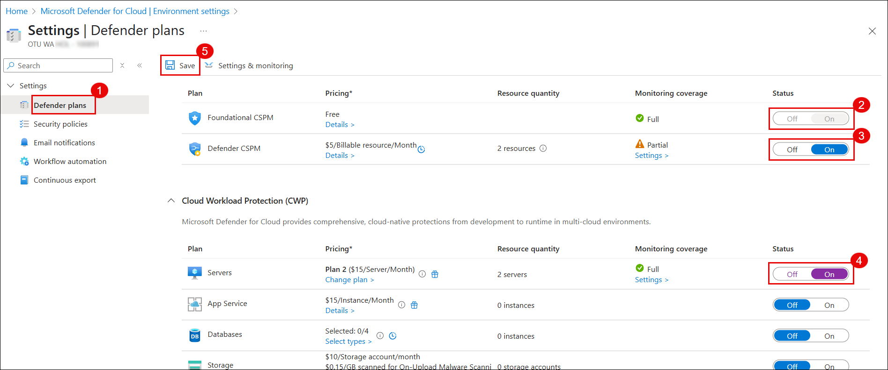

1. On a new tab in the **Microsoft Edge** browser and go to the following URL in the address bar: [https://security.microsoft.com](https://security.microsoft.com).

1. On the **Microsoft Defender portal**, go to **System (1)** > **Settings (2)** and click **Cloud Apps (3)**.

   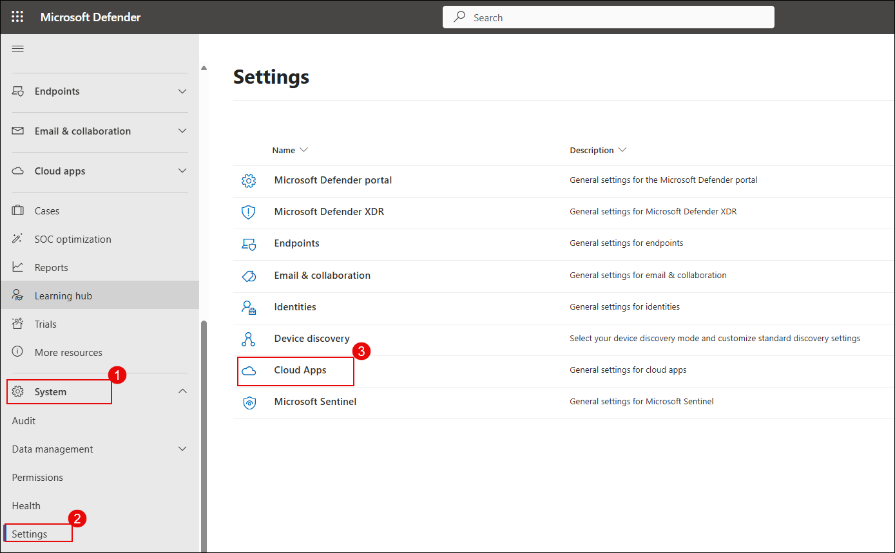

1. Under **App governance**, select **Service status (1)** and click **Turn on app governance (2)**.

   

   > App Governance is now activated. It will begin evaluating connected OAuth apps and generating insights into their behavior and risk posture.

1. On the OAuth apps page, click **Go to app governance**.

   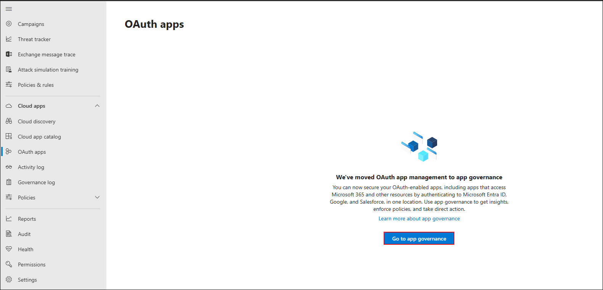

   > You may be redirected to the new App Governance interface.

   > **Note:** It may take 3–4 hours for the Microsoft Defender portal to enable OAuth apps in App Governance.

1. In the left pane, go to **Email & collaboration (1)** → **Policies & rules (2)** → **Threat policies (3)**.

   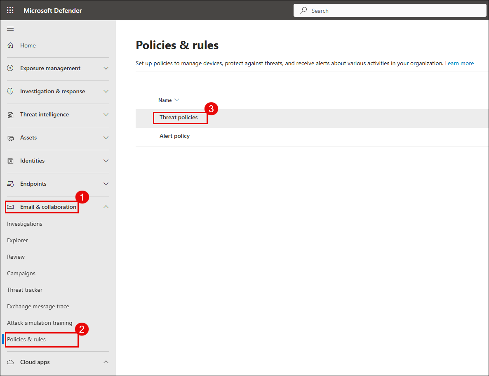

1. On the **Threat policies** page, under **Templated policies**, select **Preset Security Policies**.

   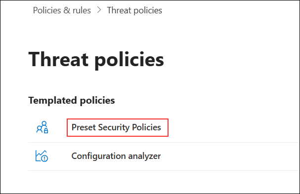

   > **Note:** If the **Learn about preset security policies** pop-up appears, click **Cancel** to close it and proceed with the lab.

1. Under **Standard Protection**, click on **Manage protection settings**.

   

1. On the **Apply Exchange Online Protection** screen, select **Specific recipients (1)**, enter the user email in the **Users** field (2), and click **Next (3)**.

    

1. On the **Apply Defender for Office 365 protection** screen, select **Specific recipients (1)**, enter the user email in the **Users (2)** field, and click **Next (3)**.

    

1. On the **Impersonation protection** and **Policy mode** screens, keep all settings at their default values and click **Next** until you reach the **Review** section.

1. On the **Review** screen, verify that **Exchange Online Protection (1)** and **Defender for Office 365 (2)** apply to the correct user, then click **Confirm (3)**.

    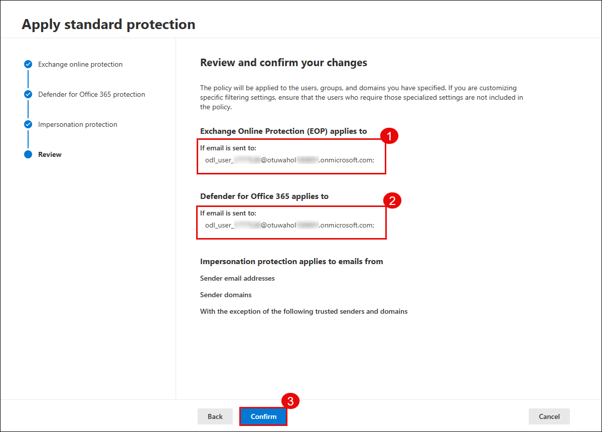

1. On the **Apply standard protection** confirmation screen, verify that the policy update is successful, then click **Done**.

    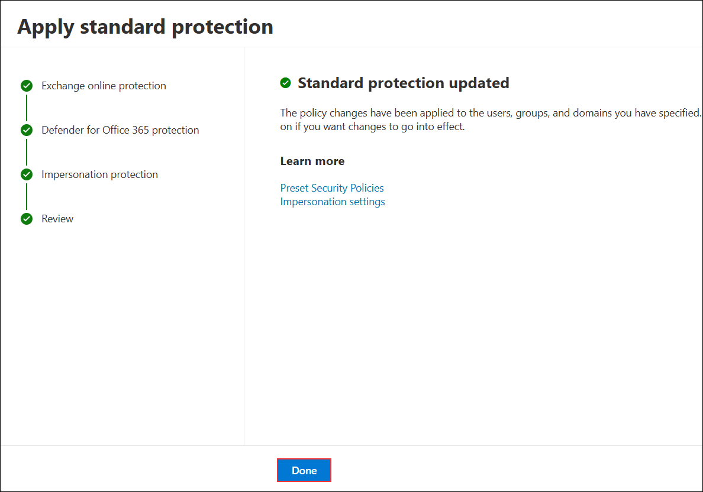

    > **Note:** Standard protection includes Safe Attachments, Safe Links, and anti-phishing policies.

1. Under **Strict Protection**, click **Manage protection settings**.

    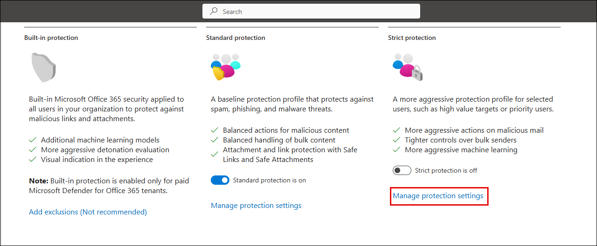

1. On the **Apply Exchange Online Protection** screen, select **Specific recipients (1)**, enter the user email in the **Users** field (2), and click **Next (3)**.

    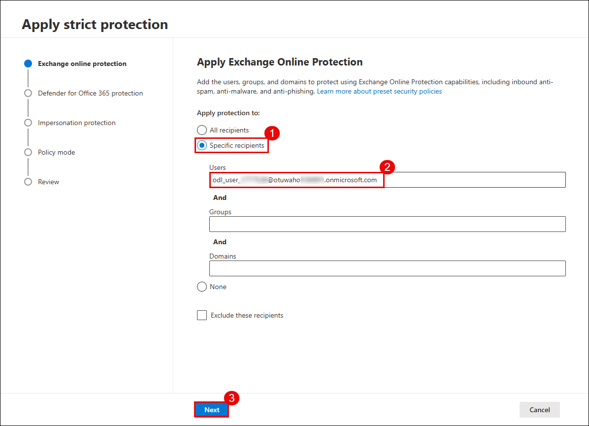

1. On the **Apply Defender for Office 365 protection** screen, select **Specific recipients (1)**, enter the user email in the **Users** field (2), and click **Next (3)**.

    

1. On the **Impersonation protection** and **Policy mode** screens, keep all settings at their default values and click **Next** until you reach the **Review** section.

1. On the **Review** screen, verify that **Exchange Online Protection (1)** and **Defender for Office 365 (2)** apply to the correct user, then click **Confirm (3)**.

    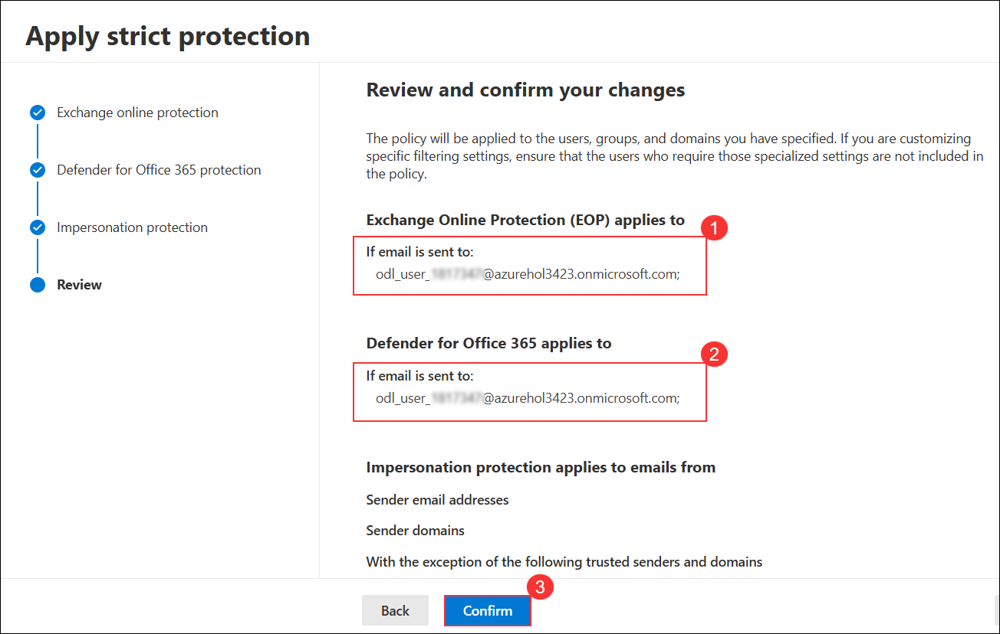

1. Once completed, confirm that:
    - **Standard protection is on (1)**  
    - **Strict protection is on (2)**

        

      > **Note:** You have now successfully configured multi-layered threat policies for both general and high-risk users.

## Review

In this lab, you learnt how to configure threat policies and simulate phishing and malware attacks using Microsoft Defender for Office 365.

## You have successfully completed Lab 1, click on Next to Continue
