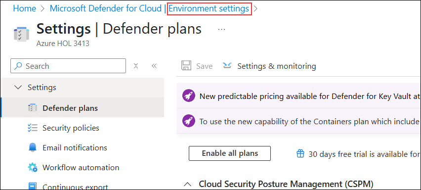
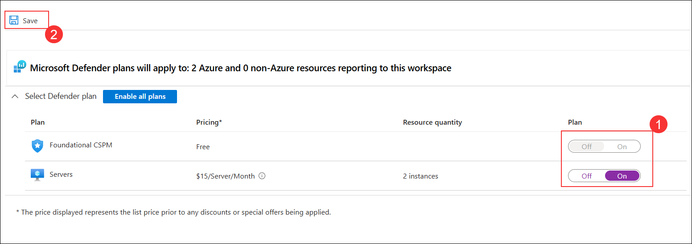
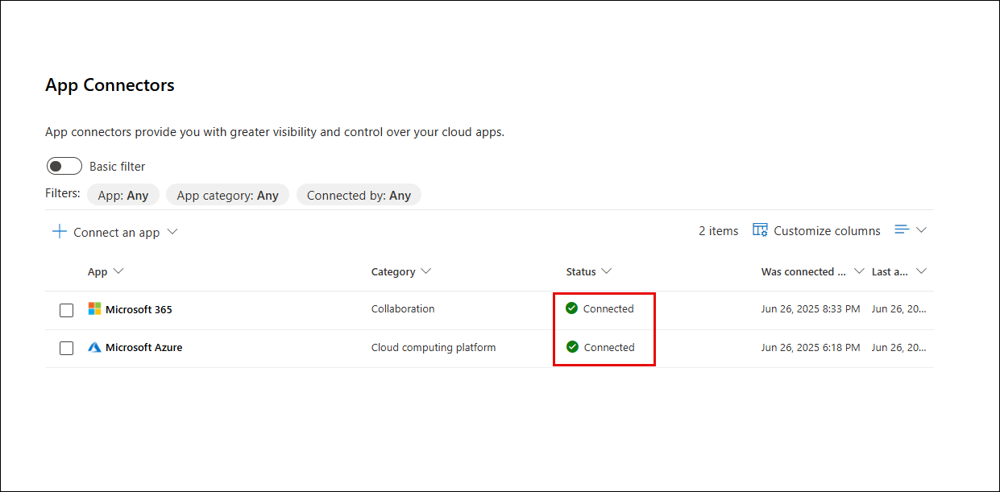

# **Day-01**

# Lab 1: Configure Threat Policies in Microsoft Defender for Office 365

In this lab, you will strengthen your organization's security posture by enabling Microsoft Defender Cloud Security Posture Management (CSPM) and activating App Governance to monitor OAuth applications. You will then configure both Standard and Strict Preset Security Policies in Microsoft Defender for Office 365, applying advanced protection features—including Safe Attachments, Safe Links, and anti-phishing policies—to selected recipients. This layered approach helps safeguard users against evolving threats and ensures comprehensive email and collaboration security.

> **⚠ Important Usage Guidance:** Microsoft Defender for Office 365 may take some time to load certain results or complete specific labs from the backend. This is expected behavior. If the data does not appear after a couple of refresh attempts, proceed with the next lab and return later to check the results.

1. Go to the [Azure Portal](https://portal.azure.com), and search for **Microsoft Defender for Cloud**.

   

1. When prompted, click **Enable** to activate Defender CSPM followed by **Accept**.

   

   > **Note:** If you don’t see the pop-up prompt, simply continue and follow the lab guide steps as shown below.

   >**Note:** This enables advanced posture capabilities like attack path analysis and permissions management.

1. In the **Microsoft Defender for Cloud** page, under **Management**, select **Environment settings (1)**, scroll down, expand **Azure** and **Tenant Root Group**, then select **Subscription (2)**.

   

1. On the **Settings & monitoring** page, turn **On (1)** the toggle for **Foundational CSPM** and **On (2)** for **Servers** under Cloud Workload Protection, then click **Save (3)**.

   

1. Click **Environment settings** in the top to return to the environment settings page.

   

1. On the **Environment settings** page, expand **Azure (1)**, then expand **Subscription** and select **loganalycticworkspace (2)**.

   

1. On the **Select Defender plan** page, turn **On (1)** the toggles for **Foundational CSPM** and **Servers**, then click **Save (2)**.

   

1. Close the Defender plans page by selecting the 'X' in the upper right corner of the page to return to the **Environment settings**.

1. On a new tab in the **Microsoft Edge** browser, go to [https://security.microsoft.com](https://security.microsoft.com).

1. On the **Microsoft Defender portal**, go to **System (1)** > **Settings (2)** and click **Cloud Apps (3)**.

   

1. Under **App governance**, select **Service status (1)** and click **Turn on app governance (2)**.

   

   > App Governance is now activated. It will begin evaluating connected OAuth apps and generating insights into their behavior and risk posture.

1. On the OAuth apps page, click **Go to app governance**.

   

   > You may be redirected to the new App Governance interface.

   > **Note:** It may take 10 hours for the Microsoft Defender portal to enable OAuth apps in App Governance. Continue with the next step in the lab and check the status later. 

1. In the **Microsoft Defender** portal, select **Settings (1)** from the left navigation pane, and then click **Cloud Apps (2)** from the list on the **Settings** page.  

   

1. On the **Cloud apps** settings page, expand **Information Protection (1)**, select **Files (2)**, check **Enable file monitoring (3)**, and then click **Save (4)**.

   

1. On the **Cloud apps** settings page, expand **Connected apps (1)**, select **App Connectors (2)**, click **Connect an app (3)**, and then choose **Microsoft 365** from the list.  

   

1. On the **Select Microsoft 365 components** page, ensure all components are checked, and then click **Connect Microsoft 365**.  

   

1. On the confirmation page, once the connection is established, click **Done** to complete the Microsoft 365 connector setup. 

   

1. Under the **Connected apps** section, click on **App Connectors**. On the **App connectors** page, select the checkbox beside **Microsoft 365**, then click on **+ Connect Microsoft Azure instance**.
  
    

1. Click **Connect Microsoft 365** and complete the authentication.

1. After successful connection, you will see the confirmation message: **“Great, Microsoft 365 is connected.”**, Click **Done**
 
    

1. On the **App Connectors** page, verify that Microsoft 365 and Microsoft Azure shows **Connected** status.
  
    

   > **Note:** It may take **2–4 hours** for the SaaS app to fully connect and display data. Kindly proceed with the next step in the lab and return later to verify the connection status.

1. In the left pane, go to **Email & collaboration (1)** → **Policies & rules (2)** → **Threat policies (3)**.

   

1. On the **Threat policies** page, under **Templated policies**, select **Preset Security Policies**.

   

   > **Note:** If the **Learn about preset security policies** pop-up appears, click **Cancel** to close it and proceed with the lab.

1. Under **Standard Protection**, click on **Manage protection settings**.

   

1. On the **Apply Exchange Online Protection** screen, select **Specific recipients (1)**, enter and select **<inject key="AzureAdUserEmail"></inject>** in the **Users** field (2), and click **Next (3)**.

   

1. On the **Apply Defender for Office 365 protection** screen, select **Specific recipients (1)**, enter and select **<inject key="AzureAdUserEmail"></inject>** in the **Users (2)** field, and click **Next (3)**.

   

1. On the **Impersonation protection** and **Policy mode** screens, keep all settings at their default values and click **Next** until you reach the **Review** section.

1. On the **Review** screen, verify that **Exchange Online Protection (1)** and **Defender for Office 365 (2)** apply to the correct user, then click **Confirm (3)**.

   

1. On the **Apply standard protection** confirmation screen, verify that the policy update is successful, then click **Done**.

   

   > **Note:** Standard protection includes Safe Attachments, Safe Links, and anti-phishing policies.

1. Under **Strict Protection**, click **Manage protection settings**.

   

1. On the **Apply Exchange Online Protection** screen, select **Specific recipients (1)**, enter and select **<inject key="AzureAdUserEmail"></inject>** in the **Users** field (2), and click **Next (3)**.

   

1. On the **Apply Defender for Office 365 protection** screen, select **Specific recipients (1)**, enter and select **<inject key="AzureAdUserEmail"></inject>** in the **Users (2)** field, and click **Next (3)**.

   

1. On the **Impersonation protection** and **Policy mode** screens, keep all settings at their default values and click **Next** until you reach the **Review** section.

1. On the **Review** screen, verify that **Exchange Online Protection (1)** and **Defender for Office 365 (2)** apply to the correct user, then click **Confirm (3)**.

   

1. Once completed, confirm that:
   - **Standard protection is on (1)**
   - **Strict protection is on (2)**

        

   > **Note:** You have now successfully configured multi-layered threat policies for both general and high-risk users.

## Review

In this lab, you:
- Enabled Microsoft Defender CSPM to enhance cloud security posture management.
- Activated App Governance for monitoring and managing OAuth app risks.
- Configured both Standard and Strict Preset Security Policies in Microsoft Defender for Office 365.
- Applied multi-layered email and collaboration protection to specific users, ensuring robust defense against threats.

## You have successfully completed the lab. Click on Next to Continue
