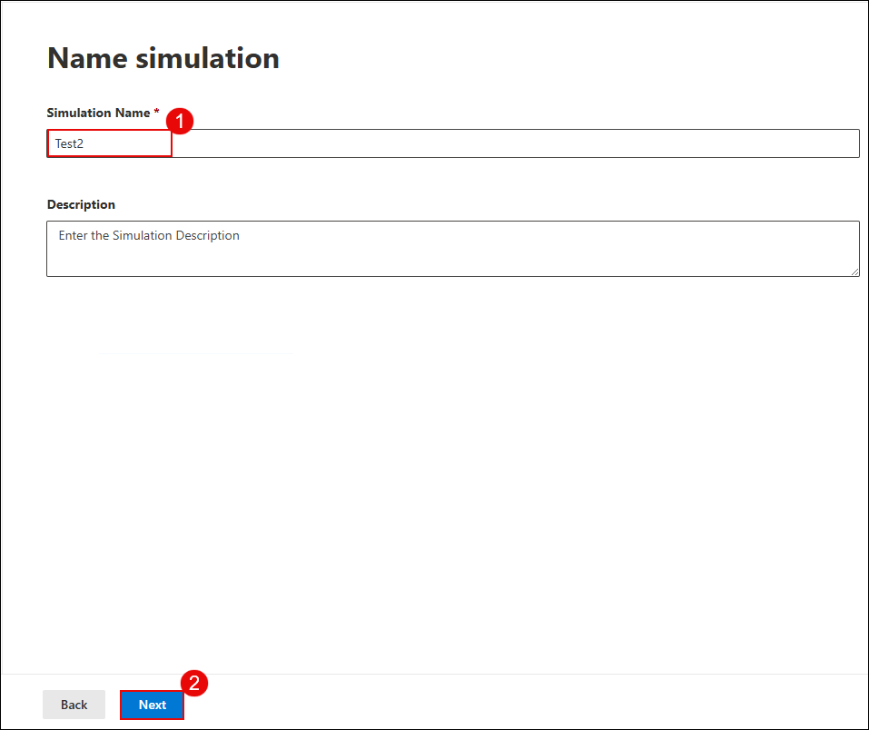

# Lab 2: Simulate Phishing and Malware Attacks Using Attack Simulator

## Overview

In this lab, you will use Microsoft Defender for Office 365’s Attack Simulation Training to simulate phishing and malware attacks. These simulations help assess user vulnerability to credential harvesting and malicious attachments. You will configure and launch both a phishing simulation and a malware attachment simulation, assign training to targeted users, and review simulation progress in the dashboard.

> **⚠ Important Usage Guidance:** Microsoft Defender for Office 365 may take some time to load certain results or complete specific labs from the backend. This is expected behavior. If the data does not appear after a couple of refresh attempts, proceed with the next lab and return later to check the results.

1. On the left navigation menu, expand **Email & collaboration (1)** and select **Attack simulation training (2)**. On the **Attack simulation training** page, select the **Simulations (3)** tab and click **Launch a simulation (4)**.

   

1. Under **Select technique**, choose **Credential Harvest (1)** and click **Next (2)**.

   

1. In the **Name simulation** step, enter a simulation name as `Test1` in the **Simulation name (1)** field, and click **Next (2)**.

   

1. Under **Select payload and login page**, choose **Global payloads**, select a phishing payload from the **list (1)**, and click **Next (3)**.

   

1. On the **Target users** screen, select **Include only specific users and groups (1)**, click **Add users (2)**, and then click **Next (3)**.

   

1. On the **Add users** screen, search for the **user email (1)**, select the **user (2)** from the list, and click **Add User(s) (3)**.

   

1. On the **Target users** screen, confirm the **User** has been added and click **Next**.

1. On the **Exclude users** screen, leave the option unchecked to skip excluding any users, and click **Next**.

   

1. On the **Assign training** screen, select **Microsoft training experience (1)**, choose **Assign training for me (2)**, set the due date to **7 days after Simulation ends (3)**, and click **Next (4)**.

   

1. Under **Select landing page**, choose a **login page template (1)** and click **Next (2)**.

    

1. In the **End user notification** section, select **Microsoft default notification (1)** and configure:
    - Positive reinforcement: **Deliver during simulation (2**)
    - Training reminder: **Weekly (3)**
    Click **Next (4)**.

        

1. In the **Launch details** step, select **Launch this simulation as soon as I'm done (1)**, set **duration to 2 days (2)**, and click **Next (3)**.

    

1. Review the configuration summary and click **Submit** to start the simulation.

    

1. On completion, click **Done**.

    

    > **Note:** You’ve successfully launched a phishing simulation. It will monitor how users interact with suspicious emails.

1. Verify the simulation appears in the dashboard as **In progress**.

    

1. On the **Attack simulation training** page, select the **Simulations (1)** tab and click **Launch a simulation (2)**.

    

1. To simulate a **Malware Attack**, choose **Launch your own simulation**, select **Malware Attachment (1)**, and click **Next (2)**.

    

1. Enter a new simulation name **`Test2`** and click **Next (2)**.

    

1. Under **Select payload and login page**, select **Global payloads (1)**, choose a malware attachment from the list and set the preferred language (2), then click **Next (3)**.

    

1. On the **Target users** screen, select **Include only specific users and groups (1)**, click **Add users (2)**, and then click **Next (3)**.

   

1. On the **Add users** screen, search for the **user email (1)**, select the **user (2)** from the list, and click **Add User(s) (3)**.

   

1. On the **Target users** screen, confirm the **User** has been added and click **Next**.

1. On the **Exclude users** screen, leave the option unchecked to skip excluding any users, and click **Next**.

   

1. On the **Assign training** screen, select **Microsoft training experience (1)**, choose **Assign training for me (2)**, set the due date to **7 days after Simulation ends (3)**, and click **Next (4)**.

   

1. On the **Assign training** page, select a landing page template from the list (1) and click **Next (2)**.

   

1. In the **End user notification** screen, select **Microsoft default notification (1)**, ensure **Deliver during simulation (2)** and **Weekly reminder (3)** are selected, and click **Next (4)**.

    

1. Set the **Launch configuration (1)** to launch immediately, set duration to **2 days (2)**, and click **Next (3)**.

    

1. On the **Select end user notification** screen, choose **Microsoft default notification (1)**, set **Deliver during simulation (2)** and **Weekly (3)** as delivery preferences, then click **Next (4)**.

    

1. Review the details and click **Submit** to complete the malware simulation setup.

    

> **Note:** This simulation mimics a malicious file being sent via email, testing how users respond to attachment-based threats.

> **Congratulations** on completing the lab! Now, it's time to validate it. Here are the steps:  
> - Hit the Validate button for the corresponding lab. If you receive a success message, you can proceed to the next lab.  
> - If not, carefully read the error message and retry the step, following the instructions in the lab guide.  
> - If you need any assistance, please contact us at cloudlabs-support@spektrasystems.com. We are available 24/7 to help you out.  
<validation step="064a226a-790e-4e5f-b789-d84483110e38" />

## Review

In this lab, you:
- Launched a phishing simulation using credential harvesting.
- Created a malware attachment simulation to test file-based threats.
- Assigned targeted user training for simulated attacks.
- Verified simulation progress and results in the dashboard.

You have successfully completed the lab. Click on Next to Continue
