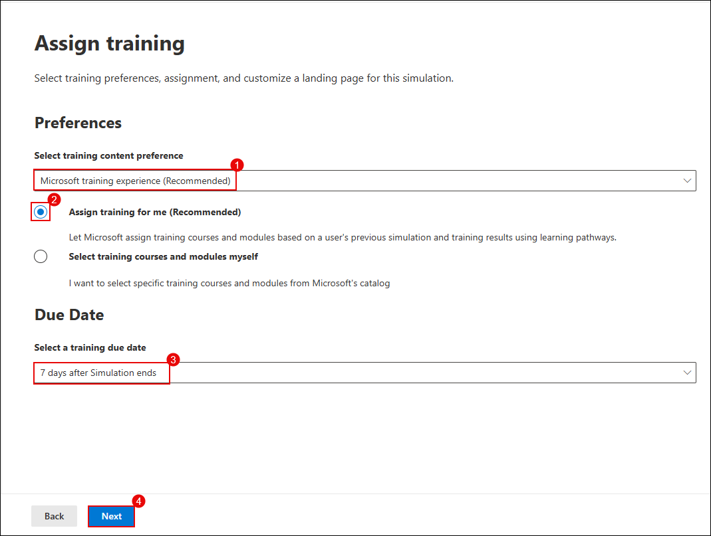
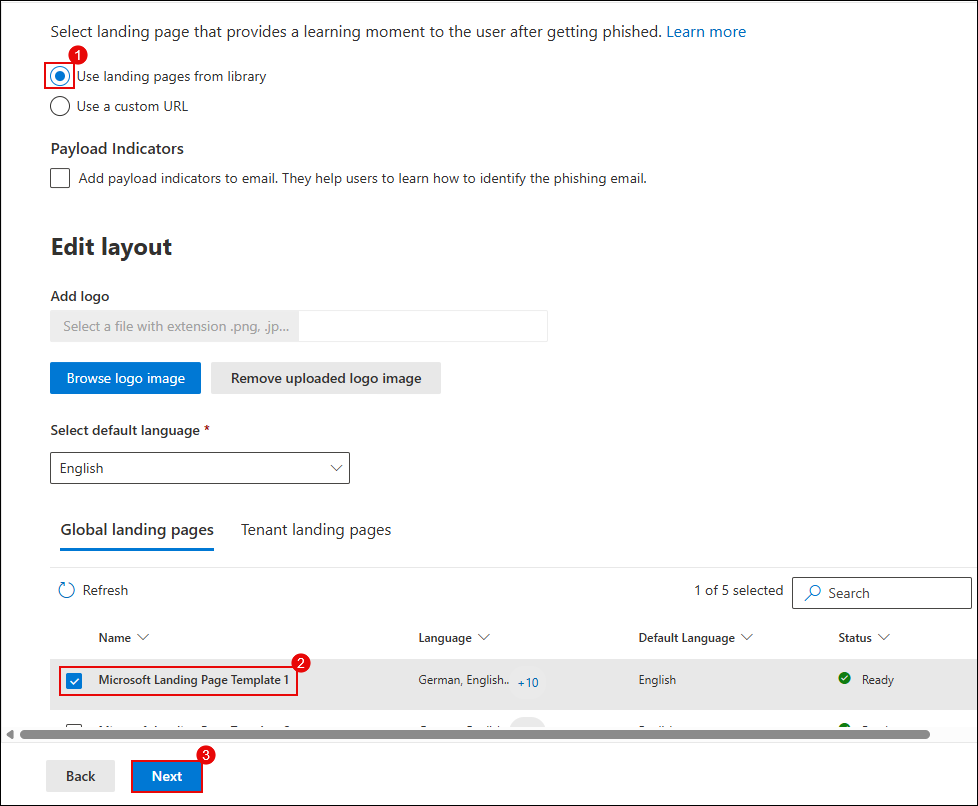
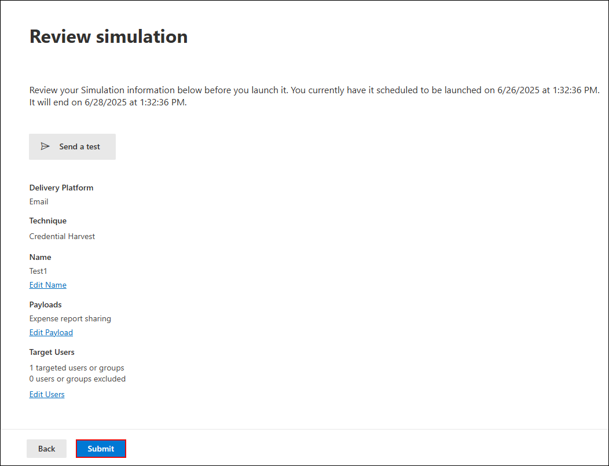

# Lab 2: Simulate Phishing and Malware Attacks Using Attack Simulator

In this lab, you will leverage Microsoft Defender for Office 365’s Attack Simulation Training to evaluate organizational resilience against phishing and malware threats. You will configure and launch two types of simulations: a credential harvesting phishing attack and a malware attachment attack. The lab guides you through targeting specific users, assigning security awareness training, and monitoring simulation outcomes using the dashboard. By completing these exercises, you will gain hands-on experience in threat simulation and user training workflows.

> **⚠ Important Usage Guidance:** Microsoft Defender for Office 365 may take some time to load certain results or complete specific labs from the backend. This is expected behavior. If the data does not appear after a couple of refresh attempts, proceed with the next lab and return later to check the results.

1. On the left navigation menu, expand **Email & collaboration (1)** and select **Attack simulation training (2)**. On the **Attack simulation training** page, select the **Simulations (3)** tab and click **Launch a simulation (4)**.

   
    > **Note:** You can use the Attack Simulator to create realistic phishing simulations that help train users to recognize and report suspicious emails.

    > **Note:** Click on `X` to close the Pop-up that may appear    

1. Under **Select technique**, choose **Credential Harvest (1)** and click **Next (2)**.

   

1. In the **Name simulation** step, enter a simulation name as `Test1` in the **Simulation name (1)** field, and click **Next (2)**.

   

1. Under **Select payload and login page**, choose **Global payloads**, select **Expense report sharing (1)** phishing payload from the list, and click **Next (3)**.

   

1. On the **Target users** screen, select **Include only specific users and groups (1)**, click **Add users (2)**, and then click **Next (3)**.

   

1. On the **Add users** screen, search for **<inject key="AzureAdUserEmail"></inject>** **(1)**, select the **user (2)** from the list, and click **Add User(s) (3)**.

   

1. On the **Target users** screen, confirm the **User** has been added and click **Next**.

1. On the **Exclude users** screen, leave the option unchecked to skip excluding any users, and click **Next**.

   

1. On the **Assign training** screen, select **Microsoft training experience (1)**, choose **Assign training for me (2)**, set the due date to **7 days after Simulation ends (3)**, and click **Next (4)**.

   

1. Under **Select landing page**, choose a **login page template (1)** and click **Next (2)**.

    

1. In the **End user notification** section, select **Microsoft default notification (1)** and configure the Delivery preferences to:
    - Microsoft default positive reinforcement notification: **Deliver during simulation (2)** 
    - Microsoft default training reminder notification: **Weekly (3)** 
    Click **Next (4)**.

        

1. In the **Launch details** step, select **Launch this simulation as soon as I'm done (1)**, set **duration to 2 days (2)**, and click **Next (3)**.

    

1. Review the configuration summary and click **Submit** to start the simulation.

    

1. On completion, click **Done**.

    

    > **Note:** You’ve successfully launched a phishing simulation. It will monitor how users interact with suspicious emails.

1. Verify the simulation appears in the dashboard as **In progress**.

    

1. On the **Attack simulation training** page, select the **Simulations (1)** tab and click **Launch a simulation (2)**.

    

1. To simulate a **Malware Attack**, choose **Launch your own simulation**, select **Malware Attachment (1)**, and click **Next (2)**.

    

1. Enter a new simulation name **`Test2`** and click **Next (2)**.

    

1. Under **Select payload and login page**, select **Global payloads (1)**, choose **HR notification on update of contract** from the list and set the preferred language to **English (2)**, then click **Next (3)**.

    

1. On the **Target users** screen, select **Include only specific users and groups (1)**, click **Add users (2)**, and then click **Next (3)**.

   

1. On the **Add users** screen, search **<inject key="AzureAdUserEmail"></inject>**, select the **user (2)** from the list, and click **Add User(s) (3)**.

   

1. On the **Target users** screen, confirm the **User** has been added and click **Next**.

1. On the **Exclude users** screen, leave the option unchecked to skip excluding any users, and click **Next**.

   

1. On the **Assign training** screen, select **Microsoft training experience (1)**, choose **Assign training for me (2)**, set the due date to **7 days after Simulation ends (3)**, and click **Next (4)**.

   

1. On the **Assign training** page, select a landing page template from the list (1) and click **Next (2)**.

   

1. In the **End user notification** section, select **Microsoft default notification (1)** and configure the Delivery preferences to:
    - Microsoft default positive reinforcement notification: **Deliver during simulation (2)** 
    - Microsoft default training reminder notification: **Weekly (3)** 
    Click **Next (4)**.

        

1. Set the **Launch configuration (1)** to launch immediately, set duration to **2 days (2)**, and click **Next (3)**.

    

1. Review the details and click **Submit** to complete the malware simulation setup.

    

> **Note:** This simulation mimics a malicious file being sent via email, testing how users respond to attachment-based threats.

> **Congratulations** on completing the task! Now, it's time to validate it. Here are the steps:
> - Hit the Validate button for the corresponding task. If you receive a success message, you can proceed to the next task. 
> - If not, carefully read the error message and retry the step, following the instructions in the lab guide.
> - If you need any assistance, please contact us at cloudlabs-support@spektrasystems.com. We are available 24/7 to help you out.
<validation step="ee7ace77-b2c8-4c3f-90dc-d40ebe835cdd" />

## Review

In this lab, you:
- Configured and launched a phishing simulation targeting credential harvesting.
- Set up a malware attachment simulation to assess user response to file-based threats.
- Assigned targeted security training to users involved in the simulations.
- Monitored simulation status and user interactions in the Attack Simulation Training dashboard.

## You have successfully completed the lab. Click on Next to Continue
