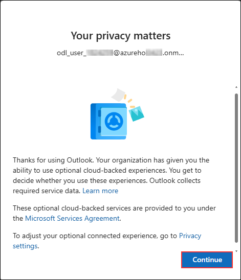
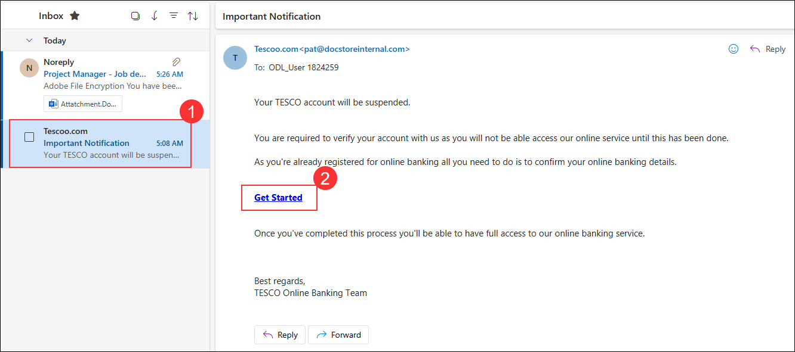
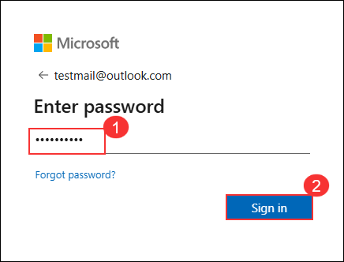
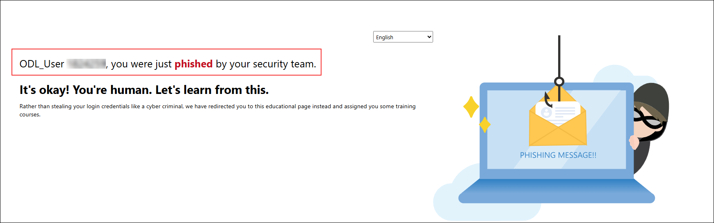
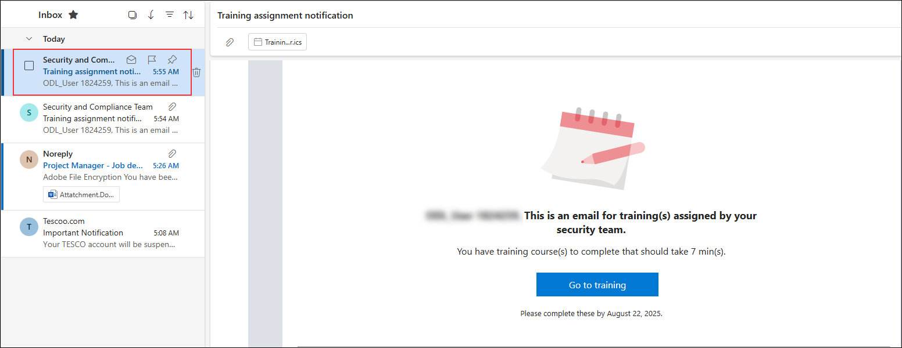
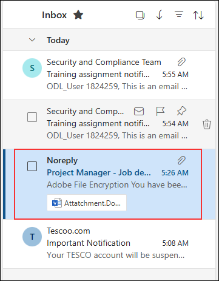
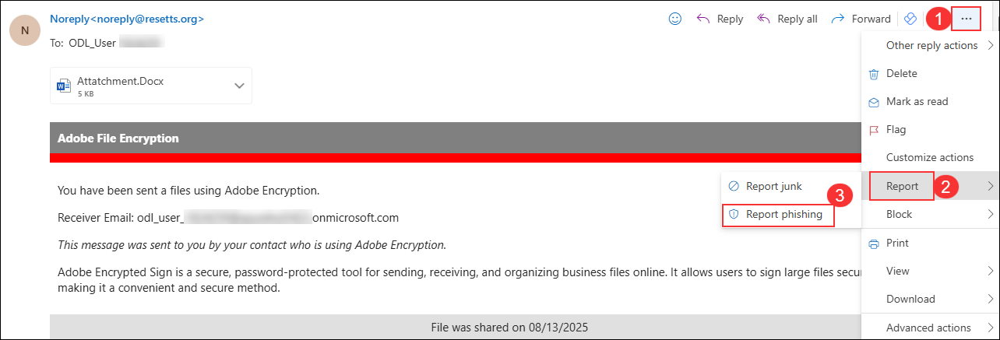
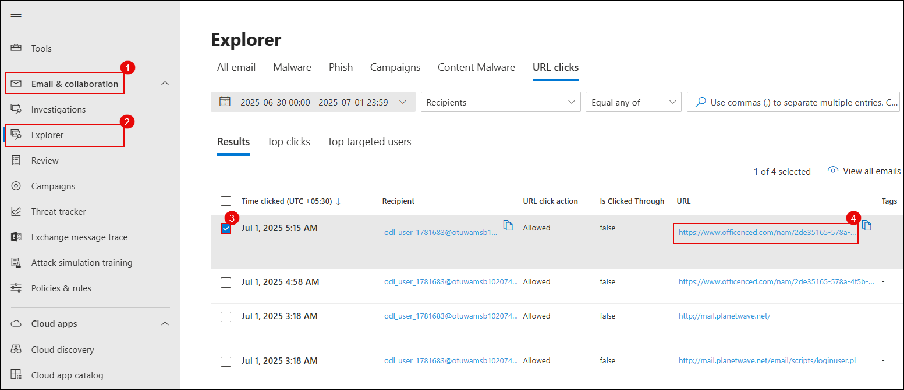
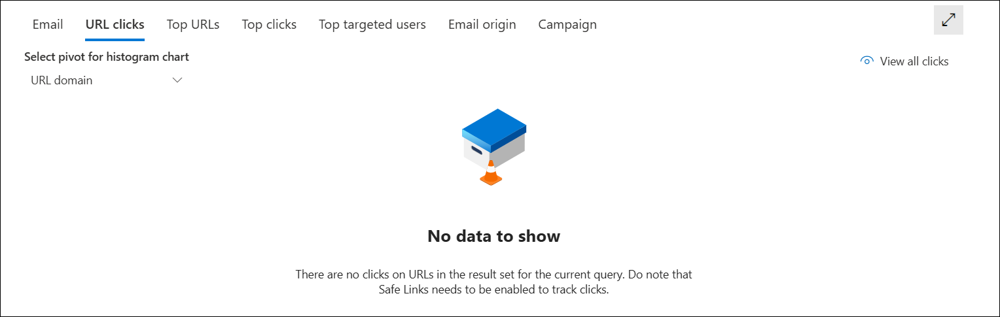
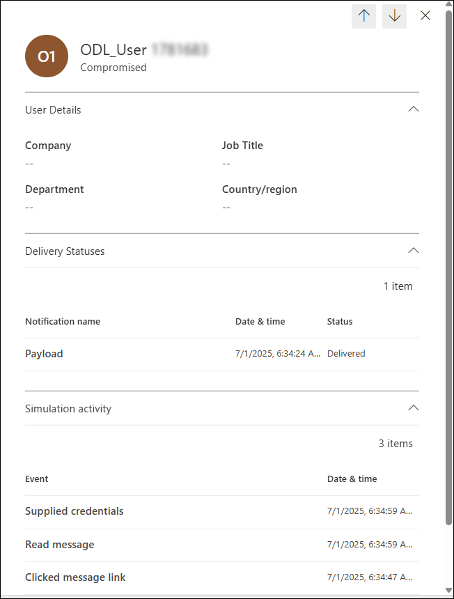

# Lab 3: Analyze Threats with Threat Explorer and Real-Time Detections

In this lab, you will leverage Microsoft Defender for Office 365 to investigate simulated phishing and malware scenarios using Threat Explorer and real-time detection features. You will interact with simulation emails, report suspicious messages, and analyze security events. The lab guides you through reviewing phishing and malware simulation results, investigating user actions such as credential submission and URL clicks, and assessing user risk based on simulation outcomes.

> **⚠ Important Usage Guidance:** Microsoft Defender for Office 365 may take some time to load certain results or complete specific labs from the backend. This is expected behavior. If the data does not appear after a couple of refresh attempts, proceed with the next lab and return later to check the results.

1. Open a new tab, navigate to https://outlook.office.com, sign in with the lab user’s credentials, and access the mailbox.

   > **Note:** If the **Your privacy matters** pop-up appears, click **Continue** to proceed.

   

1. In the mailbox, select the **phishing simulation email (1)** and click the **link (2)** provided in the message body to proceed.

   

1. On the **Sign in** page, type any random email address (1) and click **Next (2)**.

   

1. On the **Enter password** page, type any random password (1) and click **Sign in (2)**.

   

1. After submitting the fake credentials, the phishing simulation results page will appear indicating that you were phished. Review the message and proceed as instructed in the lab.

   

   > Note: This activity simulates a phishing attack and triggers credential submission logs.

1. A training assignment email is also generated for users who fall for the phishing simulation. In the mailbox, open the **Training assignment notification** email and review the details.

   

1. In the mailbox, select the malware attachment simulation email to view its contents.

   

1. With the malware attachment simulation email open, click the **More actions (1)** menu, select **Report (2)**, and then click **Report phishing (3)**.

   

1. In the **Report phishing** confirmation dialog, click **Report** to submit the phishing report.

   

1. After reporting the phishing email, a confirmation message will be sent to your mailbox. Open the **Thank you for reporting a phish!** email to review the acknowledgment.

   

1. Navigate back to **Microsoft Defender portal** and perform the following steps:

   - Select **Email & collaboration (1)** from the left navigation pane.
   - Click **Explorer (2)** under the Email section.
   - In the **URL clicks** tab, select the entry for the clicked timestamp.
   - Review the **URL (4)** that was clicked to investigate further.

      

      > **Note:** Sometimes the Microsoft Defender portal can take 1–2 hours for initial backend data to load. If refreshing the page doesn’t display results, check back later.

      

      > **Note:** If no data appears after waiting and refreshing, skip ahead to step 14 to continue with the lab.

1. Click on the **Open url page** to open the full event details.

   

   > Note: This shows the clicked URL, click metadata, and incident correlation.

1. In the **Microsoft Defender portal**, do the following:

   - Select **Email & collaboration (1)** from the left navigation pane.
   - Click **Attack simulation training (2)**.
   - Navigate to the **Simulations (3)** tab.
   - Locate and select the simulation named **Test1 (4)** from the list.

      

1. View the simulation report to observe the results.  
   In this example, 100% of users were compromised and 0% reported the phishing attempt.

   

1. Click the **Affected user** to view detailed actions taken during the simulation such as reading the email, clicking the link, and submitting credentials.

   

   > Note: This data helps evaluate user behavior and identify high-risk individuals.

1. Navigate back to the **Simulations** tab, select the simulation named **Test2**, and view the report details for the malware attachment simulation.

## Review

In this lab, you:
- Explored phishing and malware simulation emails in a user mailbox.
- Reported a phishing attempt and verified the acknowledgment response.
- Used Threat Explorer to investigate URL click events and review related security details.
- Examined simulation reports to assess user actions and identify potential risks.

## You have successfully completed the lab. Click on Next to Continue
