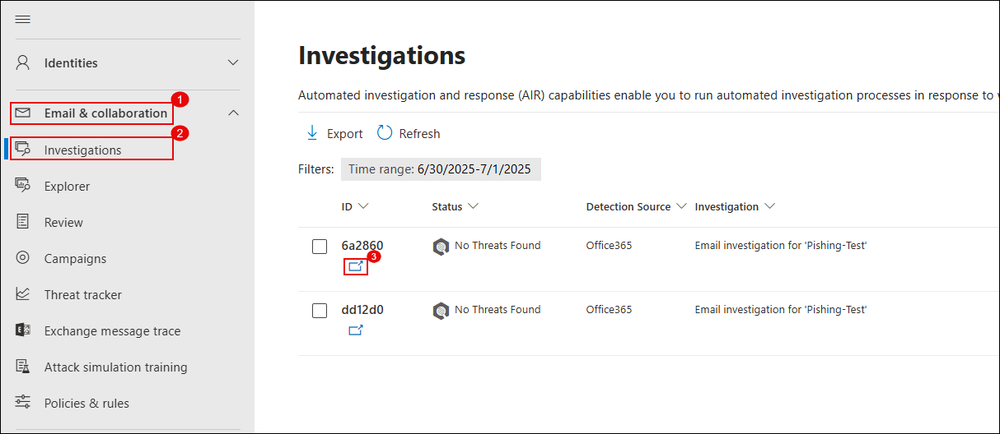

# Lab 4: Investigate and Remediate Incidents in Microsoft Defender XDR

## Overview

In this lab, you will simulate a phishing scenario and use Microsoft Defender XDR to investigate and remediate the incident. You will analyze a suspicious email with Threat Explorer, perform remediation actions such as moving the message to Junk and submitting it to Microsoft for review, and trigger an automated investigation. You will also review and manage related alerts, update their status and classification, and examine the investigation graph to understand the incident's scope and resolution.

> **⚠ Important Usage Guidance:** Microsoft Defender for Office 365 may take some time to load certain results or complete specific labs from the backend. This is expected behavior. If the data does not appear after a couple of refresh attempts, proceed with the next lab and return later to check the results.

1. Navigate back to https://outlook.office.com tab and send a new email to **<inject key="AzureAdUserEmail"></inject>** with the below links, set the Subject to `Phishing-Test`.

   ```
   https://youtube.com/  
   https://openai.com/  
   ```

      

1. In the mailbox, verify that the test email with the links has been received and open it to view the contents.

   

1. On the Microsoft Defender portal (https://security.microsoft.com), go to **Email & collaboration (1)** → **Explorer (2)**. Select the phishing email entry **Test Phishing (4)**.

   

   > **Note:** It may take 2–3 minutes for the email to appear in Explorer after delivery.

1. Click the message to open its details. Then click **Take action**.

   

1. On the **Choose response actions** page:

   - Toggle on **Show all response actions** **(1)** 
   - Select **Move or delete** **(2)** 
   - Choose **Junk** **(3)**  
   - Select **Submit to Microsoft for review** **(4)**  
   - Choose **I've confirmed it’s a threat** **(5)**   
   - Select **Phish** as the category **(6)** 
   - **Cancel** to skip creating a block rule.
   - Enable **Initiate automated investigation** **(7)** 
   - Choose **investigate mail** **(8)** 
   - Click **Next (9)**

      
   
1. On the **Choose target entities** page, enter a name such as `report-phish (1)` and review the impacted users. Click **Next (2)** and click on **Submit**.

   

1. Navigate to **Incidents & alerts (1)** → **Alerts (2)**. Locate the alert titled **Administrative action submitted by an Administrator (3)**.

   

1. Click the alert to open details. Then click **Manage alert**.

   

1. In the **Manage alert** panel enter the below details and click **Save (4)** and close the panel.

   - Set **Status** to `In progress` **(1)**
   - Assign to me (<inject key="AzureAdUserEmail"></inject>) **(2)**
   - Set **Classification** to `True positive – Phishing` **(3)** 

     

1. Go to **Email & collaboration (1)** → **Investigations (2)**. Click on the latest investigation entry related to your phishing test **(3)**.

   

1. Review the investigation graph which shows:

    - **Alert received**  
    - **Entities analyzed**  
    - **Mailbox involved**  
    - **Result**: No threats found

      

      > **Note:** It may take **60 minutes** for the automated investigation to complete and display results, you can proceed to the next lab, and check back later.

## Review

In this lab, you have completed the following:

- Simulated a phishing email and verified its delivery.  
- Investigated the suspicious email using **Threat Explorer** in Microsoft Defender XDR.  
- Performed remediation actions, including moving the message to Junk and submitting it to Microsoft for review.  
- Initiated an automated investigation with proposed remediation.  
- Managed and classified the related alert by updating its status and ownership.  
- Reviewed the investigation graph to confirm the scope and outcome of the incident.  

## You have successfully completed the lab. Click on Next to Continue

  
