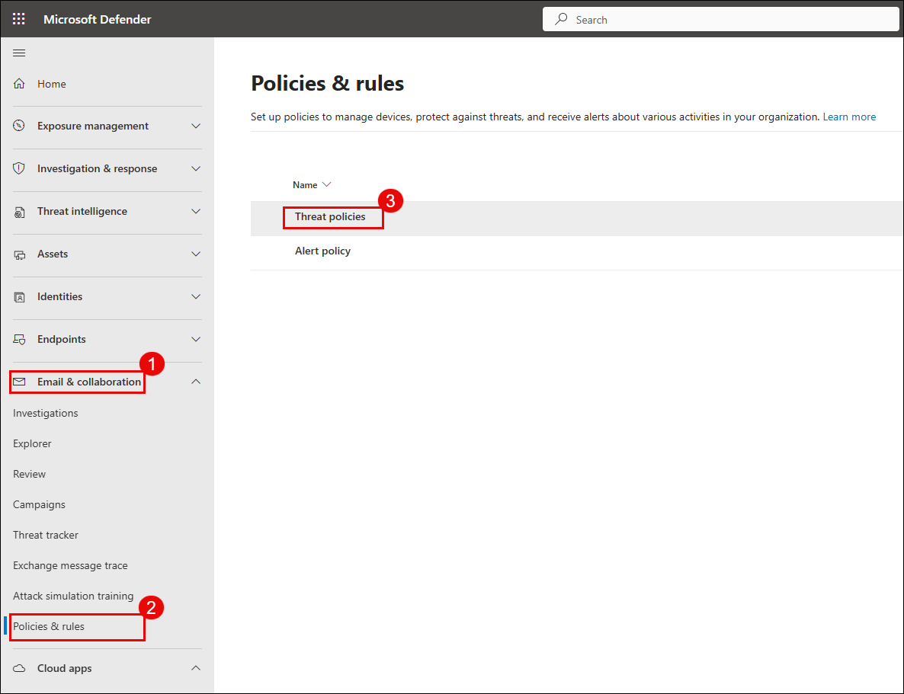
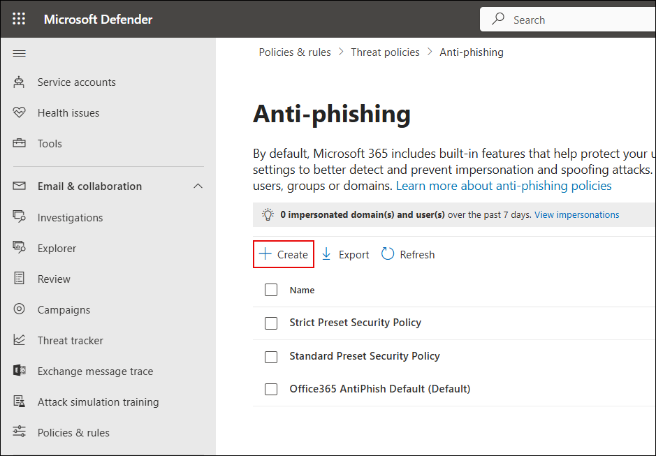
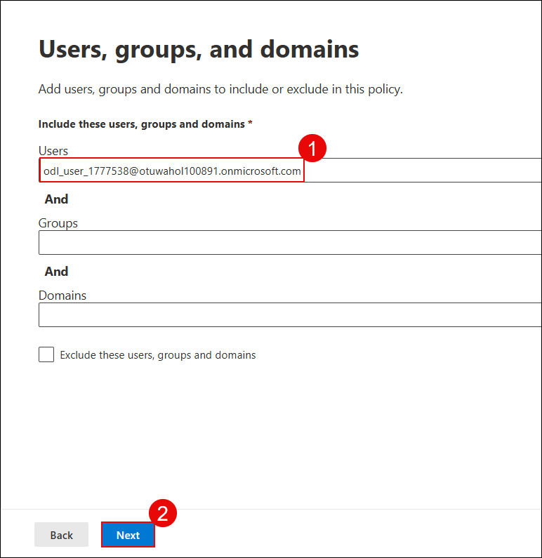
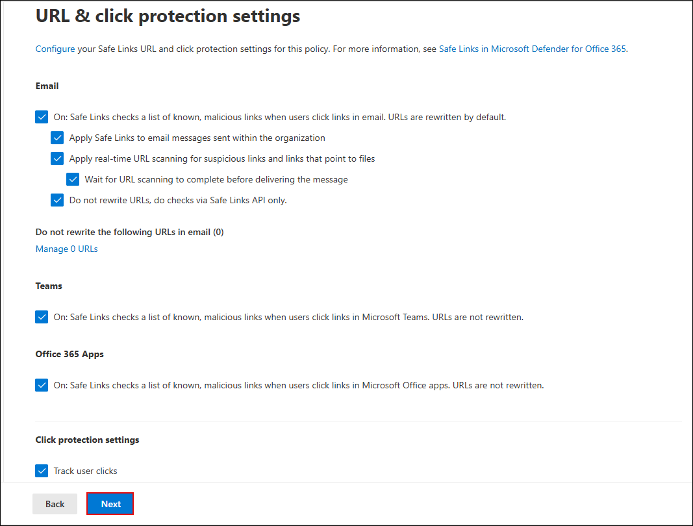
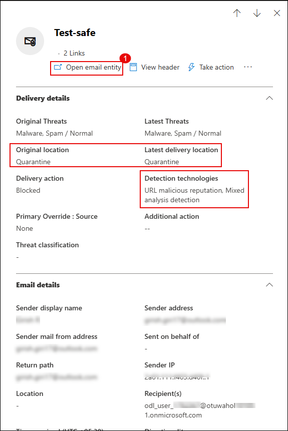

# Lab 5: Configure Anti-Phishing and Safe Links Policies

In this lab, you will configure custom Anti-Phishing and Safe Links policies in Microsoft Defender for Office 365 to protect against malicious emails and phishing links. You will also create an alert policy to detect malware in inbound email and simulate a phishing scenario to verify that the policies and alerts work as expected.

> **⚠ Important Usage Guidance:** Microsoft Defender for Office 365 may take some time to load certain results or complete specific labs from the backend. This is expected behavior. If the data does not appear after a couple of refresh attempts, proceed with the next lab and return later to check the results.

1. On the **Microsoft Defender portal**, go to **Email & collaboration (1)** → **Policies & rules (2)** → **Threat policies (3)**.

   

1. On the **Threat policies** page, under **Policies**, select **Anti-phishing**.

   

1. On the **Anti-phishing** page, click **Create (1)** to begin a new policy.

   

1. Enter the name **Anti-Phish (1)** and click **Next (2)**.

   

1. Under **Users, groups, and domains**, add the user **<inject key="AzureAdUserEmail"></inject> (1)** and click **Next (2)**.

   

1. Set the **Phishing email threshold** to **4 - Most Aggressive** to enable maximum protection.

   

1. Under **Trusted senders and domains**, check the following options:

   - **Enable mailbox intelligence (1)**
   - **Enable Intelligence for impersonation protection (2)**
   - **Enable spoof intelligence (3)**  
   - Then click **Next (4)**. 
     
      

1. Under **Message actions**, configure the following and click **Next (5)** followed by **Submit**.

   - If Mailbox Intelligence detects an impersonated user:  
     **Move the message to the recipients’ Junk Email folders (1)**
   - For spoof messages with DMARC policy = quarantine:  
     **Move the message to the recipients’ Junk Email folders (2)**
   - For spoof messages with DMARC policy = reject:  
     **Quarantine the message (3)**
   - For spoof detection by spoof intelligence:  
     **Move the message to the recipients’ Junk Email folders (4)**  

      

1. Back on the **Threat policies** page, go to **Email & collaboration (1)** > **Policies & rules (2)**, then select **Safe Links (3)**.

   

1. Click on **Create** and enter the policy name as **Anti-Safe (1)** and click **Next (2)**.

   

1. Under **Users and domains**, add the user **<inject key="AzureAdUserEmail"></inject> (1)** and click **Next (2)**.

    

1. Click on **Next** in Notification section and click on **Submit** followed by **Done**.

1. In **URL & click protection settings**, ensure all the below mentioned checkboxes are enabled, then click **Next**.

    - Email Safe Links
    - URL scanning
    - Teams and Office 365 apps protection
    - Click tracking  

      

1. Click **Done** to complete the policy creation.

1. Navigate to **Email & collaboration (1)** > **Policies & rules (2)** > **Alert policy (3)**.

    

1. On the **Alert policy** page, click **+ New Alert Policy**.

    

1. Enter the following details and click **Next (4)**:
    
    - **Name (1):** Alert-Safe  
    - **Severity (2):** High  
    - **Category (3):** Threat management  

      

1. For the activity condition, configure the following and click **Next (4)**.

    - **Activity (1):** Detected malware in an email message  
    - **Mail direction (2):** Inbound  
    - **Trigger (3):** Every time an activity matches the rule  

      

1. Add the recipient's email address **(1)** and click **Next (2)**.

    

1. Review the alert settings, choose **Yes, turn it on right away (1)**, and click **Submit (2)** and click on **Done** once the policy has been created.

    

   > **Note:** Your alert policy is now active and will trigger if matching activity is detected.

1. Navigate back to Outlook tab and send a new test email with sample malicious links to simulate a threat to **<inject key="AzureAdUserEmail"></inject>**

   ```
   https://www.amtso.org/check-desktop-phishing-page/ 
   ```

   ``` 
   https://malware.wicar.org/data/eicar.com.txt  
   ```   
   
   - Set the **Subject** to `Test-Safe`

   -  Click **Send (3)** to deliver the email.

      

1. Navigate back to Defnder portal and select **Email & collaboration (1)** > **Explorer (2)** and locate the test email **Test-Safe (3)**.

    

1. Click **Open email entity (1)** and verify that:
    
    - **Original location:** Quarantine  
    - **Delivery action:** Blocked  
    - **Detection technologies:** URL malicious reputation, Mixed analysis detection  

      

## Review

In this lab, you have completed the following:

- Configured a custom **Anti-Phishing policy** with aggressive detection settings.  
- Created a **Safe Links policy** for email, Teams, and Office 365 apps.  
- Set up an **alert policy** to detect malware in inbound email.  
- Simulated a phishing email and verified that detections and alerts were successfully triggered. 

## You have successfully completed Day 1.