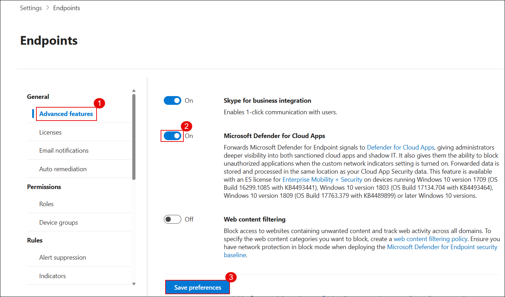
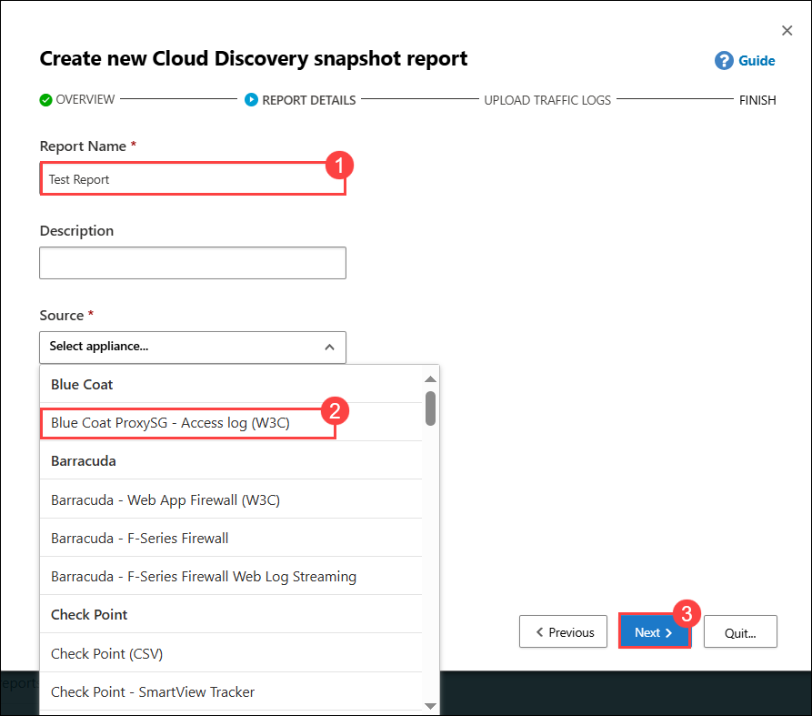
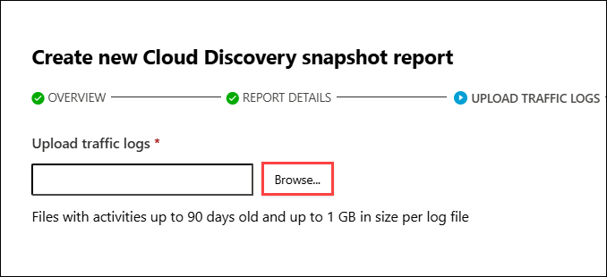
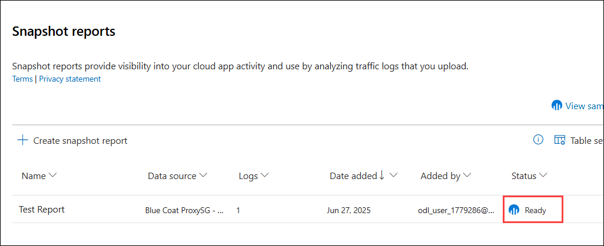
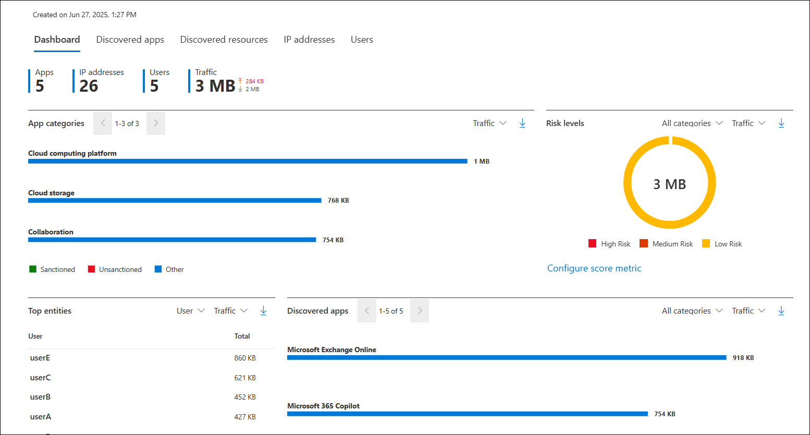

# Lab 7: Microsoft Defender for Cloud Apps-Configuring Cloud Discovery 

## Overview

In this lab, you will configure Microsoft Defender for Cloud Apps to enable Cloud Discovery. You will integrate Microsoft Defender for Endpoint, enable the Cloud Apps advanced feature, and configure the Enforce App Access setting. You will then generate and upload a snapshot report from proxy logs to analyze discovered apps in your environment using the Cloud Discovery dashboard.

> **⚠ Important Usage Guidance:** Microsoft Defender for Cloud Apps may take several minutes to display new configurations or reports. If you do not see the expected options or results immediately, wait and refresh the page before proceeding.

1. In the Edge browser, log-in to Microsoft Defender portal using the following link: https://security.microsoft.com/ with the below username and password if prompted to sign in.

    - **Email/Username:** <inject key="AzureAdUserEmail"></inject>
 
       
 
   - **Password:** <inject key="AzureAdUserPassword"></inject>

       

1.  In the Microsoft Defender portal, navigate and click on **System**, then click on **Settings**.

     

1.  On the **Settings** page, click on **Endpoints**.

     

    > **Note:** In case you do not see **Defender for Endpoint**, then open a new tab in Edge browser and enter the following URL and wait for the configuration to be completed:
 
    > [https://security.microsoft.com/securitysettings/endpoints/integration?tid=](https://security.microsoft.com/securitysettings/endpoints/integration?tid=)

     

1.  On the **Endpoints** page, under the **General** section, click on **Advanced features**.

1.  Turn on the toggle for **Microsoft Defender for Cloud Apps**, then click on the **Save preferences** button.

    

1. Navigate back to **Settings** and choose **Cloud Apps**

   

    > **Note:** It may take a few minutes for the **Cloud Apps** section to appear. If you don’t see it immediately, wait and refresh the page.

1. Under Cloud Discovery, choose **Microsoft Defender for Endpoint** and enable **Enforce App Access**

   

1. Scroll down and under Cloud Discovery, select **Snapshot reports** .

   

1. Click on **Create Snapshot Report**

   

1. In the window that appears, click **Next**.

   

1. For the **Report Name** give the name as **Test Report** (1), for source click on the dropdown and select **Blue Coat ProxySG- Access log (W3C)** and click **Next** (3)

   

1. In the Upload section, click on **Browse** and browse to C:/Lab Files and select the  **bluecoat_sample.log** file.

   

   

1. Once you have uploaded, click on **Upload Logs**. You will get a prompt stating that the snapshot report is being generated. Click on **CLose**.
   
   
   
1. You will be navigated to the **Snapshot Reports** page and notice that your report is being processed.

1. Wait until the status turns to **Ready**. This can take upto 10 minutes.

   

1. Once it is ready, click on the Test Report and you will be able to see the detailed Dashboard in the Cloud Discovery.

   

## Review

In this lab, you:
- Enabled the Microsoft Defender for Cloud Apps feature in Microsoft Defender for Endpoint.
- Configured Cloud Discovery with Enforce App Access.
- Created and uploaded a snapshot report from Blue Coat Proxy logs.
- Viewed and analyzed the generated Cloud Discovery dashboard.

## You have successfully completed the lab. Click on Next to Continue
