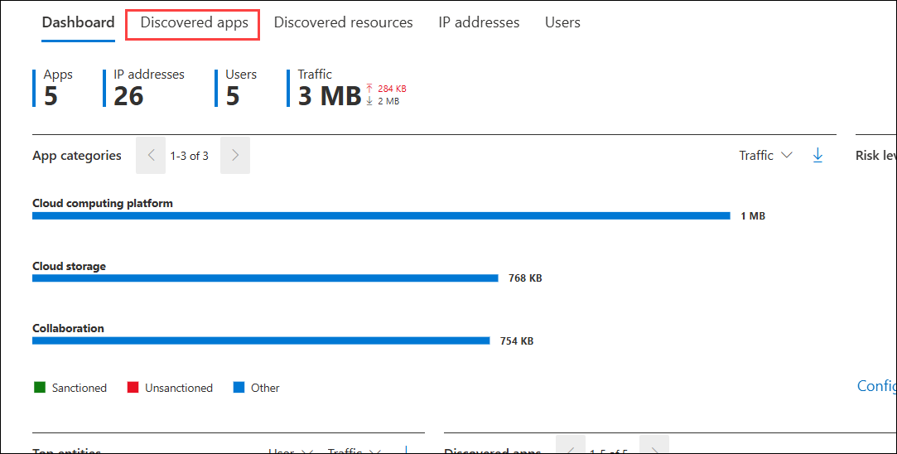
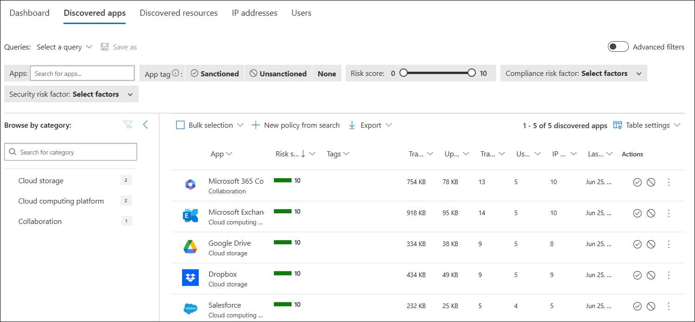
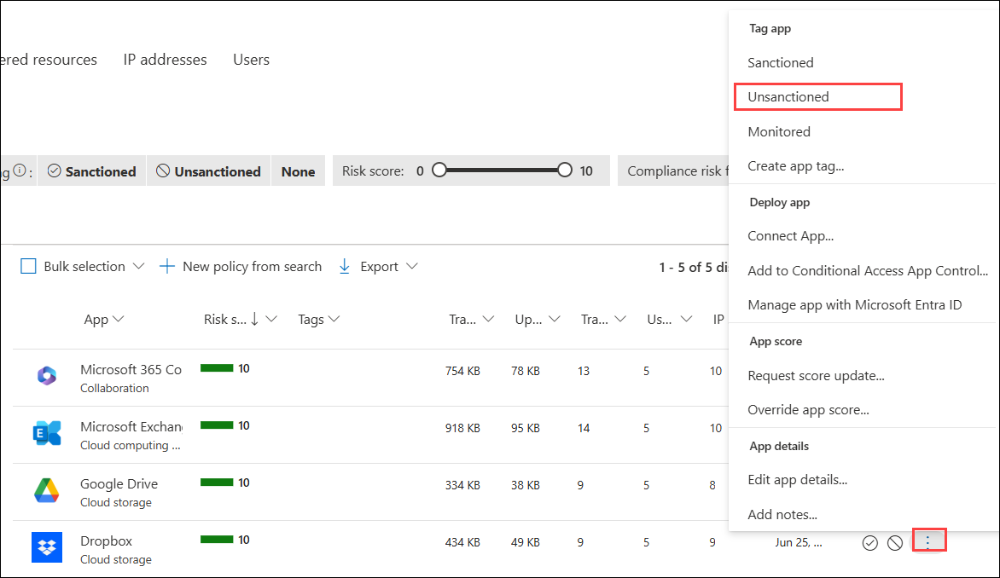

# Lab 7: Discover and Analyze Shadow IT Using Cloud Discovery

In this lab, you will analyze Cloud Discovery reports in Microsoft Defender for Cloud Apps to identify and address Shadow IT. You will review summary metrics, app categories, risk levels, top users, and discovered apps. You will also mark unsanctioned applications to help enforce usage policies and monitor non-approved services.

> **⚠ Important Usage Guidance:** Microsoft Defender for Office 365 may take some time to load certain results or complete specific labs from the backend. This is expected behavior. If the data does not appear after a couple of refresh attempts, proceed with the next lab and return later to check the results.

1. Analyze the report for the following options:

    - **Check the Summary Metrics:** Look at the total number of apps, users, IP addresses, and traffic volume to understand the overall cloud usage.
    
    - **Review App Categories**: Identify which categories (e.g., Cloud Computing, Storage, Collaboration) are using the most bandwidth and check if any unsanctioned apps are involved.
    
    - **Analyze Risk Levels**: Use the risk level chart to see how much traffic is coming from low, medium, or high-risk apps—focus on medium/high risk.
    
    - **Identify Top Users**: Check the “Top entities” section to see which users are generating the most traffic, especially to risky or unsanctioned apps.
    
    - **Inspect Discovered Apps**: Review the list of apps in use, their traffic volume, and verify if they are approved or need to be blocked or reviewed further.

1. In the dashboard, navigate to **Discovered Apps** section.

   

1. This section lists all discovered apps, showing their risk score, traffic volume, number of users, and last activity.

   

1. Click on the elipsis next to any of the applications to mark the app as **Unsactioned**. This action labels the app as not approved for use, helping you monitor and report on its usage in the dashboard.

   

## Review

In this lab, you:
- Reviewed summary metrics to understand overall cloud usage.
- Analyzed app categories, risk levels, and top users.
- Inspected discovered apps to identify risky or unapproved services.
- Marked applications as unsanctioned for better monitoring and control.

## You have successfully completed the lab. Click on Next to Continue
