# Lab 8: Connect and Onboard a SaaS App to Microsoft Defender for Cloud Apps

In this lab, you will connect and onboard a SaaS application—Microsoft 365—to Microsoft Defender for Cloud Apps. You will configure Conditional Access App Control policies in Microsoft Entra ID, enable file monitoring, and connect Microsoft 365 through the App Connectors page. This ensures visibility into user activity, enforces session controls, and enhances data security for your SaaS environment.

> **⚠ Important Usage Guidance:** Microsoft Defender for Office 365 may take some time to load certain results or complete specific labs from the backend. This is expected behavior. If the data does not appear after a couple of refresh attempts, proceed with the next lab and return later to check the results.

1. Navigate to Azure portal from the below link 

    ```
    https://portal.azure.com
    ```

1. In the search bar, type **Microsoft Entra ID** and select it.

   

1. In the **Overview** pane, select **Users (1)** under the **Manage (2)** section.
  
   

1. From the list of users, click on **<inject key="AzureAdUserEmail"></inject>**
  
   

1. In the user blade, click on **Licenses** and ensure **Microsoft 365 E5 (no Teams)** license is assigned and active.
  
   
  
1. Go back to the **Azure portal** tab. In the search bar at the top, enter **Windows Azure Active Directory**, and then select it from the search results.
  
    

1. On the **Windows Azure Active Directory** page, click on **Security (1)**, then select **Conditional Access (2)**, and on the Conditional Access page, click on **+ New policy (3)**.
  
    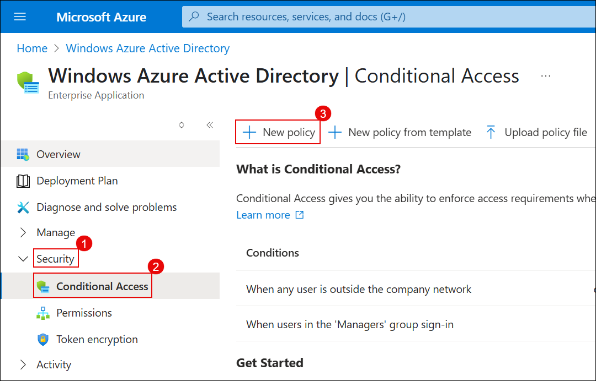

1. Name the policy: `MCAS – M365 Session Control`.

1. Under the **Assignments** section, under **Users**, select the **Specific users included (1)** option.

1. Select the **Select users and groups (3)** radio button and check the box beside **Users and groups (4)**, then click on **0 users and groups selected (5)**.
  
    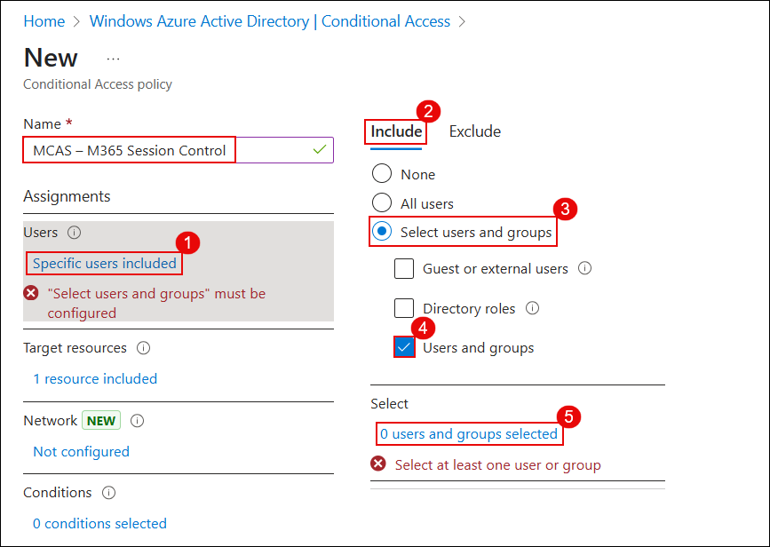

1. In the **Select users and groups** window, search for **<inject key="AzureAdUserEmail"></inject> (1)**, check the box (2)beside the user, and click **Select (3)**.
  
    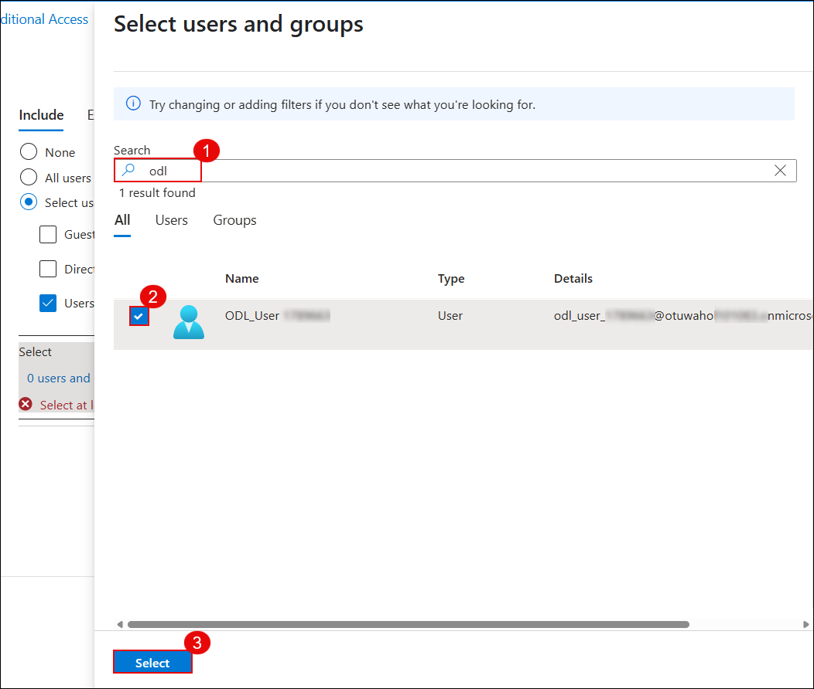

1. You’ll now see your selected user listed under **Users**.
  
    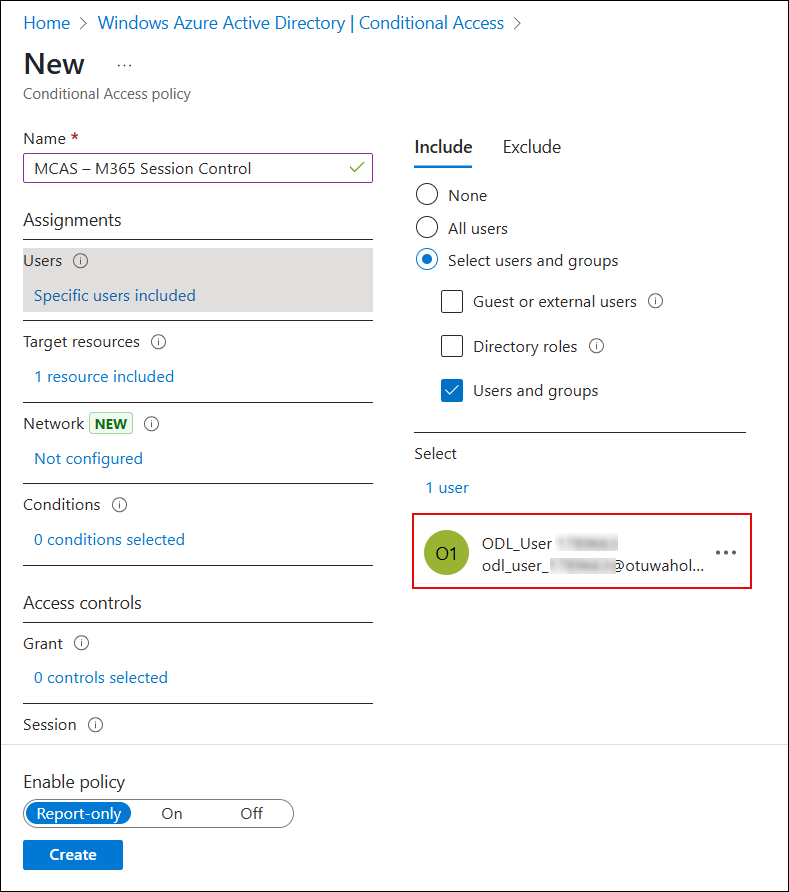

1. Under **Assignments > Target resources**, click on the **0 resource included (1)** link and ensure the radio button beside **Select resources (3)** is selected.

1. Click on **Windows Azure Active Directory (4)**, then in the **Select** pane, check the box for **Office 365 (5)**, and click **Select (6)**.
  
    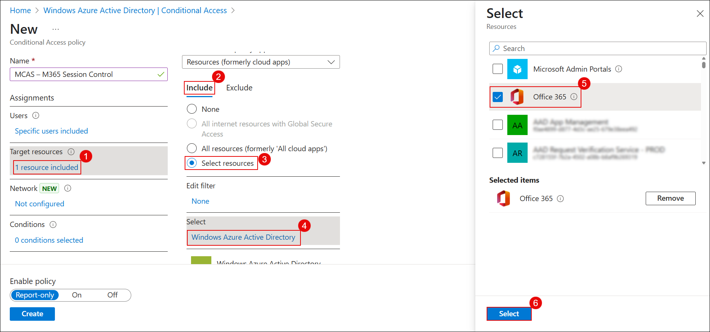

1. Under **Access controls > Session**, click on the **0 controls selected (1)** link.

1. In the Session pane, check the box for **Use Conditional Access App Control (2)**, ensure **Use custom policy (3)** is selected from the dropdown, then click **Select (4)**.
  
    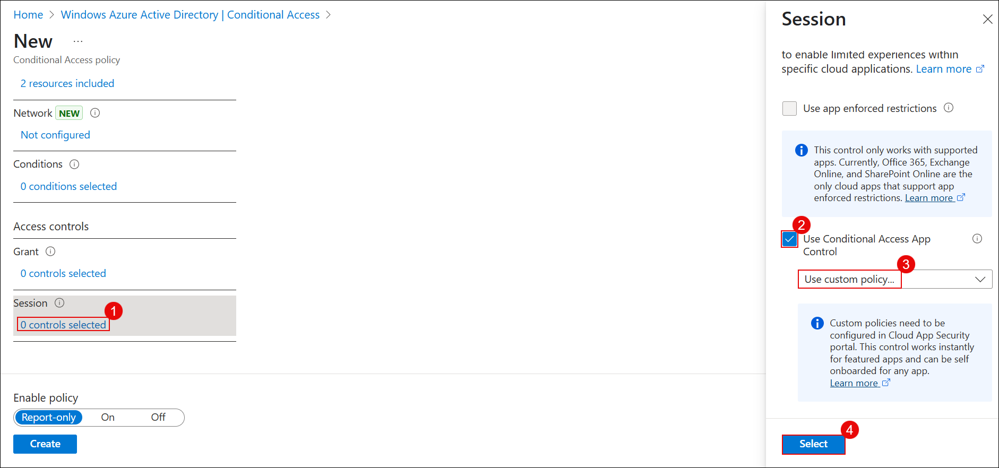

1. Scroll down, toggle **Enable policy** to **On (1)**, and click **Create (2)**.
  
    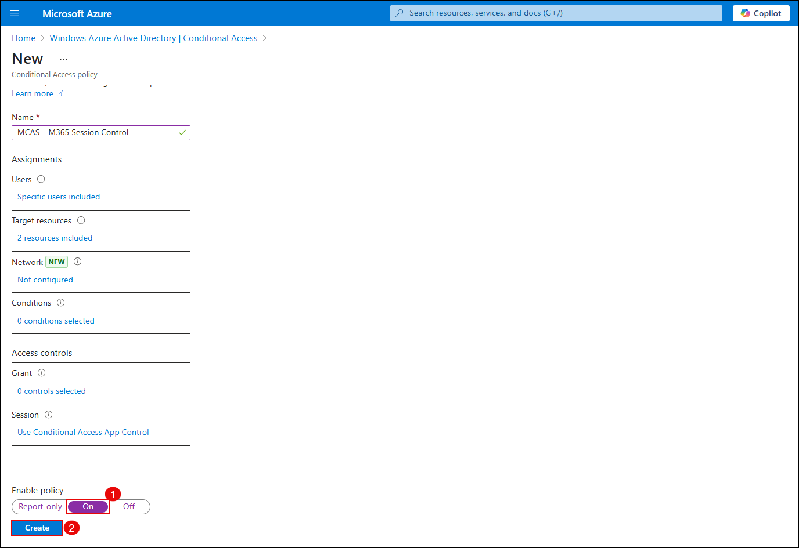

1. In the **Microsoft Defender** portal, select **Settings (1)** from the left navigation pane, and then click **Cloud Apps (2)** from the list on the **Settings** page.  

   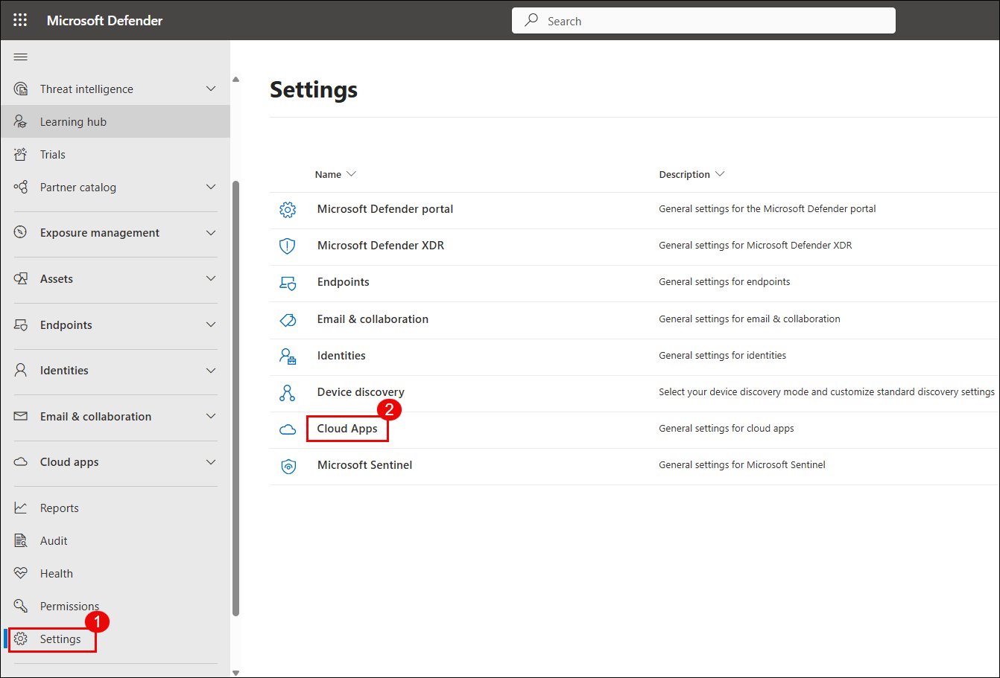

1. On the **Cloud apps** settings page, expand **Information Protection (1)**, select **Files (2)**, check **Enable file monitoring (3)**, and then click **Save (4)**.

   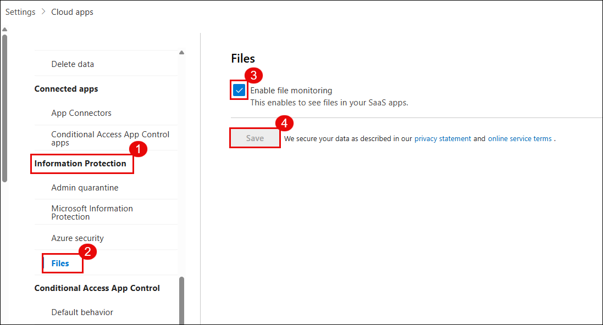

1. On the **Cloud apps** settings page, expand **Connected apps (1)**, select **App Connectors (2)**, click **Connect an app (3)**, and then choose **Microsoft 365** from the list.  

   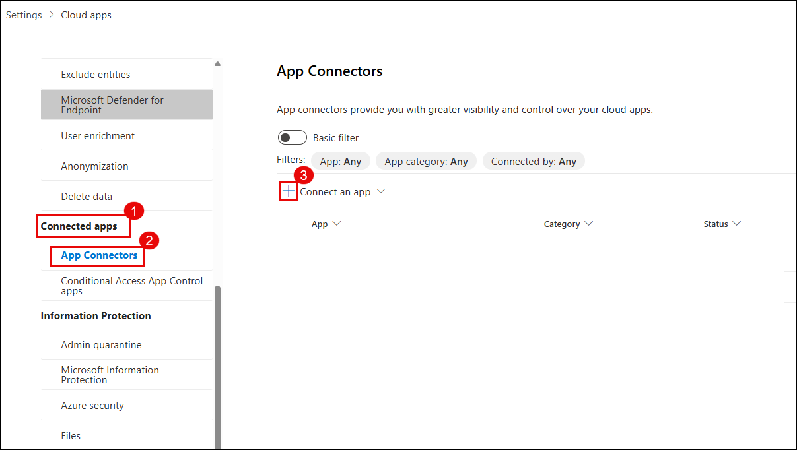

1. On the **Select Microsoft 365 components** page, ensure all components are checked, and then click **Connect Microsoft 365**.  

   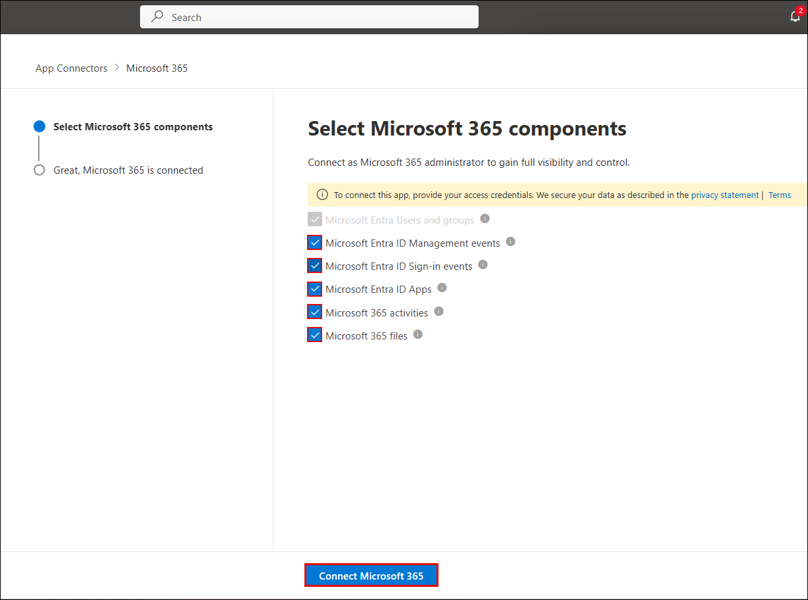

1. On the confirmation page, once the connection is established, click **Done** to complete the Microsoft 365 connector setup. 

   

1. Under the **Connected apps** section, click on **App Connectors**. On the **App connectors** page, select the checkbox beside **Microsoft 365**, then click on **+ Connect Microsoft Azure instance**.
  
    

1. Click **Connect Microsoft 365** and complete the authentication.

1. After successful connection, you will see the confirmation message: **“Great, Microsoft 365 is connected.”**, Click **Done**
 
    

1. On the **App Connectors** page, verify that Microsoft 365 and Microsoft Azure shows **Connected** status.
  
    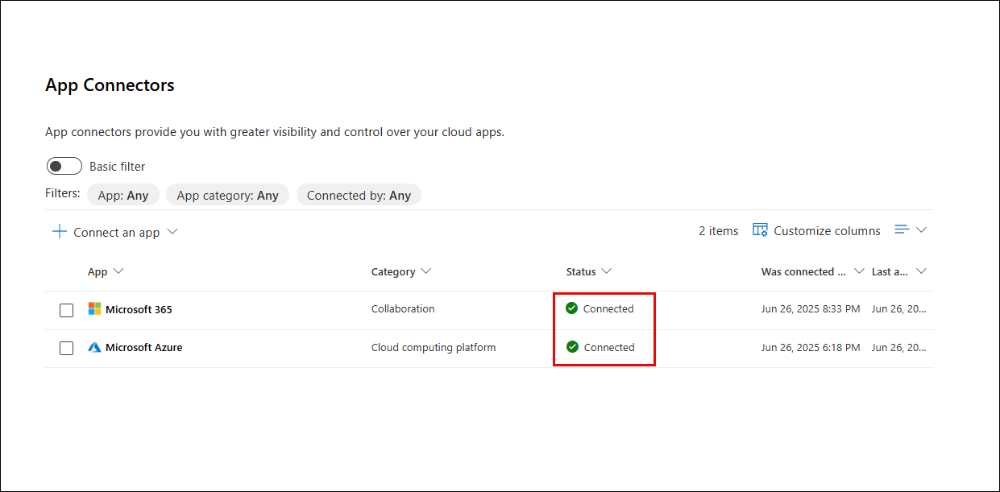

   > **Note:** It may take **2–4 hours** for the SaaS app to fully connect and display data. Kindly proceed with the next lab and return later to verify the connection status.

1. Under **Connected apps (1)**, select **Conditional Access App Control apps (2)**.

1. Locate and click the ellipsis (**⋮**) **3** next to **Microsoft SharePoint Online – General**, then choose **View settings in Microsoft Entra ID (4)**.

   

   > **Note:** If you're unable to view **SharePoint Online**, open an incognito browser window and navigate to [https://www.office.com](https://www.office.com).
   
   > **Note:** Sign in using your lab credentials. From the left pane, go to **Apps** → **SharePoint**.
   
   > **Note:** Then, return to the Conditional Access page and refresh it to load the app properly.

1. In the **Enterprise applications** blade, click **Microsoft Graph Command Line Tools**.

   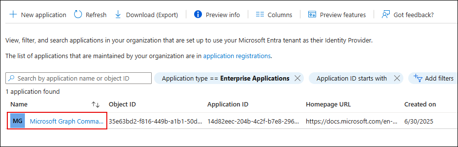

1. On the overview page, under **3. Conditional Access**, click **Create a policy**.

   

1. Click **+ New policy** to define a custom access rule for the application.

   

> **Note:** After completing this configuration, go back and repeat steps **9–17** to ensure your Conditional Access App Control policy is correctly applied to **Microsoft Graph Command Line Tools** as well.

> **Congratulations** on completing the task! Now, it's time to validate it. Here are the steps:
> - Hit the Validate button for the corresponding task. If you receive a success message, you can proceed to the next task. 
> - If not, carefully read the error message and retry the step, following the instructions in the lab guide.
> - If you need any assistance, please contact us at cloudlabs-support@spektrasystems.com. We are available 24/7 to help you out.
<validation step="9f057433-ff07-464c-8cdf-ff250fa5f83c" />

## Review

In this lab, you have completed the following:

- Verified that the lab user had the required **Microsoft 365 E5 license**.  
- Configured a **Conditional Access policy** with session controls for Microsoft 365.  
- Enabled **file monitoring** in Microsoft Defender for Cloud Apps.  
- Connected Microsoft 365 through **App Connectors** and confirmed its status.  
- Applied **Conditional Access App Control** to apps such as SharePoint Online.  

## You have successfully completed the lab. Click on Next to Continue

  
