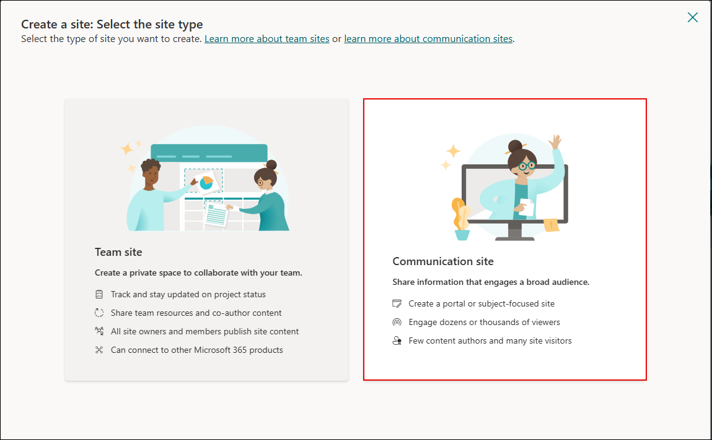
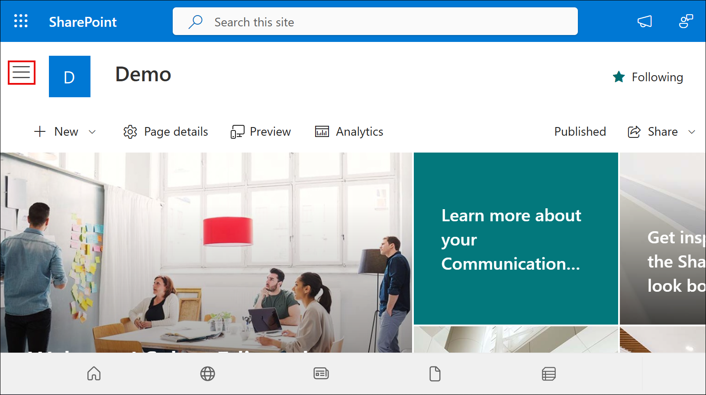
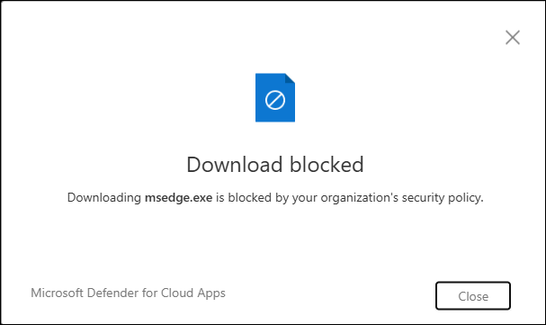

# Lab 9: Configure Session Policies to Monitor and Block Risky Behavior

## Overview

In this lab, you will configure a Session Policy in Microsoft Defender for Cloud Apps to monitor and block risky behavior. The policy will target non-compliant devices and prevent downloads of high-risk file types from Microsoft SharePoint Online. You will validate the configuration by attempting to download a blocked executable file, ensuring that the session policy enforcement works as intended.

> **⚠ Important Usage Guidance:** Conditional Access and session policies may take several minutes to apply. If policy enforcement does not trigger immediately, wait and retry the action in a new browser session or incognito mode.

1. In Microsoft Defender portal go to **Cloud Apps** → **Policy management**.

1. On the **Policy management** page, in the **All policies** section click on **+ Create policy**, then select **Session policy**.
  
   

1. Configure the policy settings:
   - **Policy template**: `No template`
   - **Policy name**: `Block-All-Download`
   - **Policy severity**: Choose high (red)
   - **Category**: `Threat detection`
   - **Session control type**: `Control file download (with inspection)`
   - **Filters**:  
   - Device tag `does not equal` → `Intune compliant, Microsoft Entra Hybrid joined`  
   - App `equals` → `Microsoft SharePoint Online`

     
   > **Note**: On the **Apply template?** dialog box, click on the **Cancel** button.

1. Scroll to **Files matching all of the following** and configure the following:
   - Filter by **Extension** → `exe` OR `apk`
   - Under **Actions**, select **Block**

      

1. Click **Create** to save and activate the policy.

   

   > Note: Ensure your Conditional Access policy is routing sessions through Microsoft Defender for Cloud.

1. Right-click the **Microsoft Edge** shortcut on the **Desktop**, select **Send to (2)** → **Documents (3)** to send a copy of the shortcut to the Documents folder.

   

1. Open an incognito browser and go to https://www.office.com.

1. Sign in using your lab credentials and from the left pane, go to **Apps** → **SharePoint**.

1. Click on **+ Create site**.

   

1. Then select **Communication site**.

   

1. Click **Standard communication (template)** and then select **Use template**.

1. Enter the **Site name** as `Demo` or any name of your choice, then click on the **Next** button.

   

1. Under the **Select a language** field, ensure that **English** is selected, then click on the **Create site** button.

   

1. On the **Demo** site, click on the **three horizontal bars** (☰) on the top-left corner.

   

1. Navigate the left-hand menu and click on **Documents**.

   

1. Click on **Upload**, then select **Files**.

   

1. Navigate and click on **Documents**, then select **Microsoft Edge** application. Now, click on the **Open** button.

   
   
   > **Note**: If `msedge.exe` is not available in the **Documents** folder, navigate to `C:\Program Files (x86)\Microsoft\Edge\Application`, locate `msedge` (the executable file), and upload it from there.

1. `msedge.exe` is successfully uploaded. Now, click on it.

   

1. Click on the **Download** button.
  
   

1. The download should be blocked with a message:  
    **"Download blocked – Downloading msedge.exe is blocked by your organization’s security policy."**
  
    

## Review

In this lab, you:
- Created a high-severity Session Policy in Microsoft Defender for Cloud Apps.
- Configured filters to target non-compliant devices accessing Microsoft SharePoint Online.
- Set file inspection rules to block downloads of specific file types such as `.exe` and `.apk`.
- Validated the policy by attempting to download a blocked executable and confirming that it was successfully blocked.

## You have successfully completed the lab. Click on Next to Continue
