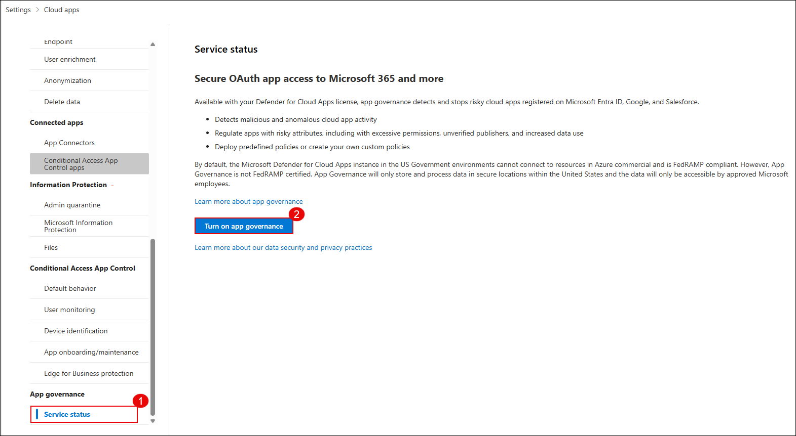
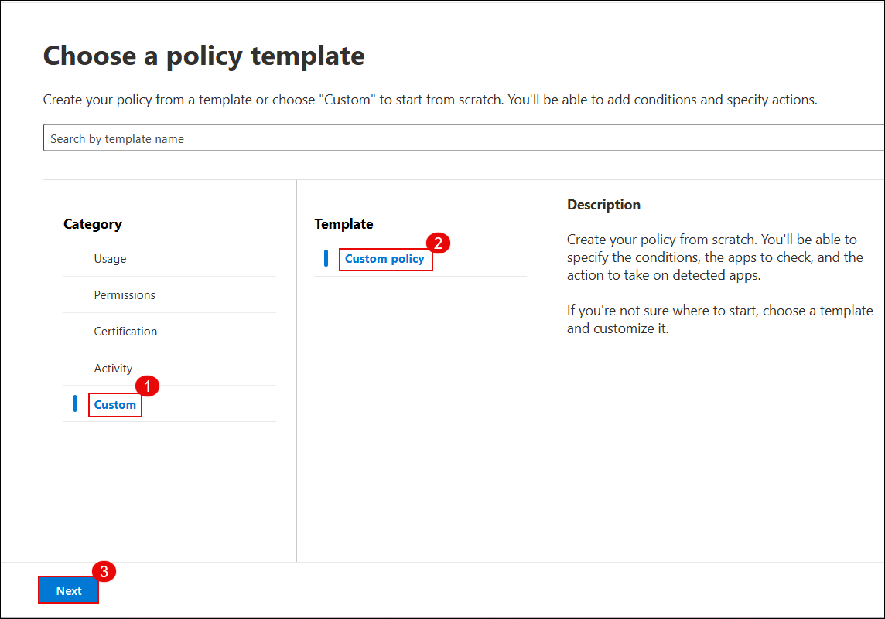
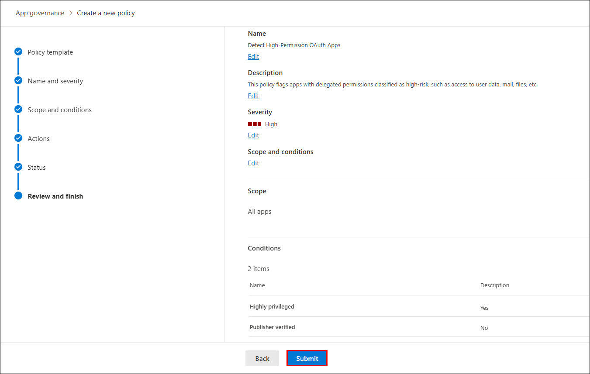

# Lab 10: Implement App Governance and Risk Detection for OAuth Apps

In this lab, you will implement App Governance in Microsoft Defender for Cloud Apps to detect and mitigate risks from OAuth applications. You will review high-risk apps with elevated permissions, create a custom detection policy targeting unverified publishers and highly privileged permissions, and configure automated remediation actions such as disabling risky apps.

> **⚠ Important Usage Guidance:** Microsoft Defender for Office 365 may take some time to load certain results or complete specific labs from the backend. This is expected behavior. If the data does not appear after a couple of refresh attempts, proceed with the next lab and return later to check the results.

1. On the **Microsoft Defender portal**, go to **System (1)** > **Settings (2)** and click **Cloud Apps (3)**.

   

1. Under **App governance**, select **Service status (1)** and click **Turn on app governance (2)**.

   

   > App Governance is now activated. It will begin evaluating connected OAuth apps and generating insights into their behavior and risk posture.

1. On the OAuth apps page, click **Go to app governance**.

   

   > You may be redirected to the new App Governance interface.

   > **Note:** It may take 5 hours for the Microsoft Defender portal to enable OAuth apps in App Governance. Continue with the next step in the lab and check the status later.

1. On a new tab in the **Microsoft Edge** browser, go to [https://security.microsoft.com](https://security.microsoft.com).

1. On the **Microsoft Defender portal**, in the left menu, go to **Cloud apps (1)** > **App governance (2)**, scroll down and select any app, such as **Microsoft Graph Command Line Tools (3)**, from the listed apps.

   

1. In the AuditLogApp details pane, select the **Permissions (1)** tab and review the permissions classified as **High privilege (2)**.

   

   > You've now reviewed an OAuth app's access level and identified potentially risky permissions that may require action.

1. Close the pane, and go to the **Policies (1)** tab > select **Microsoft 365 (2)**, then click **Create policy (3)** under *Regulate app use*

   

1. In the **Choose a policy template** pane, select **Custom (1)** > **Custom policy (2)** and click **Next (3)**.

   

1. Name the policy as **Detect High-Permission OAuth Apps (1)**, set **Severity to High (2)**, and click **Next (3)**.

   

1. Select **No, I’ll customize the policy (1)**, then click **Next (2)**.

   

1. Under policy scope, select **All apps (1)** and click **Next (2)**.

   

1. On the *Set policy scope and conditions*, click on **Edit conditions**.

   

1. Configure the policy conditions delete the **existing condition** and add the following condition by clicking on **+ Add condition**
   - Set **Highly privileged (1)** to **Yes (2)**  
   - Set **Publisher verified (3)** to **No (4)**  
   - Click **Save (5)**

   

1. In the **Set policy action** step, check the **Disable app (1)** checkbox and click **Next (2)**.

   

1. Set the policy status to **Active (1)** and click **Next (2)**.

   

1. Review the policy settings and click **Submit** to create the policy.

   

1. On the confirmation screen, click **Done** to finish.

   

   > The detection policy is now active and will monitor all onboarded OAuth apps for risky permissions and unverified publishers.

1. Navigate back to the **App governance** overview page and click **View all apps** to analyze detected apps.

   

1. In the **Microsoft 365 (1)** tab, notice apps flagged with a **High (2)** privilege level.

   

1. Go to **Incidents & alerts (1)** > **Incidents (2)**, and click the incident **Detect High-Permission OAuth Apps (3)**.

   

1. In the incident details pane, review the violation summary, app, and policy triggered and close the pane.

   

> **Note:** After creating and applying the detection policy, it may take up to **3 hours** for the related incident to be generated and appear in the **Incidents** list. If the incident is not visible immediately, continue with the lab and check back later. 

## Review

In this lab, you:

- Reviewed **OAuth app permissions** and identified high-privilege access.  
- Created a **custom detection policy** targeting unverified publishers and elevated permissions.  
- Configured the policy to automatically **disable risky OAuth apps**.  
- Verified flagged apps in **App Governance** and reviewed related incidents in the Microsoft Defender portal.  

## You have successfully completed the lab. Click on Next to Continue

  
