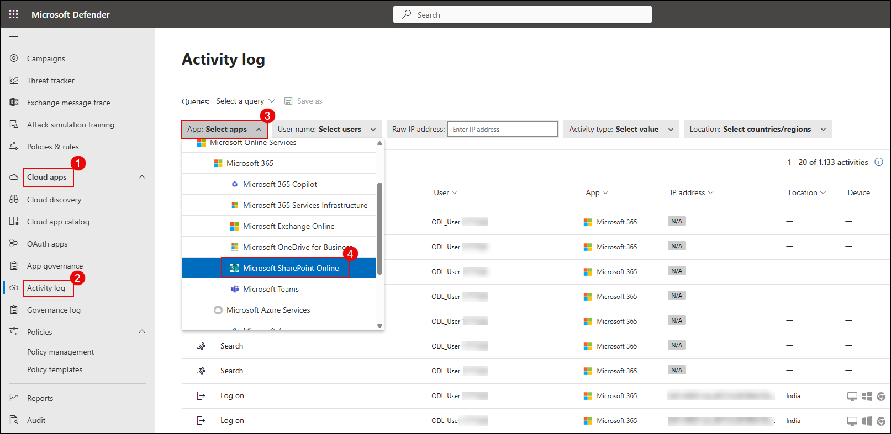

## Lab 11: Investigate Alerts and Create Custom Detection Policies

## Overview

In this lab, you will investigate alerts in Microsoft Defender for Cloud Apps, trace suspicious activities through the activity log, and create a custom detection policy to flag and respond to risky file downloads. You will simulate a detection event and verify that the system correctly triggers and notifies you via an alert email.

> **⚠ Important:** Alerts may take a few minutes to appear. If you don’t see them immediately, wait and refresh before rechecking.

1. In the Microsoft Defender Portal, go to **Cloud Apps** → **Activity log**.

1. Under the **App** filter, click on **Select apps** (3), select **Microsoft SharePoint Online**
  
   

   > **Note:** Once selected, all user activities performed in SharePoint—such as file uploads, downloads, edits, and access attempts—will be visible in the activity log.

1. In the **Microsoft Defender portal**, navigate to **Incidents & alerts (1)**, select **Email & collaboration alerts (2)**, and locate the alert named **Block-All-Download (3)**.

   

1. Click the alert, then select **Open alert page**.
   
   

1. Click **Investigate in activity log**.
 
   

   

1. Go to **Cloud Apps** → **Policy management**, and click **Create policy** → **Activity policy**.

   

1. Configure the following:

   - **Policy template:** `No template`
   - **Policy name:** `Detect Suspicious File Download – msedge.exe`  
   - **Severity:** `High`  
   - **Category:** `Threat detection`  
   - **Act on:** `Single activity`  
   - **Activity type:** `Download file`  
   - **Files and folders:** `msedge.exe`  
   - **App:** `Microsoft SharePoint Online`
   
     

1. Click **Edit and preview results**, review matches, then click **Save filters**.

   

1. Under **Alerts**, enable **Send alert as email**, add a valid address, set daily alert limit to `5`.

1. Click **Create** to save and activate the policy.

    

1. Simulate a download again in SharePoint, and downloading `msedge.exe`.
    
    

    

    

1. Open your Outlook email inbox and locate the alert email titled `Alert - Detect Suspicious File Download – msedge.exe`.
   
    
    > **Note:** If you do not see the alert email, wait for 5–10 minutes and refresh your inbox.

1. In the portal, go to **Incidents & alerts** → **Alerts**, and open the alert.
   
    

1. Click **Open alert page** → **view incident page**.

    

1. Carefully review the event details:

    - User name  
    - File name  
    - App used  
    - IP address  
    - Device info  
    - Triggered policy
   
      

## Review

In this lab, you:
- Investigated the **Block-All-Download** alert and traced related activities in the activity log.
- Created a custom activity policy to detect suspicious downloads of `msedge.exe` from SharePoint Online.
- Configured the policy to send alert notifications by email.
- Simulated a download to trigger the alert and verified the alert details in Microsoft Defender.

## Day 1 Completed Successfully
