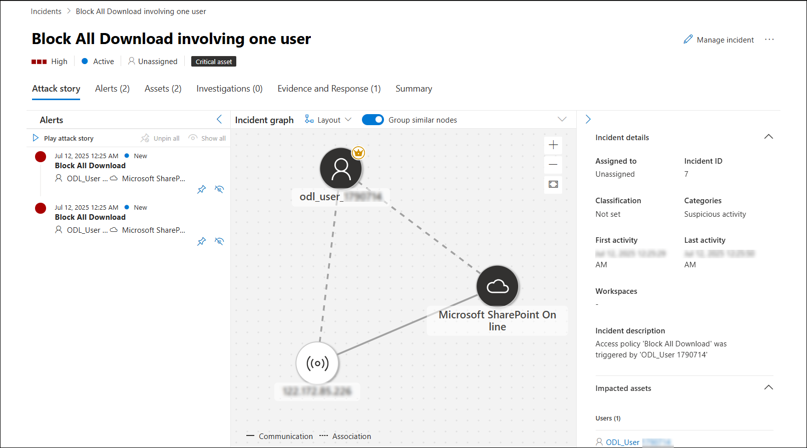

# Lab 11: Investigate Alerts and Create Custom Detection Policies

## Overview

In this lab, you will investigate alerts in Microsoft Defender for Cloud Apps, trace suspicious activities through the activity log, and create a custom detection policy to flag and respond to risky file downloads. You will simulate a detection event and verify that the system correctly triggers and notifies you via an alert email.

> **⚠ Important Usage Guidance:** Microsoft Defender for Office 365 may take some time to load certain results or complete specific labs from the backend. This is expected behavior. If the data does not appear after a couple of refresh attempts, proceed with the next lab and return later to check the results.

1. In the Microsoft Defender Portal, go to **Cloud Apps** → **Activity log**.

1. Under the **App** filter, click on **Select apps** (3), select **Microsoft SharePoint Online**.

   

   > **Note:** Once selected, all user activities performed in SharePoint—such as file uploads, downloads, edits, and access attempts—will be visible in the activity log.

1. In the **Microsoft Defender portal**, navigate to **Incidents & alerts (1)**, select **Alerts (2)**, and locate the alert named **Block-All-Download (3)**.

   

1. Click on **Investigate in activity log** and you will be redirected to the activity log page.

   

1. Click on **Download file: file msedge.exe** activity to view its details.

   

1. From the left pane, navigate to **Cloud Apps** → **Policy management (1)**, and click **Create policy (2)** → **Activity policy (3)**.

   

1. Configure the following and click **Edit and preview results (7)**:

   - **Policy template:** `No template` **(1)**
   - **Policy name:** `Detect Suspicious File Download – msedge.exe` **(2)**
   - **Severity:** `High` **(3)**
   - **Category:** `Threat detection` **(4)**
   - **Act on:** `Single activity` **(5)**
   - **Activity type**, `equals`, `Download file` **(6)**
   - **Files and folders**    `Name`, `equals`, `msedge.exe` **(6)**
   - **App:**,`equals`, `Microsoft SharePoint Online` **(6)**

      

1. Review matches in Select activity filters, then click **Save filters**.

   

1. Under **Alerts**, enable **Send alert as email (1)**, add **<inject key="AzureAdUserEmail"></inject>** **(2)** as the user email, set daily alert limit to `5` and click **Create (3)** to save and activate the policy.

   

1. Now, navigate back to SharePoint page, and simulate a download of `msedge.exe`.

   

   

   

1. Open your Outlook email inbox and locate the alert email titled `Alert - Detect Suspicious File Download – msedge.exe`.

   

   > **Note:** If you do not see the alert email, wait for 5–10 minutes and refresh your inbox.

1. In the portal, go to **Incidents & alerts** → **Alerts**, and open the alert.

   

1. Click **Open alert page** → **view incident page**.

   

1. Carefully review the event details:

   - User name
   - File name
   - App used
   - IP address
   - Device info
   - Triggered policy

      

## Review

In this lab, you have completed the following:

- Investigated the **Block-All-Download** alert and traced related activities in the **activity log**.  
- Created a **custom activity policy** to detect suspicious downloads of `msedge.exe` from SharePoint Online.  
- Configured the policy to send **alert notifications by email**.  
- Simulated a download to trigger the alert and verified the **alert details** in Microsoft Defender.  

## You have successfully completed Day 2.
