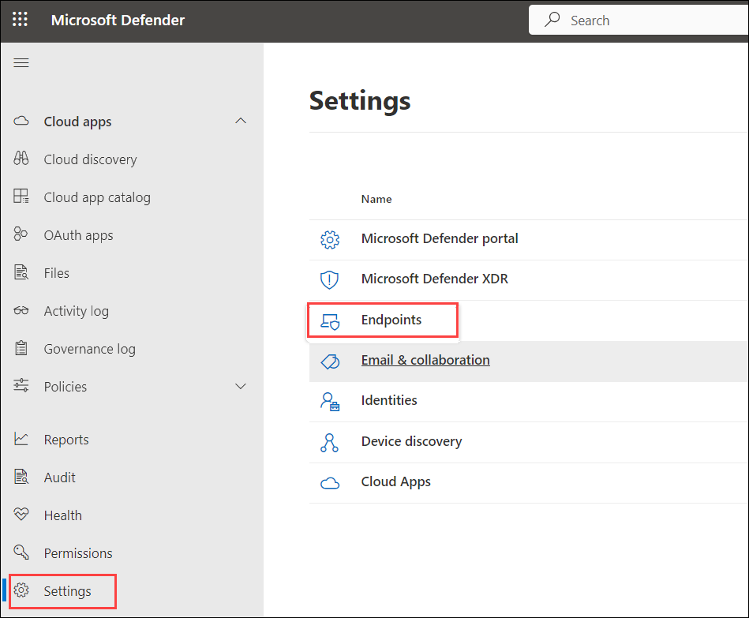

# Lab-14: Deploy Microsoft Defender for Identity Sensor on Domain Controllers

## Overview

In this lab, you will install and configure the Microsoft Defender for Identity sensor on a domain controller to monitor identity-based threats. You will first onboard the server to Microsoft Defender for Endpoint, promote it to a domain controller, and then deploy and activate the Defender for Identity sensor.

> **⚠ Important Usage Guidance:** Microsoft Defender for Office 365 may take some time to load certain results or complete specific labs from the backend. This is expected behavior. If the data does not appear after a couple of refresh attempts, proceed with the next lab and return later to check the results.

Install the AD DS role to enable the server to function as a domain controller.

1. Open a browser and go to the Microsoft Defender portal: https://security.microsoft.com. Sign in using the lab credentials.

1. If a pop-up introducing the improved security center appears after signing in, click the **X** in the top-right corner to skip the tour.

    

1. Navigate to **Settings** in the left menu bar, and then, on the Settings page, choose **Endpoints**.

    

    > **Note:** The **Endpoints** option under **Settings** may take a few moments to appear after the initial setup.  
    
    > If you don't see it right away, wait a minute and try refreshing the page.

1. Navigate to the **Onboarding** option in the Device Management section.

    >**Note:** Device onboarding can also be initiated from the **Assets** section on the left menu bar. Expand 'Assets' and choose 'Devices.' On the Device Inventory page, with 'Computers & Mobile' selected, scroll down to find the option for **Onboard devices.** Clicking on this option will direct you to the **Settings > Endpoints** page.

1. On the **Endpoints** page, under **Device management:**
      - Select **Onboarding (1)** and configure the following:  
      - Select **Windows Server 2019, 2022, and 2025 (2)** from the operating system drop-down.  
      - In the **Connectivity type** drop-down, select **Standard (3)**.  
      - In the **Deployment method** drop-down, choose **Local Script (for up to 10 devices) (4)**.  
      - Click **Download onboarding package (5)**.

         

1. In the **Downloads** pop-up:  
   - Select the **GatewayWindowsDefenderATPOnboardingPackage.zip** file.  
   - Click the folder icon to choose **Show in folder**.  
   - **Hint:** If you cannot locate the file, check the `C:\Users\admin\Downloads` directory.

       

1. Right-click on the downloaded zip file, choose **Extract All...**, ensure that **Show extracted files when complete** is checked, and then click **Extract**.

     

1. Right-click on the extracted file 'WindowsDefenderATPLocalOnboardingScript.cmd' and choose **Properties**. Tick the **Unblock** checkbox located in the bottom right of the Properties window, and then click **OK**.

     

1. Once again, right-click on the extracted file **WindowsDefenderATPLocalOnboardingScript.cmd** and opt for **Run as Administrator**. **Hint:** If the Windows SmartScreen window appears, click on **More info**, and then select **Run anyway**.
    
1. When the "User Account Control" window appears, select **Yes** to allow the script to run, answer **Y** to the question presented by the script, and press **Enter**. Once complete, you should see a message in the command screen that says *Successfully onboarded machine to Microsoft Defender for Endpoint*.

1. Press any key to continue. This action will close the Command Prompt window.

    

1. Back on the Onboarding page within the Microsoft 365 Defender portal, navigate to the "2. Run a detection test" section, and copy the detection test script by clicking the **Copy** button.

     

1. In the Windows search bar of the virtual machine, type **cmd (1)**, right-click **Command Prompt (2)**, and select **Run as administrator (3)**.

     

1. When the "User Account Control" window appears, select **Yes** to allow the app to run. 

1. Paste the script by right-clicking in the **Administrator: Command Prompt** window and press **Enter** to run it.

     

    >**Note:** The window closes automatically after running the script.

1. In the Microsoft 365 Defender portal, navigate to the left-hand menu, and under the **Assets** area, select **Devices**. If the device is not shown, proceed with the next task and return to check it later. It can take up to 60 minutes for the first device to be displayed in the portal.

     

    >**Note:** If you have completed the onboarding process and don't see devices in the Devices list after an hour, it might indicate an onboarding or connectivity problem.

1. In the Windows search bar, type **Server Manager (1)** and select **Server Manager (2)** from the results.

      

2. On the **Server Manager** dashboard, click **Add roles and features** under **Configure this local server**.

      

3. Configure the Wizard:
   - Select **Role-based or feature-based installation (1)**, then click **Next (2)**.

      

   - Choose your **Select a server from the server pool**, then click **Next**.
   - In the "Server Roles" list, check **Active Directory Domain Services (1)** then click **Next (2)**.

      

   - When prompted, click **Add Features** to include required tools, then click **Next**.
   - **Skip** the **Features** page by clicking **Next**.
   - Review the **AD DS** information page, then click **Next**.
   - Review your selections and click **Install**.
   - Wait for the installation to complete and click on **Close**.

      

      > **Note:** Do not close Server Manager after installation; the next step begins from there.

1. In **Server Manager**, click the yellow notification flag (1) and select **Promote this server to a domain controller (2)**.

      

1. In the wizard, select **Add a new forest** and enter the root domain name as `defenderxdr.internal`, then click **Next**.

      

1. Set Domain Controller Options:
   - Set both **Forest Functional Level** and **Domain Functional Level** to **Windows Server 2016** (or your server’s version).
   - Ensure **Domain Name System (DNS) server** is checked.
   - Enter a **Directory Services Restore Mode (DSRM)** password:  `P@ssw0rd123!` **(3)**, then click **Next (4)**.

      

   - Ignore DNS delegation warnings, click on **Next**.

      

   - Accept the default **NetBIOS domain name** `DEFENDERXDR`, then click **Next**.

      

   - Use default **paths** for the AD DS database, logs, and SYSVOL, then click **Next**.
   - Review your selections, then click **Next**.
   - Wait for the prerequisites check to complete, then click **Install**.

      

   - Wait for the process to complete; the server will restart automatically.

   > **Note:** The VM will restart now, wait for 5 minutes and **Reconnect** to the VM.

      

1. Go back to Microsoft Defender Portal, `security.microsoft.com`.
  
1. On the Microsoft Defender page, select **Settings** and select **Identities** and you will be navigated to **Microsoft Defender for Identity** page.

      

      >**Note:** Please wait while the **identities** page loads—this may take a few minutes.

1. Click on **Sensors** at the top, then select **Add sensor** in the top-right corner. On the **Simplify your installation process** pop-up, click **Continue with classic sensor**.

      

1. A pop-up will display a **Download installer** button and an **Access key**. Click **Download installer** to download `Azure ATP Sensor Setup.zip` and copy the **Access key** to your clipboard which will be used during the installation.

      
      
      > **Note:** If you do not see that the file is downloading, click on the **pop-up window button (1)** and then select **Always allow pop-ups and redirects from `https://security.microsoft.com` (2)** and click on **Done (3)** and **download** the file again.

      

1. In the extraction window, navigate to **C:\ATP (1)**, ensure the folder name is set to **ATP (2)**, and click **Select Folder (3)**.

      

    > **Note:** If the `ATP` folder does not exist in `C:\`, navigate to the **C:** drive, right-click in the window, select **New (2)**, and then choose **Folder (3)**. Name the folder **ATP** and extract the files into it.

      

1. In the **C:\ATP** folder, right-click **Azure ATP Sensor Setup (1)** and select **Run as administrator (2)**.

      

1. On the Setup wizard follow the below steps:
     - Choose the language and click **Next**.

         

     - Enter the **Access key (1)** copied earlier and click **Install (2)**.

         

     - Wait for the installation to complete and click **Finish**.

         

1. Return to the Microsoft Defender portal, go to **Settings** > **Identities** > **Sensors**, find the sensor for `defenderxdr.internal`, and verify that the **Status** shows **Running** within 5–10 minutes.

> **Congratulations** on completing the task! Now, it's time to validate it. Here are the steps:
> - Hit the Validate button for the corresponding task. If you receive a success message, you can proceed to the next task. 
> - If not, carefully read the error message and retry the step, following the instructions in the lab guide.
> - If you need any assistance, please contact us at cloudlabs-support@spektrasystems.com. We are available 24/7 to help you out.
<validation step="a35ecb78-8ff8-4873-9f92-37f3811cdc3f" />

## Review

In this lab, you:
- Onboarded the Windows Server to Microsoft Defender for Endpoint using the local script deployment method.
- Promoted the server to a domain controller with Active Directory Domain Services.
- Installed the Microsoft Defender for Identity sensor using the downloaded installer and access key.
- Verified that the sensor status changed to **Running** in the Defender for Identity portal.

## You have successfully completed the lab. Click on Next to Continue
