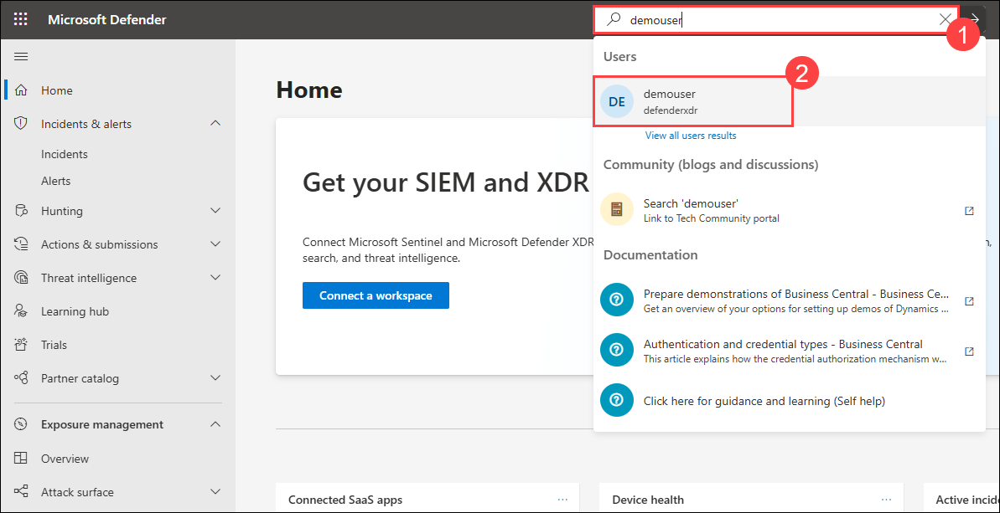
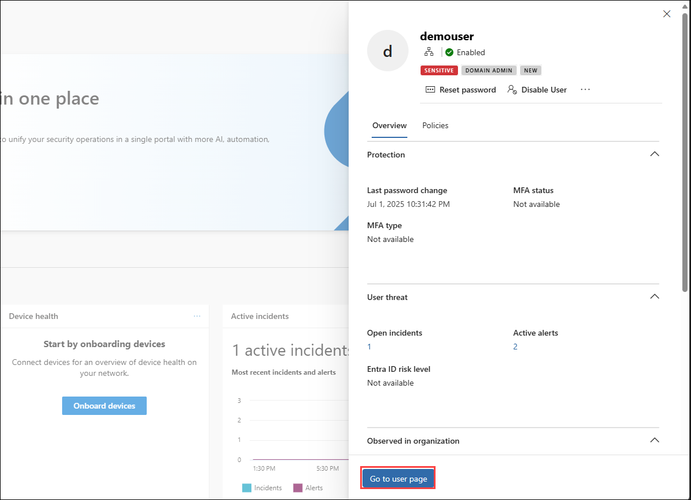
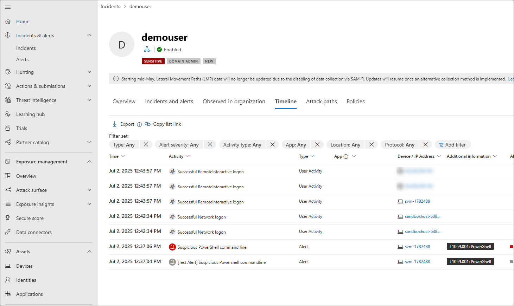

# Lab 16: Investigate Threats and User Timelines 

## Overview

In this lab, you will investigate a specific user’s activity by using the **Timeline** feature in Microsoft Defender. You will search for a user account, access their profile page, and review all recorded events and alerts to understand recent actions and potential threats.

> **⚠ Important Usage Guidance:** Microsoft Defender for Office 365 may take some time to load certain results or complete specific labs from the backend. This is expected behavior. If the data does not appear after a couple of refresh attempts, proceed with the next lab and return later to check the results.

In this task you will analyze using user timelines and alert details in the Defender portal.

1. In the Microsoft Defender portal, in the search bar, type `demouser` and select it.

      

1. Click on **Go to user page**

      

1. In the user profile, click the **Timeline** tab to view all events and alerts.

      

## Review

In this lab, you:
- Searched for a specific user (`demouser`) in the Microsoft Defender portal.
- Accessed the user profile page to view detailed account information.
- Reviewed the **Timeline** tab to analyze events and alerts related to the user.

## You have successfully completed the lab. Click on Next to Continue
