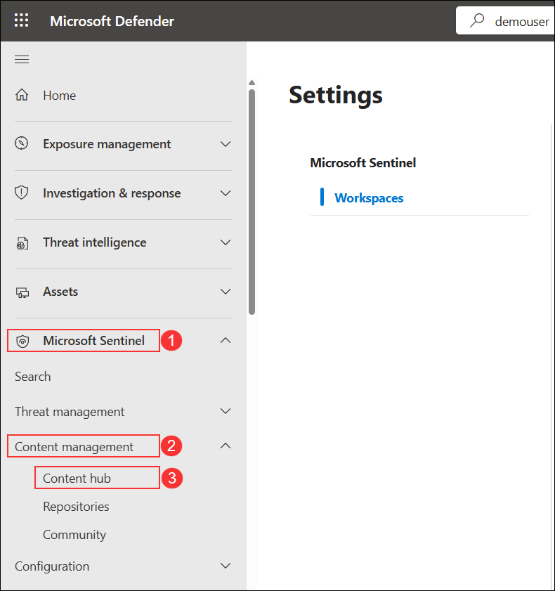
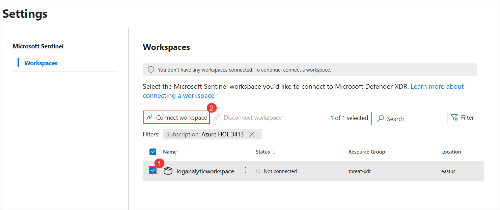
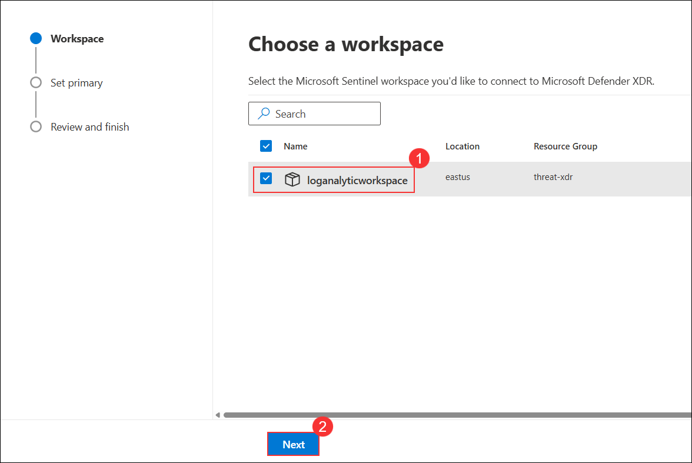
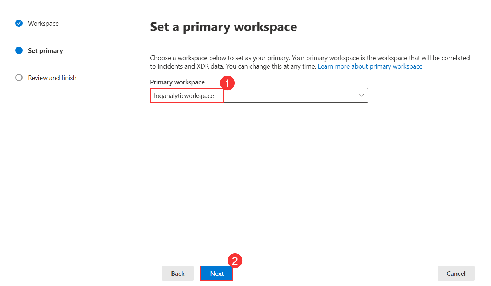
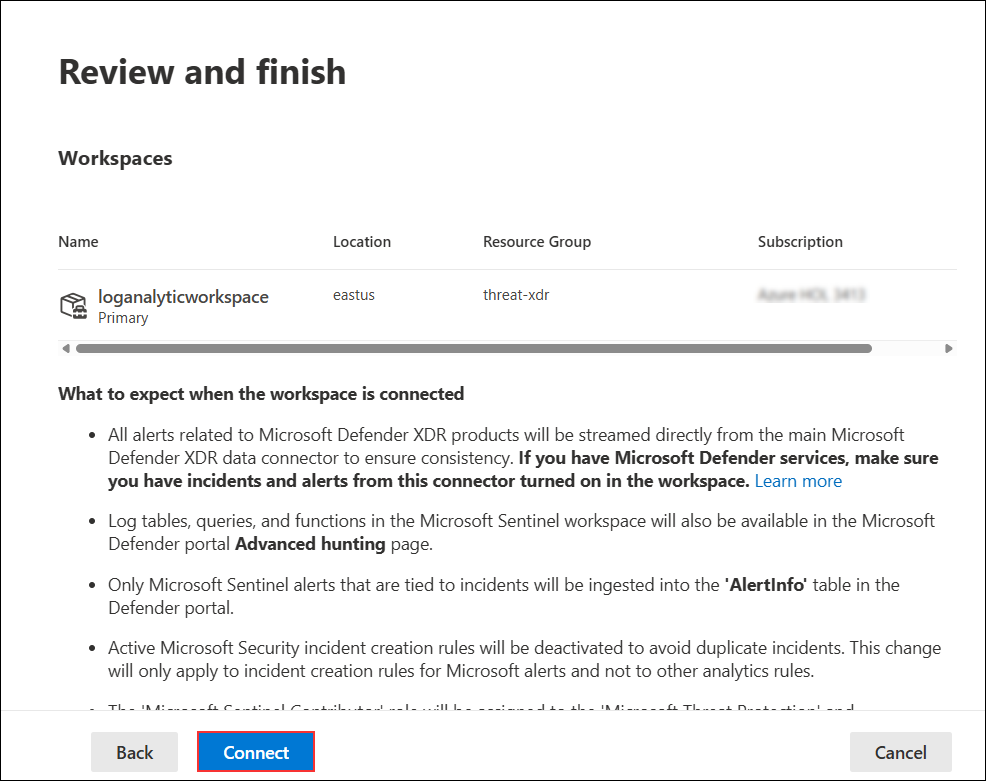
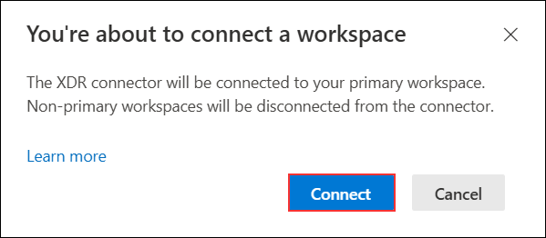
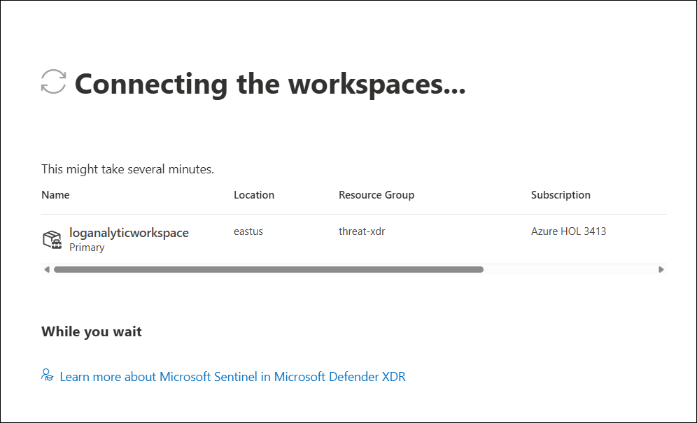
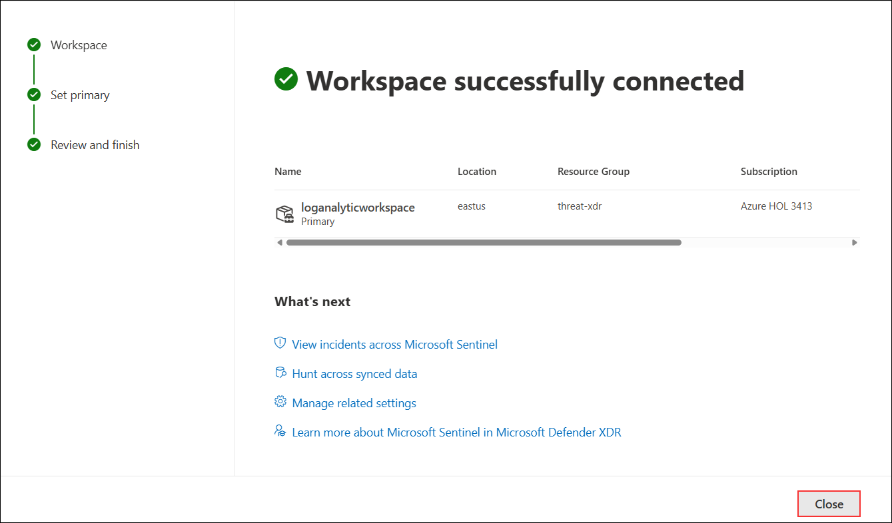
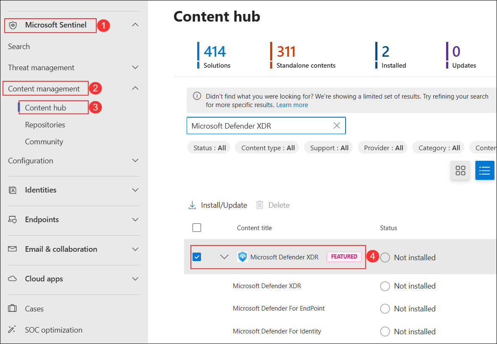
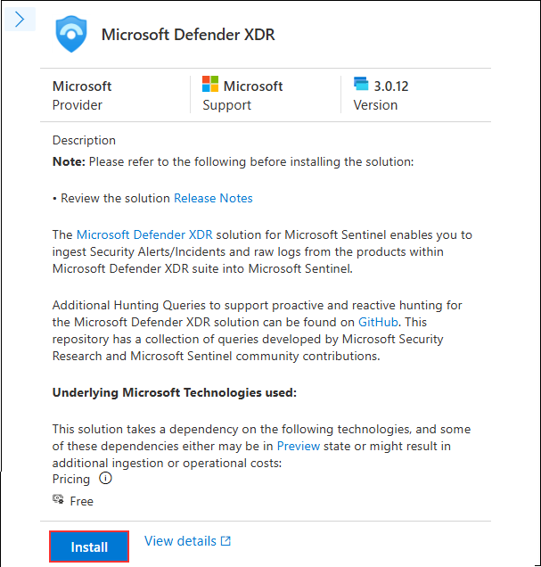

# Lab 15: Integrate Defender for Identity with Microsoft 365 Defender Portal

In this lab, you will integrate Microsoft Defender for Identity with the Microsoft 365 Defender portal and Microsoft Sentinel. This integration allows you to view Defender for Identity incidents alongside other security events in the unified Microsoft 365 Defender portal.

> **⚠ Important Usage Guidance:** Microsoft Defender for Office 365 may take some time to load certain results or complete specific labs from the backend. This is expected behavior. If the data does not appear after a couple of refresh attempts, proceed with the next lab and return later to check the results.

1. Open a browser and go to the **Microsoft Defender portal**: https://security.microsoft.com. **Sign in** using your lab credentials.

1. On the **Workspaces** page:
   - Select the checkbox for **loganalycticworkspace (1)**.
   - Click **Connect workspace (2)**.
   - Click **Content hub (3)**.

      

1. On the **Workspaces** page, select the checkbox for **loganalycticworkspace (1)** and click **Connect workspace (2)**.

   

   > **Note:** If you are already able to see the **Content hub** load, it means the workspace is already connected. In that case, you can skip directly to step 10.

1. On the **Choose a workspace** page, select the checkbox for **loganalycticworkspace (1)** and click **Next (2)**

   

1. On the **Set a primary workspace** page, verify that **loganalycticworkspace (1)** is selected in the **Primary workspace** drop-down and click **Next (2)**.

   

1. On the **Review and finish** page, review the selected workspace details and click **Connect**.

   

1. In the confirmation dialog, click **Connect** to proceed with connecting the workspace.

   

1. Wait while the connection process completes on the **Connecting the workspaces** page.

   

1. On the **Workspace successfully connected** page, click **Close** to finish.

   

   > **Note:** After the workspace connection is completed, it may take several minutes for all Microsoft Sentinel settings and data to fully load in the Defender portal.

1. On the **Microsoft Defender** portal, in the left navigation pane, select **Microsoft Sentinel (1)**, expand **Content management (2)**, and select **Content hub (3)**. In the search bar, type **Microsoft Defender XDR**, then select the checkbox for **Microsoft Defender XDR (4)** from the results.

   

1. On the **Microsoft Defender XDR** solution page, click **Install**.

   

## Review

In this lab, you:
- Connected the **loganalycticworkspace** to Microsoft 365 Defender.
- Verified and set it as the **primary workspace**.
- Installed the **Microsoft Defender XDR** solution from the Content Hub.

## You have successfully completed the lab. Click on Next to Continue

  
