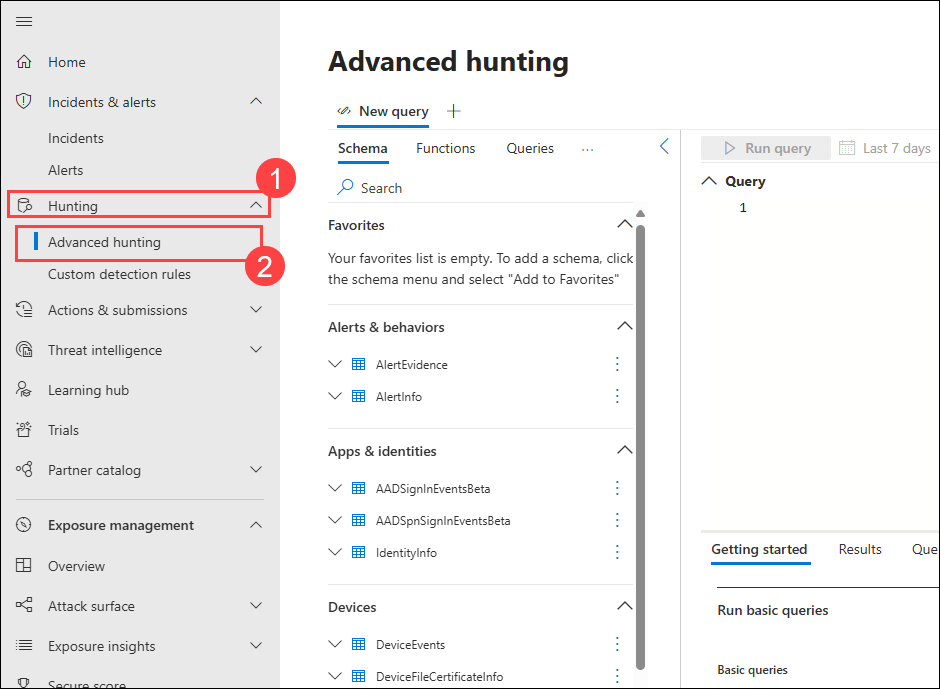
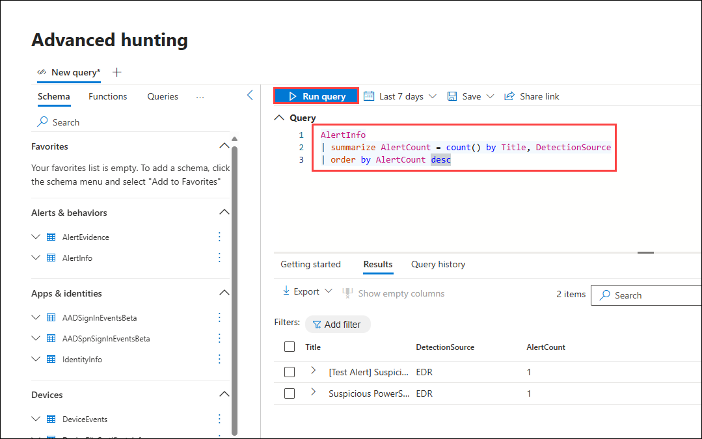
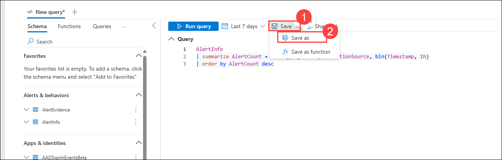

# Lab 16: Review and Run Advanced Hunting Queries for Identity Signals

In this lab, you will run advanced hunting queries in the Microsoft Defender portal to detect identity-based threats. Using KQL (Kusto Query Language), you will identify and analyze alerts related to lateral movement attacks.

> **⚠ Important Usage Guidance:** Microsoft Defender for Office 365 may take some time to load certain results or complete specific labs from the backend. This is expected behavior. If the data does not appear after a couple of refresh attempts, proceed with the next lab and return later to check the results.

1. In the **Microsoft Defender** portal, click **Hunting (1)** in the left-hand navigation pane and select **Advanced hunting (2)** from the menu.

   

1. In the query editor, paste the following KQL query to detect Lateral movement attacks:

   ```kql
   AlertInfo
   | summarize AlertCount = count() by Title, DetectionSource
   | order by AlertCount desc
   ```
   - Click **Run query** to execute.

      

1. Review the results table for all the alerts.

1. Click **Save** in the top-right corner.
   - Name the query as `Alert1`.
   - Select **Save**.

      

## Review

In this lab, you have completed the following:

- Opened the **Advanced hunting** section in the Microsoft Defender portal.  
- Executed a **KQL query** to detect identity-related alerts.  
- Reviewed and analyzed the query results.  
- Saved the hunting query for future use.  

## You have successfully completed the lab. Click on Next to Continue

  
