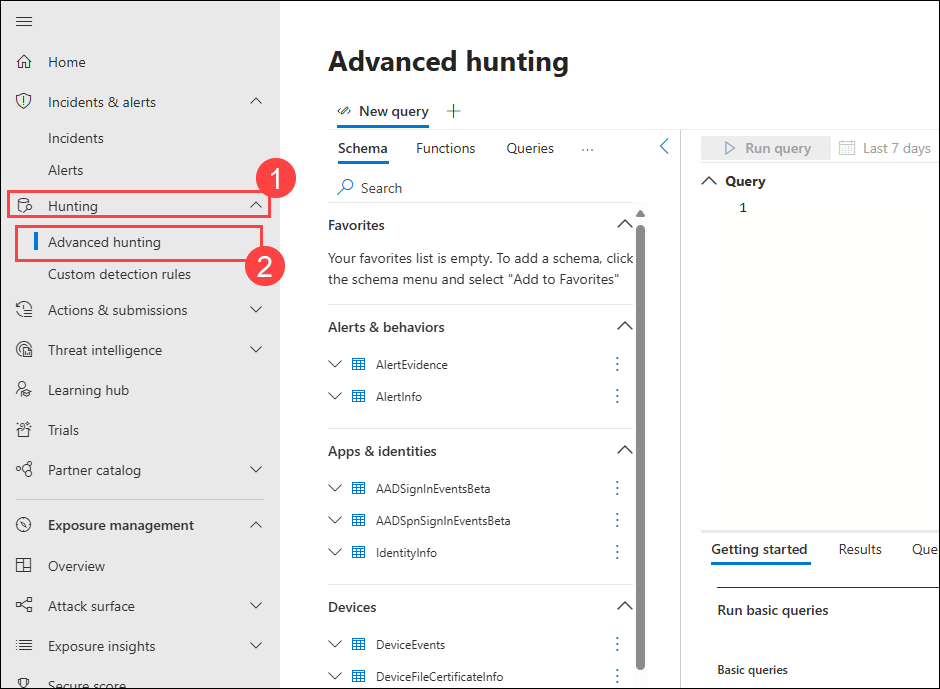
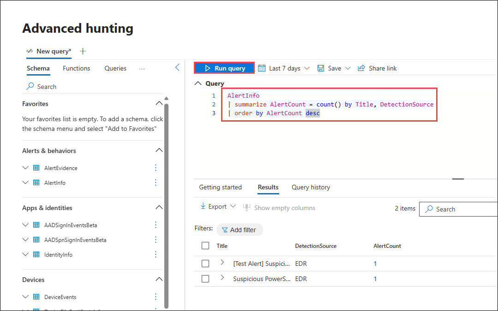

# Lab 17: Review and Run Advanced Hunting Queries for Identity Signals

In this task you will use advanced hunting queries in the Defender portal to detect identity-based threats.

1. In the **Microsoft Defender** portal, click **Hunting (1)** in the left-hand navigation pane and select **Advanced hunting (2)** from the menu.

      

1. In the query editor, paste the following KQL query to detect Lateral movement attacks:

   ```kql
   AlertInfo
   | summarize AlertCount = count() by Title, DetectionSource
   | order by AlertCount desc
   ```
   - Click **Run query** to execute.

      

1. Review the results table for all the alerts, 

1. Click **Save** in the top-right corner.
   - Name the query as `Alert1`.
   - Select **Save**.

      

## Review
