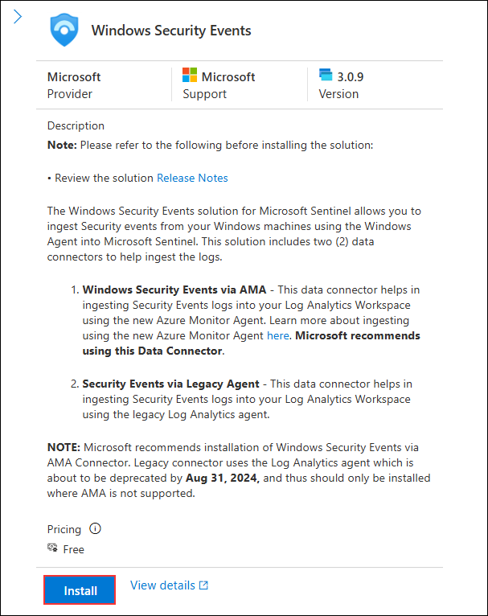
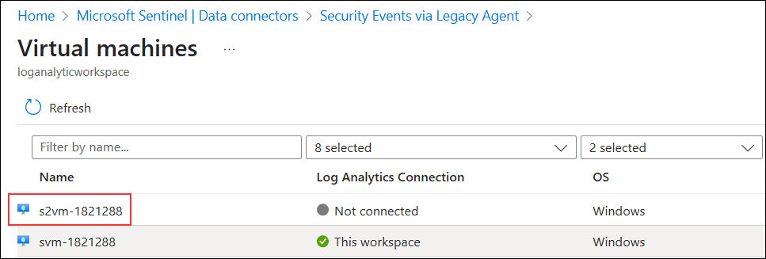

## Overview

In this lab, you will connect the **Windows Security Events** data connector in Microsoft Sentinel. This integration allows Sentinel to collect and analyze Windows security event logs from virtual machines for threat detection and investigation.

⚠ **Important Usage Guidance:** Microsoft Sentinel connectors may take some time to display a “Connected” status or start receiving event data after configuration. This is expected behavior. If the connection status does not update after a few minutes, proceed with the next lab and check back later.

# Task 1: Connect the Windows Security Event Connector

1. On the **Microsoft Defender** portal, in the left navigation pane:
   - Select **Microsoft Sentinel (1)**.
   - Expand **Content management (2)** and select **Content hub (3)**.

    

# Task 1: Connect the Windows security event connector

1. On the **Microsoft Defender** portal, in the left navigation pane, select **Microsoft Sentinel (1)**, expand **Content management (2)**, and select **Content hub (3)**.

    

1. On the **Content hub** page, in the search bar, type **Windows Security Events (1)**, then select the checkbox for **Windows Security Events (2)** from the results.

    

1. On the **Windows Security Events** solution page, click **Install**.

    

1. After receiving the notification of a successful installation, return to the Data Connector page and click on the refresh button to ensure that the changes take effect.

1. You should observe two options: **Security Events Via Legacy Agent** and **Windows Security Event Via AMA**.

1. On the left navigation pane, expand **Configuration (1)**, select **Data connectors (2)**, and in the search bar, type **Security Events via Legacy Agent (3)**. From the results, select **Security Events via Legacy Agent (4)**.

    

1. On the **Security Events via Legacy Agent** page, click **Open connector page**.

    

1. In the configuration section, opt for **Install Agent on Azure Windows Virtual Machine (1)**, and then choose **Download & Install Agent for Azure Windows Virtual Machines (2)**.

    

9. Select the **svm-<inject key="DeploymentID" enableCopy="false" />** virtual machine.

    

9. On the virtual machine page, click **Connect** to link the VM to Log Analytics.

    
        
10. select the **Virtual Machine** link from the top.

    

11. On the virtual machine page select the **s2vm-<inject key="DeploymentID" enableCopy="false" />** virtual machine.

    

11. On the second virtual machine page, click **Connect** to link the VM to Log Analytics.

    

10. select the **Virtual Machine** link from the top.

    

11. Verify that both virtual machines **s2vm-<inject key="DeploymentID" enableCopy="false" />** and **svm-<inject key="DeploymentID" enableCopy="false" />** display **This workspace (1)** under the **Log Analytics Connection** column, then click **Security Events via Legacy Agent (2)** in the breadcrumb to return to the connector page.

    

11. In the **Instructions** section, under **Select which events to stream**, choose **All Events (1)** and click **Apply changes (2)**.

    

12. Click on Apply Changes now. If you refresh the data connector page, you can see the status Connected for **Security Events Via Legacy Agent**.

## Review

In this lab, you:
- Installed the **Windows Security Events** solution from the Content Hub.
- Connected Azure Windows virtual machines to Log Analytics.
- Configured the **Security Events via Legacy Agent** connector to stream all security events.
- Verified the successful connection of both virtual machines in the data connector status.

## You have successfully completed the lab. Click on Next to Continue
