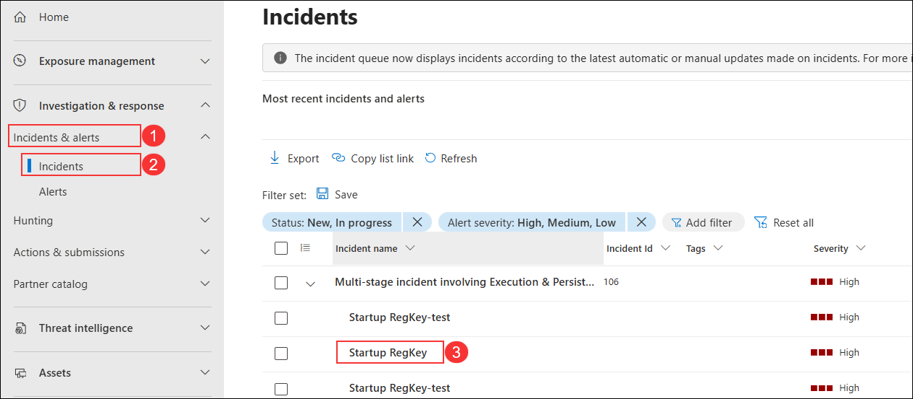
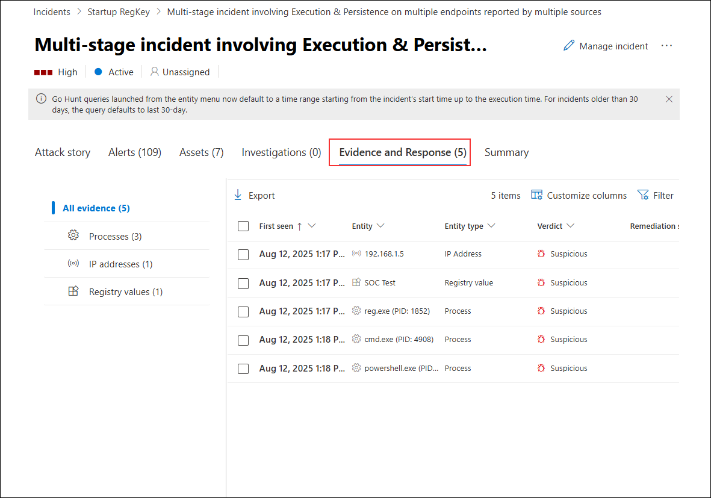
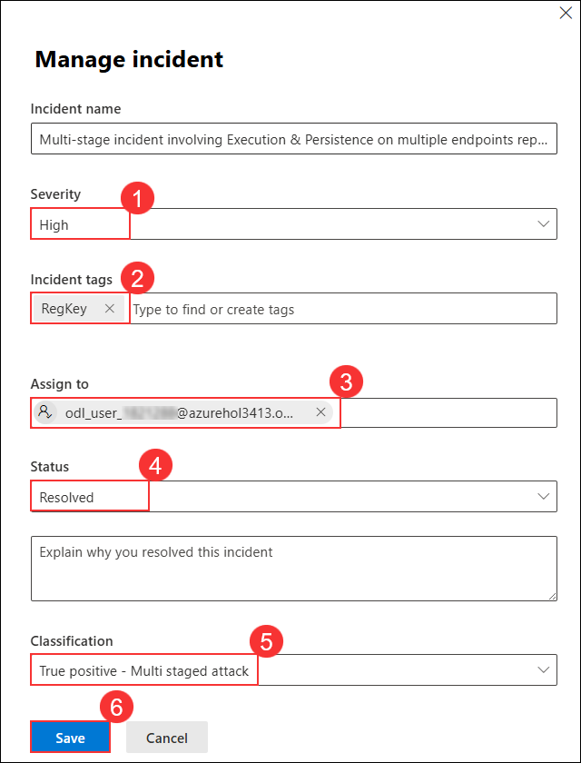

# Lab 18: Conduct attacks, Create Detections, Investigate an Incident  

In this lab, you will simulate two common attack techniques: **Persistence** through Windows registry modification and **Command and Control (C2)** using DNS queries. You will perform hands-on steps to create a registry-based persistence mechanism, execute a PowerShell script that mimics C2 traffic, and use Microsoft Sentinel to detect and investigate suspicious activity. The lab guides you through configuring analytics rules, mapping entities, and investigating incidents generated from these simulated attacks.

#### **Persistence Attack with Registry Key Add**

> **⚠ Important Usage Guidance:** Microsoft Defender for Office 365 may take some time to load certain results or complete specific labs from the backend. This is expected behavior. If the data does not appear after a couple of refresh attempts, proceed with the next lab and return later to check the results.

1. In the search of the taskbar, enter *Command*. A Command Prompt will be displayed in the search results. Right-click on the Command Prompt and select **Run as Administrator**. Select **Yes** in the User Account Control window that allows the app to run.

1. In the Command Prompt, create a Temp folder in the root directory. Remember to press Enter after the last row:

    ```CommandPrompt
    cd \
    mkdir temp
    cd temp
    ```

    >**Note**: If there is any error on temp directory already exists, please perform the next steps.  
   
1. Copy and run this command to simulate program persistence:

    ```CommandPrompt
    REG ADD "HKCU\SOFTWARE\Microsoft\Windows\CurrentVersion\Run" /V "SOC Test" /t REG_SZ /F /D "C:\temp\startup.bat"
    ```

> **Congratulations** on completing the task! Now, it's time to validate it. Here are the steps:
> - Hit the Validate button for the corresponding task. If you receive a success message, you can proceed to the next task. 
> - If not, carefully read the error message and retry the step, following the instructions in the lab guide.
> - If you need any assistance, please contact us at cloudlabs-support@spektrasystems.com. We are available 24/7 to help you out.
<validation step="7a86bc7d-f385-4cc6-8d0d-b4e5f08bdf80" />

#### **Command and Control Attack with DNS**

1. Copy and run this command to create a script that will simulate a DNS query to a C2 server:

      ```CommandPrompt
      notepad c2.ps1
      ```

1. Select **Yes** to create a new file and copy the following PowerShell script into *c2.ps1*.

      >**Note:** Pasting into the virtual machine file might not show the full script length. Make sure the script matches the instructions within the *c2.ps1* file.

      ```PowerShell
      param(
        [string]$Domain = "microsoft.com",
        [string]$Subdomain = "subdomain",
        [string]$Sub2domain = "sub2domain",
        [string]$Sub3domain = "sub3domain",
        [string]$QueryType = "TXT",
        [int]$C2Interval = 8,
        [int]$C2Jitter = 20,
        [int]$RunTime = 240
    )
    $RunStart = Get-Date
    $RunEnd = $RunStart.addminutes($RunTime)
    $x2 = 1
    $x3 = 1 
    Do {
        $TimeNow = Get-Date
        Resolve-DnsName -type $QueryType $Subdomain".$(Get-Random -Minimum 1 -Maximum 999999)."$Domain -QuickTimeout
        if ($x2 -eq 3 )
        {
            Resolve-DnsName -type $QueryType $Sub2domain".$(Get-Random -Minimum 1 -Maximum 999999)."$Domain -QuickTimeout
            $x2 = 1
        }
        else
        {
            $x2 = $x2 + 1
        }    
        if ($x3 -eq 7 )
        {
            Resolve-DnsName -type $QueryType $Sub3domain".$(Get-Random -Minimum 1 -Maximum 999999)."$Domain -QuickTimeout
            $x3 = 1
        }
        else
        {
            $x3 = $x3 + 1
        }
        $Jitter = ((Get-Random -Minimum -$C2Jitter -Maximum $C2Jitter) / 100 + 1) +$C2Interval
        Start-Sleep -Seconds $Jitter
    }
    Until ($TimeNow -ge $RunEnd)
    ```

1. In the Notepad menu, select **File** and then **Save**. 

1. Go back to the Command Prompt window, enter the following command and press Enter.

      ```CommandPrompt
      Start PowerShell.exe -file c2.ps1
      ```
    
      
   
      >**Note:** You will see DNS resolve errors. This is expected.

      >**Important**: Do not close these windows. Let this PowerShell script run in the background. The command needs to generate log entries for some hours. You can proceed to the next task and next exercises while this script runs. The data created by this task will be used in the Threat Hunting lab later. This process will not create substantial amounts of data or processing.

#### **Persistence Attack Detection**

1. In the Search bar of the Azure portal, type *Microsft Sentinel (1)*, then select **Microsoft Sentinel (2)**.

   
   
1. Select the Microsoft Sentinel Workspace you created earlier.

1. Select **Logs** from the *General* section.

   

    >**Note:** You might see some popup after clicking on **Logs**. close all Popups by clicking on **X** Icon.

1. In the query editor, enter the following KQL statement **(1)** and click **Run (2)** to retrieve the records that start with the specified EventId. Review the results in the table below **(3)**.

    ```KQL
    SecurityEvent 
    | where Activity startswith "4624" 
    ```
   

    >**Note:** It may take **5 to 10 minutes** for the SecurityEvent data to become available after onboarding or activity generation. 

    >**Note:** The number of output rows and values may differ depending on your environment and data availability.

1. In the query editor, enter the following KQL statement **(1)** to project entities for investigation and click **Run (2)**. Review the results in the table below **(3)**.

    ```KQL
    SecurityEvent 
    | where Activity startswith "4624" 
    | extend timestamp = TimeGenerated, HostCustomEntity = Computer, AccountCustomEntity = SubjectUserName
    ```

   

1. In the **Logs** window, click the ellipsis **(1)** in the command bar, select **New alert rule (2)**, and then select **Create Microsoft Sentinel alert (3)**.
   
   

1. In the **Analytics rule wizard** on the **General** tab: 
 
    - Enter **Startup RegKey (1)** in the *Name* field.  
    - Type **Startup RegKey in c:\temp (2)** in the *Description* field.  
    - Select **High (3)** for *Severity*.  
    - Choose **Persistence (4)** for *MITRE ATT&CK*.  
    - Ensure *Status* is set to **Enabled (5)**.  
    - Click **Next: Set rule logic > (6)**.  

        

1. On the *Set rule logic* tab, the *Rule query* should be populated already with your KQL query, under **Alert enhancement** expand *Entity mapping* and select **+ Add New Entity**.

    |Entity|Identifier|Data Field|
    |:----|:----|:----|
    |Account|FullName|AccountCustomEntity|
    |Host|Hostname|HostCustomEntity|

   

   

1. If **Hostname** isn't selected for *Host* Entity, select it from the drop-down list.

1. For *Query scheduling* set the following:

    |Setting|Value|
    |---|---|
    |Run Query every|5 minutes|
    |Lookup data from the last|1 Days|

   

    >**Note:** We are purposely generating many incidents for the same data. This enables the Lab to use these alerts.

1. Leave the rest of the options with the defaults. Select **Next: Incident settings>** button.

1. For the *Incident settings* tab, leave the default values and select **Next: Automated response >** button.

1. On the *Automated response* tab, leave everything as default and select  **Next: Review + Create** button.
  
1. On the **Review and create** tab, select the **Save** button to create the new Scheduled Analytics rule.

   

#### **Investigate an incident**

1. On the **Microsoft Defender portal**, under **Investigation & response**, select **Incidents & alerts (1)**, then select **Incidents (2)**, and from the list click the incident named **Startup RegKey (3)** to open its details.

   

1. Under the **Incident details** section, select the linked incident name **Multi-stage incident involving Execution & Persistence on multiple endpoints reported by multiple sources (1)** to view full incident details.

   

    >**Note:** The Analytics rules are generating alerts and incidents on the same specific log entry. Remember that this was done in the *Query scheduling* configuration to generate more alerts and incidents to be utilized in the lab.
  
1. On the incident details page, under the **Attack story** tab, select **Play attack story (1)** to visualize the sequence of events in the incident graph.

   

1. On the incident details page, select the **Assets (1)** tab to view all associated assets, including devices, users, and other resources involved in the incident.

   

1. On the incident details page, select the **Evidence and Response (1)** tab to view all related evidence, including processes, IP addresses, and registry values identified during the investigation.

   

1. On the incident details page, click **Manage incident (1)** to modify the incident’s properties or take remediation actions.

   

1. In the **Manage incident** pane, update the incident details as follows:  
    - Set **Severity (1)** to **High**.  
    - In **Incident tags (2)**, enter `RegKey`.  
    - In **Assign to (3)**, select your account.  
    - Set **Status (4)** to **Resolved**.  
    - Set **Classification (5)** to **True positive - Multi staged attack**.  
    - Click **Save (6)**.

        

## Review

In this lab, you:
- Simulated persistence by adding a startup registry key.
- Created and executed a PowerShell script to mimic DNS-based C2 activity.
- Queried and analyzed Security Events in Microsoft Sentinel.
- Built and configured a scheduled analytics rule to detect registry-based persistence.
- Mapped relevant entities for investigation and generated alerts.
- Investigated incidents and reviewed evidence in the Microsoft Defender portal.

## You have successfully completed the lab. Click on Next to Continue
