# Lab 19: Threat Hunting using Notebooks with Microsoft Sentinel  

In this lab, you will use Microsoft Sentinel to proactively hunt for suspicious PowerShell activity in your environment. You will create and run a KQL hunting query, bookmark notable results, configure entity mapping, and save the hunting query for future use. You will also set up real-time monitoring using Livestream, link bookmarked events to existing incidents for investigation, create an NRT (Near Real-Time) analytics rule to automate detection, and perform a search job in Microsoft Defender to further analyze related activity.

#### **Create a hunting query**

> **⚠ Important Usage Guidance:** Microsoft Defender for Office 365 may take some time to load certain results or complete specific labs from the backend. This is expected behavior. If the data does not appear after a couple of refresh attempts, proceed with the next lab and return later to check the results.

1. In the Search bar of the Azure portal, type *Microsoft Sentinel (1)*, then select **Microsoft Sentinel (2)**.

   
   
1. Select the Microsoft Sentinel Workspace you created earlier.

1. Select **Logs** from the *General* section.

   

    >**Note:** You might see some popup after clicking on **Logs**. Close all popups by clicking on the **X** icon.

1. Enter the following KQL Statement in the New Query 1 space:

   >**Important:** Please paste any KQL queries first in Notepad and then copy from there to the New Query 1 Log window to avoid any errors.

    ```KQL
    let lookback = 2d; 
    SecurityEvent 
    | where TimeGenerated >= ago(lookback) 
    | where EventID == 4688 and Process =~ "powershell.exe"
    | extend PwshParam = trim(@"[^/\\]*powershell(.exe)+" , CommandLine) 
    | project TimeGenerated, Computer, SubjectUserName, PwshParam 
    | summarize min(TimeGenerated), count() by Computer, SubjectUserName, PwshParam 
    | order by count_ desc nulls last 
    ```

1. Review the different results. You have now identified PowerShell requests that are running in your environment.

    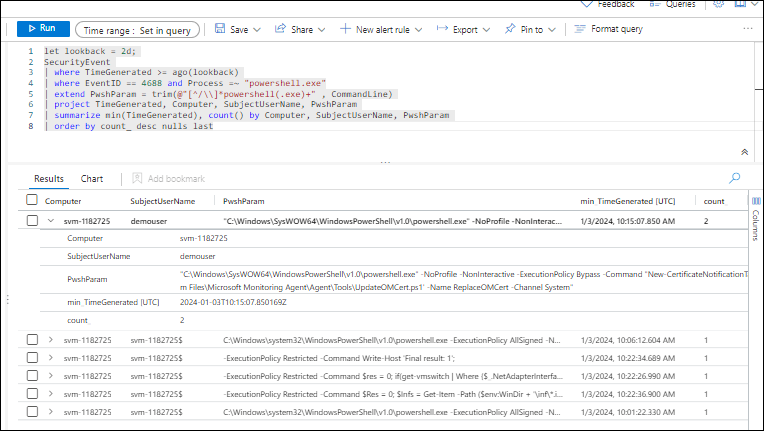

1. Select the checkbox of the results that shows the **demouser** SubjectUserName.

1. In the middle command bar, select the **Add bookmark** button.

   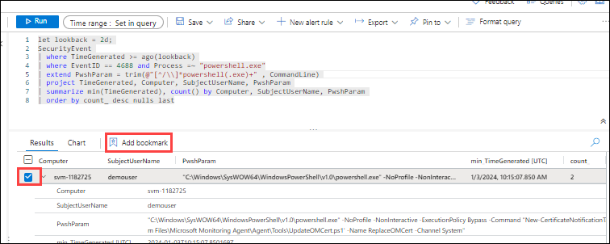

1. Select **+ Add new entity** under Entity mapping.

1. For *Entity* select **Host**, then **HostName** and **Computer** for the values.

1. In Tactics and Techniques, select **Command and Control** from the dropdown that appears.

1. Go back to the Add bookmark blade, and then select **Create**. We will map this bookmark to an incident later.

   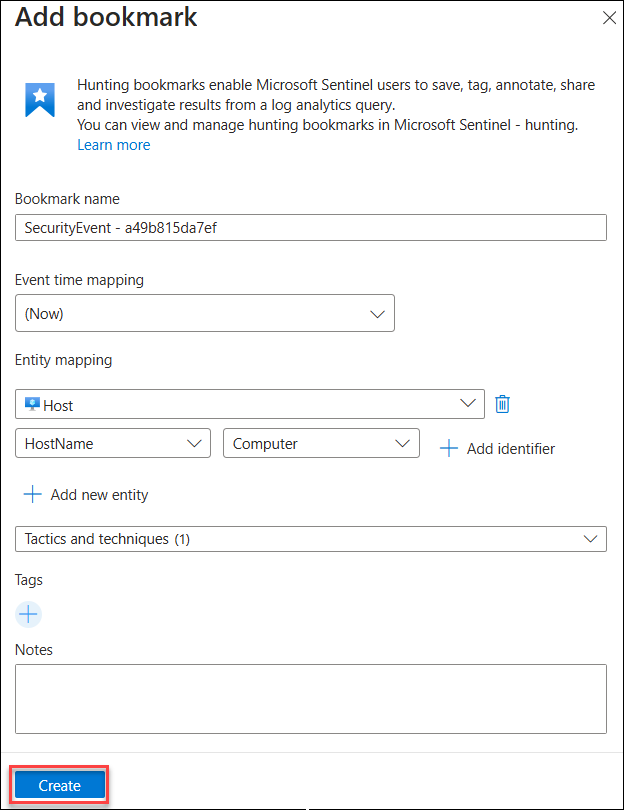

1. Close the Logs window by selecting the **X** in the top-right of the window and select **OK** to discard the changes. 

1. On the **Microsoft Sentinel** page, under **Threat management (1)**, select **Hunting (2)**, then click the **Queries (3)** tab.

   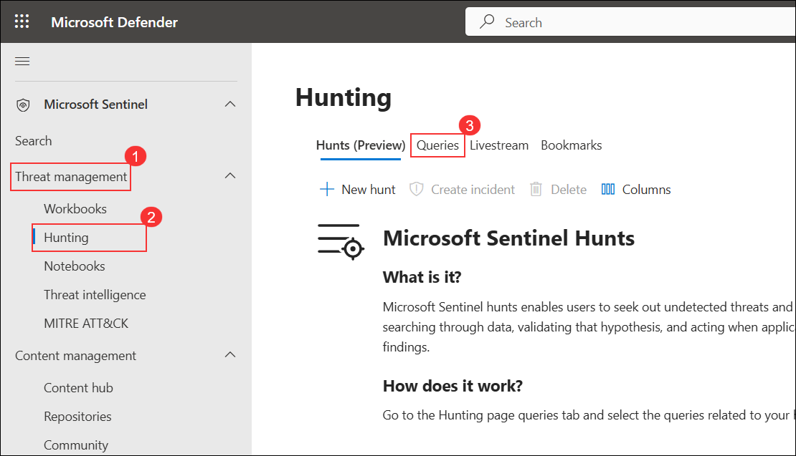

1. Select the **Queries (1)** tab and then **+ New Query (2)** from the command bar.

   

1. In the **Name** field, enter **PowerShell Hunt (1)**, and in the **Query** field, paste the provided KQL query **(2)**.

    - For the Custom query enter the following KQL statement:

    ```KQL
    let lookback = 2d; 
    SecurityEvent 
    | where TimeGenerated >= ago(lookback) 
    | where EventID == 4688 and Process =~ "powershell.exe"
    | extend PwshParam = trim(@"[^/\\]*powershell(.exe)+" , CommandLine) 
    | project TimeGenerated, Computer, SubjectUserName, PwshParam 
    | summarize min(TimeGenerated), count() by Computer, SubjectUserName, PwshParam 
    | order by count_ desc nulls last 
    ```

   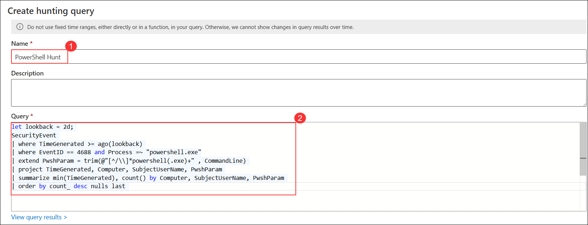

1. Under **Entity mapping**, select **Host**, then set **HostName** as the identifier and **Computer (1)** as the value. Click **Create (2)** to save the hunting query.

   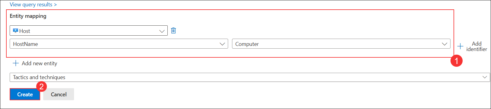

1. Verify that a notification appears confirming the hunting query **'PowerShell Hunt'** was successfully created.

   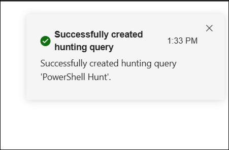

1. Confirm that the newly created hunting query **PowerShell Hunt** is now visible in the **Queries** list under Microsoft Sentinel Hunts.

   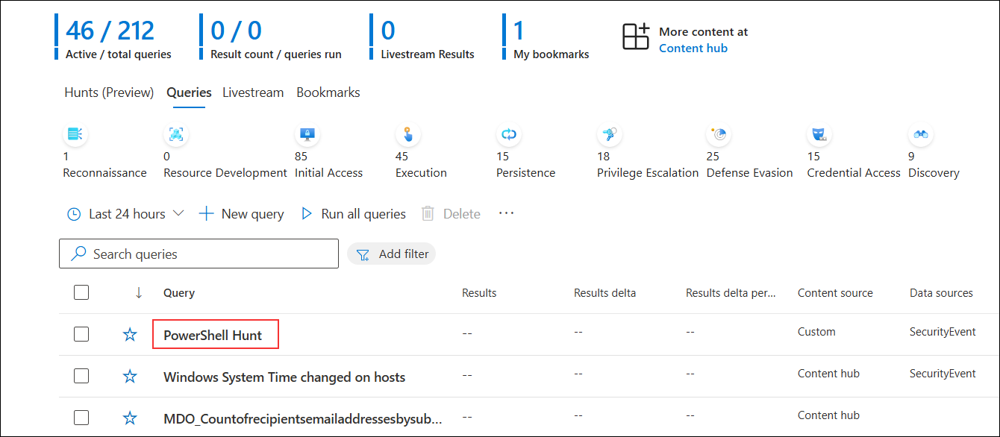

1. On the **PowerShell Hunt** details page, review the query configuration and click **View results** to see the hunting query output.

   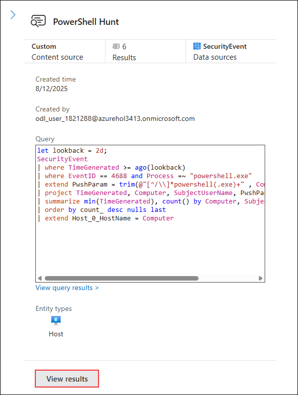

1. On the **Hunting** page, select **PowerShell Hunt (1)** from the list of queries, click on the vertical ellipsis menu, and choose **Add to livestream (2)** to monitor the query in real-time.

   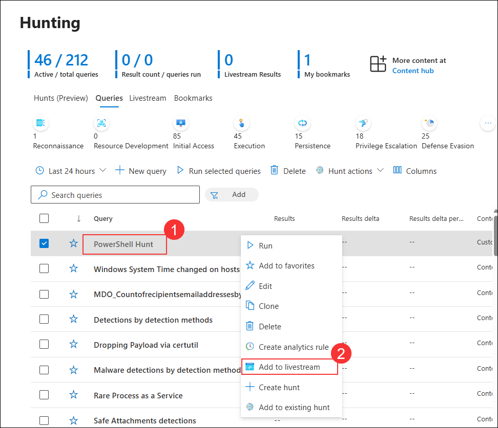

1. On the **Bookmarks (1)** tab, select the checkbox for the relevant bookmark entry **(2)**, then click **Investigate (3)** to analyze the bookmarked event in detail.

   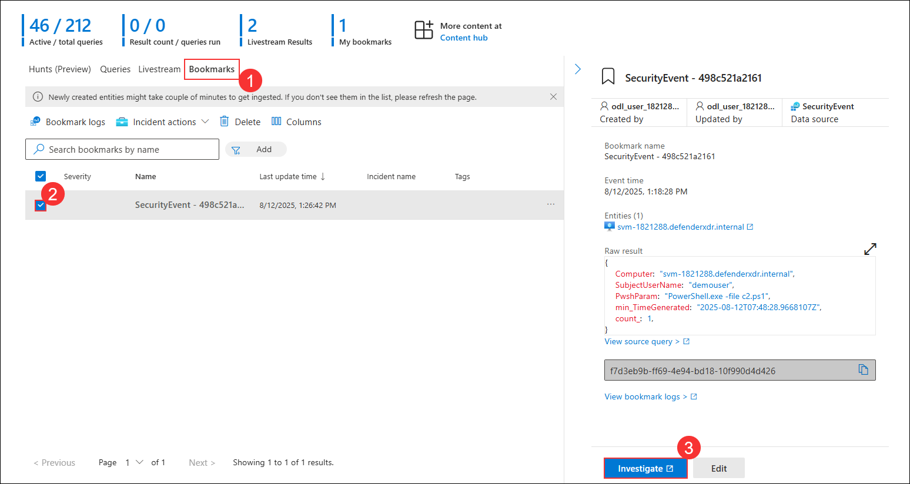

1. On the **Bookmarks** tab, click the **More actions (1)** icon for the relevant bookmark and select **Add to existing incident (2)** from the menu.

   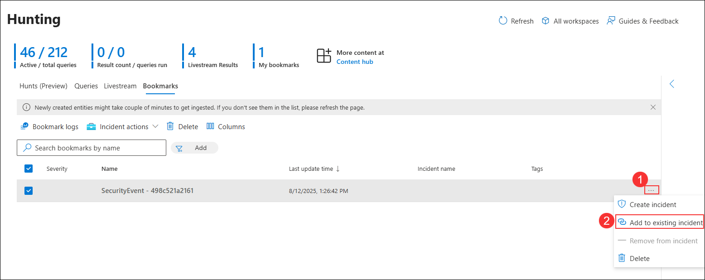

1. On the **Adding bookmark(s) to an existing incident** pane, select the incident **Multi-stage i... (1)** and click **Add (2)**.

   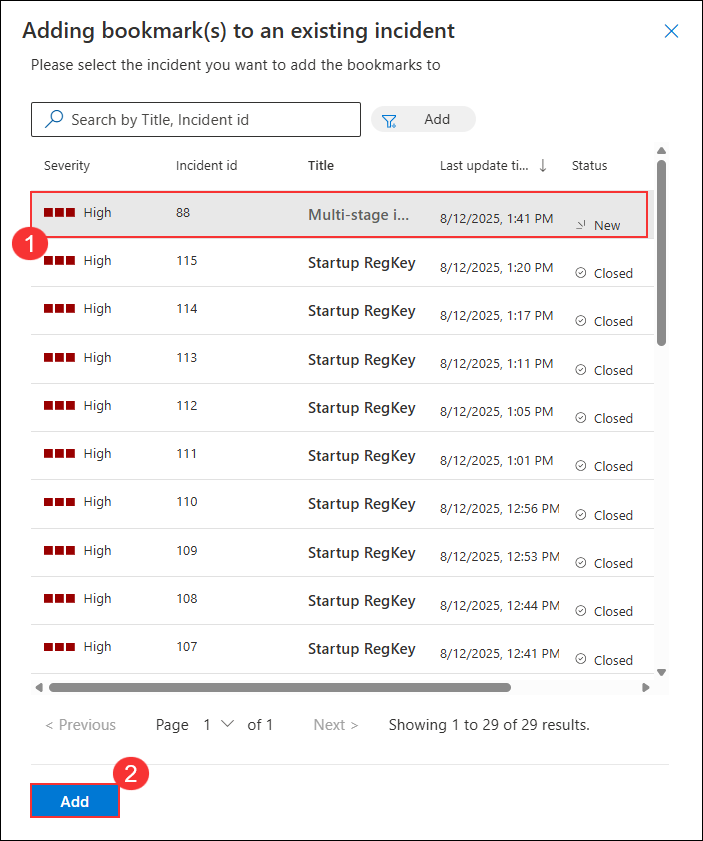

#### **Create a NRT query rule**

1. In **Microsoft Sentinel**, under **Configuration (1)** select **Analytics (2)**, then click **+ Create** and choose **NRT query rule (3)**.

   

1. On the **General** tab:  
    - Enter **NRT PowerShell Hunt (1)** in the **Name** field.  
    - Enter **NRT PowerShell Hunt (2)** in the **Description** field.  
    - Set **Severity** to **High (3)**.  
    - Set **MITRE ATT&CK** to **Command And Control (4)**.  
    - Ensure **Status** is set to **Enabled (5)**.  
    - Click **Next: Set rule logic > (6)**. 

    

1. For the *Rule query* enter the following KQL statement:

    ```KQL
    let lookback = 2d; 
    SecurityEvent 
    | where TimeGenerated >= ago(lookback) 
    | where EventID == 4688 and Process =~ "powershell.exe"
    | extend PwshParam = trim(@"[^/\\]*powershell(.exe)+" , CommandLine) 
    | project TimeGenerated, Computer, SubjectUserName, PwshParam 
    | summarize min(TimeGenerated), count() by Computer, SubjectUserName, PwshParam
    ```

1. Under Entity mapping select:
     
    - Select **+ Add new entity** under Entity mapping.
    - For the Entity type drop-down list select **Host**.
    - For the Identifier drop-down list select **HostName**.
    - For the Value drop-down list select **Computer**.

   

1. On the **Incident settings** page, keep incident creation **Enabled**, leave alert grouping **Disabled**, and click **Next: Automated response >**.

   

1. Click **Next: Review + create >**.  

   

1. On the Review and Create tab, select the **Save** button to create and save the new Scheduled Analytics rule.

   

#### **Create a Search job**

> **⚠ Important Usage Guidance:** Microsoft Defender for Office 365 may take some time to load certain results or complete specific labs from the backend. This is expected behavior. If the data does not appear after a couple of refresh attempts, proceed with the next lab and return later to check the results.

1. In Microsoft Defender Portal, on the **Search** page, select **Search (1)** from the left menu, enter **reg.exe (2)** in the search box, and click **Start**.

   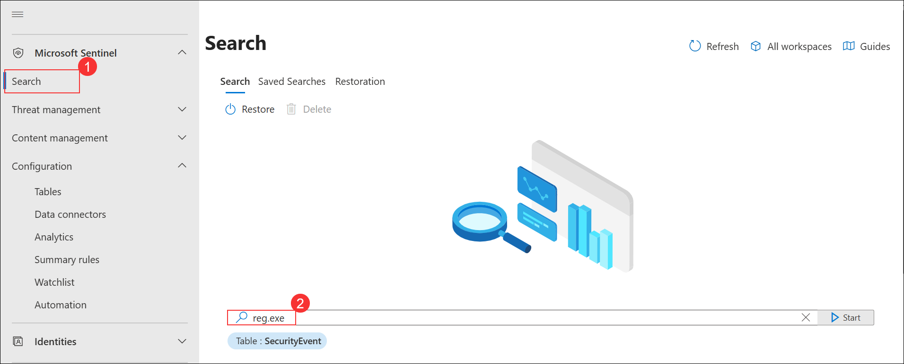

1. In the **Logs** window, click the ellipsis icon **(1)** at the top right and select **Search job (2)**.

   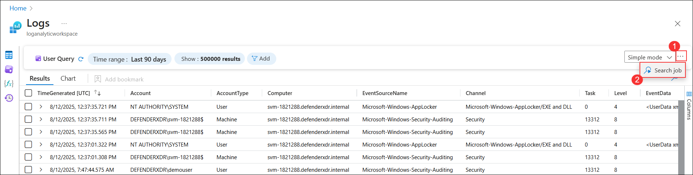

1. On the **Run a search job** window, select **Last 24 Hours (1)**, enter **Newtable (2)** as the name, and click **Run search job (3)**.

   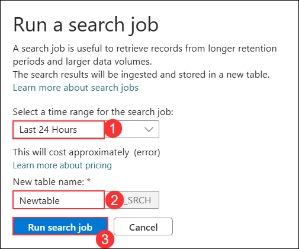

1. The query results display in the **Logs** window showing the retrieved event details.

   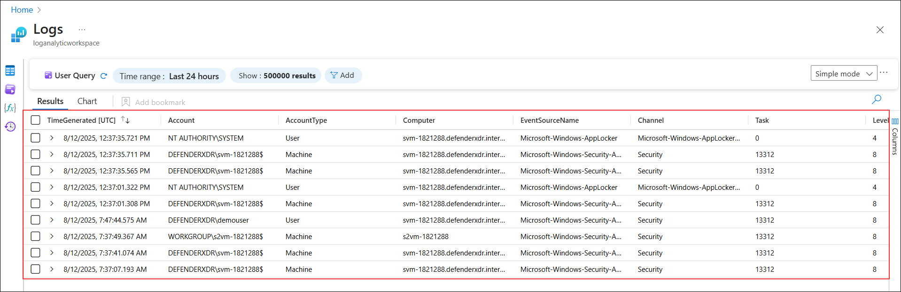

1. Close the *Logs* window by selecting the **X** in the top-right of the window and select **OK** to discard the changes. 

1. On the **Newtable_SRCH** panel, click **Restore** to investigate the retrieved data.

   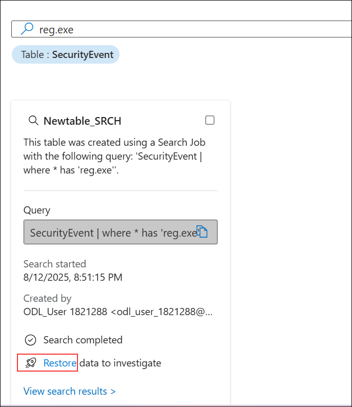
 
1. On the **Restoration** window, review the settings and click **Restore** to begin the process.

   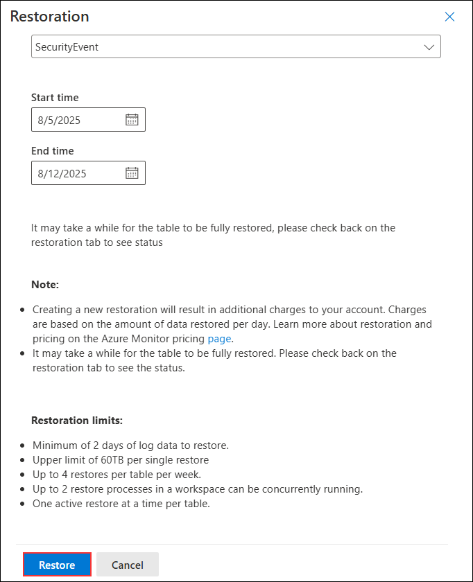

1. Review the options available and then select the **Cancel** button.

    >**Note:** If you were running the job, the restore would run for a couple of minutes and your data would be available in a new table.

## Review

In this lab, you:
- Created and executed a KQL hunting query in Microsoft Sentinel to detect suspicious PowerShell activity.
- Bookmarked significant results and mapped entities for enhanced investigation.
- Saved the hunting query and enabled real-time monitoring with Livestream.
- Linked bookmarked events to existing incidents for deeper analysis.
- Built an NRT analytics rule to automate detection of PowerShell threats.
- Performed a search job in Microsoft Defender to investigate related events and practiced restoring data for further review.

## You have successfully completed the lab. Click on Next to Continue
