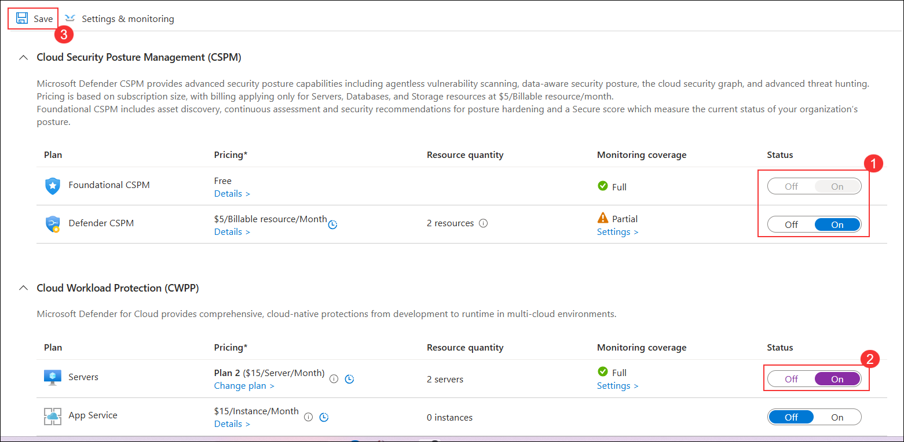
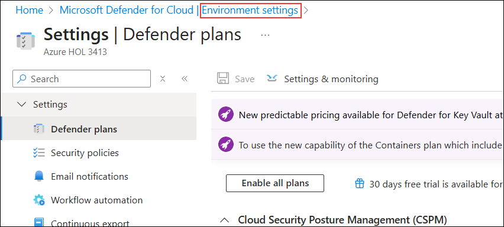
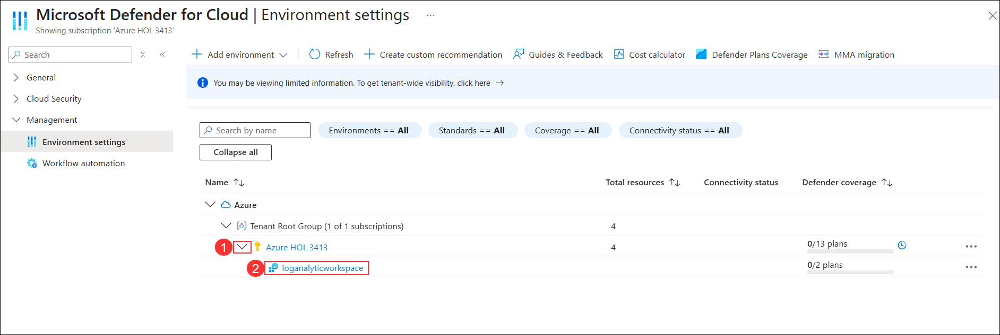
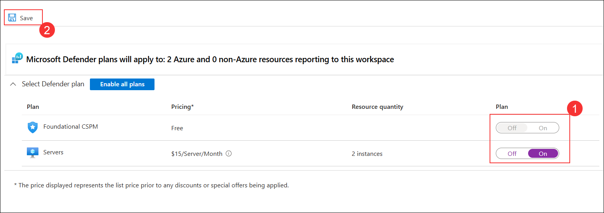

# Task 2: Enable Microsoft Defender for Cloud

## Overview

In this task, you will enable and configure Microsoft Defender for Cloud to provide enhanced cloud security posture management (CSPM) and workload protection for your Azure environment.

⚠ **Important Usage Guidance:** It may take several minutes for Microsoft Defender for Cloud to reflect the updated plan status after enabling the services. If the toggles do not immediately show as “On” or the subscription status does not update, proceed with the lab and return later to verify.

1. Go to the [Azure Portal](https://portal.azure.com), and search for **Microsoft Defender for Cloud**.

   

1. When prompted, click **Enable** to activate Defender CSPM.
     
   

   > **Note:** If you don’t see the pop-up prompt, simply continue and follow the lab guide steps as shown below.

   >**Note:** This enables advanced posture capabilities like attack path analysis and permissions management.

1. In the **Microsoft Defender for Cloud** page, under **Management**, select **Environment settings (1)**, expand **Azure** and **Tenant Root Group**, then select **Subscription (2)**.

   

1. On the **Settings & monitoring** page, turn **On (1)** the toggle for **Foundational CSPM** and **On (2)** for **Servers** under Cloud Workload Protection, then click **Save (3)**.

   

1. Click **Environment settings** in the top to return to the environment settings page.

   

1. On the **Environment settings** page, expand **Azure (1)**, then expand **Subscription** and select **loganalycticworkspace (2)**.

   

1. On the **Select Defender plan** page, turn **On (1)** the toggles for **Foundational CSPM** and **Servers**, then click **Save (2)**.

   

1. Close the Defender plans page by selecting the 'X' in the upper right corner of the page to return to the **Environment settings**.

> **Congratulations** on completing the task! Now, it's time to validate it. Here are the steps:
> - Hit the Validate button for the corresponding task. If you receive a success message, you can proceed to the next task. 
> - If not, carefully read the error message and retry the step, following the instructions in the lab guide.
> - If you need any assistance, please contact us at cloudlabs-support@spektrasystems.com. We are available 24/7 to help you out.
<validation step="ea9784ef-a103-41e0-859f-f673a96cf886" />

## Review

In this task, you:
- Enabled Microsoft Defender CSPM for the subscription.
- Activated **Servers** protection under Cloud Workload Protection.
- Configured Defender plans at both the subscription and Log Analytics workspace levels.
- Saved and applied the updated security settings for your environment.

## You have successfully completed the task. Click on Next to Continue
