# Lab 20: Mitigate threats using Microsoft Defender 

You're a Security Operations Analyst working at a company that implemented Microsoft Defender XDR solutions. You need to see the alerts in an incident to see the incident's full impact do a root cause investigation and mitigate these alerts using M365 Defender tools.

> **⚠ Important Usage Guidance:** Microsoft Defender for Office 365 may take some time to load certain results or complete specific labs from the backend. This is expected behavior. If the data does not appear after a couple of refresh attempts, proceed with the next lab and return later to check the results.

1. In the Search bar of the Azure portal, search and select **Microsoft Entra ID**.

1. Select **Groups** and then click on **New group**.

1. Enter the below details for the New group page:

    |Setting|Value|
    |---|---|
    |Group Type| **Microsoft 365** |
    |Group Name| **Sg-IT** |
    |Microsoft Entra roles can be assigned to the group| **Yes** |

1. Click on **No owners selected** and select the **<inject key="AzureAdUserEmail"></inject>** from the list and then click on **select**.

1. Click on **No members selected** and select the **<inject key="AzureAdUserEmail"></inject>** from the list and then click on **select**.

   >**Note**: Make sure you have selected **Group type** as **Microsoft 365**.

> **Congratulations** on completing the task! Now, it's time to validate it. Here are the steps:
> - Hit the Validate button for the corresponding task. If you receive a success message, you can proceed to the next task. 
> - If not, carefully read the error message and retry the step, following the instructions in the lab guide.
> - If you need any assistance, please contact us at cloudlabs-support@spektrasystems.com. We are available 24/7 to help you out.
<validation step="30cfb72e-0901-4620-b8fe-28639d0c2966" />

1. If you are not already at the Microsoft 365 Defender portal in your browser, go to (https://security.microsoft.com) and log in with the **Tenant Email** credentials.

1. From the navigation menu, under Email & Collaboration area, select **Policies & rules** (1) and select **Threat policies** (2).

      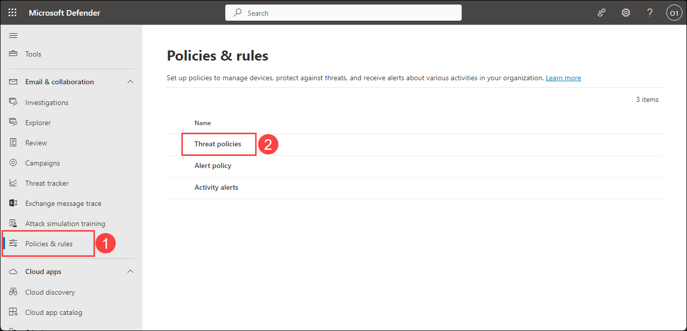

1. On the Threat policies dashboard, select **Preset Security Policies**.

    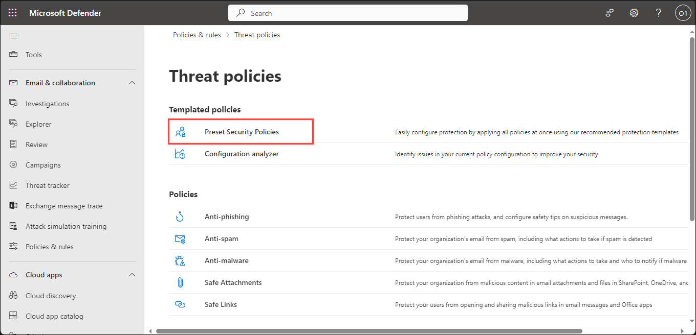

1. Review the protection settings and ensure that both **Standard protection (1)** and **Strict protection (2)** are turned on.

    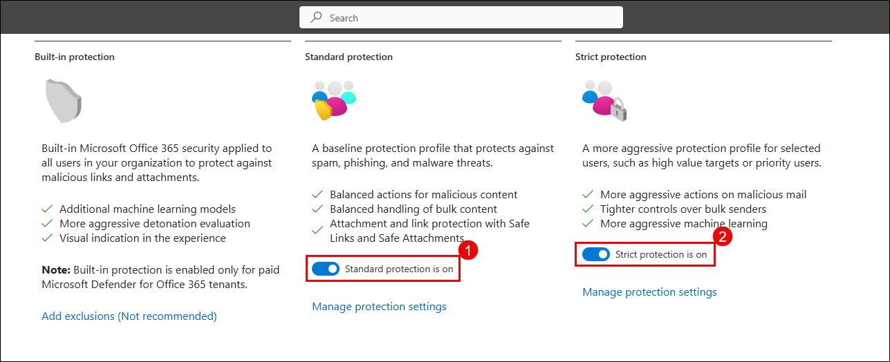

1. In the **Microsoft Sentinel** workspace, under **Configuration (1)**, select **Analytics (2)** then click **Create (3)** and choose **NRT query rule (4)** from the dropdown menu.

   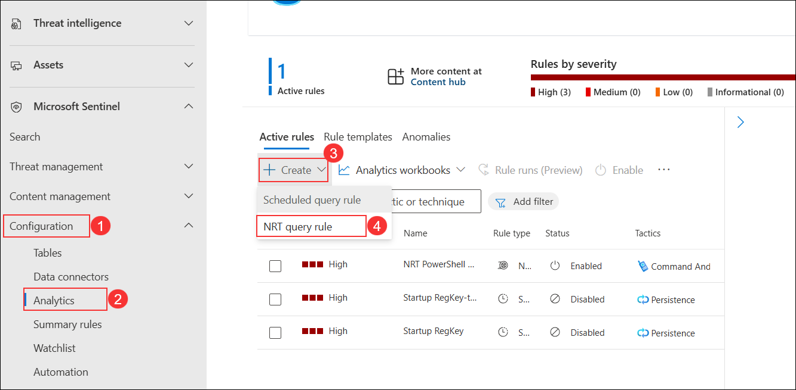

1. On the **General** tab, enter **Microsoft Defender for Cloud Alerts - Custom Severity Filter (1)** in the *Name* field.  
   - In the *Description* field, type **Custom rule to detect Defender for Cloud alerts with chosen severity levels (2)**.
   - In the *Severity* drop-down, select **High (3)**. 
   - Under *MITRE ATT&CK*, choose the relevant **tactics, techniques, and sub-techniques (4)**.
   - Ensure the *Status* toggle is set to **Enabled (5)**. 
   - Click **Next: Set rule logic (6)** to continue.

     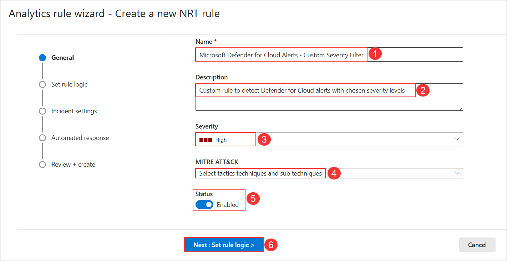

1. On the **Set rule logic** tab, in the *Rule query* field, enter the following query **(1)** and click **Next: Incident settings (2)** to proceed.

    ```KQL 
    SecurityAlert
    | where ProductName in ("Microsoft Defender for Cloud", "Azure Security Center")
    ```

   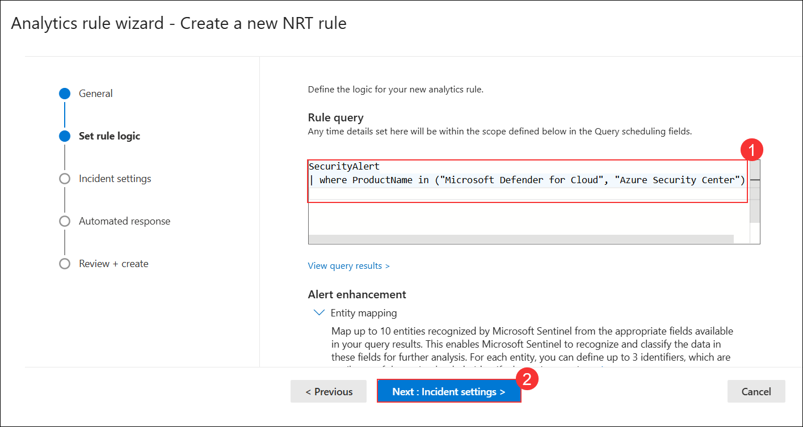

1. On the **Incident settings** page, keep everything to default and then click **Next: Automated response** to proceed.

   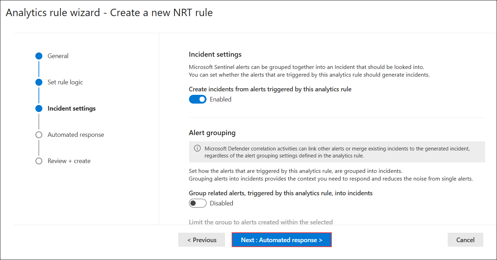

1. On the **Automated response** page, click **Next: Review + create ** to proceed.

   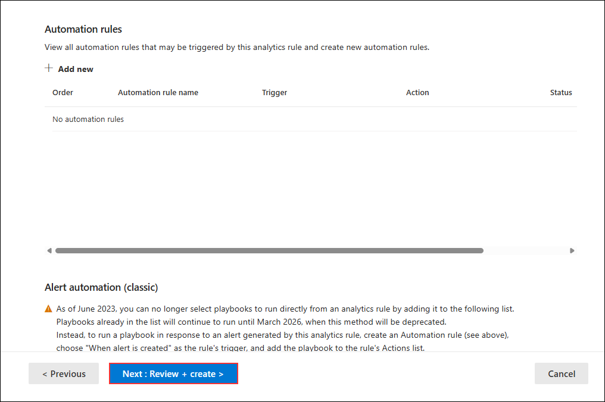

1. On the **Review + create** page, click **Save** to create the analytics rule.

   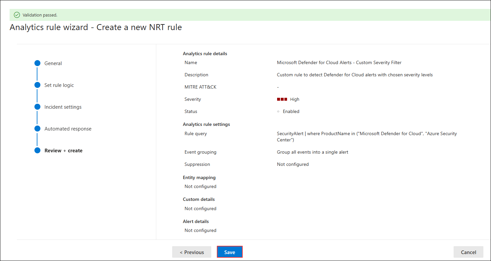

1. Onboard the **s2vm-<inject key="DeploymentID" enableCopy="false">** using device onboard using the microsoft defender endpoint onboarding portal.

   >**Note:** You can refer the **Lab01 > Task 1** to onboard the device to Microsoft Defender.

   >**Note:** Username is `demouser` and the password is the **Lab VM Admin Password**, which you can find in the **Environment** section of the lab guide.

1. If you are not already at the Microsoft 365 Defender portal in your Microsoft Edge browser, go to (https://security.microsoft.com). 

1. In the **Sign in** dialog box, copy and paste **Email/Username: <inject key="AzureAdUserEmail"></inject>** and then select Next.

1. In the **Enter password** dialog box, copy and paste **Password: <inject key="AzureAdUserPassword"></inject>** and then select **Sign in**.

1. On the **Alerts** page, under **Incidents & alerts (1)**, select **Alerts (2)** and check the box next to **[Test Alert] Suspicious Powershell commandline (3)**.

   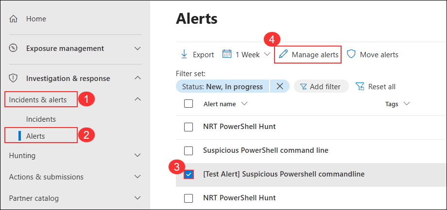

   >**Note:** If you cannot see the **Alerts**, please wait, as updates may take 24-48 hours.

1. On the **[Test Alert] Suspicious Powershell commandline** page, under the **Incident** section, click on **Execution incident on multiple endpoints**.

   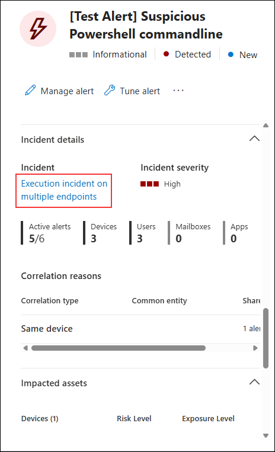

1. On the **Execution incident on multiple endpoints** page, click on **Manage incident**.

   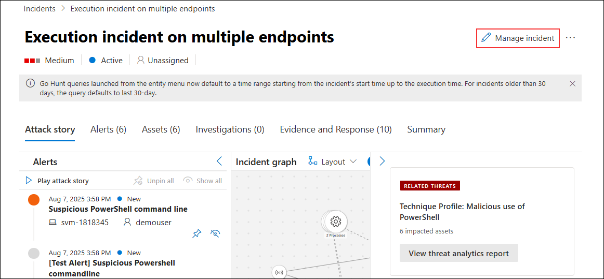

1. On the **Manage incident** pane, verify the **Incident name (1)** is set to *Execution incident on multiple endpoints*, ensure **Severity (2)** is set to *High*, assign it to your user account in **Assign to (3)**, confirm the **Status (4)** is set to *Active*, and then click **Save (5)**.

   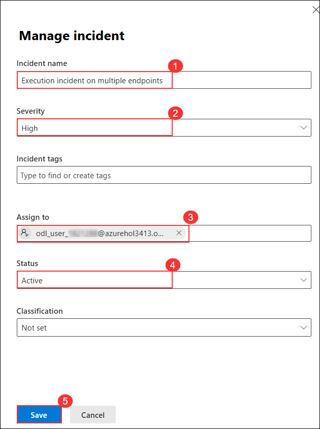

   >**Note:** Here, you can edit the name of the incident, add tags, assign it to an existing group or a user, change the status, classify the incident as required, and even add comments.

1. In the incident, the **Attack Story** tab provides a summary of the alerts and the incident graph on how these alerts are mapped.

   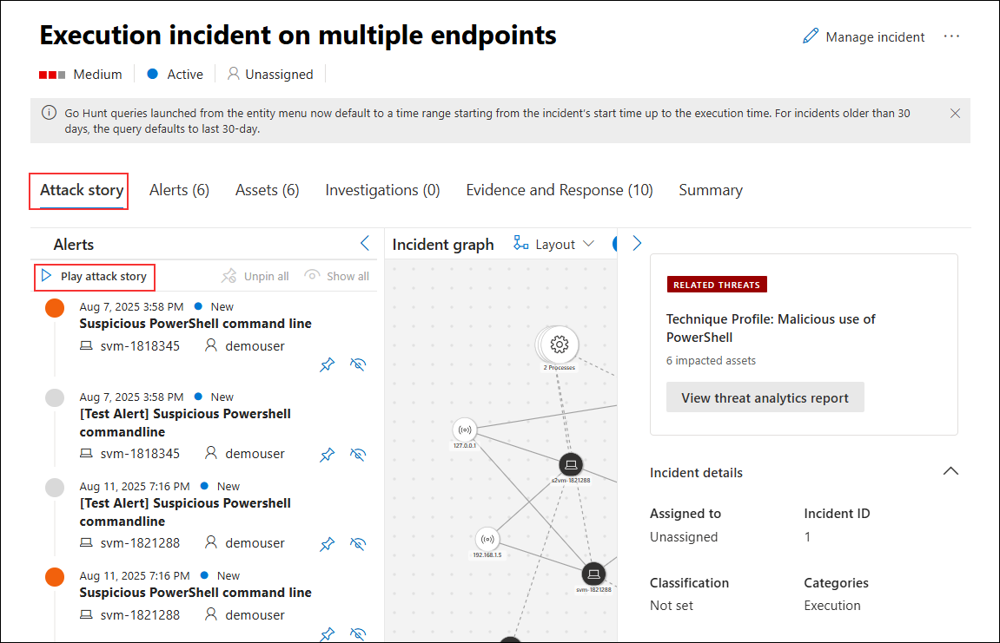

1. You can further investigate these alerts by navigating to the **Alerts** tab.

   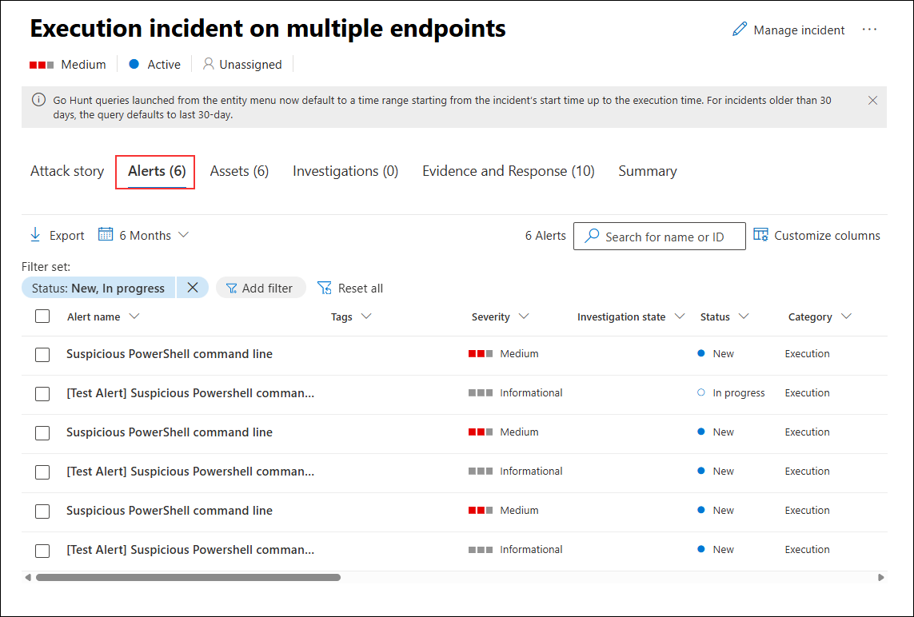

1. You can also see the devices and users affected by this incident in the **Assets** tab. You can verify that the affected device is **s2vm-<inject key="DeploymentID" enableCopy="false" />** and the user is **demouser**.

   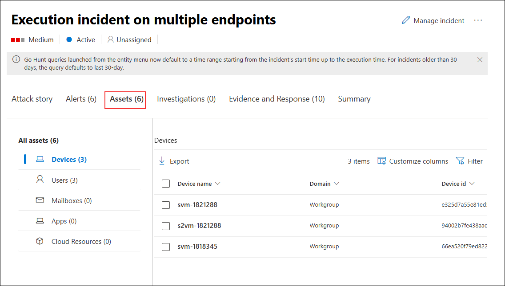

1. The **Evidence & Responses** tab shows the initial evidence investigated by Microsoft Defender which includes the processes, IP addresses.

   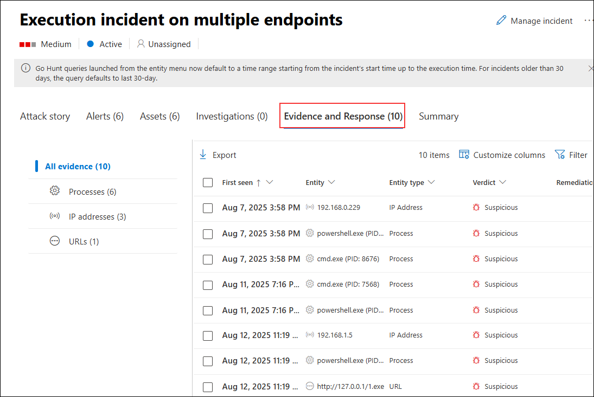

1. The **Summary** tab gives us a summarized report of the incident including active alerts & their category, incident information, scope, and much more.

1. In the Microsoft Defender portal, navigate to the **Alerts** tab from the sidebar menu.

1. On the **Alerts** page, under **Incidents & alerts (1)**, select **Alerts (2)** and check the box next to **[Test Alert] Suspicious Powershell commandline (3)**.

   

1. Click on **Maximize** to view the full alert details.

   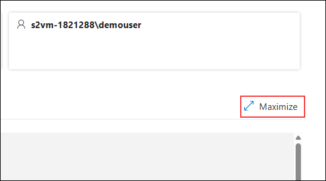

1. Click on the drop-down for the first suspicious behavior to fully investigate the root cause for this activity.

   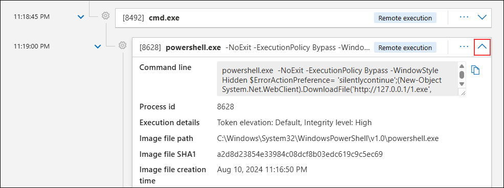

1. Microsoft Defender also provides recommendations to mitigate the alerts. On the alert details page, click on the **Recommendations** tab to view all the recommendations.

   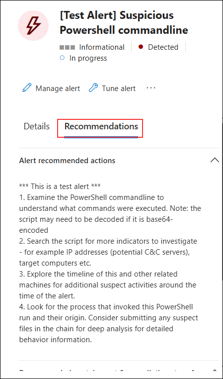

## Review
In this lab, you have completed the following tasks:
- Created a Group
- Applied Microsoft Defender for Office 365 preset security policies
- Activated a Microsoft Security Rule
- Managed Incidents
- Manage Alerts
