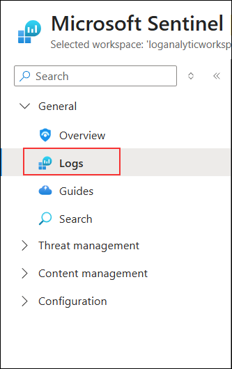
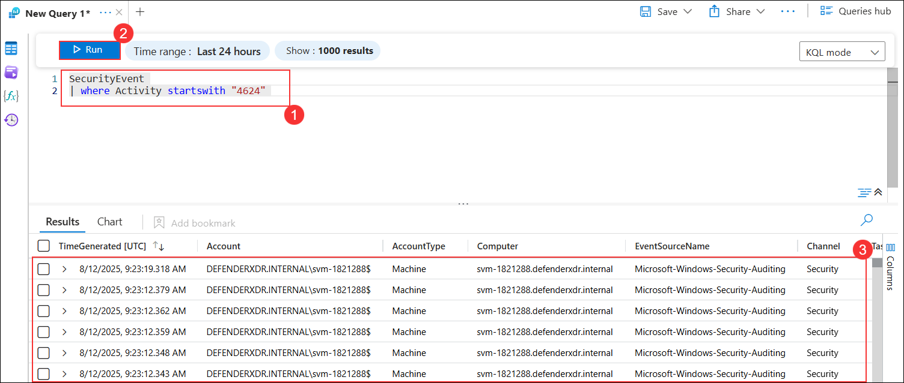
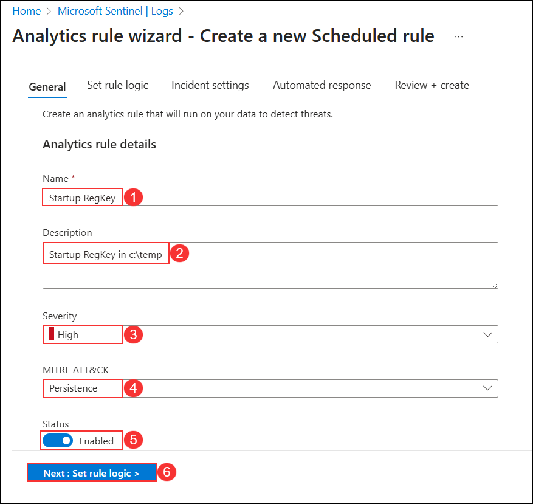
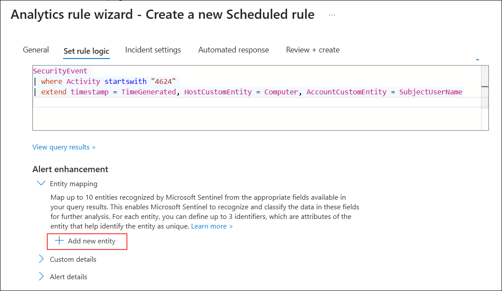
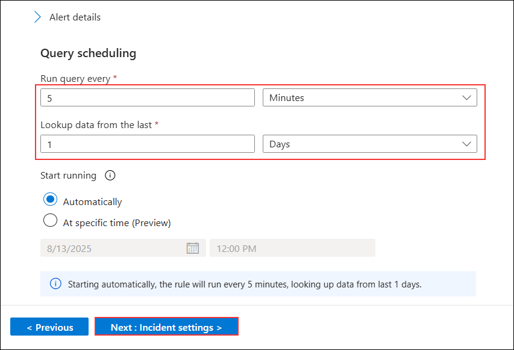

# Task 5: Persistence Attack Detection

## Overview

In this lab, you will use Microsoft Sentinel to create a detection rule for persistence attacks based on SecurityEvent logs. You will query for specific Event IDs related to logon activities, map entities for investigation, and configure a scheduled analytics rule to detect suspicious persistence techniques. This detection will help generate alerts for potential malicious activity, which can be used in later investigations.

> **⚠ Important Usage Guidance:** Microsoft Defender for Office 365 may take some time to load certain results or complete specific labs from the backend. This is expected behavior. If the data does not appear after a couple of refresh attempts, proceed with the next lab and return later to check the results.

1. In the Search bar of the Azure portal, type *Microsft Sentinel (1)*, then select **Microsoft Sentinel (2)**.

   
   
1. Select the Microsoft Sentinel Workspace you created earlier.

1. Select **Logs** from the *General* section.

   

    >**Note:** You might see some popup after clicking on **Logs**. close all Popups by clicking on **X** Icon.

1. In the query editor, enter the following KQL statement **(1)** and click **Run (2)** to retrieve the records that start with the specified EventId. Review the results in the table below **(3)**.

    ```KQL
    SecurityEvent 
    | where Activity startswith "4624" 
    ```
   

    >**Note:** It may take **5 to 10 minutes** for the SecurityEvent data to become available after onboarding or activity generation. 

    >**Note:** The number of output rows and values may differ depending on your environment and data availability.

1. In the query editor, enter the following KQL statement **(1)** to project entities for investigation and click **Run (2)**. Review the results in the table below **(3)**.

    ```KQL
    SecurityEvent 
    | where Activity startswith "4624" 
    | extend timestamp = TimeGenerated, HostCustomEntity = Computer, AccountCustomEntity = SubjectUserName
    ```

   

1. In the **Logs** window, click the ellipsis **(1)** in the command bar, select **New alert rule (2)**, and then select **Create Microsoft Sentinel alert (3)**.
   
   

1. In the **Analytics rule wizard** on the **General** tab: 
 
    - Enter **Startup RegKey (1)** in the *Name* field.  
    - Type **Startup RegKey in c:\temp (2)** in the *Description* field.  
    - Select **High (3)** for *Severity*.  
    - Choose **Persistence (4)** for *MITRE ATT&CK*.  
    - Ensure *Status* is set to **Enabled (5)**.  
    - Click **Next: Set rule logic > (6)**.  

        

1. On the *Set rule logic* tab, the *Rule query* should be populated already with your KQL query, under **Alert enhancement** expand *Entity mapping* and select **+ Add New Entity**.

    |Entity|Identifier|Data Field|
    |:----|:----|:----|
    |Account|FullName|AccountCustomEntity|
    |Host|Hostname|HostCustomEntity|

   

   

1. If **Hostname** isn't selected for *Host* Entity, select it from the drop-down list.

1. For *Query scheduling* set the following:

    |Setting|Value|
    |---|---|
    |Run Query every|5 minutes|
    |Lookup data from the last|1 Days|

   

    >**Note:** We are purposely generating many incidents for the same data. This enables the Lab to use these alerts.

1. Leave the rest of the options with the defaults. Select **Next: Incident settings>** button.

1. For the *Incident settings* tab, leave the default values and select **Next: Automated response >** button.

1. On the *Automated response* tab, leave everything as default and select  **Next: Review + Create** button.
  
1. On the **Review and create** tab, select the **Save** button to create the new Scheduled Analytics rule.

   

## Review

In this lab, you:
- Queried SecurityEvent logs in Microsoft Sentinel for specific Event IDs.
- Mapped account and host entities for better incident investigation.
- Created a high-severity analytics rule to detect persistence activity.
- Scheduled the rule to run at regular intervals for continuous monitoring.

## You have successfully completed the lab. Click on Next to Continue

  
